# 冷静点。线性回归中何时添加协变量

> 原文：<https://towardsdatascience.com/get-a-grip-when-to-add-covariates-in-a-linear-regression-f6a5a47930e5?source=collection_archive---------3----------------------->

## 精确测量效果指南！

丹·万鲁宁

[图片通过 Pixabay](https://pixabay.com/photos/mixer-dj-controller-buttons-4197733/)

线性回归模型使得在其他变量(协变量)不变的情况下测量治疗效果变得容易。但是什么时候以及为什么要包含协变量呢？

这篇文章将回答这个问题。

首先，我们将在预测的上下文中讨论协变量:当它们改进超出样本拟合时添加它们。

然后，我们将讨论何时应该使用协变量来衡量因果效应，何时不应该:

**获得正确的测量结果**

*   添加可能导致估计偏差的混杂因素
*   不要添加下游结果
*   不要添加碰撞器

**得到精确的估计**

*   添加可预测结果的质控品，而非治疗品，以提高精确度
*   不要添加预测治疗但不预测结果的质控品

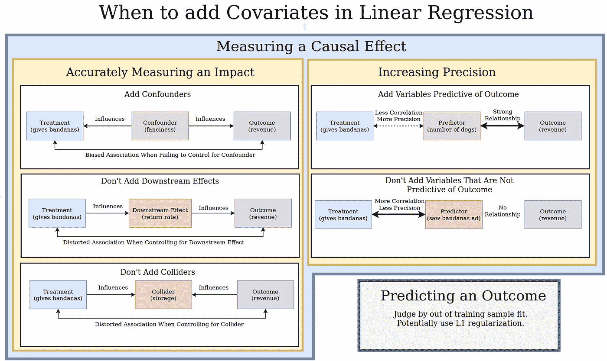

帖子摘要

# 预测:使用样本外性能

如果您不影响回归中任何变量的值，您可能只关心预测。例如，如果你想卖一套公寓，你可能想预测销售价格。你可以对其他公寓的销售价格进行回归训练，包括卧室数量等协变量。在这种情况下，您可能只关心如何准确预测销售价格。你可能不想评估如果你增加一间卧室，你能多卖多少钱(相比之下，这是一个因果问题)。

要决定是否应将协变量添加到预测上下文中的回归中，只需将数据分为训练集和测试集。使用协变量而不使用训练数据来训练模型。无论哪个模型在测试数据中预测得更好，都应该使用。

添加协变量会减少预测中的偏差，但会增加方差。样本外拟合是这种权衡的评判标准。如果你有很多变量，像 L1 正则化这样的技术可以帮助你决定包括哪些变量。你也可以考虑更复杂的黑盒模型，因为你不关心可解释性。

当你试图测量因果关系时，事情变得更加复杂。

# 因果效应

回归是可以解释的。通过回归系数，很容易确定回归中变量的变化如何与结果的变化相关联。例如，如果你拥有很多狗狗美容沙龙，你可能会考虑是否要在狗狗离开时给它们头巾，让它们看起来很可爱。

泰迪熊

您想知道赠送头巾是否会增加收入，因此您进行了回归分析:

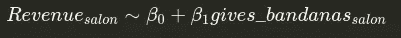

其中 gives_bandanas 是一个 0，1 的指示变量，表示沙龙是否提供头巾。\beta_1 将准确地告诉您赠送头巾对收入的影响。

向回归中添加或不添加控件的原因通常分为两类:

1.  获得正确的测量结果(如减少偏差)
2.  效果测量的精度

## 获得正确的测量

在 3 种主要情况下，向您的回归中添加协变量会影响或破坏您的最终治疗效果估计。

1.  混杂因素(包括它们)
2.  下游结果(不包括它们)
3.  碰撞器(不包括它们)

**添加可能使评估产生偏差的混杂因素**
如果不考虑混杂因素，它们可能会使您的治疗效果评估不正确。混杂因素是指影响治疗价值和结果的因素。

例如，让我们说，在高档社区的顾客更倾向于要求头巾。高档社区也往往会有人在狗狗美容上花更多的钱。因此，花哨会影响治疗(不管美容院是否提供头巾)和结果(收入),而且是一个混杂因素。

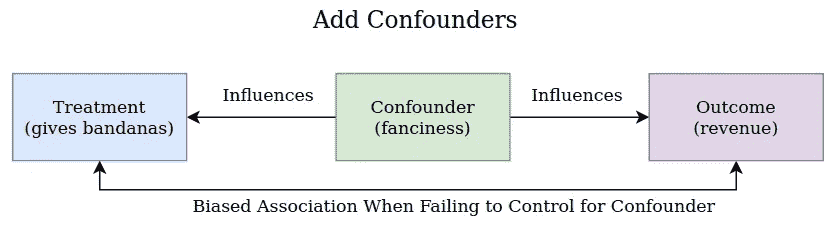

让我们举例说明:

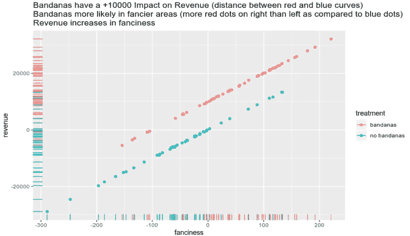

现在让我们看看如果我们不控制幻想会发生什么。

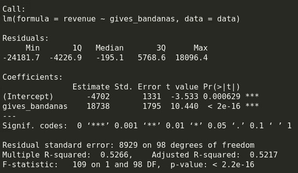

混杂、有偏模型(gives_bandanas 系数包括花哨效应)

gives _ bandanas 的真正效果是收入增加 10000 美元，但我们测量的效果要大得多。事实上，真实的效果甚至不在我们模型的 95%置信区间内。

但是如果我们在回归中加入幻想会怎么样呢？

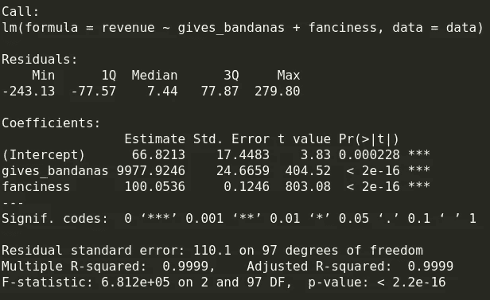

控制混杂因素模型是无偏的

现在我们有了一个精确的效果测量！

检查这些混杂因素的一个好方法是在有和没有混杂因素的情况下进行回归。如果感兴趣的系数(如 gives _ bandanas)变化很大，这是存在偏见的迹象。

[扩展:查看我的 stats stackexhange 帖子，看看无偏系数需要什么数学假设](https://stats.stackexchange.com/questions/16381/what-is-a-complete-list-of-the-usual-assumptions-for-linear-regression/400600#400600)。关键假设是严格的外生性(类似于感兴趣的变量(如 gives _ bandanas)和回归中不受控制但也会影响结果的其他变量之间没有相关性)。

虽然控制混杂因素是有帮助的，但是控制下游结果或碰撞会扭曲我们估计的治疗效果。

**不添加下游结果**

如果我们加入由我们的治疗引起并影响结果的变量，我们将通过增加的变量去除我们的治疗对结果的影响。例如，让我们想象这样一种情况，给狗送头巾会使顾客更有可能回到美容院，而收入会受到有多少顾客回来的影响。

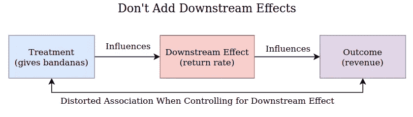

让我们看看当我们将回报率作为协变量时，赠送头巾的效果是如何丧失的。

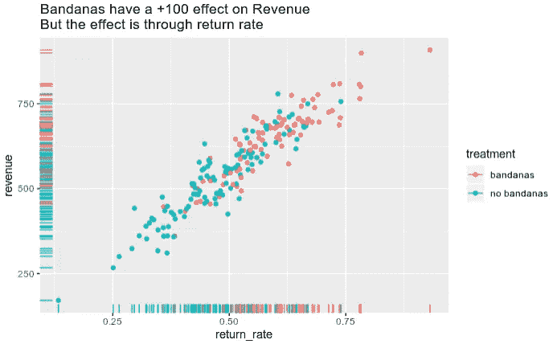

让我们看看回归是如何运行的:

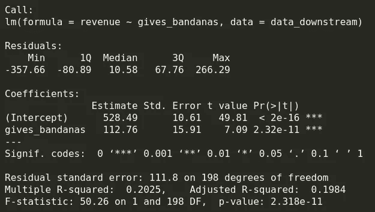

当不包括下游效应时，我们想要什么

当我们不包括下游变量时，我们得到一个非常接近真实的+100 效应的估计效应。

但是如果我们*把*包括进去呢:

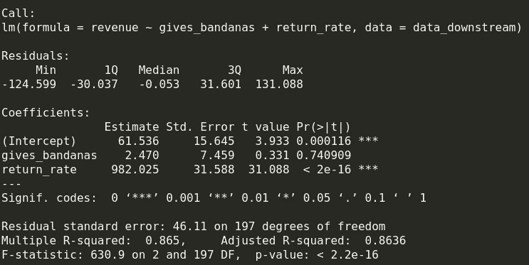

下游效应吸收并消除处理的影响

将 return_rate 添加到回归中消除了使用头巾的影响。这是因为保持 return_rate 不变，赠送头巾实际上没有影响。但是我们仍然对使用头巾的效果感兴趣(即使通过其他变量),所以我们不应该控制下游的影响。

我们不仅需要担心添加下游效果，还需要担心添加碰撞器。

**不要加对撞机**

对撞机是一个受治疗和结果影响的变量。在回归中加入对撞机会扭曲治疗和结果之间的关联。例如，一个沙龙是否作为储藏室。如果你的沙龙赠送手帕，你可能需要一个壁橱来存放它们，因此赠送手帕会影响是否有储藏室。此外，收入高的沙龙可能会看到更多的顾客留下东西，因此这些沙龙需要一个地方来存放失物。让我们考虑一个例子，其中头巾对收入没有任何影响，但如果我们意外地控制了这个碰撞器，就可以找到关联。

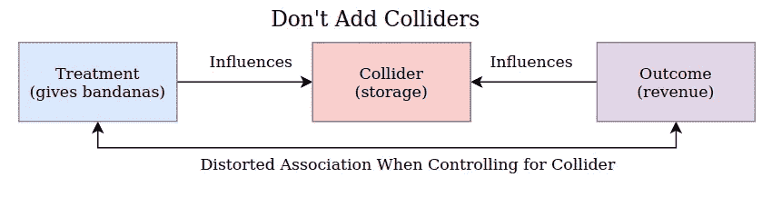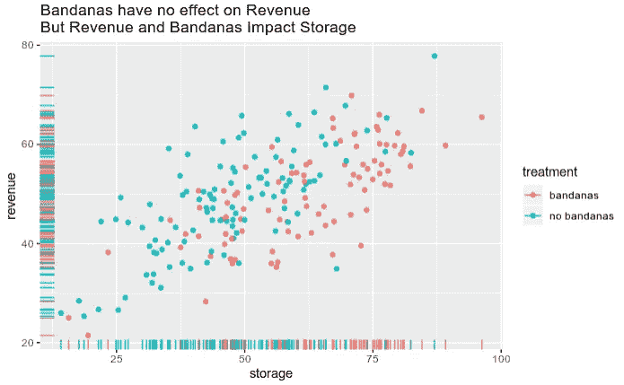

回归在没有碰撞器的情况下运行良好。

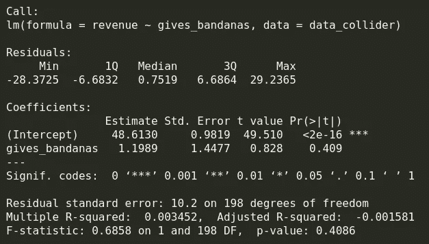

没有对撞机，没有问题

我们没有测量任何给头巾的效果，碰撞器不包括在内。这是一件好事，因为在这种情况下，头巾没有收入的影响。但是当我们加入对撞机时会发生什么呢？

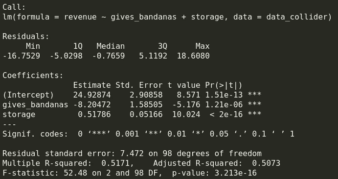

对撞机让头巾看起来有效果，其实没有！

现在我们测量了赠送头巾和实际上并不存在的收入之间的显著负相关。这是因为回归的“固定不变”解释。对于给定的存储价值，收入与赠送手帕成负相关。

知道是否添加协变量来精确测量效果是最重要的，但知道协变量何时可以提高估计的精确度也很重要。

## 协变量对系数估计精度的影响

如果协变量可以预测结果，并且与您试图估计其系数的变量不高度相关，则协变量可以提高您估计特定系数的精确度。

这个结果可能看起来与直觉相反:增加协变量不是应该增加方差从而降低精度吗？对结果的预测是这样，但对回归系数的估计却不是这样。

如果我们满足普通最小二乘法的一些标准假设(我们的结果和协变量之间的关系是线性的，单位之间不相互影响，治疗和影响结果的其他协变量之间没有相关性，homoskedastity—[请参见我的 stats stackexchange 帖子了解所有假设和含义](https://stats.stackexchange.com/questions/16381/what-is-a-complete-list-of-the-usual-assumptions-for-linear-regression/400600#400600))治疗系数的 OLS 估计方差为:

分母中的和指的是在我们的治疗应用中有多少差异(给予头巾)。这与我们添加的协变量无关。

\sigma 是回归的误差方差。我们对回归结果的预测越好，这个值就越低。因此，如果我们添加对结果有高度预测性的协变量，sigma 将会降低，我们将会有更高的精确度。

但是，如果我们以 gives _ bandana 作为结果，以所有其他协变量作为解释变量来运行回归，R _ { gives _ bandanas }代表 R。这意味着，如果我们添加与治疗高度相关的协变量，我们对治疗系数的估计将具有更高的方差。这说明了一个事实，你不应该增加与治疗高度相关的变量，除非它们是与结果高度相关的混杂因素。

我们来举例说明。假设赠送头巾与美容院所在位置的狗的数量无关，但美容院的收入相关(将狗的数量加入回归将提高精确度)。还有，假设沙龙是否从当地的大手帕供应商那里获得广告影响了沙龙是否赠送大手帕，但不直接影响沙龙的收入(加上沙龙是否收到广告会降低精准)。

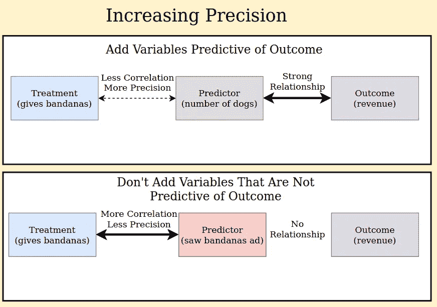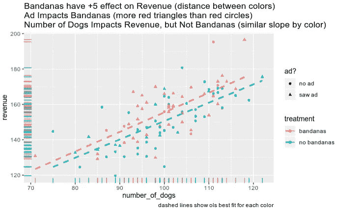

让我们从仅使用治疗的回归开始。

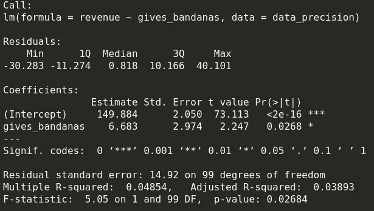

公正处理的无偏测量

我们测量了一个相当接近 5 的真实影响的精确效果。

现在让我们添加预测协变量。

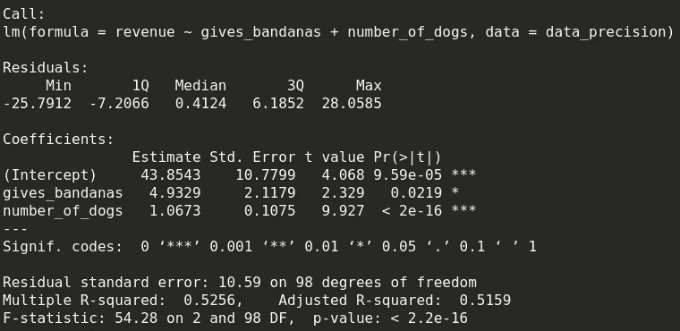

当我们增加一个好的预测器时，测量更精确

现在我们可以更精确地测量效果了！gives _ bandanas 上的系数更接近 5，标准误差更低。

但是如果我们增加了一个与治疗相关的非预测因素呢？

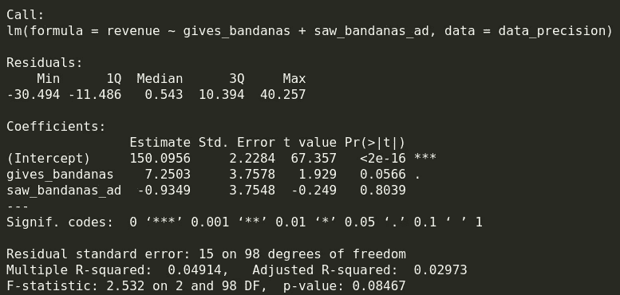

当我们增加一个与治疗相关的非预测因子时，精确度会降低

现在我们的精度更低了，离 5 的真实效果更远了。

# 摘要

总结一下，请参考下面的图表。如果你想了解更多关于通过实验测量效果的知识，请查看我的其他帖子:

*   [实际实验基础知识所有数据科学家都应该知道](/practical-experiment-fundamentals-all-data-scientists-should-know-f11c77fea1b2)
*   [一个数据科学家都应该知道的实验赋值方法](/an-experiment-assignment-method-all-data-scientists-should-know-e4d57d96b26b)

帖子摘要