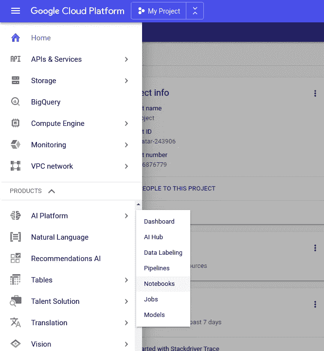
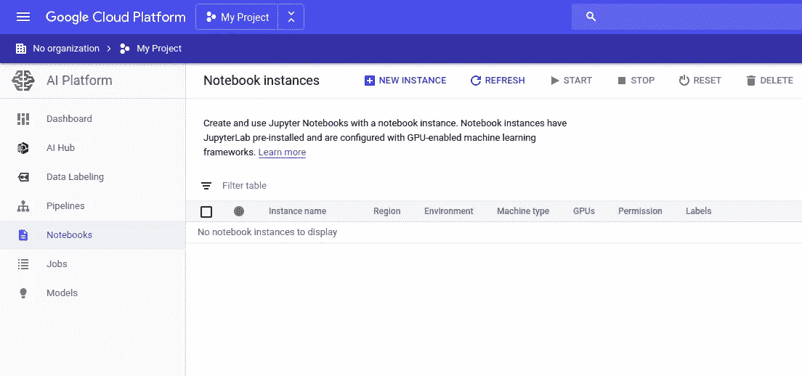
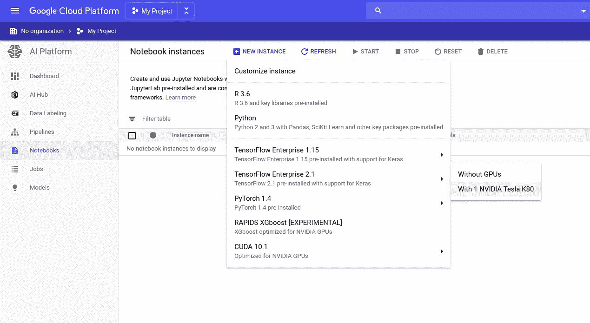
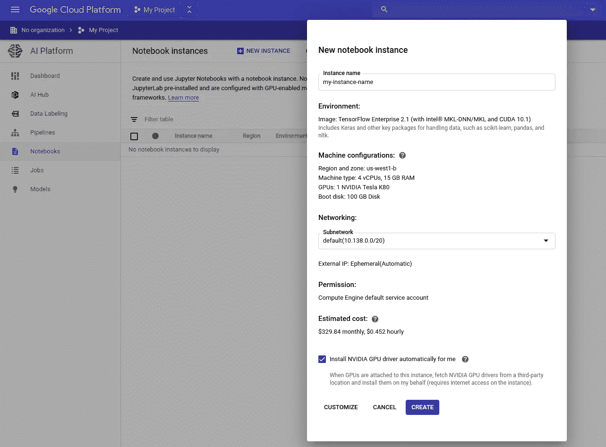
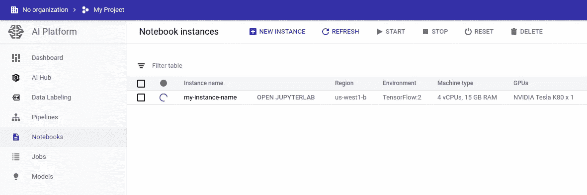
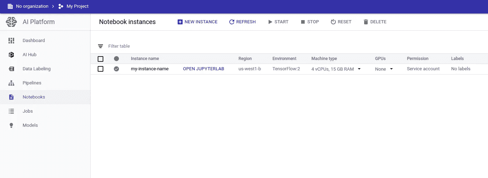
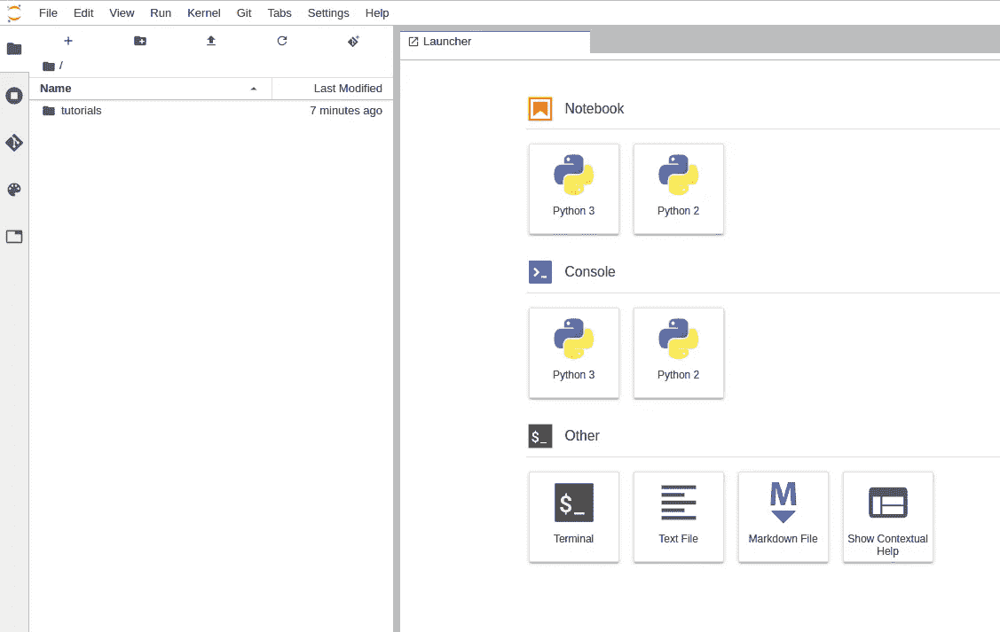
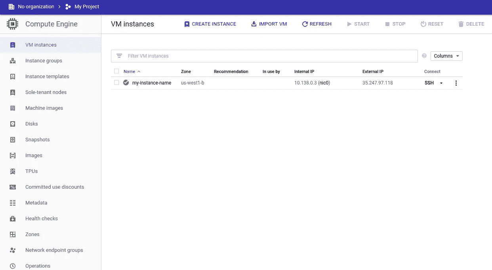

# 以最简单的方式在谷歌云平台上获得深度学习

> 原文：<https://towardsdatascience.com/get-deep-learning-on-google-cloud-platform-the-easy-way-53f74bab5ee9?source=collection_archive---------28----------------------->

## 两分钟内在 GCP 上创建一个深度学习虚拟机

照片由 [lalo Hernandez](https://unsplash.com/@lalonchera?utm_source=unsplash&utm_medium=referral&utm_content=creditCopyText) 在 [Unsplash](https://unsplash.com/?utm_source=unsplash&utm_medium=referral&utm_content=creditCopyText) 上拍摄

亲爱的读者:

我问你这些问题:

*   *你想快速开始在云端训练你的深度神经网络吗？*
*   *想学点云计算但是不知道从哪里开始？*
*   *买不起 GPU 却租得起？*

如果你回答**“是的！”我的朋友们，请继续读下去。会让你的生活轻松一点！**

(注意:我喜欢详细地设置我的虚拟机。有趣的是，我发现这里描述的步骤完全不令人满意！)

# 食谱

我假设你登录了你的 GCP 账户。

在您的菜单中，转到`AI Platform -> Notebooks`:

这会带你去`Notebook Instances`:

点击`NEW INSTANCE`并选择您想要使用的图像。作为一名谷歌粉丝，我选择最新的`TensorFlow`图片。

其中一些图像是为深度学习而构建的。如果你想用 GPU 训练你的网络，选择`With 1 NVIDIA Telsa K80`。

好的好的好的。我能听到你。我也问过自己同样的问题:

> “如果我想使用运行在具有 96 个 vCPUs 的虚拟机上的 8 个 NVIDIA Tesla V100s，我该怎么做？”

如果你愿意支付这些费用，你可以点击`CUSTOMIZE`获得。如果你接受默认值，不要担心。此过程将创建一个成熟的计算引擎虚拟机，您可以在以后轻松地对其进行修改。

在我们继续之前，勾选`Install NVIDIA GPU driver automatically for me`。这照顾我们的 GPU 设置！

现在按下那个`CREATE`按钮。

稍等一会儿…

看到绿色勾号后，点击`OPEN JUPYTERLAB`。

瞧啊。现在，您可以使用云中的 GPU“深入学习”了！这就是全部，我的朋友们。

# 如果我想进一步定制我的虚拟机，该怎么办？

这个也很容易做到！

点击主菜单中的`Compute Engine`。你会在那里看到你漂亮的虚拟机。

停止虚拟机以开始编辑它。像这样做你所有平常的奇妙变化:

*   添加防火墙规则，以便您可以在另一个端口上运行 TensorBoard
*   添加额外磁盘
*   增加虚拟 CPU 的数量，但随后却减少了数量，因为您已经被触手可及的处理能力搞疯了
*   对你的公羊做同样的事
*   用你的 GPU 做同样的事情

就是这样！各位，不使用虚拟机时，一定要记得关闭它们。

直到下一次，

贾斯廷

*原载于 2020 年 4 月 4 日*[*【https://embracingtherandom.com】*](https://embracingtherandom.com/deep-learning/cloud/gcp-deep-learning-vm/)*。*