# 熟悉数据科学最强大的武器~变量(Stat-02)

> 原文：<https://towardsdatascience.com/get-familiar-with-the-most-important-weapon-of-data-science-variables-48cc7cd85dc5?source=collection_archive---------29----------------------->


图片由[皮克斯拜](https://pixabay.com/?utm_source=link-attribution&utm_medium=referral&utm_campaign=image&utm_content=2899906)的 Gerd Altmann 提供

## 变量类型的基本概念、测量级别和不同的 python 表示技术

> "你可以拥有没有信息的数据，但你不能拥有没有数据的信息."—丹尼尔·凯斯·莫兰

数据是信息时代的原材料。没有数据，我们就无法想象现代技术。如果我们有数据，我们就能获得大量关于任何事件或空间的信息。当今世界对数据有着强烈的渴望。就现代技术而言，它可以与石油相提并论。

但是如果你不知道数据，这没有任何意义。首先，我们必须熟悉我们正在探索的数据。如果我们不了解数据，我们建立在数据之上的系统或分析模型将会以无用的分析或系统而告终。因此，我们需要熟悉数据类型及其表示技术。

**该参数保存的数据在统计学中称为变量。**一个数据集可能描述股票市场，其他数据集可能描述人口、雇员数据等等。因系统而异。具有变化值的属性是**变量**。

这篇文章将在这方面帮助你。这里将显示所有变量类型和变量的可能图形表示。如果你感兴趣，这将是最适合你的文章。让我们开始吧。

# 内容

1.  变量的类型
2.  测量级别
3.  使用 python 的数据表示(*条形图、饼图、排列图*

# 1.变量的类型

数据来源庞大。我们可能会从不同的数据源中找到不同类型的数据。但是了解数据的特征是很重要的。变量定义了数据的特征。有一些参数，我们可以很容易地划分或分类的变量。基本上有两种类型的变量。

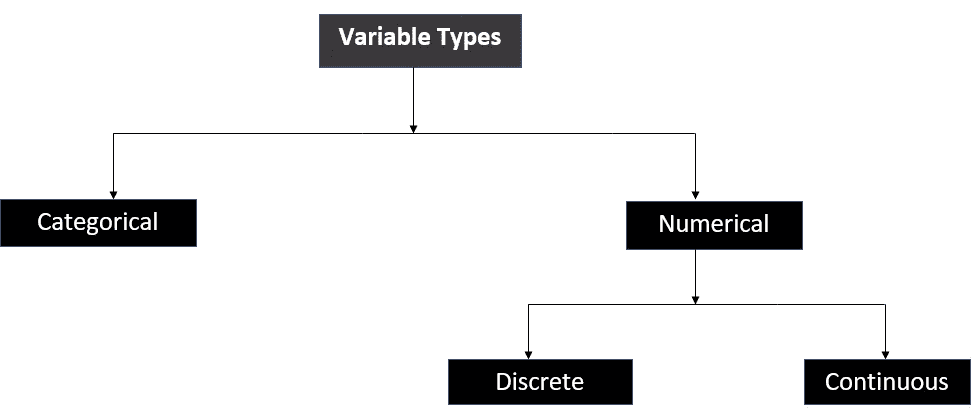

变量类型(作者照片)

主要有两种变量类型:I)分类变量和 **ii)数值变量**

**我**。**分类**:分类变量代表可以分组的数据类型。它也被称为**定性**变量。

*示例* : **汽车品牌**是一个分类变量，包含奥迪、丰田、宝马等分类数据。**答案**是保存分类数据是/否的分类变量

**二。数值:**所有用数字表示的变量称为数值变量。它也被称为**定量**变量。它可以是 a)离散的，或 b)连续的。

**a)离散:**简单来说，所有包含可数数据的变量称为离散变量。

*示例* : **变量**-子女数量、SAT 分数、人口等。，所有这些变量都包含离散数据。

**b)连续:**不可数的变量称为连续变量。它需要永远计数，计数过程将永远不会结束。

*例子*:年龄是一个连续变量。但是为什么呢？假设，你的年龄是 25 年 2 个月 10 天 7 小时 40 秒 44 毫秒 10 纳秒 99 皮秒……等等。它永远不会结束。另一个例子可能是"**平均值"**变量。取平均数 1.232343542543245……永无止境。

变量的快速比较。

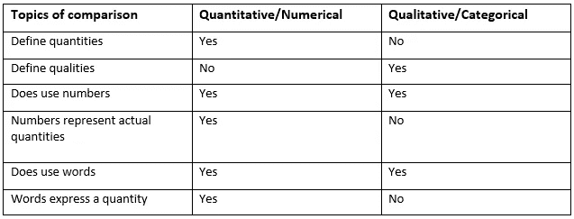

定量对比定性(作者照片)

# 2.测量级别

*根据维基百科*，“**衡量标准**或**衡量尺度**是一种分类，描述了分配给[变量](https://en.wikipedia.org/wiki/Dependent_and_independent_variables) s 的值内的信息的性质。”

心理学家斯坦利·史密斯·史蒂文斯提出了最著名的四个测量等级的分类。音程 iv。比率

**标称**和**序数**标尺用于测量定性/分类变量。另一方面，**区间**和**比值**刻度用于测量定量/数值变量。

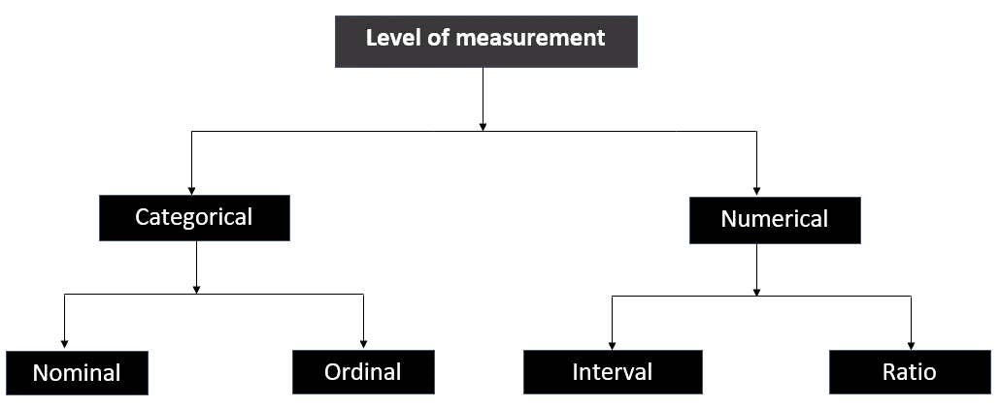

测量水平(作者照片)

**一、名义上的**:它是一个拉丁语单词，意思是只有名字。名义层代表不能按任何顺序排列的类别。该级别仅代表单个类别或名称。

*   它只代表质量。
*   有了名义尺度，我们可以确定变量中两个个体之间的差异。
*   它没有提供任何关于差异大小的概念。

*例*:假设，一个变量代表汽车品牌→奥迪、丰田、宝马等。我们不能以任何方式排列这些名字。因此，这类变量属于名义计量水平。

**二世。序数**:是有序的级别或等级。它表示可以排序的分类变量。有了这个尺度，我们可以确定一个变量的差异方向，但不能确定差异的大小。

*举例*:我们有一个名为 Height 的变量，代表矮、中、高三种人的身高。我们可以很容易地将这些值排序为高→中→矮。这个顺序提供了一个很好的关于差异方向的直觉，但是它没有提供任何线索来识别彼此之间的高度差异。

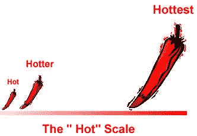

序数尺度直觉([照片通过统计如何进行](https://www.statisticshowto.com/scales-of-measurement/))

**三世。区间:**一个代表水平之间相等的区间，可以用实数表示的变量称为区间标度。它不仅对测量值进行分类和排序，而且还指定标尺上每个区间之间的距离在从低区间到高区间的标尺上是相等的。

*例*:温度是一个变量，其中 10 摄氏度与 20 摄氏度、70 摄氏度、80 摄氏度之间的间隔相同。考试成绩、身高、时间等。可以作为区间尺度的一个很好的例子。

**四。比率:**它具有区间标度一样的所有性质。此外，它必须满足标度中有意义的零。先说清楚。

假设，我们在考虑 C 和 F 标度的体温。我们发现两个人的体温分别是 10 摄氏度和 20 摄氏度，或者 10 华氏度和 20 华氏度。我们不能说第二个人的体温比第一个人高两倍。因为 0°C 和 0°F 不是真正的零度，这意味着不存在温度。如果你想用一个比例标度来表示温度，那么我们必须考虑开尔文标度，因为 0 开尔文表示没有温度。

# **3。用 Python 进行数据表示**

在这里，我们将讨论柱状图、饼状图和排列图来表示变量。

## 分类变量表示:

假设，我们有一个汽车销售市场的数据集，我们将分析**汽车品牌**变量。首先，我们计算不同**汽车品牌**的频率。好像是下面这样的东西。

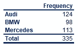

演示汽车品牌频率

让我们把它转换成数据帧。因为我们要用这个演示数据来分析图形表示。频率代表每个品牌售出汽车的数量。您可以对任何数据集进行同样的操作。让我们用熊猫数据帧来转换图像。

```
import pandas as pd
import matplotlib.pyplot as plt
df=pd.DataFrame({"Brand":['Audi',"BMW","Mercedes"],"Frequency":[124,98,113]})
```

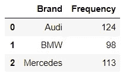

熊猫数据框

**计算相对频率**

相对频率表示个体频率分布的百分比。

*相对频率(%)=(个别频率/总频率)*100*

```
df['Relative Frequency(%)']=
round((df.Frequency/sum(df.Frequency))*100,2)
```

我们在主数据集中添加了一个相对频率列。

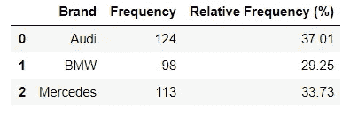

具有相对频率栏的数据框

让我们用频率画一个条形图。

**条形图:**

```
import matplotlib.pyplot as pltfig,ax=plt.subplots()
var=plt.bar(df.Brand, df.Frequency, align='center', alpha=0.5)#this loop is used to represent frequency on each bar
for idx,rect in enumerate(var):
        height = rect.get_height()
        ax.text(rect.get_x() + rect.get_width()/2., 1.01*height,
                df.Frequency[idx],
                ha='center', va='bottom', rotation=0)#adding labels and title
plt.ylabel('Frequency')
plt.xlabel('Brand Name')
plt.title('Car Sales Statistics')plt.show()
```

这是一个频率条形图。

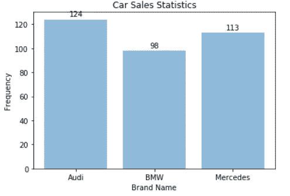

条形图代表频率

我们还可以用饼图来表示不同分类数据之间的频率分布。

## 饼图:

```
fig = plt.figure()
ax = fig.add_axes([0,0,1,1])
ax.axis('equal')ax.pie(df.Frequency, labels = df.Brand,autopct='%1.2f%%')
plt.show()
```

相对频率饼图。

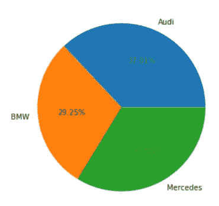

相对频率饼图

## 帕累托图

帕累托图是一种特殊类型的条形图，其中类别按频率降序显示，单独的曲线显示累计频率。

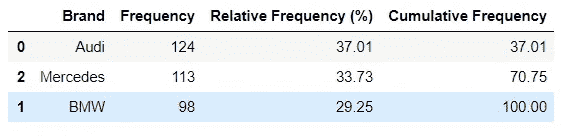

具有累积频率的数据帧。

我们用 python 来画图吧。

```
from matplotlib.ticker import PercentFormatterdf = df.sort_values(by='Frequency',ascending=False)
df["Cumulative Frequency"] = round(df["Frequency"].cumsum()/df["Frequency"].sum()*100,2)
fig, ax = plt.subplots(figsize=(10,5))
ax.bar(df.Brand, df["Frequency"], color="blue")
ax2 = ax.twinx()
ax2.plot(df.Brand, df["Cumulative Frequency"], color="red", marker="D", ms=7)
ax2.yaxis.set_major_formatter(PercentFormatter())ax.tick_params(axis="y", colors="black")
ax2.tick_params(axis="y", colors="black")
ax2.set_ylim(0,105)
ax.set_ylim(0,130)
plt.show()
```

频率表的排列图。

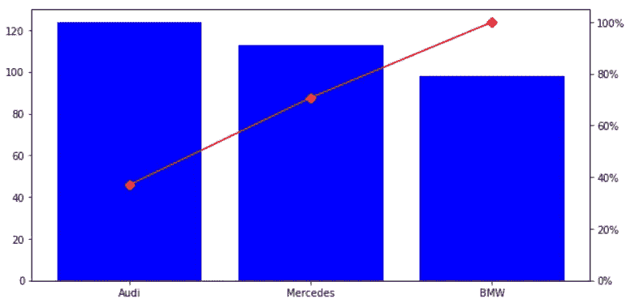

图表的左侧代表频率，右侧代表累积频率

到目前为止一切顺利。我们在文章的最后。

## 数字变量表示:

我们还可以用条形图、饼图和排列图来表示数字数据。如果我们想找到数字数据的频率，我们可能会发现每个数据的频率为 1。但是表示数据是不可行的。那么，我能做什么呢？

我们可以把数值数据分成不同的区间，然后统计区间内数据出现的频率。让我们试着对 python 数据框架有更好的直觉。

```
df=pd.DataFrame({"data":[10,40,20,5,30,100,110,70,80,63,55,32,45,85,87,77,65,44,33,4,56,90,95,96]})
```

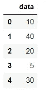

数据帧的前 5 个数据。

如果要统计频率，大部分数据的频率会是 1。

```
df['data'].value_counts()
```

这给出了频率..

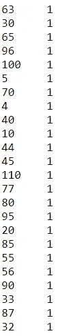

数字数据的频率。

现在，如果我们想用条形图、饼图来表示上述频率，它不提供任何信息。所以，我们需要计算间隔内的频率。假设，我们将数据分成 5 个相等的区间。

```
d=df['data'].value_counts(bins = 5).sort_index()
```

它显示了下面的频率分布。

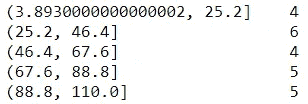

左栏表示间隔，右栏表示频率。

我们可以用柱状图，饼状图和排列图来表示数字变量的频率。试着按照上面的技巧画出数字变量的图表。这是你的任务。


照片由[杰克逊在](https://unsplash.com/@simmerdownjpg?utm_source=medium&utm_medium=referral) [Unsplash](https://unsplash.com?utm_source=medium&utm_medium=referral) 上煨

# 结论

分母变量对于数据科学任务非常重要。在我们分析的最开始，我们必须看一看它。我们经常忘记把它考虑进去。希望这几分钟的阅读能让你对变量，变量的类型等等有一个很好的直觉。你将在 Github 中获得完整的 jupyter 笔记本文件。

如果你有任何问题，请在评论区告诉我。

***数据科学统计系列文章***

1.  [*少即是多；采样的‘艺术’(Stat-01)*](/less-is-more-the-art-of-sampling-dda8b59d399?source=your_stories_page-------------------------------------)
2.  [*熟悉数据科学最重要的武器~变量(Stat-02)*](/get-familiar-with-the-most-important-weapon-of-data-science-variables-48cc7cd85dc5?source=your_stories_page-------------------------------------)
3.  [*要提高数据分析能力，您必须了解频率分布(Stat-03)*](/to-increase-data-analysing-power-you-must-know-frequency-distribution-afa438c3e7a4?source=your_stories_page-------------------------------------)
4.  [*通过可视化频率分布找到数据集的模式(Stat-04)*](/find-the-patterns-of-a-dataset-by-visualizing-frequency-distribution-c5718ab1f2c2?source=your_stories_page-------------------------------------)
5.  [*比较多个频率分布，从数据集中提取有价值的信息(Stat-05)*](/compare-multiple-frequency-distributions-to-extract-valuable-information-from-a-dataset-10cba801f07b?source=your_stories_page-------------------------------------)
6.  [*通过简短的讨论消除你对 Mean 的误解(Stat-06)*](https://medium.datadriveninvestor.com/eliminate-your-misconception-about-mean-with-a-brief-discussion-a9fed67d4b08?source=your_stories_page-------------------------------------)
7.  [*通过规范化提高您的数据科学模型效率(Stat-07)*](https://medium.datadriveninvestor.com/increase-your-data-science-model-efficiency-with-normalization-918484b4626f?source=your_stories_page-------------------------------------)
8.  [*【数据科学基础概率概念(Stat-08)*](/basic-probability-concepts-for-data-science-eb8e08c9ad92?source=your_stories_page-------------------------------------)
9.  [*从朴素贝叶斯定理到朴素贝叶斯分类器路线图(Stat-09)*](/road-map-from-naive-bayes-theorem-to-naive-bayes-classifier-6395fc6d5d2a?source=your_stories_page-------------------------------------)
10.  [*数据科学爱好者关于假设检验需要知道的一切(Stat-10)*](https://medium.datadriveninvestor.com/all-you-need-to-know-about-hypothesis-testing-for-data-science-enthusiasts-30cfe1dce028?source=your_stories_page-------------------------------------)
11.  [*用 ANOVA 进行多组间的统计比较(Stat-11)*](/statistical-comparison-among-multiple-groups-with-anova-d4ac27f6e59e?source=your_stories_page-------------------------------------)
12.  [*用卡方检验比较分类变量的相关性(Stat-12)*](/compare-dependency-of-categorical-variables-with-chi-square-test-982baff64e81?source=your_stories_page-------------------------------------)