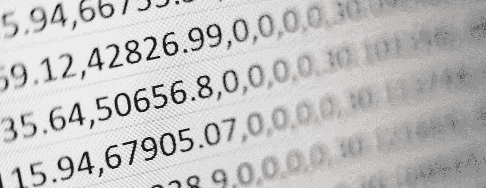
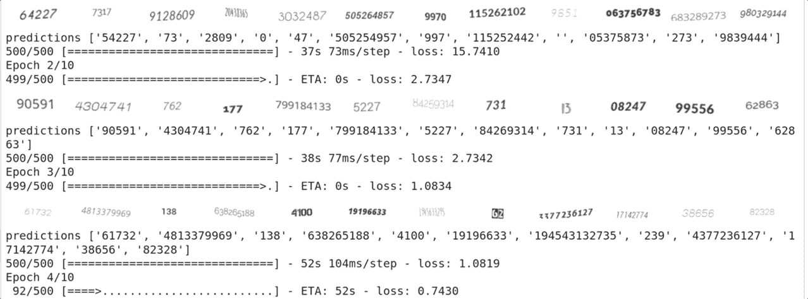
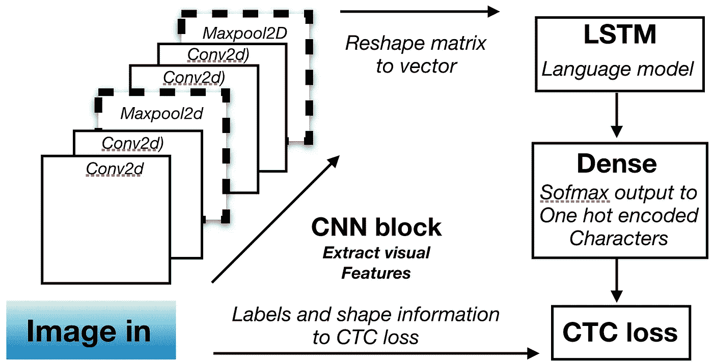
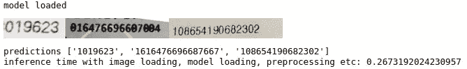

# 深度学习 OCR 入门

> 原文：<https://towardsdatascience.com/get-started-with-deep-learning-ocr-136ac645db1d?source=collection_archive---------13----------------------->

## 现代 OCR 的实用介绍，包括培训和测试所需的一切。

一项人类不该做的字符识别任务。

不久前，我开始研究潜在的 OCR 实现，目标是仅使用生成的训练数据在 tf.keras 2 中创建一个清晰的卷积递归神经网络(CRNN)基线。另一个目标是创建一个存储库，允许以后使用相同的模板探索不同的体系结构和数据域。该存储库应该是模块化的，易于使用，并充满解释性评论，以便我的同事可以很容易地跟进。

在高强度的谷歌搜索之后，我没能找到一个满足我要求的库。虽然有一些好的资源和实现，但我决定创建自己的[[1](https://keras.io/examples/image_ocr/)、[2](https://www.dlology.com/blog/how-to-train-a-keras-model-to-recognize-variable-length-text/)、[3](/a-gentle-introduction-to-ocr-ee1469a201aa)。

在我的笔记本电脑 GPU 上训练下面的简单模型需要几分钟，但是没有 GPU 你也可以很容易地训练它。

传统的文档处理流水线通过应用 OCR 软件从文本图像中解析文本来工作。通常，图像由边界框模块预先准备，边界框模块为 OCR 模块隔离图像内的文本区域。管道的后续阶段将:解析文本，提取含义、关键字、值和表格，并以更易于编程的形式返回结果，如:数据库条目、CSV，或将输出与公司的内部系统集成。

在这篇文章中，重点是 OCR 阶段，以基于深度学习的 CRNN 架构为例。在 [**GitHub**](https://github.com/kutvonenaki/simple_ocr) 中共同发布了一个完整的功能实现，旨在作为一个端到端管道模板，包括数据生成和推理。重点是提供一个清晰的、有良好文档记录的管道，可以很容易地扩展到不同的架构，而不是神经网络(NN)架构本身。

我的目标是让人们能够在不访问 GPU 或任何训练数据的情况下，仅使用存储库中的指令来训练和测试简单的 OCR 模型。这篇文章将讨论一些实现细节，但是对于那些只想尝试代码的人来说，这些并不是真正需要的。

注意，虽然在这个例子中为了简单起见我们只解析数字，但是在回购中使用的 [**trdg**](https://textrecognitiondatagenerator.readthedocs.io/en/latest/index.html) 文本生成器可以从维基百科生成随机句子，用于训练更通用的 OCR 模型。也就是说，为了在更具挑战性的数据领域(如噪声图像、手写文本或自然场景中的文本)上实现良好的性能，需要调整模型和数据增强方法。

## CRNN

OCR 中常用的神经网络架构很少，比如 CRNN 和各种基于注意力的模型[ [4](https://nanonets.com/blog/attention-ocr-for-text-recogntion/) ， [5](https://github.com/emedvedev/attention-ocr) ]。CRNN 模型使用卷积神经网络(CNN)来提取视觉特征，这些视觉特征被整形并馈入长短期记忆网络(LSTM)。然后，LSTM 的输出被映射到具有密集层的字符标签空间。

CRNN OCR 模型的基本构件。块内的层数和具体参数在不同的实现中有所不同。在推理时，不使用 CTC 丢失，而是将来自密集层的输出解码成相应的字符标签。详情见代码。

## 有时 LSTM 层可以被去除

LSTM 层的功能是学习文本的语言模型。例如，考虑一种情况，其中 CNN 特征提取层产生“tha_k you”的编码，但是 place _ 处的字符没有被很好地识别。也许在那个地方有一个污垢点或者字符是以一种草率的方式手写的。但由于 LSTM 层通过数据了解到文本中有大量的“谢谢”输入，OCR 可以预测正确的缺失字母。

同样的推理对随机字符串不起作用，比如“1252 _ 5”；在这种情况下，没有“语言模型”的上下文历史，所以实际上我们可以删除这个任务的 LSTM 部分，使模型更快更轻。这正是我们的数字唯一的例子，但真实的话，LSTM 层应该使用。

在提供的示例存储库中，LSTM 的使用由 use_lstm 布尔控制，它是 models.make_standard_CRNN()的输入参数。

# *实施*

这里的重点是高层次的概述和 tf.keras 实现中几个稍微复杂的部分，尤其是与 CTC 损失相关的部分。鼓励有兴趣更详细了解 CTC 损失的人阅读 [**这篇**](https://distill.pub/2017/ctc/) 的优秀文章。

在最高级别上，训练代码构建由图像高度和我们的字典中的字符总数参数化的神经网络，创建数据生成器并训练模型。注意，在我们的实现中，训练和推理可以接受任何长度的文本，图像宽度不需要预先定义。

单个批次中的图像必须具有相同的尺寸，但这由数据生成器(下面的 datagen)负责，将图像填充到批次中最大图像的尺寸。训练数据完全由 [**trdg**](https://textrecognitiondatagenerator.readthedocs.io/en/latest/index.html) 模块生成。

以下代码行构造了回调函数，用于在每个时期后可视化批图像及其预测，并在训练期间保存已训练的权重。在此之后，我们编译模型，选择我们喜欢的优化器，并为选定数量的时期进行训练。

tf.keras 中的高级函数

## 破解 tf.keras 2.1 中的 CTC 丢失

在 tf.keras 2.1 中为 CRNN 实现 CTC loss 可能会很有挑战性。这是由于来自 NN 模型的输出(最后一个密集层的输出)是形状的张量(batch_size、时间分布长度、数据中唯一字符的数量)，但是批量条目的实际预测目标是单词中的字符标签，例如[1，3，6，2，0，0，0]。因此，预测和目标将不会具有相同的形状。tf.keras 2.1 中的一个限制是 y_true 和 y_pred 的维度必须匹配。在推理时，我们只需要模型输出和 CTC 解码函数来产生字符标签。

除了批次的 y_pred 和 true 标签(batch_labels)，ctc_batch_cost 还需要每个输入单词的字符数(label_length)。这需要忽略 batch_labels 中的“虚拟标签”,例如，在一个最长的字为 7 个字符长的批处理中，4 个字符的字在位置[4:7]中的标签，因此 batch_labels 的形状为(batch_size，7)。还有，我们要馈入 input_length，也就是 y_pred (y_pred.shape[1])的时间维度。

在某些 keras 实现中，损耗是在神经网络内部实现的，输出不是上面的 y_pred。在这些实现中，模型已经返回计算的 ctc 批次损失，并且在 model.compile()中使用虚拟损失来最小化来自 NN 的输出(CTC 损失)。我不想在模型中实现 loss，因为我认为这使得代码与标准的 tf.keras 格式不同，并可能在以后搜索不同的架构和参数时导致复杂性。

但是我仍然需要依靠一些黑客技术来解决 y_true 和 y_pred 的不匹配维度。最后，我将标签、输入长度和 batch_labels 嵌入到一个形状为 y_pred 的数组中，并将其作为 y_true 返回。这种打包在数据生成器中完成，张量在损失函数中解包。

数组的打包实际上也考虑了所需的参数。只有当发送到 CTC loss 的 y_pred 的时间维度大于批中最长文本的字符数时，打包才可能导致错误。但这是使用太多卷积的结果，或者是由于输入定义不当。一个 6 个字符长的单词不能通过建议 5 个字符来识别。

## 如何自己测试 OCR

要开始使用，下载或克隆 [**github repo**](https://github.com/kutvonenaki/simple_ocr) 并设置包含 Tensorflow 2.1、 **trdg** (pip install trdg)和 Jupyter notebook 的 Python 环境。自述文件包含如何使用 Docker 设置环境的说明。

设置好环境后，用 jupyter 笔记本打开 [**笔记本**](https://github.com/kutvonenaki/simple_ocr/blob/master/OCR_simple.ipynb) (点击查看示例输出)。执行第一个单元以创建模型、数据生成器和编译模型。第二个单元将训练模型。第三个单元格将调用推理函数来预测放置在 inference_test_imgs/文件夹中的所有图像中的文本。训练也可以通过主文件夹中的“python train.py”来完成，但是你会错过训练过程中的可视化输出。

从推理输出的例子来看，预测的准确性取决于训练参数、神经网络结构和所使用的数据生成参数。在这个例子中，我们将与第一和第三个例子相似的数字输入神经网络。人们可以通过探索不同的神经网络结构、训练参数、字体、背景和其他数据扩充参数来改进结果。

希望你能从这个简短的介绍开始！更多详情和评论请查看 [**Github**](https://github.com/kutvonenaki/simple_ocr) **。**我们也希望聘请有好奇心的、久经考验的软件工程师来开发人工智能/人工智能产品，请随时联系我们。感谢您的阅读！

我在 Medium 的其他帖子:

[使用 Rigetti 的量子计算& pyQuil](https://medium.com/swlh/exploring-quantum-computing-with-rigetti-pyquil-mid-2020-edition-70b28f917670)

[https://medium . com/@ akikutvonen/how-to-train-sentence piece-tokenizers-for-any-language-with-large-data-pretrained-models-for-e84bb 225 ed4a](https://medium.com/@akikutvonen/how-to-train-sentencepiece-tokenizers-for-any-language-with-large-data-pretrained-models-for-e84bb225ed4a)