# 图论入门

> 原文：<https://towardsdatascience.com/get-started-with-graph-theory-2b4460eeafc?source=collection_archive---------31----------------------->

## [图论简化版](http://towardsdatascience.com/tagged/graph-theory-simplified)

## 图论简介

> 这是我全新系列 [**图论:围棋英雄**](https://medium.com/@kelvinjose/graph-theory-go-hero-1b5917da4fc1) **的第一个帖子。查看本系列下一篇文章的索引页面。它总是得到很好的维护和更新。**

图论本质上是对图或网络的性质和应用的研究。正如我上面提到的，这是一个巨大的主题，本系列的目标是了解如何应用图论来解决现实世界的问题。如果我们看看我们生活的前提，我们可以看到许多问题突然出现，这些问题又可以被建模为图表。例如，从所有给定的类别中选择一个服装组合可以被认为是一个完美的场景。

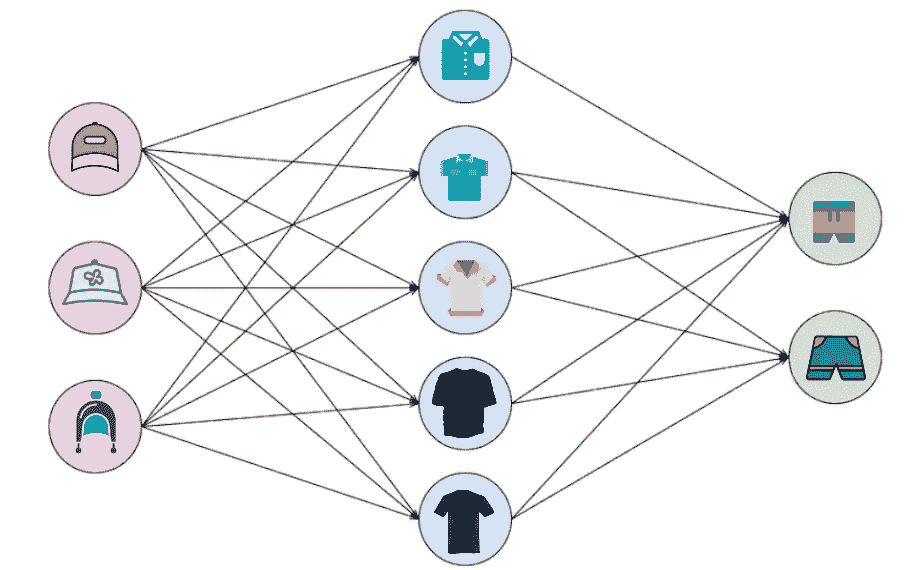

作者照片

如果我们从每个类别中选择一件商品，比如从帽子中选择一件，从 T 恤衫中选择另一件，等等，我们最终会有 n 个可能的选项。我们这里的限制是，每个类别只有有限数量的资源。尽管如此，我们还是有相当多的组合。在这种情况下，我们可以使用图表来展示每个**节点**中不同类别的服装，以及它们之间通过**边**的关系。希望节点和边背后的想法大家都知道。如果没有，节点可以被认为是每个类别的每个项目，例如，红色的帽子是一个节点，绿色的裤子也是一个节点。不同节点之间的关系可以使用边来描述，即从红色帽子到蓝色 t 恤。

图的另一个典型例子是朋友的社交网络。将数据可视化到图表上使我们能够生成并回答关于数据的不同有趣问题。

来自[触摸屏](https://images.app.goo.gl/Hvgbm5xkk4o9qFNA9)的截图

在社交网络的情况下，我们可以问这样的问题:约翰有多少朋友，或者凯西和米兰之间有多少共同的朋友。

## 图形的类型

有不同类型的图形表示可用，我们必须确保在编程解决包含图形的问题时，我们理解我们正在处理的图形的类型。

*   **无向图**

顾名思义，节点之间不会有任何指定的方向。因此，从节点 A 到 B 的边与从 B 到 A 的边是相同的。

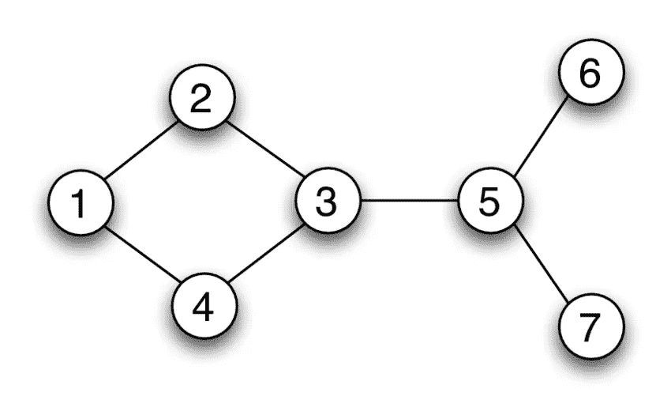

照片[researchgate.net 的哈坎·特拉利乌斯](https://www.researchgate.net/profile/Hakan_Terelius)

在上图中，每个节点可以代表不同的城市，边显示双向道路。

*   **有向图**

与无向图不同，有向图在不同的节点之间有方向或者说**方向**。这意味着如果你有一条从节点 A 到 B 的边，你只能从 A 移动到 B。

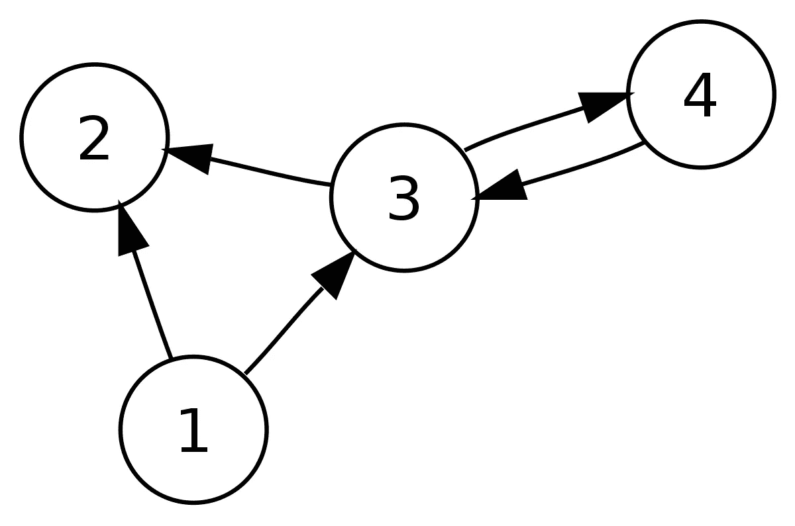

来自[维基媒体](https://upload.wikimedia.org/wikipedia/commons/5/51/Directed_graph.svg)的截图

和前面的例子一样，如果我们把节点看作城市，我们有一个从城市 1 到城市 2 的方向。这意味着，你可以从城市 1 开车到城市 2，但不能回到城市 1，因为没有从城市 2 回到城市 1 的方向。但是如果我们仔细观察图表，我们可以看到双向的城市。例如，城市 3 和 4 有指向两边的方向。

*   **加权图**

许多图可以有包含权重的边，以表示真实世界的含义，如成本、距离、数量等

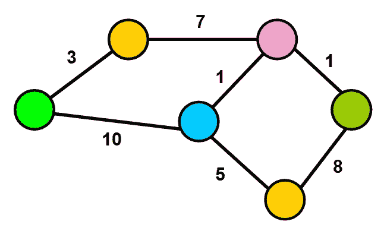

照片由[Estefania Cassingena Navone](https://www.freecodecamp.org/news/author/estefaniacn/)通过[freecodecamp.org](https://cdn-media-1.freecodecamp.org/images/H1ASU4s0MP52QUyuqo4LIjlvZcR4kn7lkq2V)拍摄

加权图可以是有向图，也可以是无向图。在这个例子中，我们有一个无向加权图。从绿色节点到橙色节点的成本或距离是 3，反之亦然。我们可以将这种关系表示为类似于 **(u，v，w)** 的三元组，该三元组显示了边从哪里进入、去往哪里以及两个节点之间的成本或距离。就像我们之前的例子一样，如果你想在两个城市之间旅行，比如城市绿色和橙色，我们将不得不支付 3 美元的费用，或者换句话说，我们将不得不开车 3 英里。这些指标是自定义的，可以根据情况进行更改。对于一个更详细的例子，考虑你必须从绿色到粉红色的城市。如果你看看城市图，我们找不到两个城市之间的任何直接道路或边缘。所以我们能做的就是经由另一个城市旅行。最有希望的路线是从绿色开始，经过橙色和蓝色，变成粉红色。如果权重是城市之间的成本，我们将不得不花费 11 美元通过蓝色到达粉红色，但如果我们通过橙色选择另一条路线，我们将只需支付 10 美元。

## 特殊图形

除了上面的划分，我们还有另一组图叫做特殊图。

*   **树**

最重要的特殊图是树。这是一个没有圈的无向图。等价地，它有 **N** 个节点和 **N — 1** 条边。

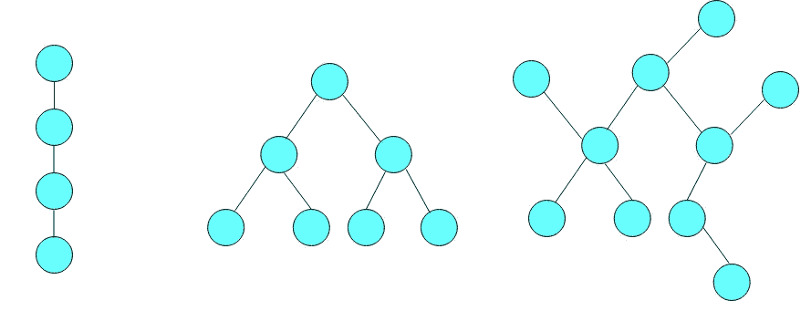

作者照片

上面给出的所有图都是树，甚至最左边的图也是，因为它没有圈。

*   **有根树**

有根树是具有指定的根节点的树，其中所有其他节点或者朝向根或者远离根。

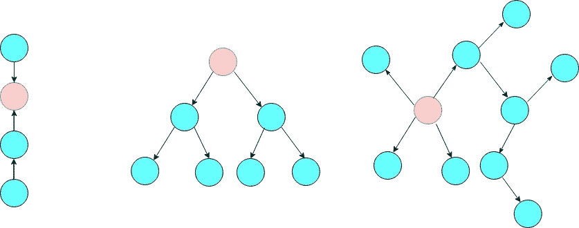

作者照片

红色的节点是根节点。最左边的树被称为**树内**，因为所有其他节点都向根节点靠近。另外两棵树是**外树**，因为所有其他节点都离开了根。

*   **有向无环图** ( **DAG** s)

Dag 是没有圈的有向图。这些图在表示具有依赖关系的结构(如调度程序和编译器)时起着重要的作用。

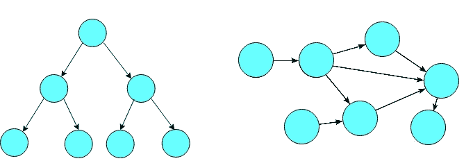

作者照片

我们可以用这个图来表示有意义的事物之间的拓扑顺序。例如，如果我们在流程管理器中使用 DAGs，我们可以说子流程 x 和 y 应该在继续处理 z 之前完成。

*   **二部图**

二部图的顶点可以分成两个不相交的集合，比如 U 和 V，其中图中的每条边连接 U 和 V 之间的顶点。

截图来自 [Wolfram Mathworld](https://mathworld.wolfram.com/BipartiteGraph.html)

如果我们看这个图，我们可以看到每个图可以分成两个不相交的集合(U，V ),每个边连接 U 和 V 之间的节点。

*   **完整图形**

我们称一个图为完全的当且仅当，每一对顶点之间有唯一的边连接。具有 n 个顶点的完整图被表示为 **Kn。**

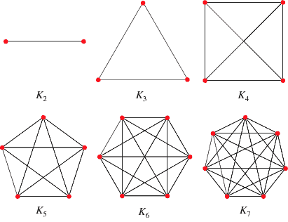

截图来自 [Wolfrom Mathworld](https://mathworld.wolfram.com/CompleteGraph.html)

由于要遍历的边的数量，完全图被认为是最坏情况图。

## 图形的表示

在这里，我们讨论如何在内存中存储一个图形，以便进一步处理。

*   **邻接矩阵**

有效的方法是使用大小为 NxN 的矩阵，其中 N 是节点的数量。我们称这个矩阵为邻接矩阵。

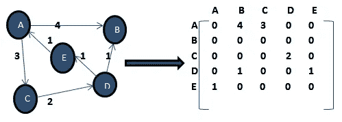

截图来自[softwaretestinghelp.com](https://www.softwaretestinghelp.com/graph-implementation-cpp/)

上面给出的是一个有向加权图及其对应的邻接矩阵 **M** 。该矩阵的大小为 5×5，因为总共有 5 个节点。从节点 A 到 B 的成本是 4，在 **M[A][B]中给出。**类似地，从一个节点到其自身的成本是零，因此所有对角线元素将总是零。这是存储密集结构的图形信息的空间有效的方法，并且边查找将总是花费恒定的时间。但是，随着节点数量的增加，跟踪边信息所需的空间也将呈指数增长。如果大部分的边都没有适当的信息，我们将最终建立一个稀疏矩阵。

*   **邻接表**

我们用来存储节点和边信息的另一个重要结构是邻接表。这是从节点到边列表的映射。

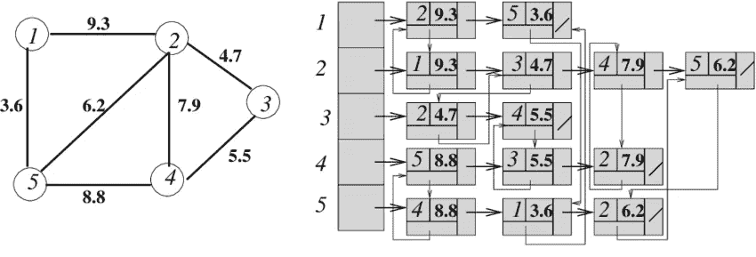

摄影:苏伦德·巴斯瓦纳经由 researchgate.net

给出的例子是一个无向加权图。如果我们看最右边的图，我们可以看到从每个顶点开始的几个列表。节点 1 有两条输出边，即 2 和 5，我们用它的成本来表示这些信息。列表中的每个元素都有目标节点和相应的成本或权重。

如果邻接表是稀疏的，则邻接表是存储图信息的有效机制，即，与相同情况下的邻接矩阵相比，邻接表将占用更少的存储器。但是，这仍然是一个比邻接矩阵稍微复杂的表示。

*   **边缘列表**

边列表是一种简单地将图表示为无序边列表的方式。假设任何三元组(u，v，w)的符号表示:
“*从 u 到 v 的成本是 w* ”。

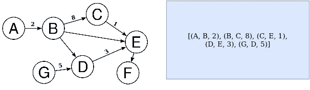

作者照片

对应于左侧的有向加权图，右侧给出了边列表。列表中的每一对都显示了两个节点之间的边信息以及相关的权重。

> 在接下来的帖子中，我们将讨论可以通过图论解决的不同问题。

