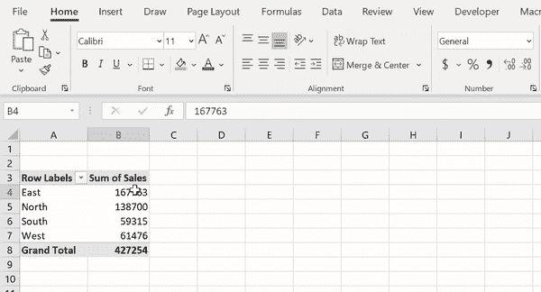

# Python 入门的 3 个简单技巧(放弃 Excel！)

> 原文：<https://towardsdatascience.com/get-started-with-python-and-ditch-excel-85e7f67318b?source=collection_archive---------29----------------------->

## 面向 Excel 高级用户的熊猫介绍


让我们学一些蟒蛇和熊猫吧！资料来源:Nik Piepenbreier

所以你已经实现了思想上的飞跃，想要学习 Python——这太棒了！但是从哪里开始呢？

让我来指导您完成您已经知道如何在 Excel 中以及如何在 Python 中完成的任务！

您将使用 Pandas，这是 Python 中的主要数据分析库。

如果您需要安装 Pandas，您可以使用 pip 或 conda:

```
pip install pandas
#or
conda install pandas
```

Pandas 将数据加载到*数据框*中，你可以把它想象成 Excel 表格。

让我们将数据集加载到数据报中。您可以通过使用以下代码来实现这一点。我们还将使用熊猫头方法探索前五行:

用熊猫生成我们的数据框架。资料来源:Nik Piepenbreier

为了跟随 Excel 中的教程，文件[可以在这里找到](https://github.com/datagy/pivot_table_pandas/raw/master/sample_pivot.xlsx)。

Excel 表格和 Pandas 数据框架之间有许多不同之处。让我们快速浏览一下！


比较 Excel 工作表和 Pandas 数据框架。资料来源:Nik Piepenbreier

好了，现在我们开始吧！

# 过滤、排序和重新排序列

Excel 是一个更加可视化的工具，可以很容易地点击一个按钮，抽象出你想要完成的功能。

## 按单列排序


在 Excel 中对单个列进行排序。资料来源:Nik Piepenbreier

例如，如果您想在 Excel 中对一列进行排序，您只需:

*   选择数据选项卡，
*   突出显示要排序的列，然后
*   单击从 A 到 Z 排序或从 Z 到 A 排序。

为了在熊猫身上做到这一点，你应该写:

熊猫按单列排序。资料来源:Nik Piepenbreier

## 按多列排序

有时您可能希望按多列排序。


在 Excel 中按多列排序。资料来源:Nik Piepenbreier

同样，Excel 使这变得很容易:

单击数据选项卡

*   点击排序
*   输入要作为排序依据的列

对于熊猫，只需在“by”参数中添加一个列表:

在 Pandas 中按多列排序。资料来源:Nik Piepenbreier

## 过滤列

在 Excel 中筛选列是一项简单的任务！只需点击数据选项卡，然后过滤。这将在所有列标题上创建箭头。当您点击这些时，只需填写您的选择:


在 Excel 中筛选列。资料来源:Nik Piepenbreier

对熊猫来说，这同样简单:

在 Pandas 中过滤一个列。资料来源:Nik Piepenbreier

最棒的是，您还可以使用比较运算符来选择 10 个以上的单位，或者基于多个条件进行选择:

*   **比较**:可以用>(大于)、<(小于)、==(等于)、> =(大于等于)、< =(小于等于)，
*   **和【条件】条件**:将每个条件用括号括起来，并用与符号(&)将括号分开
*   **或**条件:用括号将每个条件括起来，并用竖线(|)将括号隔开

熊猫身上不同类型的过滤器。资料来源:Nik Piepenbreier

## 重新排序列

重新排序列更多的是给你自己一个视觉提示。

要在 Excel 中拖动对列进行重新排序，您可以通过单击列的标题来选择该列，将鼠标悬停在旁边，直到光标变为四向箭头，然后按住 SHIFT 键并将该列拖动到新位置:


在 Excel 中移动列。资料来源:Nik Piepenbreier

要在 Pandas 中完成同样的事情，您只需按照您想要的列的顺序将它们放入一对方括号中:

熊猫栏目重新排序。资料来源:Nik Piepenbreier

# 数据透视表(含百分比)

数据透视表是那些在 Excel 中把你带到下一个级别的东西之一。

它们允许您轻松快速地汇总数据，而无需依赖复杂的公式。

假设您想知道每个地区的总销售额，您可以:

1.  选择数据，单击“插入”选项卡上的“数据透视表”，然后单击“确定”创建表格。
2.  将 Region 拖动到“行”框中，将 Sales 拖动到“值”选项卡中。Excel 会自动假设我们要将这些值相加。


在 Excel 中创建数据透视表。资料来源:Nik Piepenbreier

要在 Pandas 中完成同样的事情，您可以简单地使用 pivot_table 函数:

在 Pandas 中创建数据透视表。资料来源:Nik Piepenbreier

让我们稍微分解一下:

*   我们创建一个名为 pivot 的新变量。
*   我们使用熊猫数据透视表函数。我们的第一个论点是数据帧 df。
*   索引参数是' region ',它告诉 Pandas 基于' Region '列创建行。
*   我们将参数值分配给字段“Sales”，让 Pandas 知道我们想要计算销售列。
*   最后，我们使用 agg func(' aggregation func ')参数告诉 Pandas 对值求和。默认值为“平均值”。

要深入了解熊猫数据透视表的功能，请查看我在熊猫的[数据透视表上的另一篇文章。](https://datagy.io/python-pivot-tables/)

## 将数据透视表值显示为百分比

您可能希望将值显示为列总数的百分比。同样，Excel 使这变得非常容易:


在 Excel 中计算数据透视表中的百分比。资料来源:Nik Piepenbreier

*   只需右键单击一个值，
*   选择将值显示为→占列总数的%

在熊猫身上也一样容易做到这一点。最简单的方法是为此创建一个新列:

计算熊猫的数据透视表百分比。资料来源:Nik Piepenbreier

让我们来看看发生了什么:

*   我们通过使用 pivot['% of column total']，声明了一个新列——这将为该列指定名称' % of column total '
*   然后，我们将行中的每个值(pivot['sales'])除以整个列的总和(pivot['sales']sum())并乘以 100

# 创建图表


在 Excel 中创建图表。资料来源:Nik Piepenbreier

现在，如果你想创建一些图表，这在 Excel 和 Python 中都非常容易。

我们先来看 Excel。如果要将此数据透视表绘制成柱形图:

*   将指针放在表格中的一个单元格上，
*   转到插入→二维柱形图

对熊猫来说，这甚至更容易。Pandas 内置了 Python 顶级的数据可视化库功能之一。就像加法一样简单。plot(kind = 'bar ')到代码的结尾:

在 Pandas 和 Matplotlib 中创建图表。资料来源:Nik Piepenbreier

这可能看起来有点令人生畏。让我们来分解一下:

*   从 matplotlib 导入 pyplot 作为 plt
*   重写您之前的代码(第 2-3 行)
*   现在画出“销售”列，并指定一个 kind =“bar”作为参数
*   最后，使用 savefig 方法保存文件。

**注意**:如果你使用的是 Jupyter 笔记本，你可以在导入你的库后，通过编写以下代码来显示图表:

```
%matplotlib inline
```

# 额外提示:正确格式化值

在处理数据时，正确设置值的格式可能会有所帮助。



在 Excel 中设置数据格式。资料来源:Nik Piepenbreier

例如，将货币格式化为美元(等等。)或百分比。

要在 Excel 中做到这一点，您需要:

*   选择要格式化的值，
*   在“主页”选项卡的“号码”部分中，选择所需的类型

熊猫将这一点隐藏了一点，这可能会让新来者颇感困惑。

实现这一点的一个简单方法是使用 apply()函数。这个函数的作用是获取一个序列，并对其应用另一个函数。应用的函数将是格式化值的函数。

如果您想设置透视数据框架中销售列的格式，您可以编写:

在 Pandas 中格式化值。资料来源:Nik Piepenbreier

这可能看起来有点不全面(确实如此)，但是在如何设计数据样式方面，它确实给了您很大的灵活性。让我们仔细看看:

*   我们定义了一个名为 format()的函数，它接受一个参数(x)
*   该函数仅用于返回使用特定格式的字符串格式的格式化值。
*   ${:，. 2f}部分表示实际的格式。冒号(:)用于表示格式的开始，逗号(，)用于表示千位逗号分隔符，而. 2 表示两位小数。
*   这种符号可能有点难以适应，我倾向于谷歌搜索我想要的样式，然后复制粘贴。

同样，如果你想保持百分比，你可以写:

熊猫中的格式化百分比。资料来源:Nik Piepenbreier

在这段代码中，我们创建了另一个名为 format_percent()的函数，并执行了与上面类似的步骤。

**注意**:列总计的“% 1”列已被修改为不将该值乘以 100。这是因为格式化程序会自动完成这项工作。

# 在那里你可以学到更多

非常感谢您阅读这篇文章！希望你觉得有用！

我已经写了一些文章，解释了如何用 Python 处理普通和高级的 Excel 任务，如果你想看看的话！

如果你准备好投入 Python 和 Pandas，我还写了一本电子书，提供了对 Python、Pandas 和 Matplotlib 的完整介绍，可以让你很快上手！

你可以通过[点击这个链接](https://gumroad.com/l/introtopythonfordatascience)找到它。

祝您愉快！