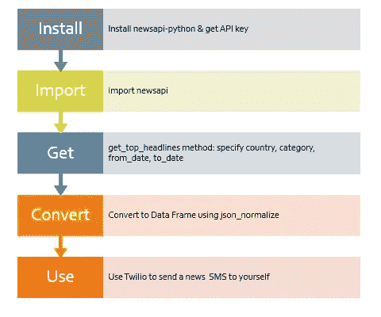
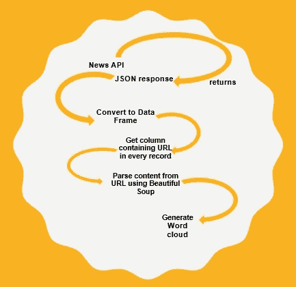

# 如何使用 Python 获取每日新闻

> 原文：<https://towardsdatascience.com/get-the-latest-news-using-python-and-performing-analysis-on-it-using-wordclouds-b4541b3b14fd?source=collection_archive---------16----------------------->

## 使用 Python 中的 NewsAPI 获取新闻，并生成词云来理解新闻和观点。



图片来源:作者

你有没有想过如何通过编程获得最新的新闻？新闻 API 就是 Python 中的一个这样的模块，可以在这方面帮助你。它有大约 120 个来源的数据，包括路透社、BBC 新闻、ABC 新闻、ESPN。

 [## Python 客户端库—新闻 API

### 使用非官方的 Python 客户端库将新闻 API 集成到您的 Python 应用程序中，而不用担心…

newsapi.org](https://newsapi.org/docs/client-libraries/python) 

首先，从 NewsAPI 获取 API 密钥，开始提取新闻文章。你可以在这里看到更多关于如何得到一个。

 [## 开始—文档—新闻 API

### 要开始使用，您需要一个 API 密钥。它们免费用于开发、开源和非商业用途，您可以…

newsapi.org](https://newsapi.org/docs/get-started) 

导入相关的库。

```
from newsapi import NewsApiClient
```

这是用于 NewsAPI 导入的。现在初始化 NewsAPI 的变量

```
newsapi = NewsApiClient(api_key=api_key)from pandas.io.json import json_normalizeimport pandas as pd
```

我们将使用 Python 中漂亮的 Soup 包来帮助清理数据中的 HTML 标签。

```
from bs4 import BeautifulSoup
```

现在，让我们看看实际用途。

L最新消息

获取最新消息:

```
def top_headlines():    
   country=input("Which country are you interested in?") 
   category=input("""Which category are you interested in? \nHere 
   are the categories to choose from:\nbusiness\nentertainment   
   \ngeneral\nhealth\nscience\ntechnology""")        
   top_headlines =newsapi.get_top_headlines(category=category,
   language='en',country=country)     
   top_headlines=json_normalize(top_headlines['articles'])   
   newdf=top_headlines[["title","url"]]    
   dic=newdf.set_index('title')['url'].to_dict()
```

让我们来谈谈这段代码是做什么的。我写过一个函数叫 top_headlines。我接受两个输入，国家和类别。当我向该国提供输入时，你必须以特定的格式书写。新闻 API 中的国家参数遵循以下代码系统:

 [## ISO 3166 国家代码列表

### 下面的可排序表格包含 249 个国家中每个国家的三组 ISO 3166-1 国家代码，链接到…

en.wikipedia.org](https://en.wikipedia.org/wiki/List_of_ISO_3166_country_codes) 

USA 是“us”，英国是“gb”，印度是“in”。有关其他国家的标志，请参考上面的链接。

在代码本身中，我已经提到了如何向 category 参数提供输入。“一般”代表一般新闻，“体育”代表体育新闻，以此类推。

使用 get_top_headlines，您可以获得最新的新闻。现在，输出是 JSON 格式的，所以我想把它转换成数据帧。因此，我使用了在本教程前面导入的 json_normalize 方法。然后，我将它存储到一个新的 Dataframe 中，该 data frame 只包含从 JSON 输出中返回的列列表中选择的几个列。

然后我决定，我要搞清楚这个新闻信息。我用了一个案例来看媒体的观点在一个特定的时间段内是如何变化的。新闻 API 有一个付费版本，提供长达两年的信息。在免费版本中，你可以检索 30 天的新闻，这也是我选择的时间范围。

搜索特定的主题

为了进行这种分析，我们需要使用这种方法:

```
get_everything(query,language,sort_by='relevancy',from_param,to)
```

这意味着它可以获得与特定搜索查询相关的所有信息。比方说，您想要获取有关当今世界最热门话题——新冠肺炎病毒或冠状病毒——的所有信息，您可以在上述函数的“query”参数中指定。

上述函数中的“from_param”参数和“to”参数是日期参数。它会要求您指定希望获得搜索查询结果的时间范围。因为我提到过，我想获得 30 天的所有结果，这是免费版本允许的最大时间范围，我将指定 from_param 为今天的日期前 30 天。然而，我需要在一个循环中写这个，这样我可以确保我每天都得到。

所以，我首先构建了一个日期函数来帮助我。

```
import datetime
from datetime import datetime, timedelta
def date(base):    
    date_list=[]    
    yr=datetime.today().year    
    if (yr%400)==0 or ((yr%100!=0) and (yr%4==0)):          
        numdays=366        
        date_list.append([base - timedelta(days=x) for x in    
        range(366)])   
    else:        
        numdays=365        
        date_list.append([base - timedelta(days=x) for x in    
        range(365)])    
        newlist=[]    
        for i in date_list:        
           for j in sorted(i):            
               newlist.append(j)    
        return newlist 
def last_30(base):     
    date_list=[base - timedelta(days=x) for x in range(30)]      
    return sorted(date_list)  
def from_dt(x):    
    from_dt=[]    
    for i in range(len(x)):          
        from_dt.append(last_30(datetime.today())[i-1].date())         
    return from_dt        
def to_dt(x):    
    to_dt=[]    
    for i in range(len(x)):        
        to_dt.append(last_30(datetime.today())[i].date())    
    return to_dt
from_list=from_dt(last_30(datetime.today()))
to_list=to_dt(last_30(datetime.today()))
```

我构建的第一个日期函数(date)是一个更通用的日期函数，如果需要的话，我想在很长的时间内使用它。我正在使用 first date 函数获取所有日期的列表。我只需要 30 天，所以我确保使用 last_30 来完成。这将给我从当前日期和时间开始的过去 30 天的列表。继续讨论 from_dt 函数，它专门用于上面提到的 get_everything 函数的 from_param。这是您需要所有新闻文章的时间范围的开始，to_dt 是结束日期。

我现在有两个单独的列表，分别是开始日期和结束日期。

现在我们将处理查询参数，它是 get_everything 函数的搜索词。

```
def func(query): 
    newd={}    
    newdf=pd.DataFrame()    
    for (from_dt,to_dt) in zip(from_list,to_list):           
        all_articles =   
        newsapi.get_everything(q=query,language='en',
        sort_by='relevancy',from_param=from_dt,to=to_dt)          
        d=json_normalize(all_articles['articles'])         
        newdf=d[["url","publishedAt","source.name","author"]]
        dic=newdf.set_index(["source.name","publishedAt","author"]) 
        ["url"].to_dict()        
        for (k,v) in dic.items():            
            page = requests.get(v)            
            html = page.content            
            soup = BeautifulSoup(html, "lxml")            
            text = soup.get_text()            
            d2=soup.find_all("p")            
            newd[k]=re.sub(r'<.+?>',r'',str(d2))     
    return newd
```

遍历日期的 from 和 to 列表的压缩版本，我们得到了 30 天时间范围内的所有文章的列表。我选择循环的原因是，这样我就可以对每一天进行分析。然后我将它存储在数据框中。然后，我获取相关的列，并将它们存储回字典中。我想解析新闻 URL 中的内容，以便只从文章中获取内容。我在这里使用 Python 中的 BeautifulSoup 包来解析内容，并获取信息所在的相关

标签。因为我们在这里主要关注文本数据，所以我们需要这些段落标签之间的信息。你可以在这里找到更多关于 BeautifulSoup 的信息:

[](https://www.crummy.com/software/BeautifulSoup/bs4/doc/) [## 美丽的汤文档—美丽的汤 4.9.0 文档

### Beautiful Soup 是一个 Python 库，用于从 HTML 和 XML 文件中提取数据。它与您最喜欢的解析器一起工作…

www.crummy.com](https://www.crummy.com/software/BeautifulSoup/bs4/doc/) 

一旦我们有了更清晰的数据，我们现在就可以继续使用单词云来分析模式。

N使用 WordCloud 进行 ews 分析

现在，我们来看看单词云。我们可以从新闻中理解数据的部分。有哪些常见的模式？

```
def wordcld(dictionary):        
    newd={}    
    for (k,v) in dictionary.items():        
    if v!='[]':            
        wordcloud = WordCloud().generate(str(dictionary[k]))                
        fig, axes= plt.subplots(figsize=(20,12),clear=True)                     
        plt.imshow(wordcloud, interpolation='bilinear')            
        plt.show()                 
    else:            
        print(str(k[0])+"_"+str(k[1][5:10])+"_"+str(k[1][11:13])              
        +"_"+str(k[1][14:16]) +"_"+str(k[1][17:19])+"_"+str(k[2]))             
        print("Wordcloud Not applicable")
dic=func("Indian Economy")
wordcld(dic)
```

我在搜索一些关于印度经济的常用词，得到了下面的图片。我得到的图像是一天。我上面的代码会给你 30 天的结果。


图片来源:作者

试试这个，如果你有任何问题，请随时告诉我。

下一步，您可以使用 Twilio API/SendGrid 电子邮件 API 将此作为文本消息/电子邮件通知发送给自己，我将在另一个教程中介绍，或者您可以看到一些现有的 API，如下所示:

[](https://medium.com/@osaimola/creating-a-serverless-sms-twitter-app-with-aws-lambda-twilio-b33f63254cbb) [## 用 AWS Lambda & Twilio 创建一个无服务器的 SMS-Twitter 应用程序

### 我们将使用 AWS Lambda 函数来创建 Tweets，并通过 SMS 向/从 Twilio 发送 Twitter 事件通知…

medium.com](https://medium.com/@osaimola/creating-a-serverless-sms-twitter-app-with-aws-lambda-twilio-b33f63254cbb) [](https://sendgrid.com/docs/for-developers/sending-email/v3-python-code-example/) [## v3 API Python 代码示例

### 让我们知道我们做得怎么样！请评价此页面:如果您需要 Twilio SendGrid 的即时帮助，请…

sendgrid.com](https://sendgrid.com/docs/for-developers/sending-email/v3-python-code-example/) 

总结一下:



图片来源:作者

如果你有任何问题，欢迎在这里评论或者给我发邮件。你也可以在 GitHub 上看到这段代码:[https://github.com/mukund14/News/tree/news_api_Python](https://github.com/mukund14/News/tree/news_api_Python)

mukundan.sankar14@gmail.com