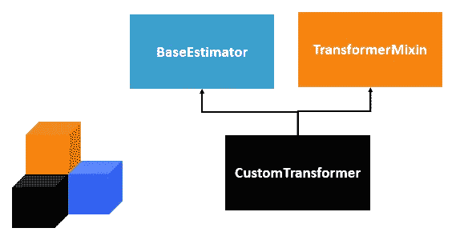
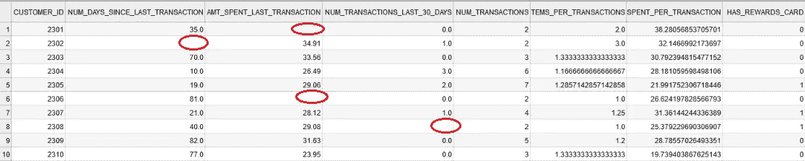
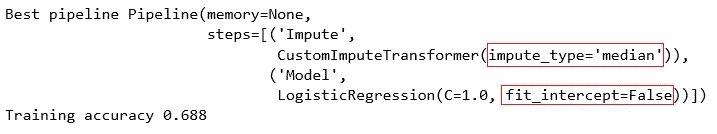
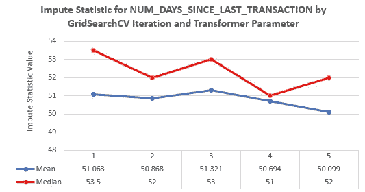

# 充分利用 scikit——学习面向对象编程

> 原文：<https://towardsdatascience.com/get-the-most-out-of-scikit-learn-with-object-oriented-programming-d01fef48b448?source=collection_archive---------28----------------------->

## 浏览一个数据科学示例，增强您的 Python 编码能力！

作为数据科学家，我们都熟悉 [scikit-learn](https://scikit-learn.org/) ，这是 Python 中最常用的机器学习和数据分析库之一。我个人在我的大部分专业项目中都使用它和熊猫。

然而，直到最近，当我需要构建一个定制的回归估计器时，我才充分利用了 scikit-learn。我惊喜地发现，创建一个新的兼容的估计器类是如此容易，这都归功于 scikit-learn 组件的面向对象设计。

在本文中，我将带您了解一个常见的数据科学工作流，并演示面向对象编程(OOP)的一个用例。特别是，您将学习如何使用继承的概念来定制 transformer 对象，这允许我们扩展现有类的功能。由于继承，这个转换器将很容易适合 scikit-learn 管道，以构建一个简单的机器学习模型。

## 激励人心的例子。

为了更清楚地说明问题，让我们看一个受零售商营销启发的实际例子。假设我有一个[数据集](https://github.com/andrew-alberts/transformer-example/blob/master/sample_rfm_data.csv)，其中每条记录代表一个客户，并且有与购买[最近、频率和货币价值](https://www.investopedia.com/terms/r/rfm-recency-frequency-monetary-value.asp)相关的度量(即特征)。使用这些功能，我们希望预测客户是否会加入零售商的奖励卡计划。这模拟了一个真实的场景，我们希望预测哪些客户是营销的最佳目标。请参见下面的客户记录数据示例:

我们客户数据的前十行。请注意用红色圈出的缺失值。

数据的一个显著特点是缺失，即在观察值中存在缺失值。这些值将被渲染为 NaN 的，一旦被熊猫读取，将不会在我们的机器学习模型中工作。为了构建我们的模型，我们需要估算缺失特征的值(即，用推断的数量替换缺失值)。虽然有多种数据插补技术，但为了简单起见，假设我们想尝试对任何缺失值进行列均值或中值插补。

那么，我们应该使用哪个统计量，平均值还是中间值？找出答案的一个简单方法是尝试两个选项，并评估哪一个在网格搜索中产生最佳性能，也许可以使用 scikit-learn 的 [**GridSearchCV**](https://scikit-learn.org/stable/modules/generated/sklearn.model_selection.GridSearchCV.html) 。

一个错误是计算整个训练集的平均值和中值，然后用这些值进行估算。更严格地说，我们需要计算这些数据的统计数据，不包括坚持折叠。这看起来很复杂，但是多亏了 OOP，我们可以通过*继承*轻松实现我们自己的转换器，它将与 scikit-learn 兼容。从那里，我们可以将 transformer 插入到 scikit-learn [**管道**](https://scikit-learn.org/stable/modules/generated/sklearn.pipeline.Pipeline.html) 中，这是一个与 transformer 对象列表以及 estimator 对象一起排序的对象，用于构建我们的模型。

## 构建自定义输入转换器。

为了开始为我们的转换器构建类，我们将编写类定义和构造函数。特别注意( **TransformerMixin** ， **BaseEstimator** )，这表明我们继承了这两个类。这将使我们创建的[**custom impute transformer**](https://github.com/andrew-alberts/transformer-example/blob/master/custom_impute_transformer.py)类的对象与 scikit-learn 的其他组件兼容，方法是提供 **GridSearchCV** (如 ***get_params*** )所期望的方法的实现，并指示我们创建的对象是正确的类型(如 transformers)。

接下来，我们将实现 ***fit*** 方法。给定数据集*X*,***fit***计算每列的平均值或中值，可用于以后的插补。

最后，我们编写了 ***转换*** 的方法。该方法将我们希望转换的数据集作为参数，应用已经计算的“估算值”并用它们填充 NaN 值。

下面是一个在小样本上使用自定义 transformer 对象的例子。

以下是打印到控制台的结果:

红色表示 x1 的平均值，蓝色表示特征 x2 的平均值。

注意，我们创建的功能已经在 scikit-learn 的[**simple impute**](https://scikit-learn.org/stable/modules/generated/sklearn.impute.SimpleImputer.html)类中可用。我决定在这里从头实现它，因为它易于构建，并且很好地展示了创建更复杂的转换器所需的内容。

## 将转换结果传输到 ML 模型中。

我们将创建一个管道，将自定义转换器的结果级联到逻辑回归模型中。

加载数据。

通过传递元组列表来创建管道。每个元组都有流水线阶段的名称(在这个例子中是*估算*和*模型*)以及用于估计器的变换器的对象。

对于网格搜索，我们将搜索以确定哪种类型的插补是最好的，因此在 *param_grid* 中有条目" imput _ _ imput _ type ":[" mean "，" median"]。

我们将获得最好的管道，并从中获得训练预测。注意，我们可以在 best_pipe 对象上调用 ***预测*** 函数。这有效地将首先从**custom impute transformer**运行 ***转换*** ，然后从逻辑回归运行 ***预测*** 。

最佳流水线和训练精度的输出如下。

GridSearchCV 确定的最佳管道。请注意红色方框中的最佳超参数值。

## 演示变压器做我们想要的。

在这个例子中，我们清楚地表明，我们需要 transformer 来计算除了保留折叠之外的所有折叠的统计数据。为了证明我们的代码确实做到了这一点，我们将进一步利用继承来构建一个 impute transformer 对象，该对象完全执行我们最初的 transformer 所做的事情，并添加了在交叉验证的每次迭代中输出不同统计数据的功能。

我们将再次使用继承来创建[**customimputoutputtransformer**](https://github.com/andrew-alberts/transformer-example/blob/master/custom_impute_output_transformer.py)，它是**customimputtransformer**的子类:

我们唯一需要实现的功能就是 ***fit*** 。事实上，我们将使用通过使用*调用标准 ***fit*** 函数得到的结果，并简单地用控制台输出扩充它，如下所示。*

*现在我们需要做的就是改变我们在管道中使用的对象，并在运行它时监视输出是什么。*

*为了简洁起见，我可视化了一个特性的输出。你可以在 [Github](https://github.com/andrew-alberts/transformer-example/blob/master/verbose_output.txt) 上看到实际的打印输出。*

**

*它的行为符合预期。 **GridSearchCV** 的每次迭代都产生四个训练折叠的统计数据，而不是计算一个全局值。*

## *结论*

*在本文中，我们了解了如何使用继承(OOP 的一个基础方面)来解决现实世界中的数据科学问题。我展示的例子很简单，但是，您可以使用相同的框架为您的项目构建更复杂的类。*

*所有的代码、数据和结果都可以从这个 [Github repo](https://github.com/andrew-alberts/transformer-example) 中提取。本文中展示的例子是完全可复制的，所以您可以随意提取代码并自己使用它。*