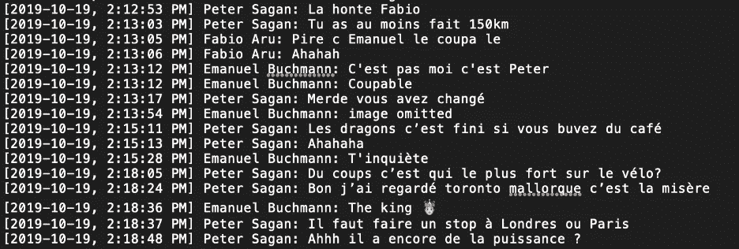
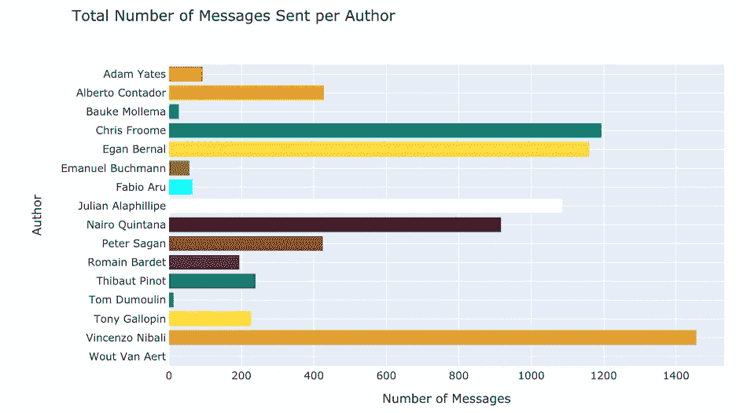
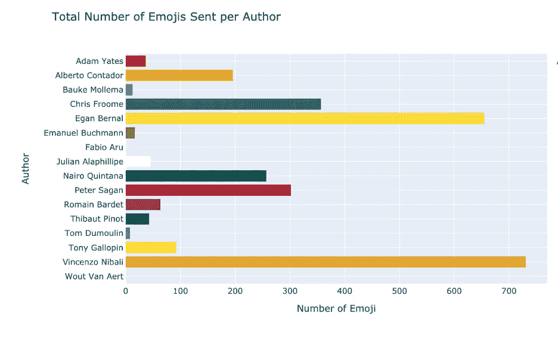
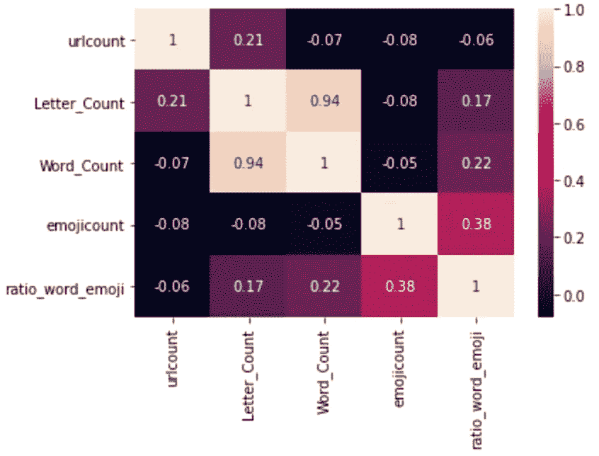
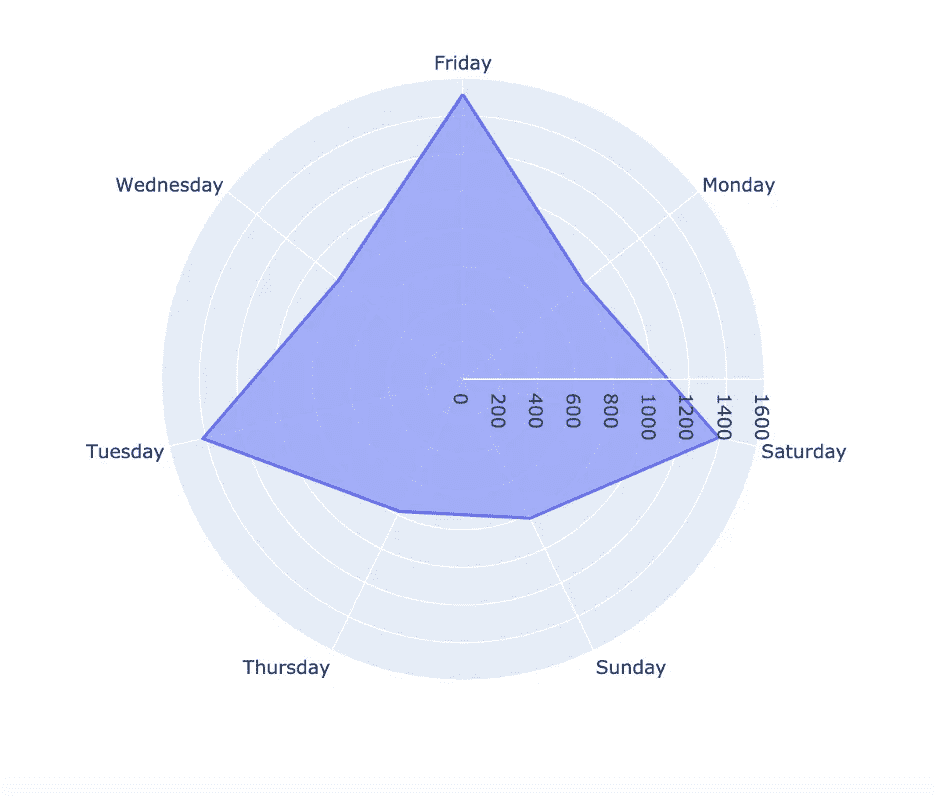
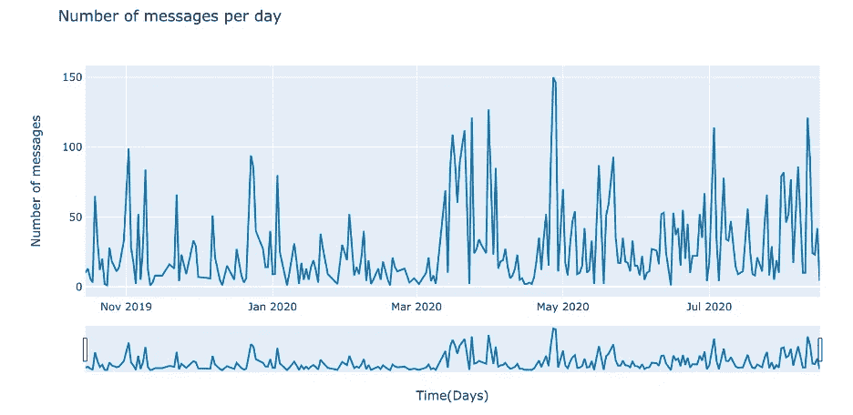
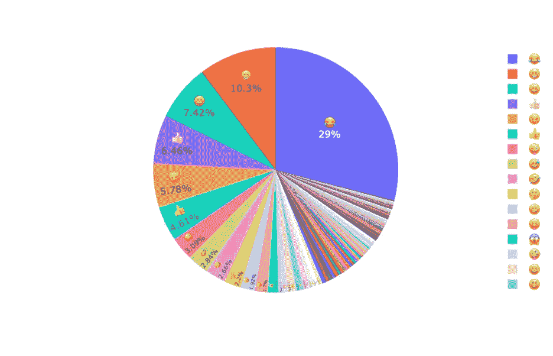
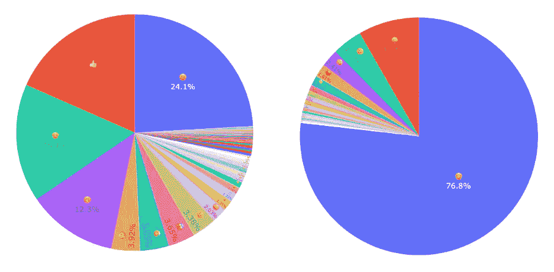
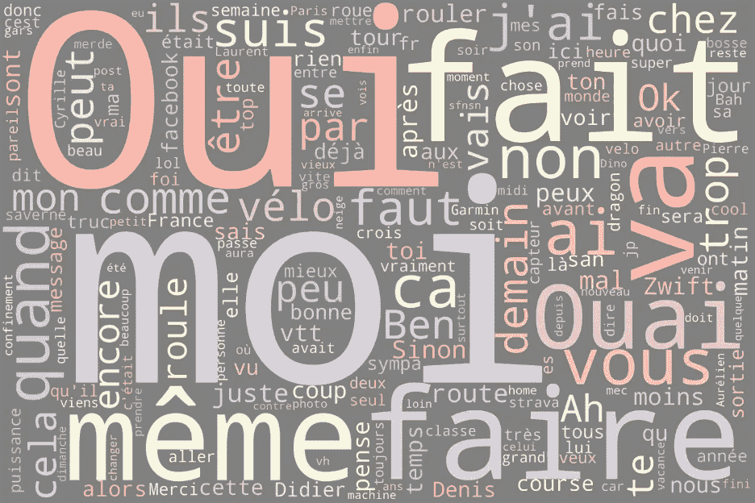

# 用自然语言处理认识你的朋友

> 原文：<https://towardsdatascience.com/get-to-know-your-friends-with-natural-language-processing-nlp-38a1f6e56e09?source=collection_archive---------32----------------------->

## 准备、探索、了解 WhatsApp 用户使用 Python 的习惯。

马科斯·保罗·普拉多在 [Unsplash](https://unsplash.com?utm_source=medium&utm_medium=referral) 上的照片

D 做一个新项目并有一个好的想法可能具有挑战性。在过去的几个月里，在奇怪的情况下，我们都在，我不知道该做什么项目。我开始了几个项目，但没有完成，因为结果并不乐观，不值得一篇文章。我知道我不想使用 Kaggle 或其他地方的数据集，但我想通过使用我需要收集的数据来做一个端到端的项目。

在浏览了 Medium 上的文章/项目后，多亏了 [Samir Sheriff](https://medium.com/u/2374ffd01038?source=post_page-----38a1f6e56e09--------------------------------) 的文章，我发现可以分析来自 WhatsApp 组的数据，由于我没有做过自然语言处理或 NLP 的项目，我认为这是提高我的技术技能的绝佳机会。

 [## 构建自己的 Whatsapp 聊天分析器

### 使用 Python 的分步指南

towardsdatascience.com](/build-your-own-whatsapp-chat-analyzer-9590acca9014) 

**什么是自然语言处理？**

自然语言用于人类之间的日常交流，如 Messenger、电子邮件、Whatsapp、社交媒体(Twitter、脸书等)。).这些来源的数据对于文本和语音来说都是高度非结构化的，因此很难被机器解析和理解。**自然语言处理(NLP)涉及自然人类语言和计算机之间的交互。它是语言学、计算机科学和人工智能领域的交叉。**

如今，[大部分数据](https://solutionsreview.com/data-management/80-percent-of-your-data-will-be-unstructured-in-five-years/)被归类为非结构化数据，这意味着收集的数据没有像在 Microsoft Excel 中那样组织在表格中。因此，它更难分析，也不容易搜索，这就是为什么它直到最近几年才对组织有用。往往需要大量的时间来清理和组织数据到一个有用的数据框中，这对于很多人来说是一个枯燥的任务。如果这一信息被忽视，公司就没有利用他们所能获得的一切来取得成功。现在在就业市场上，越来越多的公司正在寻找专家来分析这些数据，因为他们希望利用这些宝贵的信息。我以前写过一篇类似的文章，讲的是如何收集和处理推文到亚马逊 S3 桶。

 [## 如何通过云计算从 Twitter 中提取数据

### 通过使用 Python 和 Tweepy

medium.com](https://medium.com/analytics-vidhya/how-to-create-a-dataset-with-twitter-and-cloud-computing-fcd82837d313) 

人工智能算法现在有助于从每天生成的大量非结构化数据中自动提取意义。公司使用 Hadoop 等大数据工具和软件从原始非结构化数据中准备、挖掘、集成、存储、跟踪、索引和报告业务见解。

我把 NLP 的主要应用总结如下:

*   分类:根据内容对文档进行分类，这种技术用于电子邮箱中的垃圾邮件过滤器或分析产品评论。
*   推荐:通过基于内容的算法，根据给定的信息选择最相关的文档。这项技术被谷歌、网飞、亚马逊用来根据你之前的搜索推荐一些东西。
*   主题建模:通过解释模式来理解文本的含义，并识别每个个体背后的结构。

**现在让我们看看我的项目**

作为 WhatsApp 小组的一员，我可以导出数据并开始探索它。这个组是在 2015 年创建的，但由于 WhatsApp 数据的加密最近发生了变化，我只能从 2019 年 10 月开始拉数据。此外，为了让广大公众理解这篇文章，我不打算将我的代码粘贴到文章中。相反，你会看到用包 *plotly* 制作的很酷的图。如果你对代码感兴趣，请查看我在 GitHub 上的[库。](https://github.com/walkyrie67/whatsapp_analysis)

请注意，WhatsApp 群组中的任何人都可以从对话中提取数据，在 messenger 上也可以这样做。请随意复制我的代码，并使用它来研究您的数据。

现在回到我的项目，从 Whatsapp 应用程序中提取数据后，我获得了一个文本文件，看起来就像这样:

文本文件—非结构化数据

正如我之前提到的，我不能使用这种格式的数据，这些数据是非结构化的，一团乱麻。为了将这些数据转换成包含列的数据框架，我对数据进行了标记。但是，什么是标记化呢？

标记化是对输入字符串的各部分进行划界和可能的分类的过程。

在一个文本文件中，每行代表一个注释，我确定了 4 个标记:

<2019–10–19>T3<peter sagan=""></peter>

<date><author></author></date>

经过进一步的清理，我能够生成下面的数据框。我不会深入讨论我如何获得数据帧的所有细节。相反，我建议查看我在上文和文章末尾链接的回购。

结构化数据帧

此外，为了确保所有这些信息的隐私，并且因为我希望我的朋友在这篇文章发表后仍然是我的朋友，我用一些著名的职业自行车运动员代替了我们的名字，因为群聊最初是由于我们对自行车和山地自行车的共同爱好而创建的。以下是该小组 17 位作者的名单:

> 克里斯·弗鲁姆、伊根·贝尔纳尔、阿尔贝托·康塔多、奈罗·金塔纳、罗曼·巴尔德、文森佐·尼巴里、彼得·萨根、伊曼纽尔·布赫曼、朱利安·阿拉菲利普、托尼·盖洛平、蒂博·皮诺、汤姆·杜穆林、法比奥·阿鲁、亚当·耶茨、沃伦·巴吉尔、沃特·范阿尔特、鲍克·莫勒姆。

**群组中最活跃的用户**

现在让我们开始研究数据。群聊包含 8，337 条消息、2，818 个表情符号和 229 个链接。对数据的第一个简单观察是检查谁在聊天中发送了最多的消息。下面是每个作者的邮件数量和字数的图表。

Vincenzo 是该组中发送消息最多的作者(1，470 条)，其次是 Chris、Egan、Julian 和 Nairo，大约有 1，000 条消息。让我们看看尼巴利在环法自行车赛上是否会像在这个团体中一样活跃。

Jonny Kennaugh 在 [Unsplash](https://unsplash.com?utm_source=medium&utm_medium=referral) 上拍摄的照片

我们还可以看看谁发送了最多的表情符号，上面的图显示，文森佐·尼巴里在聊天中发送了最多的表情符号，其次是伊根、克里斯和彼得。前 5 名和之前剧情差不多。我注意到朱利安·阿拉菲利普发送的表情符号很少。

探索不同变量之间是否存在相关性的另一种方法是创建一个相关矩阵。基于此，变量之间没有强相关性。表情符号的数量和每个表情符号的字数比率(0.38)之间有相当的相关性。字母数和单词数之间有很强的相关性，这种相关性被认为是单词越多字母越多。

**网址专员**

为了完成描述部分，我查看了每个作者发送的 URL，你会注意到 Nairo 将大多数链接(118 个)发送到该组，接下来是 Julian (36 个)和 Vincenzo(28 个)。

**关于前 5 名作者的更多统计数据**

接下来，我总结了该组中每个用户的统计数据，长话短说，我只公布了该组中的前 5 名用户。

我还观察了一周中哪一天最活跃。根据下面的雷达图，周二、周五和周六是最忙的日子:这几天大约发送了 1400 条消息。

**时间**

雷达图—一周中每天的消息数量

现在让我们来看看通过时间发送的消息数量。在下图中，可以明显看出，自 2020 年 3 月左右以来，该群体明显比以前更加活跃(p 值:2.63e-06)。

我认为这种增长可能是由于法国在三月和五月之间的封锁:更多的空闲时间=更多的时间发送信息。

最活跃的一天是 4 月 27 日，这一天已经发送了 150 条消息。

**你会说表情符号吗？**

截至 2020 年 8 月，Unicode 标准中共有 3304 个表情符号。在我的 Whatsapp 群中，总共使用了 143 个独特的表情符号。下面的饼状图显示了该群体中表情符号的总使用比例:

使用表情符号的总比例

大约 50%的表情符号被分成 4 种类型:

**😂:** [脸上带着喜悦的泪水](https://emojipedia.org/face-with-tears-of-joy/)

😁:[眉开眼笑的脸](https://emojipedia.org/beaming-face-with-smiling-eyes/#:~:text=Often%20expresses%20a%20radiant%2C%20gratified,to%20Emoji%201.0%20in%202015.)

😄:[咧着嘴笑的脸带着微笑的眼睛](https://emojipedia.org/grinning-face-with-smiling-eyes/)

👍:[竖起大拇指](https://emojipedia.org/thumbs-up/)

尽管 WhatsApp 包含了 3304 个表情符号，但绝大多数作者只使用了 4 个表情符号。看起来这个群聊真的很有趣，因为大多数表情符号都有很多微笑和喜悦的泪水，这很有意义，因为我们一直在相互开玩笑。

作为一名训练有素的生物学家，我不禁注意到多样性指数是如何应用在这个场景中的。多样性指数是一种定量方法，反映了一个生态系统中有多少种类的物种，基于每个物种的*丰度*和物种的*多样性*。因此，我开始计算表情符号的丰富程度，也就是说我统计了群聊中每个作者使用的独特表情符号的数量。我们可以通过比较不同的生态系统来解释多样性指数。在这种情况下，每个作者就是一个生态系统。在前 5 名用户中，Vincenzo 是多样性最高的用户，Egan 是多样性最低的用户，尽管他正在发送大量表情符号！我们可以从建议 Egan 多样化他的表情符号开始。为了更深入地挖掘，我们来看看文森佐和伊根使用表情符号的比例:

文森佐·尼巴里 vs 伊根·伯纳尔

在前 5 名中，文森佐的多样性指数最高，伊根的多样性指数最低。文森佐 50%以上的时间使用 3 个表情符号，伊根 75%以上的时间使用一个表情符号。

**云之语**

单词云是文本数据的可视化表示，其中大小表示每个单词的频率，在本例中，是群聊。创建单词云的第一步是将所有评论合并成一个包含 335，093 个单词的长字符串。

WordCloud

英语中的“Oui”或“yes”用了 118 次，“moi”或“me”用了 214 次。我在这个云上看到一些和骑行有关的词:“vélo”、“Zwift”、“Garmin”、“vtt”、“strava”、“course”、“sortie”。令人惊讶的是，我没有看到关于饮料或食物的单词。“bière”或“beer”这个词用了 17 次，而“vin”或“wine”只用了 8 次。在冠状病毒时代，封锁或“禁闭”这个词已经被使用了 33 次。在做这个分析之前，我预计会看到更多不健康的习惯，但根据单词 cloud，这个群体相当健康，并且更加关注体育运动。

这个分析现在即将结束，如果你对代码感兴趣，可以通过我的 [GitHub repo](https://github.com/walkyrie67/whatsapp_analysis) 访问。作为总结，在这篇文章中，我探讨了人们如何互相发短信的倾向，什么是最忙的日子，以及随着时间的推移趋势是什么。此外，我还可以进行一些有趣的分析，分析哪些作者发送的表情符号最多或最少，以及使用的表情符号的多样性如何。

我希望你喜欢阅读这篇文章，希望你学到了一些关于如何准备和探索 Whatsapp 数据的见解，希望你现在看到了 NLP 对企业的潜力，或者只是想了解你的朋友和他们的习惯。

为了进一步探索这些数据，我可以进行情感分析，试图找到作者之间的倾向。例如，我可以调查谁是最积极/消极的作者？或者，随着时间的推移，情绪在变化吗？

这个项目打开了我对数据科学的视野，我迫不及待地想继续探索 NLP 世界。例如，我读过 Sharon Lim 的一篇非常酷的文章，他在文章中应用了主题建模和朴素贝叶斯进行分类。在文章中，Sharon 能够找到最佳的主题数量，并确定各种主题类别和结构。

 [## 利用自然语言处理释放文本分析的力量

### 主题建模的潜在狄利克雷分配和文本分类的朴素贝叶斯

medium.com](https://medium.com/towards-artificial-intelligence/unlock-the-power-of-text-analytics-with-natural-language-processing-2e6d83b35f99) 

最后，如果你喜欢我的工作，你可以在 [LinkedIn](https://www.linkedin.com/in/risserl/) 上联系我。