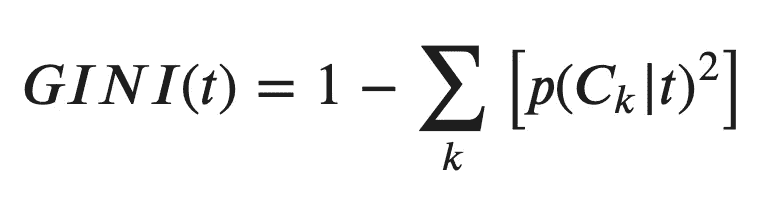
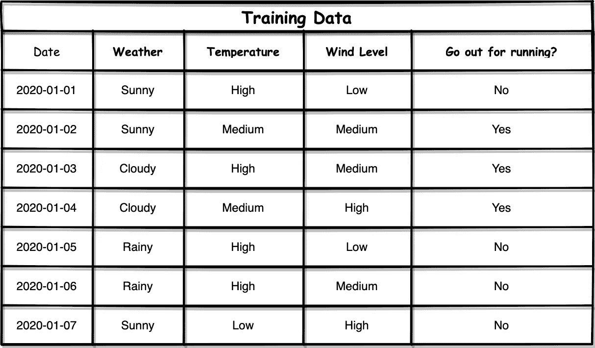
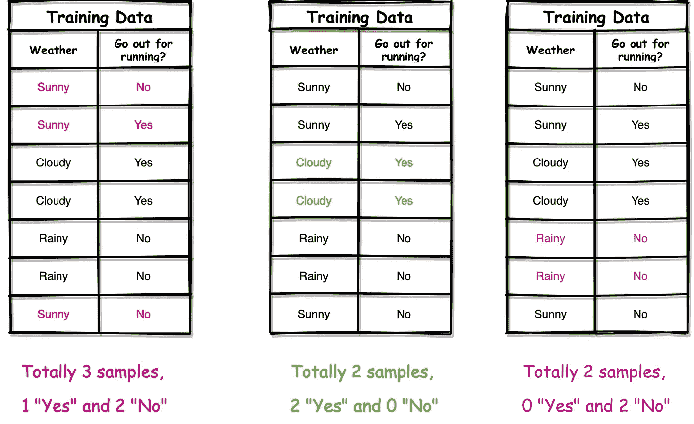
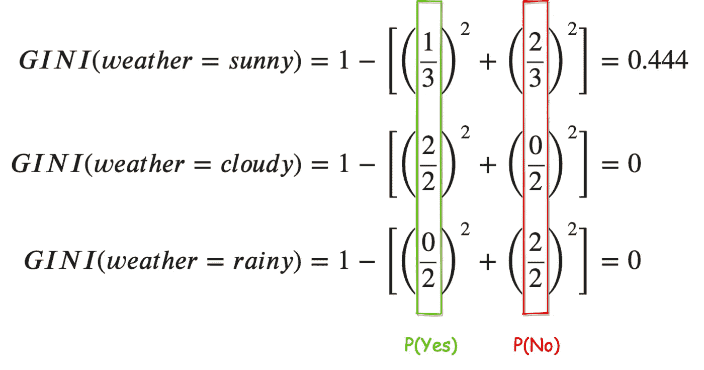
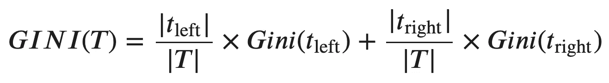
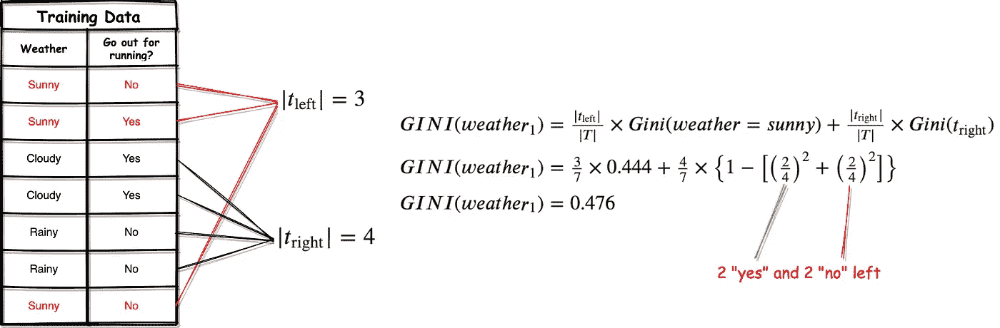
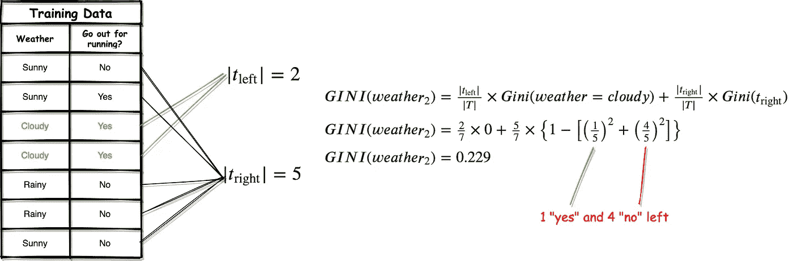
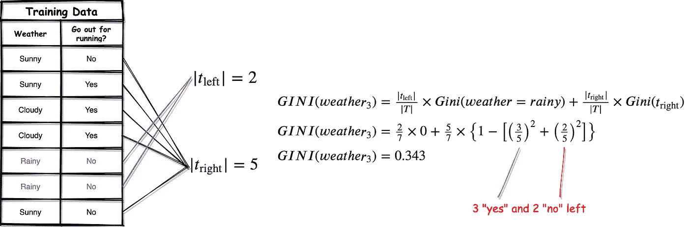

# 让您的决策树模型随车移动

> 原文：<https://towardsdatascience.com/get-your-decision-tree-model-moving-by-cart-82765d59ae09?source=collection_archive---------26----------------------->

由 [Pixabay](https://pixabay.com/photos/shopping-toilet-paper-covid-19-4974313/) 上的 [Alexas_Fotos](https://pixabay.com/users/Alexas_Fotos-686414/) 拍摄的照片

## 基尼杂质——另一种决策树节点划分标准

作为最流行的经典机器学习算法之一，决策树在可解释性方面比其他算法更直观。在我以前的文章中，我介绍了用于构建决策树模型的 ID3 和 C4.5 算法。

*   [**决策树基础知识和 ID3 算法**](/go-out-for-exercise-or-not-let-data-science-decide-34f8f28ce7b4)

 [## 出去锻炼还是不锻炼？让数据科学来决定

### 决策树机器学习算法简介

towardsdatascience.com](/go-out-for-exercise-or-not-let-data-science-decide-34f8f28ce7b4) 

*   [**ID3 的弊端和 C4.5 算法**](/do-not-use-decision-tree-like-this-369769d6104d)

 [## 不要像这样使用决策树

### 展示 ID3 中信息获取的局限性以及使用 C4.5 的优势

towardsdatascience.com](/do-not-use-decision-tree-like-this-369769d6104d) 

在本文中，我将介绍另一种叫做 **CART** 的算法，用于构建决策树模型，这可能也是最常用的。顺便说一句，当你使用 Scikit-Learn 库作为决策树分类器时，这是默认的算法。

# 什么是 CART 算法？

[683440](https://pixabay.com/users/683440-683440/) 在 [Pixabay](https://pixabay.com/photos/tree-tribe-forest-arrows-brown-746617/) 上拍摄的照片

CART 算法是 **C** 分类**A**d**R**回归 **T** rees 的缩写。它是由 Breiman 等人在 1984 年发明的[1]。

它通常与 C4.5 非常相似，但具有以下主要特征:

1.  与可能有多个分支的一般树不同，CART 使用二叉树，每个节点只有两个分支。
2.  CART 使用 Gini 杂质作为划分节点的标准，而不是信息增益。
3.  CART 支持数字目标变量，这使得它能够成为预测连续值的回归树。

本文将把重点放在 CART 作为分类树上。

# 基尼杂质

照片由[奇莫诺](https://pixabay.com/users/qimono-1962238/)在 [Pixabay](https://pixabay.com/photos/water-drop-liquid-splash-wet-1761027/) 上拍摄

就像 ID3 和 C4.5 算法依赖信息增益作为分割节点的标准一样，CART 算法使用另一个称为 Gini 的标准来分割节点。

如果你学过经济学，你一定熟悉基尼指数，它表明一个国家或任何其他人群内部的收入不平等或财富不平等[2]。

在 CART 算法中，出于类似的目的，直观地使用基尼系数。即基尼系数越大，意味着节点的杂质越大。类似于 ID3 和 C4.5 使用信息增益选择不确定性较大的节点，基尼系数会引导 CART 算法找到不确定性较大(即杂质)的节点，然后进行分裂。

基尼系数的公式比我们在其他两个决策树算法中使用的信息增益和信息增益比率相对简单。如下图所示。

*   *p(Ck|t)* 是节点 *t* 成为类别 *Ck* 的概率。
*   节点 *t* 的基尼系数为 1 减去所有类别的概率之和。

不要被公式吓到。我们举个例子来演示一下。我保证不难理解。

下面的例子在我写的所有关于决策树的文章中都被使用过。

假设我们想通过使用“天气”特性进行分割来启动决策树。然后，我们需要计算其条件下的基尼系数。让我们关注天气属性和结果，如下表所示。

计算概率 *p(Ck|t)是相当容易的。*例如，如果我们考虑属性“天气=晴朗”,则总共 3 个样本中有 1 个“是”和 2 个“否”。因此，类别“是”的概率是 1/3，类别“否”的概率是 2/3。然后我们可以很容易地计算出基尼系数如下。

我们从上面 3 个等式中得到的直觉是

*   当天气晴朗时，会有一些不确定性，因为我们可能会出去跑步，也可能不会。
*   当天气多云时，我们肯定要出去跑步。完全没有不确定性(100%纯度)
*   当天气下雨时，我们肯定不会出去跑步。也没有任何不确定性(100%纯度)

这些数字也反映了我们的直觉。天气晴朗的时候基尼系数是 0.444，因为不纯。当天气多云或下雨时，基尼系数为 0。因此，使用属性“天气=多云”和“天气=下雨”来分割节点没有任何意义，因为我们知道决策必须是全是或全否。

# CART 算法如何选择根/下一个节点

由 [cocoparisienne](https://pixabay.com/users/cocoparisienne-127419/) 在 [Pixabay](https://pixabay.com/photos/root-tree-root-tree-nature-log-276636/) 上拍摄的照片

我们如何决定根节点，从而使用相同的逻辑来决定如何分割内部节点？这与使用所有可能的子节点的基尼系数的加权和一样简单。

由于 CART 算法是利用二叉树的 CART 算法，每次我们只需要计算两个节点的基尼系数的加权和。公式如下。

*   |t_left|和|t_right|分别是左边和右边节点的样本大小。
*   |T|是候选父节点 T 的样本大小

还是那句话，不要被公式吓到。让我们用同样的例子，天气特征。

如果我们使用天气作为根节点，有 3 种不同的情况:

1.  除以“晴”和“不晴”，基尼系数= 0.476

2.除以“多云”和“不多云”，基尼系数= 0.229

3.除以“多雨”和“不多雨”，基尼系数= 0.343

同样的逻辑将应用于所有其他可能性，直到我们找到最大的基尼系数，这将是根节点。类似地，对于内部节点，应用相同的逻辑来确保每个分裂具有最大的基尼系数。

# 摘要

照片由 [geralt](https://pixabay.com/users/geralt-9301/) 在 [Pixabay](https://pixabay.com/photos/mark-marker-hand-write-training-589858/) 上拍摄

在本文中，我介绍了另一种决策树算法，称为 CART(分类和回归树)。它构造只有两个分支的二叉树。它还支持将连续数值作为目标。CART 最显著的特点是使用基尼系数作为划分节点的标准。

 [## 通过我的推荐链接加入 Medium 克里斯托弗·陶

### 作为一个媒体会员，你的会员费的一部分会给你阅读的作家，你可以完全接触到每一个故事…

medium.com](https://medium.com/@qiuyujx/membership) 

如果你觉得我的文章有帮助，请考虑加入 Medium 会员来支持我和成千上万的其他作者！(点击上面的链接)

# 参考

[1] Breiman，Leo，等.分类和回归树.CRC 出版社，1984 年。

[2]基尼系数。维基百科。[https://en.wikipedia.org/wiki/Gini_coefficient](https://en.wikipedia.org/wiki/Gini_coefficient)