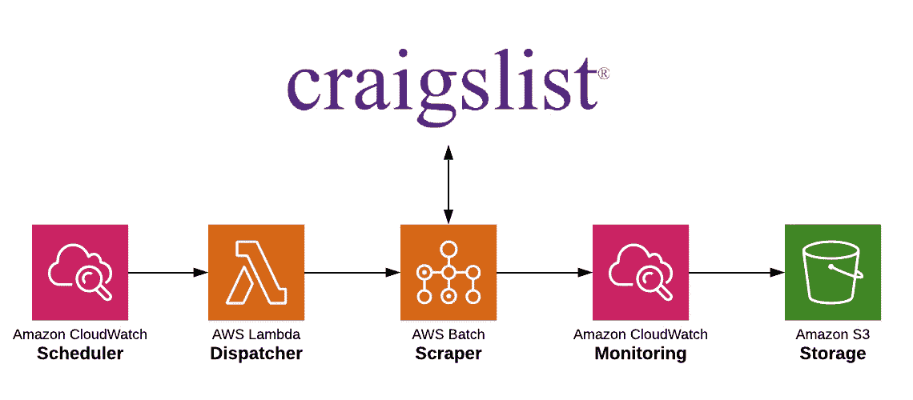
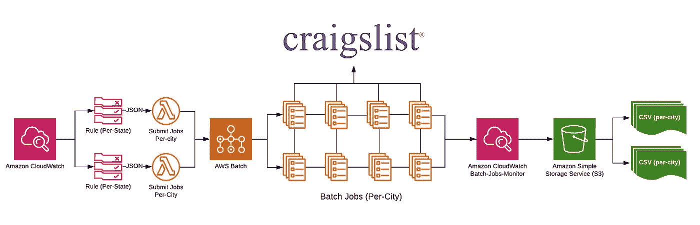
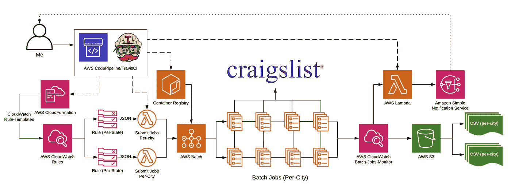
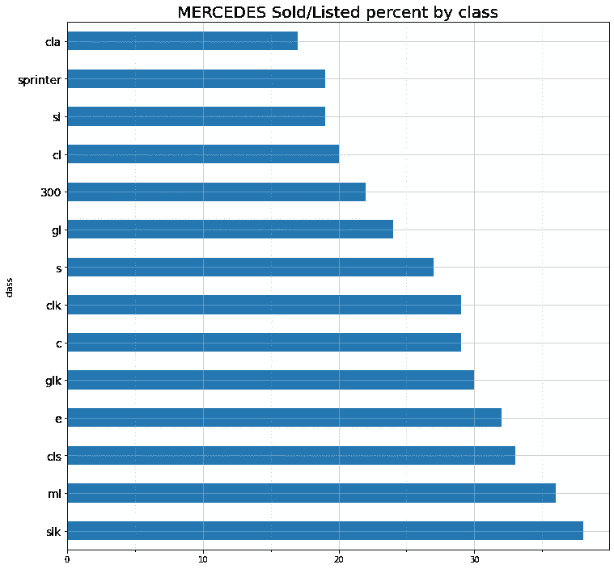

# 我如何用 AWS 构建一个可伸缩的 Web Scraper

> 原文：<https://towardsdatascience.com/get-your-own-data-building-a-scalable-web-scraper-with-aws-654feb9fdad7?source=collection_archive---------10----------------------->

## 我对完全托管的基于云的 Python scraper 的提议

我如何想象我的 AWS 控制台…(照片由[帕特里克·grądys](https://unsplash.com/@patrykgradyscom?utm_source=medium&utm_medium=referral)在 [Unsplash](https://unsplash.com?utm_source=medium&utm_medium=referral) 上拍摄)

去年年初，我在 Craigslist 上发现了一个疯狂的二手车交易。经过反复检查，证明这不是一个骗局(事实并非如此)。我很自然地直接去了《凯利蓝皮书》,以了解我的新车的“真正价值”——但这让我想到:

> 凯利蓝皮书是如何计算私人汽车价值的？我凭什么相信他们？

似乎他们必须使用的第一个资源是 Craigslist——因为这是最受欢迎的点对点二手车列表平台(直到最近，也是*唯一的*主要平台)。如果是这种情况，凯利蓝皮书必须以某种方式访问 Craigslist 的数据。然而，Craigslist 不提供 API，也不向公众开放他们的数据集(假设他们有)。这让我想到，也许像 KBB 这样的公司正在搜集他们的一些数据(这可能是一个安全的猜测)。

因此，我决定收集数据来建立我自己的凯利蓝皮书式的平台。为此，我需要构建一个满足以下要求的刮刀:

1.  易于扩展和动态的刮板，以适应许多 Craigslist 城市，上市，和上市类型。
2.  每天管理数百个作业的处理——交错并仔细安排，以避免 DDoS Craigslist 服务器(或被它们阻塞)。
3.  监控每个作业，以便在出现任何运行时故障时立即通知我。
4.  最后，CI/CD 用于管理所有相关服务的快速部署。

这是我的解决方案的高级示意图:

作者图片

本质上，我需要构建一个 ETL 管道来每天收集 Craigslist 数据，以便记录每个汽车列表的生命周期和事件(价格变化、除名)。本文重点介绍这些数据的提取过程。在接下来的几周里，我会写更多关于我如何转换/加载和处理数据的内容(稍后先看一些结果——继续阅读！).

**免责声明**:请理解这个项目只是为了研究而建。虽然它有能力在很短的时间内点击 Craigslist 上千个请求(或者让你的电脑崩溃)，但我一直很小心地限制给定时间内的请求数量，通过战略性地间隔作业，以免垃圾邮件/DDoS Craigslist 服务器。**如果你在 Craigslist(或任何这方面的网站)，一定要阅读并遵守**[**robots . txt**](https://craigslist.org/robots.txt)**。**

# 让我们开始吧…

虽然我不会像教程那样一步一步地讲解整个过程；我想给你一个刮刀本身如何工作的概念。

scraper 在 Docker 容器中运行——代码本身非常简单，你可以在这里找到整个项目。它是用 Python 构建的，并使用了 [BeautifulSoup](https://www.crummy.com/software/BeautifulSoup/) 库。

有几个环境变量被传递给 scraper。这些变量定义了每个作业的搜索参数。本质上，容器的生命周期遵循以下三个步骤:

1.  向容器传递几个变量，主要是城市/搜索区域和车辆制造商。
2.  容器根据给定的参数搜索 Craigslist，并从 HTML 生成结构化结果。
3.  容器将这些结果以 CSV 格式发送给 S3。

# 流程和基础设施

这是最酷的部分…

现在，让我们详细回顾一下提取/调度流程。

1.  每天，我的 AWS **CloudWatch** 事件规则触发 lambdas 为不同的州和汽车制造商分派刮擦工作。
2.  调度程序将每个城市的任务提交给 AWS 批处理。
3.  AWS **Batch** 加速计算环境( **ECS** )并根据环境的配置运行作业(计算环境决定作业并发性——点击阅读更多关于 AWS Batch [的信息)。](https://aws.amazon.com/batch/)
4.  **CloudWatch** 在批处理发送状态更新时处理并通知故障。
5.  在每个批处理作业结束时，scraper 将发送一个新生成的搜索结果 CSV 到我的 **S3** 桶，命名约定为:search type _ make _ city _ timestamp . CSV。我选择将“品牌”放在“城市”之前，因为品牌对车辆列表的价格和寿命更重要。

下面是刮擦过程的高级示意图:

作者图片

从图中可以看出，我用的是 CloudWatch，Lambda，Batch，S3。我还将 SNS 用于由“批处理-作业-监视器”触发的通知

以下是我选择服务的理由:

**CloudWatch** 拥有“规则”,其行为类似于 Cron 作业，可以将 JSON 有效负载传递给 lambda 函数。这使我能够提交多个带有 JSON 格式的作业参数的 CloudFormation 模板，以便根据预先确定的 Cron 表达式执行。

Lambda 对于较小的任务(分派和通知)来说非常棒，并且可以很容易地与几乎所有的亚马逊服务集成。

**AWS 批次**非常适合我的刮刀容器。我决定以每个城市为基础运行作业，这意味着在相对较短的时间内会有数千个请求。为了提高每项工作的速度，我决定在 python scraper 中对请求进行多线程处理。这意味着我需要一个允许长运行时间和高 I/O 速率的服务。由于这些条件，Lambda 是不可能的(并且 Lambda 不支持 Python 的多线程包)。我发现 AWS Batch 是完美的——我能够配置计算环境以满足我的需求(和预算),同时在按使用付费的服务中拥有易于维护的 Dockerized scraper。另一个主要的好处是，AWS Batch 使用 ECS 来运行作业，因此，每次处理新队列时，AWS Batch 都会启动新的 EC2 实例— **和新的 IP 地址**(实质上是轮换 IP)。

**S3…** 好吧，S3 是一个快速又便宜的方法，可以把我的半结构化刮刀暂时存放在一个容易接近的位置。我确实必须考虑我的对象命名标准。如果不考虑命名标准，S3 桶可能会对成千上万的对象造成混乱 AWS SDK 不提供健壮的对象搜索功能。很快，我将把我的数据从 S3 迁移到一个结构化的关系数据库中。

对于我需要自己发送的少量文本通知来说，SNS 非常棒——并且很容易与 CloudWatch 和 Lambda 集成。

# CI/CD 概述

这一部分对我来说很重要，主要是因为我的铲运机有许多移动部件 AWS 控制台可能很乏味。

对于提交触发的构建/部署，我使用了**代码管道**和 **TravisCI** 。这主要是为了我自己的实验。我发现 TravisCI 能够做我需要的一切，所以我将把我的代码管道项目转移到 TravisCI，每月节省额外的 1 美元😉

我使用了 [**无服务器框架**](https://www.serverless.com/) 通过 TravisCI 的构建脚本来处理 Lambda 部署。

python scraper 被打包并部署到 Amazon 的 **ECR** 中，AWS Batch 根据需要引用/启动图像。

我承认，我对我的 Cron 事件规则采取了一种黑客式的方法:我编写了 **CloudFormation** 模板，将事件有效负载嵌入为 JSON。

转义的“jsonInput”有点混乱，但是我可以通过这些模板轻松地添加或删除作业。例如，如果我想添加另一个抓取作业，我只需添加带有新的“jsonInput”和“cronExpression”值的“group2a”。

我应该注意到“TemplateURL”路由到指向单个 Lambda 函数的事件规则 CloudFormation 模板，该函数被配置为接收“jsonInput”并相应地将作业分派给 AWS 批处理。

当需要更改时，模板被修改并提交给 Github。一旦 pull-request 被合并到我的主分支，TravisCI 就用最新的更改更新 CloudFormation 堆栈。这个过程让我可以非常简单地放大或缩小我的可伸缩刮刀。

# 现在整个事情

…这是我的整个解决方案—从 CI/CD 到文本提醒:

作者图片

# 敬请期待！

你想知道如何在这样一个美女身上得到一笔好交易(你不会相信它的价格)吗？或者你可能对项目本身更感兴趣…

1998 年奔驰 SLK 230(机械增压)，50k 英里，硬顶敞篷车(一切工作完美)。是的，它是我的。(*图片作者)*

如上所述，我将很快写关于我的数据集的后处理。作为先睹为快，我对来自加利福尼亚-梅赛德斯-奔驰两个月的数据的样本数据集进行了一些分析(我现在有大约 6 个月的数据！).猜猜我发现了什么？

根据这个(小)数据集，我的 SLK 是 Craigslist 上所有梅赛德斯-奔驰房源中销售率最高的！

看看这个:

有一款 SLK，销售率约为 38%。作者创建的图表。

这是一些很酷的数据，对不对？

我很想听听你对这个解决方案的想法——剥猫皮的方法不止一种。在下面留下评论！

我们上 [Linkedin](https://www.linkedin.com/in/aaron-langley/) 连线吧！

干杯！

—亚伦·兰利