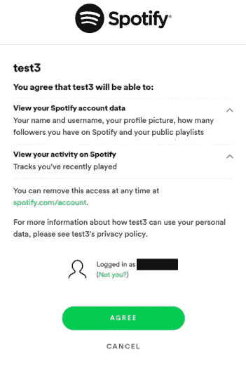

# 使用 Python 获取您的 Spotify 流媒体历史记录

> 原文：<https://towardsdatascience.com/get-your-spotify-streaming-history-with-python-d5a208bbcbd3?source=collection_archive---------8----------------------->

## 上面有美味的歌曲。


没有这些特征就不一样了。[来源](https://commons.wikimedia.org/wiki/File:Foodiesfeed.com_pouring-honey-on-pancakes-with-walnuts.jpg)

*这是我的第一个媒介故事！感谢任何反馈。*

如果你像我一样是一个专注的 Spotifyer，通过查看你的流数据，你可以学到很多东西。你倾向于在冬天听悲伤的歌吗？恋爱时你的音乐喜好发生了什么变化？

幸运的是，Spotify 允许你请求下载你所有的流媒体历史记录*。*在本教程中，我将向您展示如何提取这些数据，用美妙的歌曲特色为其调味，并将其组织成一个方便的 **CSV 文件**，您可以用自己喜欢的工具进行分析。

但是还有更多。到那时，你也将基本了解 **Spotify API** 如何工作，如何完成**授权代码流**，以及如何构建自己的 **Spotify 应用。**继续读下去！

但是如果你赶时间的话，完整的代码可以在我的 [**GitHub**](https://github.com/vlad-ds/spoty-records) **获得。**

## 特征，特征

Spotify 的*音频特征*是复杂的指标，旨在描述一首歌曲的个性和对听众的总体印象。以下是对每种方法的简要描述:

***声学*** *—如何声学* ***舞蹈性*** *—不言自明* ***能量*** *—如何‘快、大、吵’* ***乐器性*** *—人声较少，* ***活跃度越高*** *—录音中是否有听众* ***响度*** *—不言而喻* ***语速****—* ***价态越高***

*Spotify 还会测量每个曲目的时长、调、模式和拍号。你可以在 Spotify 的[文档](https://developer.spotify.com/documentation/web-api/reference/tracks/get-audio-features/)中了解更多关于功能的信息。*

## *我们需要做的是*

*首先，我们从 Spotify 获取流媒体数据。由于不包含这些功能，我们从 Spotify API 请求它们。最后，我们将数据导出为我们喜欢的格式。*

## *要求*

*这个任务的主要需求是 [**Spotipy**](https://github.com/plamere/spotipy/commits?author=stephanebruckert) 库。我们还将使用**请求**模块来处理 API。虽然不是必需的，但我还包含了 **Pandas** ，因为它使得保存和加载表格数据变得非常容易。*

*确保安装了必要的依赖项:*

# *行动*

## *获取数据*

*在[https://www.spotify.com/](https://www.spotify.com/)访问您的 Spotify 账户仪表盘。在隐私设置中，您会发现请求您的数据的选项。这需要一些耐心。Spotify 说需要 30 天，但通常要快得多。就我而言，我等了三天。*

*最终你会收到一封电子邮件，里面有你的 Spotify 数据，格式为. zip 文件。提取 *MyData* 文件夹，并将其复制到您的工作文件夹中。*

## *获取流*

*我们的文件夹里有几个文件。让我们感兴趣的是这样的: *StreamingHistory0.json* 。您可能有一个或多个文件，这取决于您的流历史的大小。让我们打开文件。我的第一首歌是这样的:*

*不错的选择，对吧？*

*让我们编写一个 Python 函数，它将收集所有的 *StreamingHistory* 文件，提取 JSON 对象并将它们转换成 Python 字典。*

*就是这样。现在我们有了历史上所有曲目的时间戳列表。*

## *成为 Spotify 开发者*

*Spotify 的数据下载中不包括歌曲功能。我们必须通过 Spotify API 请求它们。*

*访问 API 是免费的，但我们需要注册一个 Spotify 应用程序。别担心:只需要几分钟。在这里报名[即可。](https://developer.spotify.com/)*

*恭喜你:你正式成为 Spotify 开发者了！*

*转到您的新[开发者仪表板](https://developer.spotify.com/dashboard/applications)并点击“创建应用”。不要担心细节。Spotify 将允许你创建虚拟应用，只要你承诺不将它们货币化。但你应该避免在名字中使用“Spotify ”,否则它可能会被屏蔽。*

## *授权代码流*

*没人能简单地向我解释，所以我来了。一个应用程序可以访问 Spotify API，但前提是它必须获得至少一个用户的许可。因此，我们将使用该应用程序询问自己是否允许访问我们的用户的数据。*

*我们需要提供一个“重定向链接”，我们将用来收集用户的许可。在开发者仪表盘的应用面板中，点击“编辑设置”并在**重定向 URIs 下添加一个链接。**这不一定是真实的链接:如果你没有网站，你可以简单地使用[http://localhost:7777/callback](http://localhost:7777/callback)。*

*你还需要你的应用程序的**客户端 ID** 和**客户端密码**。您可以在应用面板中的应用名称下找到它们。现在，您已经拥有了访问 Spotify API 所需的一切！*

## *访问 Spotify API*

*现场救援。在这些字段中插入您刚刚收集的变量:*

*该函数将一个**请求**打包，该请求从您的应用程序(通过**客户端 Id** 和**客户端机密**识别)发送给用户(通过 Spotify **用户名**识别)。*

*该请求有一个**范围**，它定义了您将要请求的权限。你可以在这里了解更多关于示波器的信息。*

*最后，你需要提供一个**重定向 URI** 。这必须与您在应用程序设置中列入白名单的项目相对应(见上一节)。*

*该函数返回一个**令牌**，它基本上是一个字符串，我们将使用它向 Spotify API 保证我们拥有用户授权。*

*一旦您使用正确的参数运行该函数，它将在您的 web 浏览器中打开一个授权面板。点击链接，使用您的 Spotify 凭据登录，您应该会看到如下内容:*

**

*现在您终于可以授权您的应用程序了。一旦你点击同意，你将被带到重定向 URI，这很可能是一个不存在的页面。只需复制地址并将其粘贴到 Python 控制台中。*

*就是这样。如果您在控制台中打印您的*令牌*变量，您应该会看到类似这样的内容:*

## *访问令牌和刷新令牌*

*但是还有更多。如果您关闭代码并再次运行，您将不必提供授权，尽管内存中已经丢失了*令牌*变量。斯波蒂皮似乎记得你的令牌。这里发生了什么事？*

*如果您进入工作文件夹并启用隐藏文件可视化，您将看到 Spotipy 已经创建了一个名为*的新文件。缓存您的用户名。**

*如您所见，您的**访问令牌**有一个有效期，通常为一个小时。但是 Spotify 也给你提供了一个**刷新令牌**。当原始令牌过期时，您的应用程序可以使用刷新令牌来请求新令牌。*

*因此，每次运行脚本时调用 *prompt_for_user_token* 函数来加载令牌是很重要的。如果它找到一个缓存文件，它将使用它。如果您移动或删除缓存文件，您的令牌将会丢失，用户必须再次授权您。*

## ***获取身份证***

*Spotify 数据下载没有为我们提供曲目的**id。**我们需要这些 id 来获取特性。*

*我们可以通过使用 API 来搜索我们的轨道名称，获取第一个结果并提取 ID，从而获得 ID。Spotify 在[文档](https://developer.spotify.com/documentation/web-api/reference/search/search/)中展示了如何构建这样的请求。*

*我想使用 Python 中的**请求**库来执行这个任务。由于我还不熟悉它，我在 https://curl.trillworks.com/[使用脚本将 curl 命令转换成 Python 请求代码。以下是 Spotify 的 curl 命令示例:](https://curl.trillworks.com/)*

```
*curl -X GET "https://api.spotify.com/v1/search?q=tania%20bowra&type=artist" -H "Authorization: Bearer {your access token}"*
```

*这是我在 [curlconverter](https://github.com/NickCarneiro/curlconverter) 的帮助下写的函数:*

*让我们测试我们的功能:*

*很好。[将 ID 粘贴到 Open Spotify](https://open.spotify.com/album/6QaVfG1pHYl1z15ZxkvVDW?highlight=spotify:track:25yQPHgC35WNnnOUqFhgVR) 中，获得大量经典音乐。*

## ***获取特征***

*现在我们有了自己的 id，从 API 中获取特性就变得轻而易举了。*

*让我们在赛道上测试一下:*

## *包装它*

*精彩！现在我们已经拥有了构建我们的流历史数据框架所需的一切。最简单的方法是创建一个字典列表:*

*(如果您的历史记录中有数千首歌曲，从 API 获取数据可能需要相当长的时间。我建议您首先在一个样本上测试您的代码。)*

*瞧。我们有一堆不错的流媒体工具，还有一些功能。现在，我们可以使用 Pandas 将字典列表转换成数据帧，并将其导出为 CSV 格式。*

# *我们完成了！*

*如果你浏览我的 [**GitHub**](https://github.com/vlad-ds/spoty-records) ，你会发现我的代码有点不同。当您重复 API 请求时，您可能会得到在第一次运行时被拒绝的响应。此外，将来您可能希望用新的一批流重新运行代码。但是 API 请求很慢，所以我添加了保存已经收集的 id 和特性的函数，允许您在不重复旧请求的情况下提出新请求。*

# *下一步是什么？*

*一旦你有了所有特性的流媒体历史，你就可以拿出你的 **Pandas/Matplotlib** 技能来分析和绘制它们。你甚至可以[应用机器学习](/a-music-taste-analysis-using-spotify-api-and-python-e52d186db5fc)来回答一些有趣的问题。*

*如果你有一个朋友和伙伴喜欢 Spotify，你可以用这个脚本向他们展示他们的历史。只需在您的代码中输入他们的用户名，向他们发送授权链接，并确保他们向您发送重定向 URI。*

*接下来，我将探讨如何分析我们刚刚收集的数据。同时，你可以查看[其他关于这个主题的酷文章](/is-my-spotify-music-boring-an-analysis-involving-music-data-and-machine-learning-47550ae931de)。*

**我的第一个媒介故事到此结束。感谢阅读！**