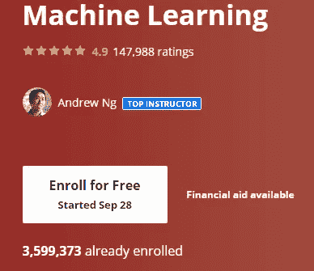
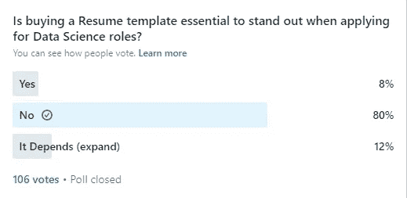

# 获得数据科学工作比以往任何时候都难

> 原文：<https://towardsdatascience.com/getting-a-data-science-job-is-harder-than-ever-fb796aae1922?source=collection_archive---------6----------------------->

## 如何利用找工作的困难来为自己谋利

马丁·佩希在 [Unsplash](https://unsplash.com?utm_source=medium&utm_medium=referral) 上的照片

## 介绍

在写这篇文章的时候，我正在寻找一份新的工作，作为一名数据科学家，因为我和前一家公司的新冠肺炎通信有困难。

这一次，我注意到事情似乎比我上次上市时要困难得多，但我没有利用这些挑战来延长我们成为数据科学家的梦想，或在最糟糕的情况下结束这些梦想，而是努力更好地理解这些挑战，以便我可以提出一些解决方案，使它们最有利于我，现在也有利于你！

## 古怪的工作要求

这似乎是我与数据科学求职者进行的大多数讨论中的一个主题

> 没人觉得自己有资格了。

许多数据科学职位描述没有传达广告中角色的**实际**要求。

这种情况的一个主要影响是，有抱负的数据科学家根据工作描述优先考虑他们的个人和技术技能，这可能会误导对履行角色的要求。另一个问题是招聘人员会收到大量不符合要求的申请。

根据 Jeremie Harris 的一篇精彩文章，标题为 [*数据科学职位发布的问题*](/the-problem-with-data-science-job-postings-8a3542f38724) 有很多原因可以解释为什么一份工作描述看起来难以理解，这取决于你来辨别你所在的职位属于哪一类:

*   解决问题的方法很多，所以很难把范围缩小到一个工作描述
*   新的数据科学团队可能会鼓励人们成为万事通，这将转化为工作描述
*   公司缺乏经验来了解他们有什么问题，以及能够解决这些问题的人应该具备什么能力
*   由招聘人员撰写

**解决方案**

虽然这需要你有一定的洞察力，但重要的是要确定奇怪的工作描述的潜在原因，因为一些场景可能对你作为数据科学家的成长有害，例如成为一名万事通。

克服这一挑战的一个很好的方法是承认职位描述只是公司的愿望清单，他们想雇用他们认为有能力解决他们实际存在的问题的人。

关于这一点，一定要展示你的能力，让别人(公司)觉得你有能力应对他们的挑战。此外，如果你满足了任何职位描述中至少 50%的要求，那么你很有可能是合格的，并且绝对应该尝试去应聘这个职位——如果你 100%满足了职位描述，那么你很有可能资历过高。

## 数据科学变得越来越商业化

能够旋转 Jupyter 笔记本并进行一些可视化，然后建立一个模型，这在过去是可行的，但在我看来，这已经不足以引起你的注意。

Jupyter 笔记本电脑非常适合进行实验，但是当你进入现实世界时，我们就会越过实验阶段。我相信，每个数据科学家都应该知道如何组装 Jupyter 笔记本，但随着数据科学变得越来越生产化，可以编写生产级代码的数据科学家会获得加分，因为这样可以节省成本和时间。

以下是每个数据科学家都应该知道如何编写生产级代码的 3 个理由:

*   在从数据科学家到工程师的翻译过程中，有些东西可能会丢失
*   消除流程中的延迟
*   一石二鸟，因为一个人可以做两个人的工作——让你更有价值

**解决方案**

虽然有争议，但我相信当涉及到面向数据科学应用的产品时，数据科学家和软件工程师的技能正在趋同，因此更多的数据科学家应该学习软件工程最佳实践。

 [## 数据科学家应该知道软件工程的最佳实践

### 成为不可或缺的数据科学家

towardsdatascience.com](/data-scientist-should-know-software-engineering-best-practices-f964ec44cada) 

鉴于你已经知道如何编写生产级代码，你可能想看看[肖恩·惠勒](https://medium.com/u/2d3762e7f110?source=post_page-----fb796aae1922--------------------------------)的文章标题为 [*“生产化”数据科学意味着什么？*](/what-does-it-mean-to-productionize-data-science-82e2e78f044c) 异常总结了数据科学生产的代码级最佳实践之外的系统应用焦点——至少可以说这是一篇非常有趣的文章。

> “某样东西‘投入生产’意味着它是从企业到客户的管道的一部分。[……]在数据科学中，如果某样东西在生产中，它就在将信息放在消费它的地方的路上。”

## 竞争

数据科学是这个星球上发展最快的新兴技术之一，成千上万的人蜂拥而至更新他们的技能，以尝试成为一名数据科学家。如果你不相信我，自 Coursera 开设吴恩达机器学习课程(这是数据科学的重要组成部分)以来，已经有超过 350 万人注册了该课程。

这是 21 世纪最性感的工作。

现在越来越多的人试图进入这个领域，因此工作竞争非常激烈。但是，这不一定要成为决定不找工作的理由！

**解决方案**

是的，我们应该做得更多来脱颖而出，但是根据我最近在 LinkedIn 上做的一项民意调查，这并不一定意味着拥有最漂亮的简历。

来源: [Kurtis Pykes 领英](https://www.linkedin.com/posts/kurtispykes_datascience-machinelearning-artificialintelligence-activity-6714579336265011200-2Q0l)

当然，拥有一个优秀的投资组合是脱颖而出的一个很好的方式，然而，在增加你获得机会的机会方面，似乎是不可战胜的是接触招聘经理或你申请的职位中的高级职位的数据科学家。

LinkedIn 让找到在特定公司工作的人变得如此容易，所以在申请工作时，它应该成为工作申请过程的一部分。

## 结论

在数据科学领域很难找到工作的事实永远不应该成为你没有工作的理由。任何工作本身都会面临许多挑战，获得这份工作只是一个资格阶段，看看雇主是否相信你有能力面对挑战，以及你是否相信雇主是你希望加入的团队。永远寻求提升自己，不要等着准备好申请，因为你可能永远都不会觉得自己准备好了，不要害怕被拒绝或拒绝与你的目标不一致的公司。

让我们在 LinkedIn 上继续讨论…

 [## Kurtis Pykes -人工智能作家-走向数据科学| LinkedIn

### 在世界上最大的职业社区 LinkedIn 上查看 Kurtis Pykes 的个人资料。Kurtis 有一个工作列在他们的…

www.linkedin.com](https://www.linkedin.com/in/kurtispykes/)