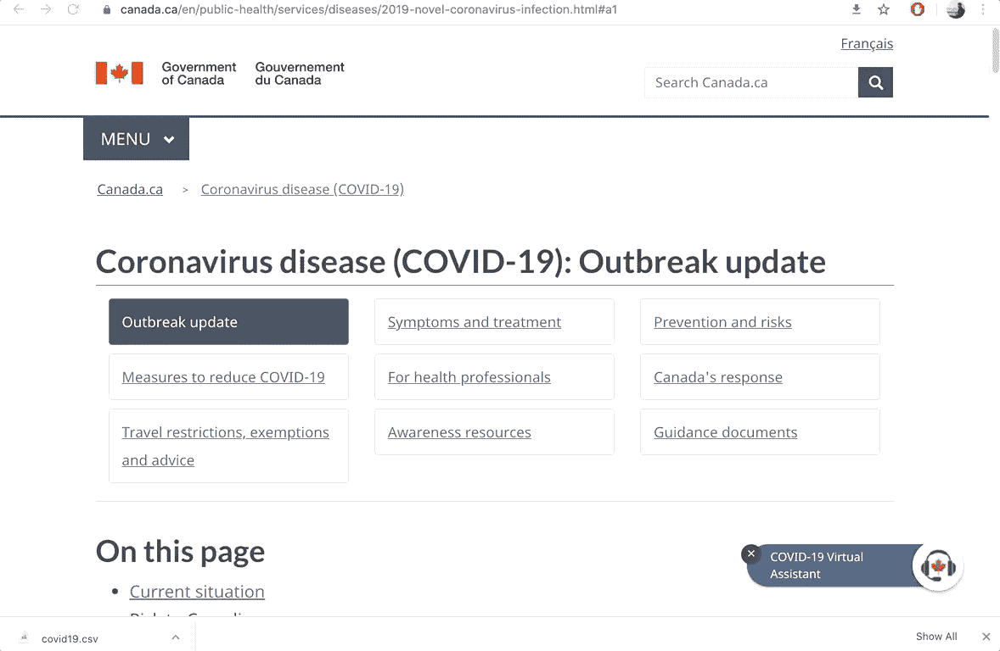

# Shell + 5 常用命令入门

> 原文：<https://towardsdatascience.com/getting-comfortable-with-shell-5-common-commands-to-know-dbfa3aeb47c5?source=collection_archive---------46----------------------->

## 面向初学者的 Shell 介绍


[Goran Ivos](https://unsplash.com/@goran_ivos?utm_source=medium&utm_medium=referral) 在 [Unsplash](https://unsplash.com?utm_source=medium&utm_medium=referral) 上的照片

唱空壳可能会令人生畏。喜欢拥有漂亮用户界面的工具是可以理解的。在我们看 shell 之前，shell 到底是什么？

## 定义外壳

让我们简单点，从我们如何使用电脑开始。把你的电脑想象成一个等待指令的机器人。对于您的大多数需求，您使用应用程序让计算机执行操作。例如，现在你正在使用一个互联网浏览器应用程序(比如谷歌 Chrome)来阅读这篇文章(除非你使用的是中型移动应用程序，我绝对推荐下载)。应用程序是你与计算机交流的方法。换句话说，我们不会对着电脑说话，口头告诉它“打开互联网浏览器，进入 Medium。”我们让应用程序来做这件事。应用程序扮演着重要的角色——它们将我们想要做的事情翻译成计算机可以理解的指令。不同的应用服务于不同的角色。谷歌 Chrome 用于浏览互联网，微软 Word 用于键入文章，Finder/File Explorer 用于访问文件。

**Shell 是我们与计算机交流并使其执行动作的直接方式。用专业术语来说，它是一种命令解释程序和编程语言。**不用通过 Finder 之类的应用程序来查看你的文档，你可以使用 shell 直接指示电脑显示你的文档。这种与计算机直接交流的渠道给了我们更多的权力去控制我们想要计算机做的事情。

# 看贝壳

现在回到我们关于壳牌令人生畏的观点。让我们看一个例子。

## **在 Finder vs. Shell 上删除文件**

假设您想要删除一个名为`myFile`的文件。在 Finder(或 PC 的文件资源管理器)上这样做既简单又直观。你进入 Finder，找到`myFile`，右键点击文件，选择移动到垃圾桶/删除。简单。


使用 Finder 删除文件

当使用命令行时，它可能看起来更困难和可怕，尤其是对于第一次使用的用户。在 Mac 上，打开“终端”(按 command 和空格键，键入 Terminal，然后按 Enter)。要删除`myFile`,你可以输入代码进入你的文档，然后输入代码查看你的文档以确保`myFile`在那里，最后用更多的代码删除`myFile`。见下文。


使用终端删除文件

如果你以前从未打开过命令行界面(命令行界面是你输入 shell 命令的程序 Mac 上的终端或 Windows 上的命令提示符)，你可能对上面的 gif 很感兴趣。或者受到恐吓。或者两者都有。以下是用户喜欢避免 shell 的三个原因:

*   **你需要知道命令。**在 Finder 上你可以用鼠标导航，但是命令行界面只接受通过键盘输入的文本。这需要记忆必要的命令。在上面的例子中，`rm`是删除文件的命令(rm 是 remove 的缩写)。
*   **更容易搞砸。使用 shell 可以让您更好地控制任务。所以害怕输入错误的文本，害怕做错事，比如删除一堆文件，是可以理解的。**
*   **有好用的应用** (Finder/File Explorer，FileZilla 等。)

您可能已经被说服避免使用命令行界面。但是壳牌证明了它的强大。

# 为什么要用 Shell？

## 大多数开发人员角色都需要了解 Shell

如果您正在从事任何涉及编码的工作(软件开发人员、数据工程师、数据科学家等)，您可能会在职业生涯的某个阶段使用 shell。熟悉使用 shell 将提高您的工作效率，并向您的团队展示您的经验。

> 对于许多开发人员工作来说，如果一个候选人不知道如何使用 shell，那么得出他们没有太多经验的结论是合理的。作为一名数据工程师/科学家，我每天都需要使用 shell。

## Shell 允许您自动化重复的任务

您可以在命令行上完成许多任务，而使用 Finder 等标准应用程序则不那么容易。假设你正在研究加拿大的新冠肺炎病例。要获得每日更新病例数的 CSV 文件，您需要访问加拿大公共卫生网站并下载 CSV 文件。如果文件每天下午 6 点更新，那么您需要每天获取更新的文件。这意味着每天下午 6 点以后，你需要去网站下载文件。



从加拿大公共卫生部下载新冠肺炎病例的 CSV 文件

将这与在 Shell 中下载文件进行比较。你所需要做的就是打开终端，并键入以下内容:

```
curl -O [https://health-infobase.canada.ca/src/data/covidLive/covid19.csv](https://health-infobase.canada.ca/src/data/covidLive/covid19.csv)
```

让我们分解代码。`curl`是从链接下载文件的命令(curl 是 **C** lient **URL** 的简称)。`-O`是一个可选的标志(我们将很快探索这个标志),它告诉计算机我们想要以原始名称保存文件(O 代表原始)。最后我们传递下载链接。总而言之，我们告诉计算机在给定的链接下载文件，并以其原始名称 *covid19.csv* 保存文件。


使用 Shell 下载文件链接

真快！无需打开互联网浏览器，转到链接，然后滚动到下载按钮。只需键入一行，就大功告成了。你可能会想，从网站上下载文件真的没什么大不了的。但是，如果您的研究需要您每天下载文件，您可以使用编写一个简单的 shell 脚本(只需一次)来自动完成这项日常任务。因此，每天下午 6:05(或者我们在脚本中指定的任何时间)，新的每日文件都在您的下载文件夹中。这已经为你节省了几分钟的时间。现在想象一下，如果您每天需要下载多个文件，您将节省多少时间。

使用 shell 还有许多额外的好处。但是我们先来探究一下 shell，简单了解一下如何使用。

## Shell 命令快速介绍

Shell 命令的使用方式如下:

```
command [-flag] [parameter]
```

*   命令是您想要采取的操作。例如，`ls`命令的意思是列出一个文件夹的内容。我们将很快回到`ls`。
*   [-flag]是您可以指定的可选详细信息。请注意，您实际上不需要键入方括号。方括号表示这部分代码是可选的。例如，默认情况下，`ls`命令不会列出以点号开头的文件。你的探测器也一样。要列出这些文件，键入`ls -a` (-a 表示列出 **a** ll 文件)。


*   [parameter]是要对其执行命令或操作的实体(路径/文件/链接)。注意方括号，意味着参数部分是可选的。对于`ls`，默认情况下，它会列出你所在文件夹的内容。你可以通过阅读`%`符号前的文字来判断你在哪个文件夹。在这种情况下，我们在文档中。如果要列出不同文件夹的内容，需要将文件夹名作为参数传递。假设我们的文档中有一个名为“StayPositive”的文件夹。要查看 StayPositive 文件夹中的内容，请将 StayPositive 作为参数:`ls StayPositive`。


保持乐观的 5 个理由:)

## 需要知道的 5 个命令

你不需要掌握使用命令行界面。如果你试图学习它，你会不知所措。另外，如果您不经常使用命令，您很可能会忘记它们。这里有五个您应该知道的经常使用的 shell 命令。

**ls(列表)**

List 的缩写，`ls`是列出一个目录的命令。如果你输入`ls`并按下回车键，你会得到一个存储在你所在文件夹中的文件列表。

**光盘(更改目录)**

`cd`命令用来改变你正在查看的目录。这就像在 Finder 中用鼠标点击目录/文件夹来查看其内容一样。例如，`cd Documents`将带您到您的文档目录。使用前面的命令，如果您键入`ls`，您可以*列出*您的文档中的内容。


cd 和 ls

**手动**(手动)

每当你不知道如何使用一个命令，或者忘记传递哪个标志时，使用`man`。`man`将显示你作为参数传递的命令的帮助手册。这里我们用`man`来列出如何使用`ls`。请注意，您可以使用鼠标或按空格键来滚动手册。每按一次`space`，页面就会向下滚动。当您准备退出手册时，按`q`退出。


**rm** (删除文件)

`rm`用于删除一个文件。需要注意的是`rm`将会完全删除文件，而不是将它移动到垃圾箱。要使用`rm`，包括文件名作为参数。所以要删除*我的文件*，输入`rm myFile`。

**mkdir** (制作目录)

`mkdir`将制作一个目录/文件夹。将目录名作为参数传递。要创建 myFolder，请键入`mkdir myFolder`。

## 学习 Shell 的后续步骤

虽然这篇文章向您介绍了 shell 和常见命令，但我建议您参加一个关于 shell 的入门课程，以便更好地理解。网上可以找到一堆。谷歌一下“学壳”就行了。我最喜欢的两个 shell 课程是 DataCamp 的—[Shell 简介](https://learn.datacamp.com/courses/introduction-to-shell)和[使用 Shell 进行数据处理](https://learn.datacamp.com/courses/data-processing-in-shell)。注意，这些课程只有第一章是免费的。我和 DataCamp 没有任何关系，我只是从他们的互动练习中受益匪浅。

当你遇到一个你要执行的任务并想自动完成它时，你的学习成果就会显现出来。一定要在 google 上搜索如何使用 shell 自动完成这项任务。很可能有人已经问过同样的问题并得到了答案。你将开始自动化你从来不知道的任务，这些任务是如此容易自动化。下次再见，学习愉快！