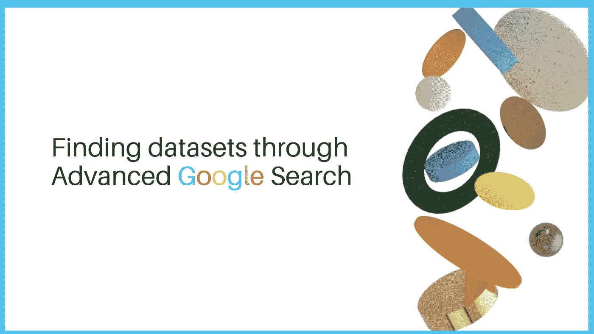
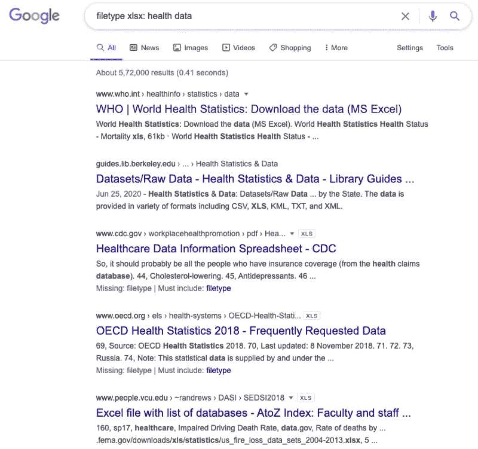
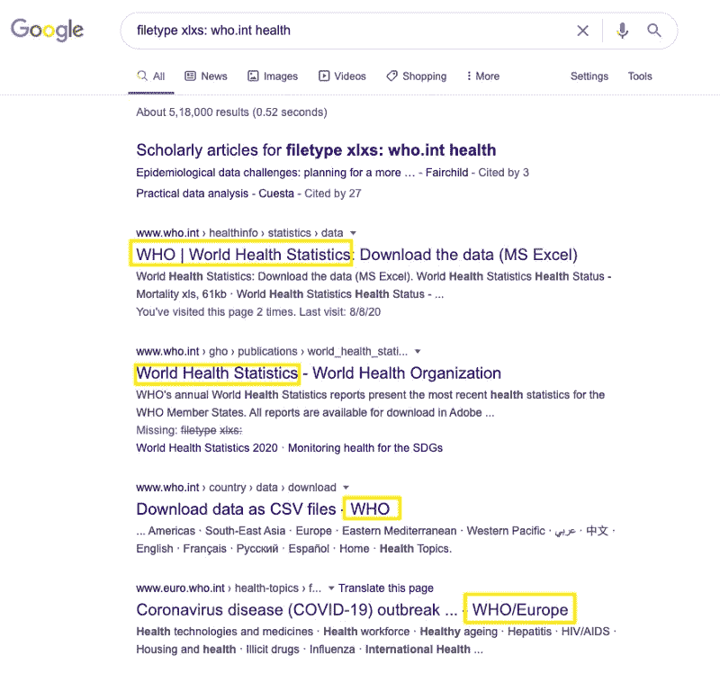
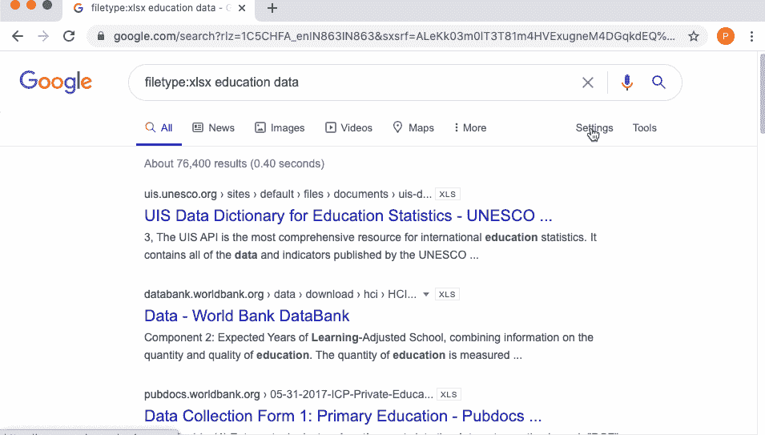

# 更有效地利用谷歌搜索查找数据

> 原文：<https://towardsdatascience.com/getting-datasets-for-data-analysis-tasks-advanced-google-search-b1c01f9cc324?source=collection_archive---------39----------------------->



作者图片

> “数据！数据！数据！”他不耐烦地喊道。"没有粘土，我无法制砖。"

> 《铜榉树历险记》中的夏洛克·福尔摩斯，亚瑟·柯南·道尔爵士

在数据科学过程中，数据的重要性怎么强调都不为过。数据分析任务的结果代表了输入其中的数据类型。但是，有时候获取数据本身也是一大痛点。最近，我用免费工具**做了一个名为 [**数据新闻和可视化的短期课程，通过这个课程分享了一些很棒的资源。我将通过一系列文章来分享一些有价值的技巧。在这些文章中，我将试图强调一些你可以在互联网上免费找到数据的方法，然后用它来创造一些有意义的东西。**](https://live-journalismcourses.pantheonsite.io/course/data-journalism-and-visualization-with-free-tools/)**

**这篇文章是寻找好数据集的完整系列文章的一部分。以下是该系列中包含的所有文章:**

****第 1 部分** : [为数据分析任务获取数据集——高级谷歌搜索](/getting-datasets-for-data-analysis-tasks-advanced-google-search-b1c01f9cc324)**

****第 2 部分** : [为数据分析任务寻找数据集的有用站点](/useful-sites-for-finding-datasets-for-data-analysis-tasks-1edb8f26c34d)**

****第三部分** : [为深度学习项目创建定制图像数据集](/creating-custom-image-datasets-for-deep-learning-projects-6e5db76158d4)**

****第四部分** : [毫不费力地将 HTML 表格导入谷歌表单](/import-html-tables-into-google-sheets-effortlessly-f471eae58ac9)**

****第 5 部分** : [使用 Camelot，从 pdf 中提取表格数据变得很容易。](/extracting-tabular-data-from-pdfs-made-easy-with-camelot-80c13967cc88)**

****第六部分** : [从 XML 文件中提取信息到熊猫数据框架](/extracting-information-from-xml-files-into-a-pandas-dataframe-11f32883ce45)**

****第 7 部分** : [5 个真实世界的数据集，用于磨练您的探索性数据分析技能](/5-real-world-datasets-for-exploratory-data-analysis-21b7cc5afe7e)**

# **高级谷歌搜索**

**让我们从高级谷歌搜索开始，这是访问公开可用数据集的最常见方式之一。只需在搜索栏中键入所需数据集的名称，我们就可以访问大量的资源。然而，这里有一个简单的技巧，可以在很大程度上简化这个过程，并帮助您在互联网上找到特定类型的文件。**

# **1.使用要下载的文件的文件名和扩展名**

**假设我们手头有一项任务，要查找 CSV 格式的医疗保健相关数据。CSV 文件表示逗号分隔值文件，允许以表格形式保存数据。要获取此类文件，请进入谷歌搜索栏并键入以下内容:**

```
filetype < the extension of the file to be downloaded>: <category of data> data
```

****

**作者图片**

**谷歌将列出与搜索结果最匹配的链接。大多数情况下，这将是指向网站上特定文件的直接链接，这些文件可以下载到本地系统上，供以后分析。**

# **2.使用文件名、扩展名和站点名称**

**如果你想进一步缩小搜索范围，这个选项会派上用场。提到文件名就会指向很多文件。但是，如果您想查找特定网站的数据，也可以在搜索栏中提及，如下所示:**

```
filetype < the extension of the file to be downloaded> : site <website> <category of data> filetype xlsx: who.int health
```

****

**作者图片**

**现在所有的结果都只与世卫组织有关，这有助于大大缩小搜索结果的范围。**

# **与搜索命令兼容的文件**

**与搜索命令兼容的文件有哪些种类？可以通过主页上的设置轻松访问这些信息，如下所示:**

*   **点击`Settings` > `Advanced Search`**
*   **向下滚动到`file type`选项，寻找可用的类型。您会看到有许多选项，包括 pdf 和 ppt 文件类型。**

****

**作者图片**

# **结论**

**在本文中，我们研究了通过标准的 google 搜索更快更有效地找到我们想要的数据集的方法。我们研究了仅仅添加一个文件扩展名和一个网站名称如何帮助更有效地过滤结果。当我们知道我们在寻找什么样的数据时，这些技术会很方便。**

***最初发表于*[*【parulpandey.com】*](https://parulpandey.com/2020/08/09/getting-datasets-for-data-analysis-tasks%e2%80%8a-%e2%80%8aadvanced-google-search/)。**