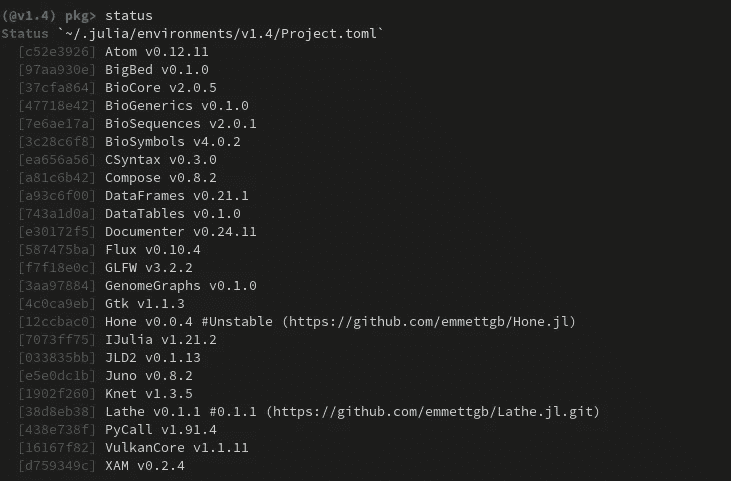
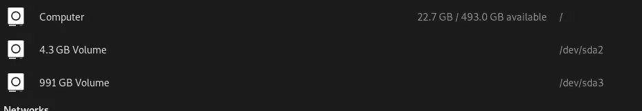
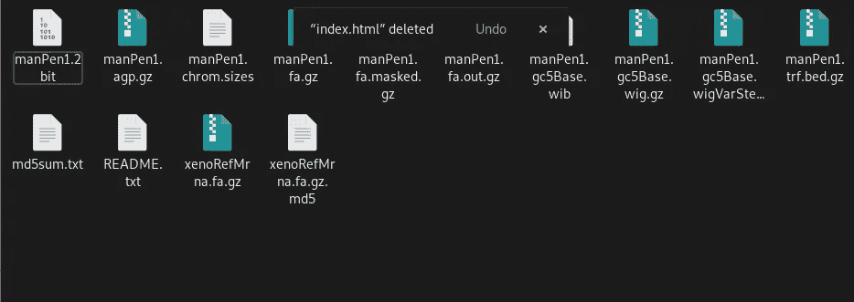
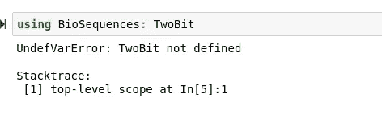
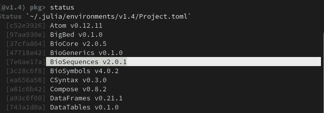
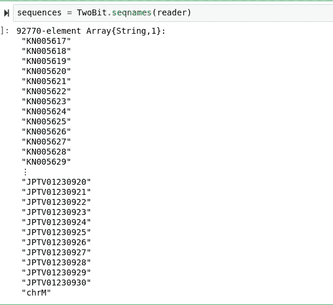

# 熟悉生物朱莉娅:朱莉娅的生物信息学

> 原文：<https://towardsdatascience.com/getting-familiar-with-biojulia-bioinformatics-for-julia-796438aa059?source=collection_archive---------50----------------------->

## 走出我的舒适区，用 Julia 语言尝试一门新的应用科学。


ulia 是一种伟大的编程语言，通常与它强大的统计分析和机器学习能力联系在一起。然而，许多人可能知道，Julia 实际上有一套相当成熟和成熟的其他应用科学软件包。一些著名的例子包括 Yao.jl 的量子模拟，JuliaAstro.jl 的天文学(我也很想看看这个)，QuantEcon.jl 的定量经济学，甚至 QuantumBFS.jl 和 QuantumOptics.jl 的量子物理学。有了 Julia 的这个丰富的科学计算生态系统，就很容易明白为什么许多科学家在业余爱好或工作上是朱利安。

这个软件包生态系统激起了我的兴趣，所以我决定利用最近由于病毒而有的空闲时间深入其中一个。毕竟，这是做一些有成效的事情的好时机，比如用我最喜欢的编程语言学习一门新的应用科学；因为我认为这很有成效。或许这也是学习更多生物学和基因组测序的最佳时机。明确地说，我在生物信息学领域没有任何领域知识，但我正在寻求在其中获得一个立足点，随着时间的推移，我可以通过实践和研究来提高。我也有兴趣看看我如何能够与 Julia 一起将机器学习和统计学应用于生物学，并交叉我非常感兴趣的两个应用科学。

# 添加包

为了使用 BioJulia 的软件包，我们当然需要添加它们。对于我的选择，我几乎去了 [BioJulia 的 Github](https://github.com/BioJulia) 并挑选了一些听起来有趣的库。在我的方法中我没有意识到的是，BioJulia 实际上有自己的包注册表。我没有通过 Pkg REPL 和 Github 单独添加软件包，而是决定使用注册表。在 Pkg REPL 中，我们可以使用以下命令添加 BioJulia 注册表:

```
registry add https://github.com/BioJulia/BioJuliaRegistry.git
```

然后我就可以像平常一样添加我的包了。这些包激起了我的兴趣:

*   生物序列. jl
*   GenomeGraphs.jl
*   BioSymbols.jl

然而，这种体验最终有点不像我添加我一无所知的包，而有点像糖果店的孩子……我还决定选择 XAM.jl 和 BigBed.jl。我们还需要 BioCore.jl，我继续选择了 BioGenerics.jl(不确定我是否需要它。)最后，我打开了一大堆 Github 页面。幸运的是，我在谷歌浏览器上启用了实验性的标签分组。


> 我喜欢这个功能。

```
pkg> add BioCore
pkg> add BioSymbols
pkg> add GenomeGraphs
pkg> add BioGenerics
pkg> add BigBed
pkg> add BioSequences
pkg> add XAM
```

令人惊讶的是，我的包列表看起来还不算太差！



当然，现在我要做的只是进行超出人类能力范围的研究，并从我刚刚添加的几个包中选择一个…

> 但是我全押了！

我偶然发现了这个视频，如果你想看的话:

这真的很有帮助，让我知道我可以从哪里开始学习，以便有一个坚实的知识基础来处理这些包。实际上，我最初并没有意识到我的机器学习、编程和统计领域知识会在这里应用到多大程度，当我知道她的第一个复选框完全为我所用时，我非常高兴。总而言之，她说在开始学习生物信息学时要做五件事:

## №1:编程基础

*   统计编程语言中的 Apt 能力。✔
*   熟悉 Bash。✔
*   能够将数据读入您选择的编程语言。✔
*   能够进行基本的统计检验(如 t 检验，卡方检验，f 检验)✔

## №2:做一个项目

*   找到一些有趣的数据，并将其读入您选择的编程语言中。
*   使用绘图库可视化数据。

**这里是她建议的获取数据的网站:**

[](https://genome.ucsc.edu/) [## UCSC 基因组浏览器主页

### 2000 年 6 月 22 日，UCSC 和国际人类基因组计划联盟的其他成员完成了第一个…

genome.ucsc.edu](https://genome.ucsc.edu/) 

**强调了理解所收集数据的重要性。**

她还建议机器学习——这一天我是一个快乐的年轻人。我不认为我意识到生物信息学和机器学习有多少共同之处。

## №3:带着工具旅行

> (我已经这样做了，我喜欢狩猎)

*   在做之前，找到与你想做的事情相关的行业标准工具。
*   一旦你有了更多的经验，拓展业务，甚至尝试创建自己的工具。

## №4:重复步骤 2 和 3

所以在看完这个简短的介绍后，我决定下一步最好的行动是开始我的第一个项目。

# 我的第一个项目

对于我的第一个生物信息学项目，我决定浏览前面提到的 UCSC 网站寻找数据。该网站不仅有大量的数据，而且有很多查看这些数据的好方法！今天，我只是读取数据，但在未来，我将探索它，用它进行可视化和测试，也许我甚至可以找到一些实用的机器学习用途。


我从这个网站上得到了一些我认为很酷的穿山甲数据。这样做有点奇怪，因为你被带到一个没有样式的 html 页面，花了 30 分钟谈论如何用 wget 获得一个文件……这当然很奇怪，并使找到 ftp://或 http://链接变得非常困难。这是我最后使用的一个:

```
wget --timestamping 
        'ftp://hgdownload.cse.ucsc.edu/goldenPath/manPen1/bigZips/*'
```

有趣的是，我的 512GB NVME 驱动器的存储空间非常低，因为我是一个数据囤积者，所以我非常害怕我可能会用这些数据填满我的 SSD，并需要四处清理。你知道我真正需要什么吗？

> NAS。



以下是我用 wget 从存储库中收集的文件:



现在，我将在这个目录中创建一个笔记本服务器。

```
cd ~/Projects/bioproject
jupyter-notebook
```

这是一个巨大的数据量，所以我决定尝试进入 Julia 的第一个是 manPen1.2bit。这是因为虽然我不知道如何将这些数据读入 Julia，但我知道我有一个包可以做到这一点。BioSequences.jl 中有一个 2 位阅读器，您可以在此处找到文档:

[](https://biojulia.net/BioSequences.jl/v1.0/io/twobit.html) [## 生物序列. jl

### 2bit 是一种二进制文件格式，用于存储由多个染色体序列组成的基因组。阅读…

biojulia.net](https://biojulia.net/BioSequences.jl/v1.0/io/twobit.html) 

BioSequences.jl 有一个存储在名为 TwoBit 的子模块中的类型。然而，当我试图导入它时，我遇到了一个问题…



> " TwoBit 未定义"

考虑到这一点，我决定检查我拥有的 BioSequences.jl 的版本:



在文档页面的左侧，我将版本更改为我电脑上的正确版本，然后搜索 TwoBit。这表明这个包不再是一个子模块，而是成为了它自己的包，所以我必须添加它:

```
pkg> add TwoBit
```

现在我们可以将它导入 Julia 并创建我们的阅读器:

```
using TwoBit
reader = TwoBit.Reader(open("manPen1.2bit", "r"))
```

现在，我们可以在我们的阅读器上使用 seqnames()方法查看刚刚读入的基因组序列:

```
sequences = TwoBit.seqnames(reader)
```



> 现在我们有了生物数据！

# 结论

那相当有趣！我非常兴奋地看到所有的基因组学，我将能够在朱莉娅身上进行实验。虽然我肯定还有很长的路要走，但我认为一些实践和反复会让我达到可以开始用核苷酸和 DNA 进行机器学习的地步。虽然这肯定不是我的知识领域或技能领域，但我真的认为我会喜欢基因组学，因为我一开始就很喜欢生物学。

我的下一步是尝试将数据可视化，并从中得出结论。我真的没有意识到这和我每天做的事情有多么相似。我很感激这一点，也非常兴奋地想了解更多。我在亚马逊上订购了一些可能有助于我了解这些海量信息的书籍，但现在，我只想熟悉与基因组学相关的工具和数据格式。