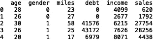
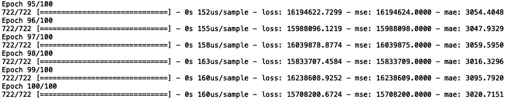
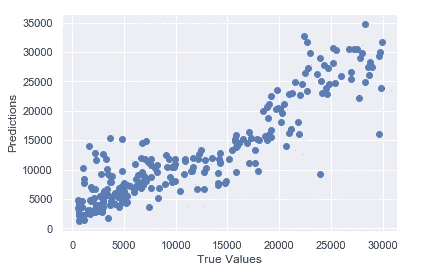
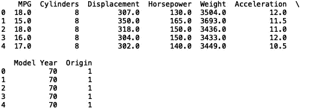
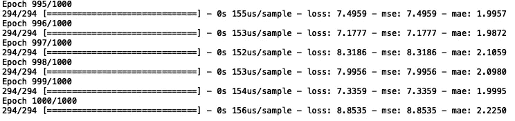
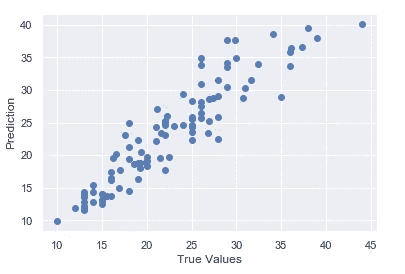

# 熟悉 Keras

> 原文：<https://towardsdatascience.com/getting-familiar-with-keras-dd17a110652d?source=collection_archive---------20----------------------->

## 两个神经网络回归问题


由[像素](https://www.pexels.com/photo/black-female-barista-together-with-colleague-using-laptop-at-work-4350039/)上的[赖爷子](https://www.pexels.com/@ketut-subiyanto)拍摄的照片

神经网络是由大脑连通性松散启发的计算系统。简而言之，神经网络对输入进行一系列转换，其结果在学习过程中被用作特征。Keras 是 python 中的一个开源库，可以轻松地对神经网络进行实验。Keras 提供了许多神经网络的构建模块，包括目标函数、优化器、激活函数、各种类型的层和许多附加工具。

在本帖中，我们将使用 Keras 库构建三个回归神经网络模型。

我们开始吧！

# 预测汽车的价值

在第一个例子中，我们将根据客户属性预测汽车销售的潜在价值。这些属性包括年龄、收入和性别等信息。数据可以在[这里](https://github.com/MGCodesandStats/datasets/blob/master/cars.csv)找到。

首先，让我们导入 pandas 并将数据读入数据框:

```
import pandas as pd 
df = pd.read_csv("cars.csv")
```

让我们打印前五行:

```
print(df.head())
```



接下来，我们将定义输入和输出变量。我们将使用“年龄”、“性别”、“英里数”、“债务”和“收入”来预测“销售额:

```
import numpy as np
X = np.array(df[['age', 'gender', 'miles', 'debt', 'income']])
y = np.array(df['sales'])
```

我们现在需要分割数据用于训练和测试。我们将从“sklearn”中导入“train_test_split”方法:

```
from sklearn.model_selection import train_test_split
```

然后，我们将测试集定义为随机样本(20%的数据):

```
X_train, X_test, y_train, y_test = train_test_split(X, y, random_state = 42)
```

接下来，我们需要重塑我们的标签系列:

```
y_train = np.reshape(y_train, (-1,1))
```

现在我们可以定义我们的模型了。首先，我们需要导入几个包:

```
from tensorflow.python.keras.models import Sequential
from tensorflow.python.keras.layers import Dense
```

接下来，我们定义一个顺序模型对象:

```
model = Sequential()
```

让我们建立一个简单的神经网络，它有一个输入层、一个隐藏层和一个输出层。我们还将在输入层和隐藏层使用“ReLu”激活功能。对于输出层，我们将使用线性激活函数。输入层和隐藏层将有 32 个神经元:

```
model.add(Dense(32, input_dim=5, kernel_initializer='normal', activation='relu'))
model.add(Dense(32, activation='relu'))
model.add(Dense(1, activation='linear'))
```

接下来，我们编译模型。我们将使用“adam”优化器和均方误差损失函数:

```
model.compile(loss='mse', optimizer='adam', metrics=['mse','mae'])
```

最后，我们拟合我们的模型。让我们以 100 个时期和 10:

```
model.fit(X_train, y_train, epochs=100, batch_size=10)
```



我们看到，与销售额相比，均方误差和平均绝对误差都非常低，这很好。

现在，让我们对测试集进行预测:

```
y_pred = model.predict(X_test)
```

接下来，我们可以可视化我们的结果。让我们导入 matplotlib 和 seaborn，并显示真实值与预测值的散点图:

```
import matplotlib.pyplot as plt 
plt.scatter(y_test, y_pred)
plt.xlabel('True Values')
plt.ylabel('Predictions')
```



对于第一次传球来说，这是一个不错的表现。通过进一步的超参数调整，我们可以做得更好。为了进一步提高性能，我鼓励您尝试一下层数、神经元、时期和批量大小。你也可以尝试一些其他的优化器，而不是“adam”，比如“rmsprop”或“sgd”。您还可以尝试使用规范化、标准化或最小/最大缩放来转换数据。

# 预测燃油效率

现在，让我们继续讨论另一个问题。在本例中，我们将以每加仑英里数来预测燃油效率。我们将使用马力、重量和气缸数量等信息作为预测模型的输入。数据可以在[这里](http://archive.ics.uci.edu/ml/machine-learning-databases/auto-mpg/)找到。

让我们导入数据并打印前五行:

```
df = pd.read_csv("auto-mpg.csv")
print(df.head())
```



接下来我们将定义我们的输入和输出。我们将使用“气缸”、“排量”、“马力”、“重量”、“加速度”、“车型年”和“来源”来预测每加仑英里数(MPG):

```
X = np.array(df[['Cylinders','Displacement','Horsepower','Weight',
                'Acceleration', 'Model Year', 'Origin']])
y = np.array(df['MPG'])
```

我们现在需要分割数据用于训练和测试。我们将测试集定义为数据的随机样本:

```
X_train, X_test, y_train, y_test = train_test_split(X, y, random_state = 42)
```

接下来，我们需要重塑我们的标签系列:

```
y_train=np.reshape(y_train, (-1,1))
```

现在让我们定义我们的模型。让我们从一个具有 64 个神经元的输入和隐藏层的神经网络开始。输入维度为 7，优化器为“adam”，损失函数为“mse”。我们还将使用 1000 个历元和 10:

```
model = Sequential()
model.add(Dense(64, input_dim=7, kernel_initializer='normal', activation='relu'))
model.add(Dense(64, activation='relu'))
model.add(Dense(1, activation='linear'))
model.compile(loss='mse', optimizer='adam', metrics=['mse','mae'], validation_split = 0.2)
model.fit(X_train, y_train, epochs=1000, batch_size=10)
```



现在，让我们来看看我们的结果:

```
y_pred = model.predict(X_test)
plt.scatter(y_test, y_pred)
plt.xlabel('True Values')
plt.ylabel('Predictions')
```



我们可以看到性能相当不错。我鼓励您尝试提高性能，或者尝试为其他预测问题建立神经网络模型。例如，您可能对使用神经网络来预测野火规模感兴趣，使用[美国野火数据](https://www.kaggle.com/tracy2533/us-wildfire)。

总之，在这篇文章中，我们介绍了两个回归问题的建模过程:预测汽车的价值和预测燃油效率。我们讨论了如何初始化顺序模型对象、添加层、添加神经元、指定优化器、指定时期和指定批量大小。我们还使用真实散点图和预测散点图进行了模型验证。我希望这篇文章对你有用。这篇文章的代码可以在 [GitHub](https://github.com/spierre91/medium_code/blob/master/two_nn_regression_problems.py) 上找到。感谢阅读，机器学习快乐！