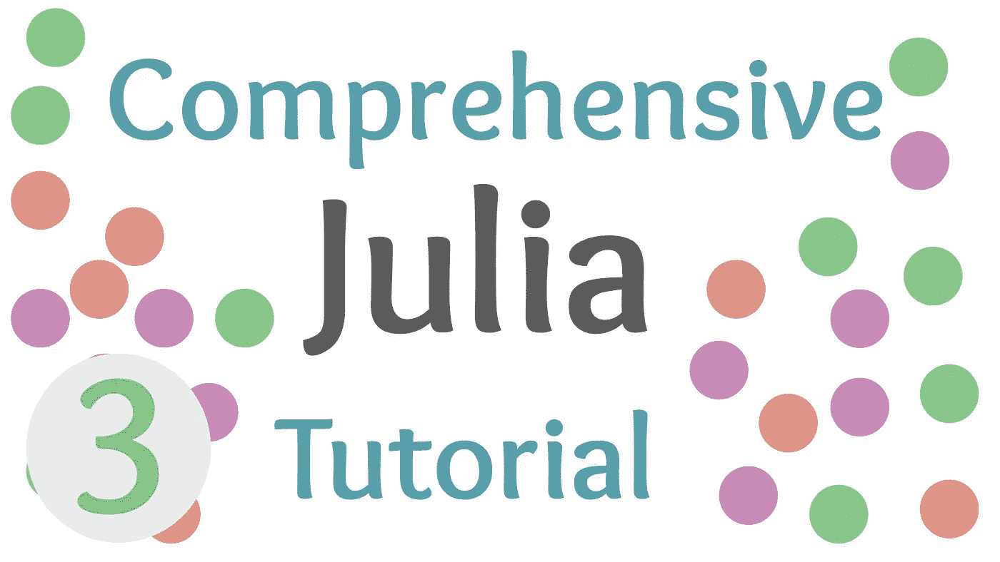
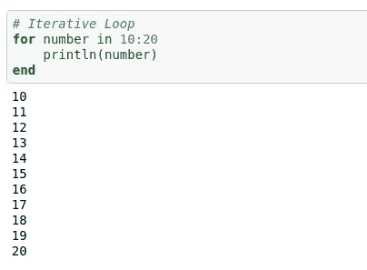
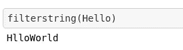

# 熟悉 Julia 中的循环

> 原文：<https://towardsdatascience.com/getting-familiar-with-loops-in-julia-cfbcc344728c?source=collection_archive---------22----------------------->

## 朱莉娅综合教程

## Julia 编程语言中循环和条件一起使用的介绍。



(图片由作者提供)

> [Github 回购](https://github.com/emmettgb/JuliaLessons)
> 
> [笔记本](https://github.com/emmettgb/JuliaLessons/blob/master/3/Comprehensive%20Julia%20Tutorial%203(%20Completed%20NB%20).ipynb)

# 介绍

如果一个人想进一步提高他们在软件工程方面的技能，仅仅通过观看是很难学会的。即使对文献或多媒体中的所有概念都了如指掌，如果不实际创建代码并查看代码如何与数据交互，也很难学习。大约十五年前，我一头扎进了 C++这门美丽的语言。为了学习 C++，我会花几个小时研究和复制粘贴代码，以找出它是做什么的。问题是我没有自己写代码，即使它是直接复制的。

需要澄清的是，我并不是说复制和粘贴代码是一件坏事，我总是从我以前的笔记本、我当前的项目，甚至是万维网上复制和粘贴代码片段。然而，很多工程是关于学习如何学习的。其中一部分是知道什么时候复制和粘贴，而不是什么时候你需要进一步研究材料。在我的 C++例子中，我记得使用了 STD 库和<

有趣的是，在地球上所有的语言中，我从未真正对 Python 感兴趣，直到大约三年前。虽然没错——它确实比 C++容易学得多，但我发现许多不同之处令人震惊。不管这种语言与其祖先相比有多简单，我发现自己陷入了一个陷阱，从谷歌上转移大量我并不真正理解的代码，这阻碍了我对这种新语言的学习能力。

所有这些证据都是为了支持一个说法:

> 想学编程，需要写代码。

我有一个导师，他参考了 Zed Shaw 的书《艰难地学习 Python》。这本书里的观点反映了我所讨论的内容的重要性，并且让我真正认识到，只要有互动，教育就变得简单多了。我也认为自己是一个视觉学习者，所以对我来说，这可以适用于任何试图学习计算机编程的人。

带着这些想法，我想如果我要提供具体和充分的教程，将一个人从一个绝对的初学者变成一个绝对的专业人士，那么我当然应该包括学生自己学习的资源。Github repo 中现在提供了笔记本的空副本，我坚持让较新的程序员自己键入代码！

# 环

在编程领域，开发人员可以使用一些不同的操作来处理数据。最常用的两种操作是循环和条件。循环是一种编程技术，它不仅允许检查、比较和计算类型内部的元素，而且是程序本身的基础。

编程中使用的循环主要有三种类型，一些独特的应用与特定的语言有关，例如 Julia 的语法循环。在 Julia 中，我们有以下循环应用程序供我们使用:

*   迭代循环
*   循环时
*   递归循环
*   语法循环

也就是说，语法循环**仍然使用迭代器，**只是在迭代器旁边使用语法表达式，用更多的表达式进行更快的循环——迭代也是如此。

让我们来看看一个迭代循环。迭代循环不同于递归循环和 while 循环，因为它们需要 dim 来循环。包含这种 dim 的类型的一个例子是数组。在数组的例子中，我们可以使用迭代循环连续地逐个循环每个元素。这也可以使用生成器类型来完成，它只是一种能够自己创建类型的类型。一个基本的例子是一个范围，其中范围类型生成一个位于范围的给定边界之间的 dims 数组。在这个例子中，我们将遍历一个由 10 到 20 之间的所有整数组成的数组:

```
**for** number in 10:20
    println(number)
**end**
```



(图片由作者提供)

while 循环将采用 bool 类型，这是一个读取 true 或 false 的条件，并将其用作循环的中断。只要不满足提供的条件，循环就会停止。而循环实际上是在机器上运行的大多数应用程序的基础。这是因为，只要你想让他们执行任务，他们就能始终如一地执行任务。当然，为了创建 while 循环，我们将使用关键字“while”，后跟一个条件。

```
*# while loop*
number = 1
**while** number <= 5
    number += 1
    print(number)
**end**
```

另一个要看的是打破循环的能力。这通常是在有条件的情况下完成的，但它使用了关键字“break”例如，虽然上面的循环将打印 1 到 6 之间的每个数字，但如果我们打破它，我们将得不到任何打印结果。

```
*# while loop*
number = 1
**while** number <= 5 break
    number += 1
    print(number)
**end**
```

最后，还有递归循环。递归以及何时使用它是一个完全不同的讨论。一般来说，递归会降低性能，但是，有许多函数式算法是利用递归的现代计算的基础。也就是说，在迭代和 while 循环不能完成工作的情况下，递归有一些很好的用途。阶乘的计算是递归在科学、高级计算中合理应用的一个完美例子。大多数递归算法将使用一个条件来决定是否应该用一个返回来中断一个循环。在阶乘函数中，我们要做的第一件事是检查我们想要阶乘的数字是否为 1。如果是这样的话，1 的阶乘当然只是 1，所以我们将返回 1。

```
**function** fact(n)
    **if** n == 1
        **return**(1)
```

这会打破我们的循环。考虑递归循环的一个很好的方法是想象函数本身既是循环又是循环的初始化。接下来，我们要把这个数乘以它本身的阶乘减一。这在数学上本质上是非常递归的，因此计算中的应用程序也应该是递归的。

```
**else**
        **return** n * fact(n-1)
```

只要满足 else 条件，这个函数就会调用自己。如果 n-1 不等于 1，那么它将再次调用自己——这就是递归。这是我们的最终结果:

```
**function** fact(n)
    **if** n == 1
        **return**(1)
    **else**
        **return** n * fact(n-1)
    **end**
**end**
```

> 有趣的事实:
> 
> Julia 的基本阶乘函数 factorial()实际上并没有使用递归来计算阶乘。相反，它使用查找表将值与相应的阶乘相匹配。这意味着大于一个数的值，在 Julia 的例子中是 22，是无法计算的。虽然这可能是一个缺点，但这也意味着数字小于 22 的运算要比其他情况快得多。

# 拉链环

zip 循环是一个很好的工具，当你想同时遍历多个数组的时候可以使用它。这对于阈值以及跨数组比较或操作值都很有用。Julia 中的 zip 语法与大多数语言略有不同，所以确保应用正确的语法很重要，使用 zip 作为方法，两个 dim 成对使用。

```
array2 = [30, 40, 50, 60]
**for** (i, w) in zip(array, array2)
    println(i, w)
**end**
```

# 把我们知道的和循环结合起来

现在我们已经有了循环、条件和函数的坚实基础知识，让我们把所有这些技能结合起来。

```
newarray = [] **for** element in array
    **if** element == 10
        append!(newarray, element)
    **elseif** element == 20
        append!(newarray, element)
    **end**
**end**
```

在这个例子中，我们循环遍历一个数组。如果它满足等于 10 的条件，那么我们将把它附加到新的空数组中。如果数字不等于 10 和等于 20，我们也将这样做。然而，如果它等于 10 和 20，那么它将只运行初始 if。

# 你自己试试！

> 你能创建一个函数来遍历字符串“Hello World”中的每个字母，并且只打印 H、W、l、r、o 或 D 中的一个字母吗？

我们要做的第一件事当然是定义我们的 hello world 字符串变量。

```
Hello = "hello world"
```

接下来，让我们写一个函数。

```
**function** filterstring(input)
```

该方法的下一步是遍历字符串中的每个字符。为此，我们可以用 for 循环调用字符串。

```
**for** character in input
```

接下来，我们需要检查该值是否在我们想要打印的值列表中。每当我们想要检查某个东西时，我们很可能会使用条件。对于这个例子，你可以使用 to 方法。其中一个是新手方法，另一个要简单得多。创建一个可接受值的列表并检查循环元素是否在该列表中，或者为每个单独的字符创建一个条件。无论哪种方式，都会产生相同的结果，坦率地说，只是简单和容易得多。

```
**function** filterstring(input)
    validchars = ['H', 'W', 'l', 'r', 'o', 'd']
    **for** character in input
        **if** character in validchars
            print(character)
        **end**
    **end**
**end**
```



(图片由作者提供)

# 结论

恭喜你！你正在成为一名优秀的 Julia 开发者。虽然事情在开始时看起来很复杂，但是您需要获得的大部分知识，至少在开始时，将会学习更多使用操作符、条件、类型和循环来处理数据的方法。虽然还有更多的东西需要学习，但是在这些教程中已经介绍了用 Julia 语言编程的基础知识。