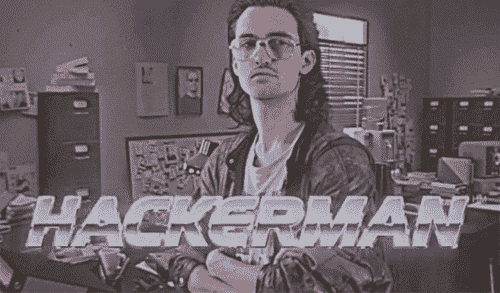

# 被解雇，在新冠肺炎中部被聘为数据科学家

> 原文：<https://towardsdatascience.com/getting-fired-and-hired-as-a-data-scientist-in-the-middle-of-covid-19-2c6626556cf8?source=collection_archive---------23----------------------->

来自 [Pexels](https://www.pexels.com/photo/photo-of-person-walking-on-deserted-island-934718/?utm_content=attributionCopyText&utm_medium=referral&utm_source=pexels) 的[汤姆·斯温南](https://www.pexels.com/@shottrotter?utm_content=attributionCopyText&utm_medium=referral&utm_source=pexels)的照片

## 困难时期找工作的心得。

我在 YC 的一家初创公司开始了机器学习方面的新工作，该公司的核心产品是一个让计算机视觉 ML 建模变得简单的平台。产品、同事、文化和薪酬都很棒。几个星期后，我们开始在家工作，就像几乎所有其他与疫情打交道的公司一样。即使在那时，一切都超级顺利。

有一天，我在 slack 上收到一条 CEO 发来的 DM，说他想和我聊聊天。我就知道会这样。我只是不知道该如何反应。我问原因，我明明知道。不知何故，这场尴尬的对话在 5-10 分钟内就结束了。

老实说，我并不感到太难过。我在那里只呆了一个多月。令人烦恼的是未来——又一次求职。找工作很累人。通常情况下，你可以轻松地寻找工作，因为你已经有了一份工作。你花时间去评估公司，评估你在公司的未来。我没有。像我这样的人越来越多，而空缺职位却比以往任何时候都少。

# 我的第一反应

我做的第一件事就是处理这个情况。打电话给几个密友告诉他们这个消息。真的帮我镇定了神经，减少了紧张的兴奋感。

很快我为我的下一次狩猎做了一些预感—

1.  我不能太挑剔。我需要尽快评估谁在招人。对于一份工作，我需要有一套清晰的最低**标准**。如此之少，以至于即使我拿掉一个，我的工作生活也会像地狱一样。
2.  既然我被解雇了，我就可以公开放出消息说我正在找工作。我希望我的朋友和网络能帮助我。他们做到了。因为我在 LinkedIn 上的一篇[帖子，我得到了这么多线索。](https://www.linkedin.com/feed/update/urn:li:activity:6653611218001072128/)
3.  从我过去的求职经历中，我发现哪些求职网站有用，哪些没用。但是要注意，许多工作列表是存在的，但是没有人去检查它们。它们正在恢复黑洞。
    *工作—* [iimjobs](https://www.iimjobs.com/) ， [hirist](https://www.hirist.com/) ， [angel](https://angel.co/)
    *浪费时间—* [Linkedin jobs](https://www.linkedin.com/jobs/?showJobAlertsModal=false)
4.  除了工作列表网站，我更依赖推荐。不要申请 LinkedIn 的工作，**使用搜索栏搜索带有*数据科学、机器学习等标签的内容。*** 通过帖子连接到发布空缺职位的人员。

# 冷静一下:)

完全披露——那段时间我住在孟买的家里。我有足够的积蓄来养活自己和家人。

我对我的失业很轻松。我知道一件事——整天申请工作是没有意义的。我有一个清晰的申请策略——每两天，浏览工作列表，找到任何感兴趣的东西，然后申请。反正我在 LinkedIn 上很活跃。我留意了提到任何空缺职位的帖子。只需将它加入书签。在求职申请上浪费时间没有意义。我能做的最好的事就是耐心等待。对于每一份重要的申请，找一个可以推荐你的人。90%的时间都在工作。

同时，我养成了许多好习惯。我开始锻炼，玩很多室内和室外游戏(在我的社会里)，对瑜伽感兴趣。

在技术方面，我决定学习新的东西。我一直有一个遗憾，就是没有学习数据结构和算法。至少有 4 次我开始学然后放弃了。这次我屁股下面着火了。任务完成。

[https://giphy.com/explore/hacker-man](https://giphy.com/explore/hacker-man)

接下来，我真的很怀念孟买公司过去组织的技术聚会。我喜欢行业层面的讨论和结交新朋友。在这个失业+禁闭的时期，我决定和网上的人联系。这是最好的！我被介绍给很多人。不仅仅是数据科学，还有时尚、管理等等。

# 那么面试呢？

让我们看看。我完成了 6 次 T21 的任务，10-15 次面试，以及数不清的申请。我将突出重要的几个。

## 排名第一的大型食品订购公司

1.  *职位——ML 工程师*
2.  *公司类型——大型创业公司*
3.  *状态—第一轮后被拒绝*
4.  *来源— LinkedIn 推荐*

过程—

通常，当人力资源代表给你打电话寻求机会时，他们会问你具体的技能、目前的薪水和工作地点。但这次不同。她很好地向我解释了角色和问题陈述。直到她问了一些琐碎的人事细节，我才意识到她是一名人事。她问我知不知道 Scala。我没有。她以一种非常合法的方式解释了 Scala 对于他们的系统是多么的重要。印象深刻！

数据科学家/ML 工程师这两个术语可以互换使用。不在这里。整个面试基本上都是 ML 系统工程。我们只讨论了工程部分，没有讨论科学部分。我完全没有准备好。

总的来说，这是一次积极的学习经历！

危险信号——无

## #2 大型美容和时尚电子商务公司

1.  *职位—数据科学家*
2.  *公司类型——最近资助的大型创业公司*
3.  *状态—在两轮和一次分配后被拒绝(因为蹩脚的原因)*
4.  *来源——一名员工在 LinkedIn 上联系*

过程—

采访者不是数据科学家。他是产品经理。该公司外包了大量的分析工作。第一轮很标准。谈到我过去的工作。他给了我一个任务，是关于产品描述的数据集。目标是为搜索查询排列产品。努力工作并取得了好成绩。在下一轮中，向他介绍了该方法，并展示了一些有趣的结果。

他没有问我任何关于我的方法。相反，有人问我能做些什么改进。我解释了我关于使用过去的购买和协作过滤等方法的想法。我得到的只有*嗯嗯……*

后来，当我询问我的申请情况时，他打电话告诉我，我被拒绝了。酷毙了。我要求反馈。他说了两件事—

1.  我不是 CS 出身— *为什么你在让我做作业之前不看我的简历或者问我？？？？*
2.  我们需要资深的人— *我已经在简历上明确提到我的经历和日期了！！数数并不难。*

危险信号—

1.  面试官不适合。
2.  在讨论作业时，他没有质疑我的方法。我知道他没有技术知识。从业务或者产品角度还是可以问很多的。

## #3 一家小型分析公司

1.  *职位—数据科学家*
2.  *公司类型—分析公司(基于服务)*
3.  *状态——我拒绝了他们*
4.  *来源——一名员工在 LinkedIn 上联系*

过程—

人力资源部打电话来了。询问关于我的标准信息。然后事情变得很奇怪。问我父亲的生意。我在想为什么？这合法吗？我说了那是什么。然后她问我爸爸挣多少钱？是时候说-

[https://cnb.cx/2KulS1E](https://cnb.cx/2KulS1E)

危险信号—

你知道的。

顺便说一句，要知道

 [## 非法面试问题——不要问应聘者什么

### 非法工作面试问题从求职者那里获取信息，这些信息可能被用来歧视…

www.betterteam.com](https://www.betterteam.com/illegal-interview-questions) 

## #4 一家 SaaS 公司

1.  *职位—数据科学家*
2.  *公司类型——Saas 公司*
3.  *状态—报价已收到。我拒绝了他们。*
4.  *来源——一名员工在 LinkedIn 上联系*

过程—

总共 4 轮，1 次任务。这家公司在印度并不出名，至少在我的网络中是这样。经过跟踪，我发现了他们的产品，员工背景。不过没什么特别的。面试是标准的。解决了任务，并在其中一轮中与数据科学家进行了讨论。在随后的几轮中与高层管理人员进行了交谈。主要是案例研究。他们最终提供了一份不错的薪水。

我仍然对这家公司感到有些不安。没有任何危险信号。除了一件事——在作业讨论中，我提到了一些我无法在截止日期内尝试的方法。她说，“嗯，24 小时的期限在这里很常见。”然后一笑置之。当时我并没有过多地去理解它。

我看了 glassdoor 上的评论。积极的看起来是假的。消极的人有共同的痛点。我决定联系前雇员。最后，我出于绝望决定不打错电话，拒绝了他们的提议。

危险信号—

1.  可疑文化
2.  一致的负面评价

## #5 一家位于硅谷的食品科技创业公司

1.  *职位—数据科学家*
2.  *公司类型——A 轮募集*
3.  *状态——在分配后出现幻影(在 4-5 次提醒后)。*
4.  *来源—匹配天使*

过程—

在我之前找工作的时候，我们在安吉尔上匹配过。因为我在比赛结束后得到了一份工作邀请，所以我们没有继续。这次我联系了他们是否还在招人？他们给了我一个任务。这是一个多标签分类任务。这似乎是他们正在解决的问题之一。

我在这项任务中工作最努力。无法完成所有子任务。然而，这足以表达我的努力。

我要求下周的审查和状态。他们说过几天。同样的动作重复 4 次以上。每次都有不同的蹩脚借口。

很可能，他们从申请人那里得到了解决问题的方法。

危险信号—

1.  一连串的借口。除非你要求，否则人力资源部不会与你联系。

# 是什么让我保持理智？

虽然我说我对裁员感到非常冷静，但当我发现顶级公司都在裁员 1000 人时，我开始思考——我要如何同时与所有这些公司竞争？这么少的空缺也是这样吗？我得加快速度。

在这两个月里，我的朋友和家人给了我很多支持。朋友们经常来看我，我的家人给了我足够的空间来解决我的问题。

我第一份工作的 CEO 一听到我的消息就让我回来。我也确保在身体和精神上照顾好自己。

# 我学到了什么？

对我来说，处理不确定性的机会并不多。这段艰难的经历教会了我如何应对。有关心你的人让这种经历变得可以忍受。

尽快开始建立一个强大的网络。与人们联系，询问他们当前的项目，你如何帮助他们。尽可能多交朋友。意识到当你是一个团体的一部分时，你总是更强大。

我都不敢想象背负沉重助学贷款的应届毕业生有多难。如果你是一个很难找到工作的求职者，请在 LinkedIn 上联系我，并说明我可以如何帮助你(当然是免费的)。请具体说明你的问题。在这里找到我。