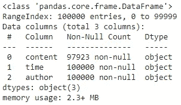

# 通过 Discord 服务器获得群体行为洞察

> 原文：<https://towardsdatascience.com/getting-group-behavior-insights-through-discord-servers-732e4941d8f8?source=collection_archive---------27----------------------->

## 分析不和谐信息数据如何提供关于社交媒体行为和社交团体的有价值的见解。


[耐嚼](https://unsplash.com/@chewy?utm_source=unsplash&utm_medium=referral&utm_content=creditCopyText)在 [Unsplash](https://unsplash.com/s/photos/friend?utm_source=unsplash&utm_medium=referral&utm_content=creditCopyText) 上拍照

# 介绍

在浏览互联网的时候，社交媒体基本上是不可避免的。几乎每个人都因为各种原因使用至少一个社交媒体平台，它们通常代表了一个人社交生活的重要部分。

正是因为这个原因，分析社交媒体平台中的行为数据是了解人们，甚至是群体的一种很好的方式。在基于聊天的社交媒体平台上，这种群体洞察变得更加明显。

出于这个原因，我将向您展示如何获得 Discord、消息传递数据，并为分析做好准备，以及使用一点点。您可以跟随包含本文代码的 [google colab。](https://colab.research.google.com/gist/ThiagoFPMR/a8403f3ae1ecc8557b136d25e90d475f/discord-analysis.ipynb)

# 数据

在一个基于聊天的平台中，特别是像 Discord 这样的服务器被分成多个频道的平台，在制作数据集时，我们可以跟踪许多变量。

对于我将在这里使用的数据，所有消息都来自同一个通道，这意味着我们不需要跟踪消息被发送到哪里。对于我们将要进行的分析来说，所有重要的变量是消息的作者、消息发送的时间以及消息本身的内容。

我们将使用的数据框，总共包含 3 列。

# 在开始之前

当处理这样的数据时，如果这些数据包含其他人的姓名(在本例中是用户名)，而这些人不一定允许您公开他们的信息，您应该始终匿名化这些数据，以避免任何不必要的问题，同时也尊重他们的隐私。

# 准备数据

在我们开始分析之前，我们必须确保我们的数据包含我们需要的一切。

使用 Pandas 查看文件概述后，您应该会注意到数据集中有丢失的值。其背后的原因是，在这个数据集中，在消息中发送的图像和嵌入被表示为 NaN 值。

```
data.info()
```



使用 **DataFrame.info()** 方法获得数据集的概览。

由于这些消息只代表了数据集的一小部分，对我们没有任何用处，我们可以简单地丢弃它们。我们还应该将 time 列转换成 *DateTime* 以便更容易地处理日期。

一旦我们解决了这个问题，我们就可以专注于做一些更好的工作来分析更多的列。例如消息中包含什么表情或者每条消息有多少单词。

除了我们都习惯的常规表情符号，discord 还有专属的公会表情符号，可以是动画的，也可以不是。为了表示所有这三种表情，我们将为每一种表情添加一个单独的列，每一列都由包含消息中发送的该类型的所有表情的数组组成。

要创建这些数组，我们可以使用正则表达式来识别哪些消息包含表情，然后将它们添加到各自的列中。

我利用 python 的表情库更容易地从消息中提取表情，因为并非所有表情都符合我使用的正则表达式模式。

之后，我们只需将字数统计列添加到数据框中，就可以开始处理数据了。

# 分析数据

有了转换后的数据集，我们可以开始分析，以深入了解我们的消息传递历史数据。

在经历了所描述的整个过程之后，数据帧的前 5 行。

例如，我们可以进行的一种可能的分析是，观察服务器中的用户活动在整个数据集内的表现，该数据集包含来自该服务器的一年多的信息。

然而，在这样做的时候，我们遇到了一个问题，即有太多的作者，他们中的许多人缺乏足够的数据来为分析做出任何实质性的贡献。

这是因为数据还包括来自服务器中不活动的机器人和用户的消息，因此不会告诉我们关于整个群体的任何信息。

```
fig = px.histogram(data, x='author', title='Messages Sent Per Author', labels={'author':'Author'})fig.update_layout(title_font_size=30, template='plotly_white')fig.show()
```

列出的大多数作者在服务器历史上几乎没有发送过消息。

通过设置一个最小的消息量作为基线，去掉发送少于这个数量的作者，我们可以过滤掉那些没有贡献足够数据的作者。

有了更少的作者，他们都贡献了大量的消息，我们最终可以绘制一个图表，更好地表示服务器中用户活动随时间的变化。

```
fig = px.histogram(data, x='time', color='author', opacity=0.5, title="User Activity Over Time", labels={'time':'Date'})fig.update_layout(barmode='overlay', title_font_size=30, template='plotly_white')fig.show()
```

通过缩小时间窗口，您可以深入了解服务器最近的活动情况，甚至可以发现服务器在一天中的哪些时段最活跃。

我们还可以画出每个作者发送的消息总量，看看谁是最活跃的，以及服务器成员在频率上如何比较。

```
fig = px.bar(x=data.author.value_counts().index, y=data.author.value_counts(), color=data.author.value_counts().index, title='Messages Sent per User', labels={'x': 'Author', 'y': 'Messages Sent'})fig.update_layout(title_font_size=30)fig.show()
```

请注意，上图计算了数据帧中包含的所有已发送消息。您还可以限制时间范围以获得更多的最新数据，而不是考虑这么大的时间窗口。

并且，通过对数据集进行简单的过滤，您可以用同一个图来表示包含某个字符串但仍被作者划分的消息的数量。

```
term = 'LOL'
term_data = data[data.content.str.contains(term)]# The exact same plot, but replaced data by term_datafig = px.bar(x=term_data.author.value_counts().index, y=term_data.author.value_counts(), color=term_data.author.value_counts().index, title=f'Messages Containing "{term}" Per User', labels={'x': 'Author', 'y': 'Messages Sent'})fig.update_layout(title_font_size=30, template='plotly_white')fig.show()
```

另一种可能的分析是绘制和比较每个用户发送的表情的总量，同时也根据表情的类型对它们进行划分，例如，这可以指示组中谁有 nitro，因为只有那些有 nitro 的用户才能发送动画表情。

然而，对于这个图，首先，我们需要将数据框转换成“整齐”的格式，这就是 Pyplot 用于条形图的格式，就像我们将要绘制的这样。我们可以通过使用 ***pd.melt()*** 方法来做到这一点，这是一种非常有用的方法，可以轻松地将数据帧转换为“整齐”的格式。

将 emote 列从数组转换为整型，并应用 ***pd.melt(*** )方法。

```
fig = px.bar(data_line, x ='author', y='value', color='variable', labels={'value':'Emotes Sent', 'author':'Author'}, title="Emotes Sent per User")fig.update_layout(title_font_size=30, template='plotly_white')fig.show()
```

# 结论

在所有这些例子之后，应该很明显，从聊天数据中可以获得很多潜在的洞察力，比如来自 Discord 服务器的聊天数据。

从洞察某人的日常行为到他们作为更广泛群体的一部分的行为，来自社交媒体的数据是发现人们新事物的最佳方式之一，这就是为什么它值得更多关注

# 参考

本文的灵感来自以下两个处理类似数据分析的仓库，但分别用于 WhatsApp 和 Telegram:

[](https://github.com/kurasaiteja/Whatsapp-Analysis) [## kurasaiteja/Whatsapp-分析

### GitHub 是超过 5000 万开发人员的家园，他们一起工作来托管和审查代码、管理项目和构建…

github.com](https://github.com/kurasaiteja/Whatsapp-Analysis) [](https://github.com/expectocode/telegram-analysis) [## 预期代码/电报分析

### 一个处理 telegram-history-dump Venn _ userlist . py 输出的工具:比较聊天之间的用户重叠…

github.com](https://github.com/expectocode/telegram-analysis)