# 从谷歌地图获得关于企业和位置的见解

> 原文：<https://towardsdatascience.com/getting-insights-about-businesses-and-locations-from-google-maps-3f8a5739059a?source=collection_archive---------14----------------------->

## 让我们看看如何利用 Python 和 Selenium 的能力来挖掘 Google Maps 中关于感兴趣的企业和位置的数据

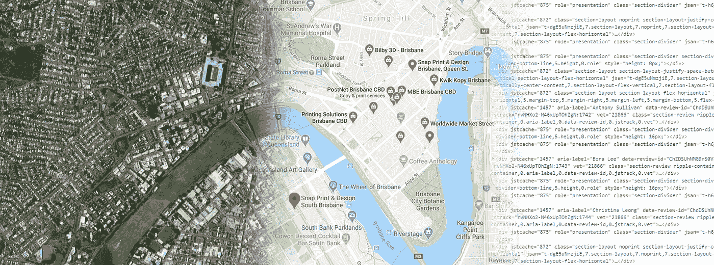

谷歌地图充满了你感兴趣的任何类型的商业或位置的有用数据。在这篇循序渐进的文章中，我将使用 **Python** 和 **Selenium** 从其中提取关于某个企业(或位置，我们将研究 3 个主要示例)的数据，然后以快速和自动化的方式对与之非常接近的类似或竞争企业进行同样的操作。

这个操作的输出是一个包含有用数据的**数据帧**(名字、商业类型、星级、联系信息、坐标、流行时间等。)我们可以用它来获得关于业务/位置及其周围环境的许多见解。

如果你想了解你的竞争对手的情况，这将是很有用的，但如果你想快速生成某个城市某类企业的列表，这也是很有用的。它还适用于历史地标、公园和各种景点，而不仅仅是企业，我们将在后面的第三个也是最后一个示例中看到。

您可以通过在我的 [**GitHub 存储库中下载 Jupyter 笔记本来阅读本文，这里是**](https://github.com/kelmouloudi/MediumArticle-GoogleMaps) 、以及 CSV 格式的提取数据。

*ps:我不隶属于任何企业。本文中的示例是随机选取的，仅用于说明和教育目的。*

# 软件包和设置:


插图作者:明蒂·rawpixel.com

我们将需要[**Selenium**](https://pypi.org/project/selenium/)python 包来执行数据抓取。如果您还没有它，您可以使用 pip: `pip install selenium`或`conda install selenium`安装它，如果您使用的是 Anaconda 发行版的话。

为了与浏览器互动，我们还需要一个**网络驱动**(这里我们将使用 Chrome)，所以你必须 [**到这里并把它**](https://chromedriver.chromium.org/downloads) 下载到你的机器上(确保它与你当前的 Chrome 版本兼容) :

```
from selenium import webdriver
```

我们还需要 Selenium 中几个有用的类。我们将在这里导入它们:

```
from selenium.webdriver.common.by import By
from selenium.webdriver.support.ui import WebDriverWait
from selenium.webdriver.support import expected_conditions as EC
from selenium.webdriver.common.keys import Keys
from selenium.common.exceptions import NoSuchElementException, TimeoutException, ElementNotInteractableException, ElementClickInterceptedException
```

现在我们来获取 [**tqdm**](https://github.com/tqdm/tqdm) ，一个必不可少的进度条 python 包。估计你的代码的 web 抓取部分要花多少时间是非常有用的(我用 tqdm_notebook 是因为我在 Jupyter 笔记本上工作。在 IDEs 中你应该做`from tqdm import tqdm`，然后用`tqdm`代替`tqdmn`):

```
from tqdm import tqdm_notebook as tqdmn
```

除此之外，我们还需要 [**Pandas**](https://pandas.pydata.org/) 来读取和操作数据集，以及 [**Numpy**](https://numpy.org/) 来处理空值:

```
import pandas as pd
import numpy as np
```

同样，让我们导入 [**Matplotlib**](https://matplotlib.org/) 和 [**Seaborn**](https://seaborn.pydata.org/) 来做数据可视化:

```
import matplotlib.pyplot as plt
import seaborn as sns
```

为了在地图上显示我们的企业/位置，我们需要 [**叶子**](https://pypi.org/project/folium) 。如果没有叶子，使用`pip install folium`或`conda install -c conda-forge folium`安装:

```
import folium
```

最后，我们需要内置的 python 模块 [**time**](https://docs.python.org/3/library/time.html) 和 [**re**](http://localhost:8888/notebooks/Desktop/Data%20Science/Getting%20insights%20about%20businesses%20and%20locations%20from%20Google%20Maps.ipynb) (第一个模块在元素加载时停止代码一段时间，第二个模块使用 [**RegEx 或正则表达式**](https://regexr.com/) 从模式的原始文本中提取数据):

```
import time, re
```

这是可选的，只是为了给我们的数据帧添加一些 CSS 样式:

```
%%HTML
<style>.dataframe th,td:first-child{background: rgb(63,87,124);background: linear-gradient(180deg, rgba(63,87,124,1) 0%, rgba(101,124,161,1) 100%, rgba(0,212,255,1) 100%);;
padding: 10px;font-family: monospace;font-size: 110%;color: white;border:1px dashed white;text-align:left !important;
-moz-border-radius: 3x;-webkit-border-radius: 3px;}.dataframe thead{border:none; !important;}</style>
```

# 澳大利亚布里斯班的打印店:


图片由布拉德·斯克鲁斯——Flickr.com(CC)拍摄

Ryan 是一名获得印刷行业管理文凭的应届毕业生，他正在澳大利亚布里斯班找工作。他刚刚把他的简历送到了打印店 **Kwik Kopy Brisbane** (因为它碰巧离他家最近)。他还能在城市的什么地方找到合适的工作？让我们帮帮莱恩。

我们要做的第一件事是去谷歌地图搜索该企业的名称，或者我们可以在浏览器地址栏的`www.google.com/maps/search/`后添加名称。然后，如果我们单击业务类别，这里是`Print shop`(见下图)，我们将获得不同打印相关业务的列表。我们航行的时间越长，就离我们最初的打印店越远:

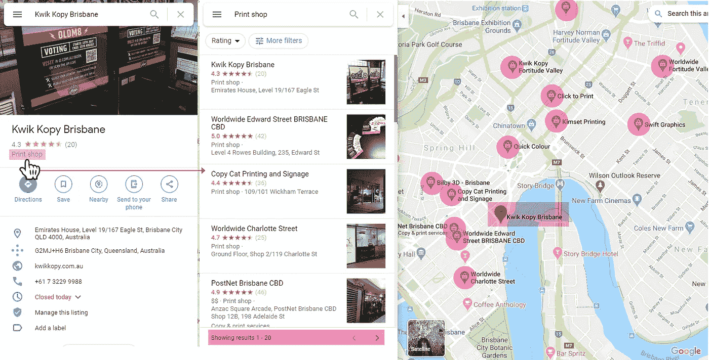

在编写为我们进行网络搜集的代码之前，让我们先列出我们将经历的所有步骤:

**1。绕场比赛**:

*   答:取我们公司的名字，加在`www.google.com/maps/search/`之后，然后访问那个网址
*   b:点击业务类别
*   c:获取参赛者的姓名和地址，然后点击下一步按钮`>`。我们反复这样做，直到我们对有多少竞争者感到满意。这一步的输出是一个竞争对手的列表(名字和地址)，让我们把它命名为`competition`(名字本身不足以唯一地标识一个企业，这就是为什么我们还要捕获地址)

**2。提取数据**:

*   d:获取`competition`的第一个元素并将其添加到`www.google.com/maps/search/`之后，然后访问该 URL
*   e:提取名称、业务类别、平均评级、评论总数、地址、电话号码和网站，然后从`competition`开始使用另一个元素再次循环到步骤 D，直到结束。

下面是这样做的代码:

执行这段代码后，您将看到一个 Chrome 窗口打开，我们之前概述的步骤会自动一个接一个地执行。有时，**谷歌地图会将一个企业名称/地址与另一个**混淆，并给你一个选择:

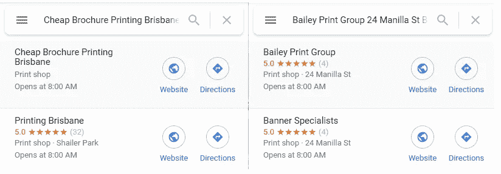

出现这种情况时，只需在搜索栏中点击最接近查询的业务，代码就会正常继续。你也可以忽略它，由于有了`try`和`except`模块，代码会在 25 秒后自动跳到`competition`中的下一次迭代。

如果一切按计划进行，让我们用提取的列表制作一个熊猫数据框架。姑且称之为`PS`打印店:

```
PS = pd.DataFrame(data={'full_name':full_name, 'rating':rating, 'total_ratings':total_ratings, 'business_category':business_cat, 'address':address, 'phone':phone, 'website':website, 'latitude':lat, 'longitude':long})
```

这是我们的数据框架，包含 Kwik Kopy 和大约 100 家竞争对手的信息:

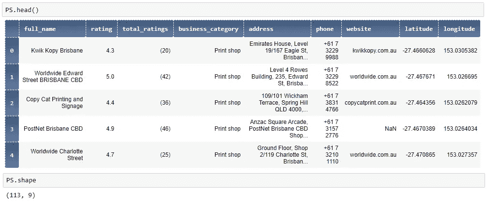

此时，最好将该数据帧保存为 CSV 文件以便安全保存:

```
PS.to_csv('print_shops.csv', index=False)
```

下次我们打开笔记本时，我们所要做的就是读取 CSV 文件，而不是再次运行 web 抓取代码:

```
PS = pd.read_csv('print_shops.csv')
```

经过一些数据清理和准备(见 [Jupyter 笔记本](https://github.com/kelmouloudi/MediumArticle-GoogleMaps))，我们最终得到了 84 个不同的企业，Ryan 在找工作时可以考虑。还不错！但是它们在城市中有多分散呢？要回答这个问题，让我们将它们绘制出来，并在单击标记时显示的弹出窗口中添加它们的信息:

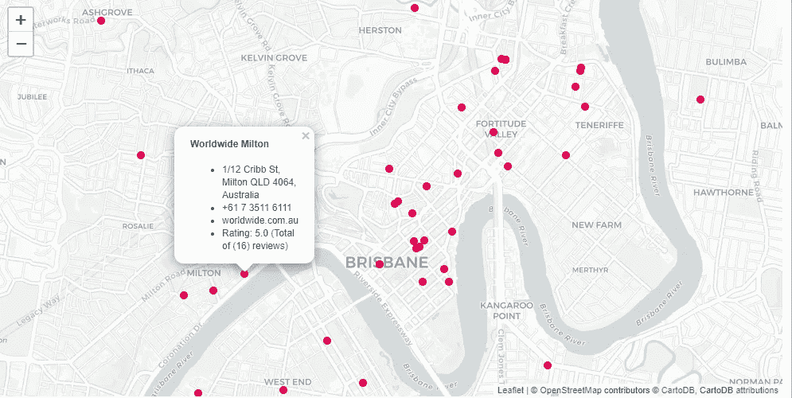

你可以在这里下载这个 HTML 格式的地图: [ps_map.html](https://github.com/kelmouloudi/MediumArticle-GoogleMaps)

现在，这看起来更像是一个求职冒险的路线图！瑞安可以开始联系离他家最近的企业，如果需要的话，可以向外扩展。

在这个用例中，平均评级和评级总数对 Ryan 来说意义不大。在下一个例子中，我们将探索这两个变量更重要的行业:我们将在生机勃勃的格拉斯哥寻找最好的牛排馆。

# 苏格兰格拉斯哥的牛排馆:


戴夫·谢伊——Flickr.com(CC)摄影

Moira 想请她的男朋友吃一顿美味的牛排晚餐作为生日礼物，但她不知道具体去哪里。她在一个专门的博客上搜索，发现**迷你烧烤牛排店**是格拉斯哥最好的牛排店之一。让我们帮助 Moira 决定哪家牛排馆最适合这个场合，因为她认为好的葡萄酒(或鸡尾酒)和音乐是美好体验的必备条件。

我们将遵循与之前完全相同的步骤，除了添加两种新类型的有用信息:**价格范围**(从`$`到`$$$$`)和**评论主题**(数字指有多少评论谈到了该主题) :


下面是我们将使用的代码(有时谷歌地图根本不显示评论主题。如果发生这种情况，只需关闭 Chrome 窗口，停止代码并再次重新运行单元格) :

现在让我们用提取的列表制作一个数据框架。我们将它命名为`SH`牛排餐厅:

```
SH = pd.DataFrame(data={'full_name':full_name, 'rating':rating, 'total_ratings':total_ratings, 'business_category':business_cat, 'price_range':price_range, 'address':address, 'phone':phone, 'website':website, 'review_topics':review_topics, 'latitude':lat, 'longitude':long})
```

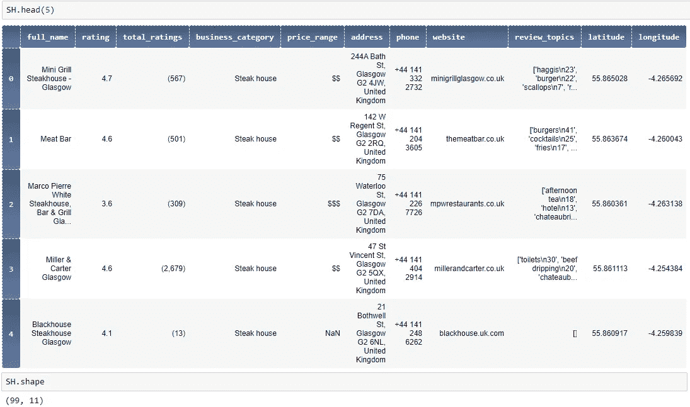

让我们来看看我们得到的业务类别:

```
SH.business_category.value_counts()
```

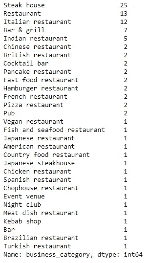

我们希望只保留那些名称中带有“牛排”或“烧烤”字样的、**酒吧、&烧烤店、**餐馆。让我们称这个新的数据框架`SBR`(用于牛排店、酒吧&烧烤店和餐馆) :****

```
steak_houses = SH[SH.business_category == 'Steak house']
bar_grills  = SH[SH.business_category == 'Bar & grill']
restaurants  = SH[(SH.business_category.str.contains('Restaurant', case=False)) & (SH.full_name.str.contains('steak|grill', case=False, regex=True))]SBR = pd.concat([steak_houses, bar_grills, restaurants])
```

这就让出了 47 个名额。现在让我们帮助 Moira 从这些高级餐厅中挑选最划算的。如果你还记得的话，莫伊拉想要一次享受美酒、鸡尾酒和音乐的美好经历。让我们来看看有一个或多个这些要求的地方的`review_topics`:

```
list(SBR[SBR.review_topics.str.contains('\Wwine|cocktail|music', case=False, regex=True)].review_topics)
```


正如我们在上面看到的，16 个不同的地方至少有 3 个关键词中的一个。为了能够做出选择，让我们添加 3 个新列`wine`、`cocktails`和`music`，包含这些关键词被评论提及的次数(这是在提取的`review_topics`中位于`\\n`之后的数字)。我们没有统计这些词被提到了多少)。我们将使用 RegEx 提取我们想要的信息:首先我们用`wine......|$`提取部分`'wine\\n8'`，然后我们用`\d+|$`提取数字。如果模式不存在，这里确保我们得到一个空值:

```
wine = []
for i in SBR.review_topics :
    wine.append(re.findall('\d+|$', re.findall('wine......|$', i)[0])[0] )SBR['wine'] = winecocktail = []
for i in SBR.review_topics :
    cocktail.append(re.findall('\d+|$', re.findall('cocktail......|$', i)[0])[0] )SBR['cocktail'] = cocktailmusic = []
for i in SBR.review_topics :
    music.append(re.findall('\d+|$', re.findall('music......|$', i)[0])[0] )SBR['music'] = music
```

3 个新列`wine`、`cocktail`和`music`是字符串类型。让我们将它们转换成数值(但在此之前，让我们用 0 替换空值) :

```
SBR.wine = SBR.wine.replace('', 0)
SBR.cocktail = SBR.cocktail.replace('', 0)
SBR.music = SBR.music.replace('', 0)SBR.wine = SBR.wine.astype(int)
SBR.cocktail = SBR.cocktail.astype(int)
SBR.music = SBR.music.astype(int)
```

现在让我们添加一个名为`score`的新列，它是三个新变量`wine`、`cocktail`和`music`的总和:

```
SBR['score'] = SBR.wine + SBR.cocktail + SBR.music
```

现在让我们按`score`对`SBR`数据框进行分类，假设机构满足这两个条件:

*   `wine`和`cocktails`中至少有一个不为空
*   对于`music`，它没有空值

```
SBR[((SBR.wine != 0)|(SBR.cocktail != 0)) & (SBR.music != 0)].sort_values(by='score', ascending=False)
```

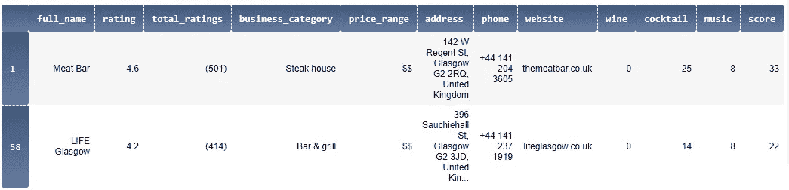

范围缩小到两个地方了！这对莫伊拉来说已经足够了，但是不行！她希望有一种方法来设想所有的选择，以便做出一个好的选择。好吧，莫伊拉，如你所愿！

让我们将变量`rating`(代表平均升值幅度)`total_ratings`(表示受欢迎程度)和`price_range`(表示一个地方的可负担程度)考虑在内，并将`SBR`中的所有机构绘制在一个网格上。

但在此之前，我们需要删除`total_ratings`中的括号和逗号，将系列转换为数字，并将`price_range`中的美元符号改为更有意义的符号(美元符号出于某种原因会导致错误) :

```
SBR.total_ratings = SBR.total_ratings.replace('(\(|\)|,)', '', regex=True)SBR.total_ratings = SBR.total_ratings.astype(int)SBR.price_range = SBR.price_range.replace({'$$':'Affordable', '$$$':'Pricy' })
```

现在是网格。我们将使用一个散点图，X 轴是`total_ratings`，Y 轴是`rating`。颜色会根据`price_range`变化。我还添加了注释，以显示牛排馆**、【迷你烧烤牛排馆】(MG)** (博客推荐)的位置，以及获得良好评分的两个地方，**、【肉吧】(MB)** 和**、【生活格拉斯哥】(LG)** :

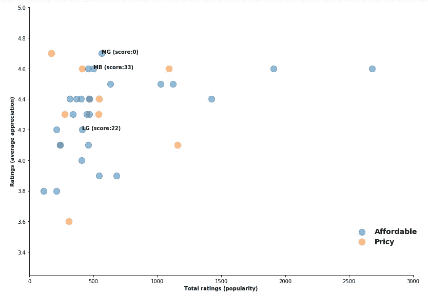

结果是，博客推荐的“迷你烧烤牛排屋”(Mini Grill steak house)(MG)(T13)在平均评分方面表现异常出色，但在对 Moira 最重要的东西(饮料和音乐)方面得分很低。**“肉吧”(MB)** 另一方面得分很高(33)，在受欢迎程度和平均评分方面仅略低于 **MG** 。

莫伊拉现在很满意，她已经下定决心了。希望现在打电话预订还不算太晚！

# 意大利罗马的历史地标:


sbmeaper 1——Flickr.com 的照片(公共领域)

安东尼奥是一名高中历史老师。他计划和他的一群学生去意大利首都罗马进行为期三天的实地考察，参观那里最受欢迎的历史地标。然而，他知道每年的这个时候罗马都挤满了游客，他主要关心的是在参观某些地点时避免排长队和拥挤的人群，尤其是在**高峰时段**。这就是为什么我们要帮助他安排他的访问，以确保他的学生最大程度的舒适。

和往常一样，我们将使用我们的代码从谷歌地图中抓取有用的信息。这一次，我们将增加一种新的信息:**流行次数**:

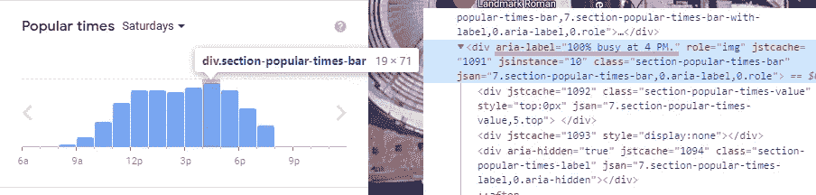

当你访问**万神殿**的页面时，谷歌地图会显示上图(一个以前的大寺庙，现在是罗马的教堂)。根据谷歌地图:**“在流行时间图上，任何给定小时的流行度相对于该企业一周的典型峰值流行度来显示”**。因此，周六下午 4 点参观万神殿是一个非常糟糕的主意，因为这是一周中最繁忙的时间(因此属性`aria-label`的值为 100%)。

在这种情况下，我们不会搜索特定的地方。我们将简单地在谷歌地图上搜索**【罗马旅游景点】**(尽量宽泛)。现在让我们运行我们的代码:

完成后，让我们用提取的列表制作一个数据框架。我们称之为`HL`历史地标:

```
HL = pd.DataFrame(data={'full_name':full_name, 'rating':rating, 'total_ratings':total_ratings, 'landmark_category':landmark_cat, 'description':description, 'address':address, 'hours':hours})
```

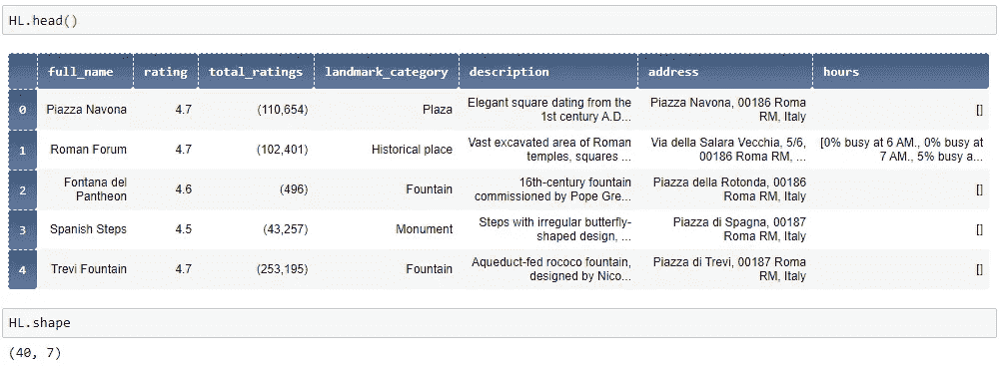

像往常一样，让我们保存这个数据帧:

```
HL.to_csv('historical_landmarks.csv', index=False)
```

打开它:

```
HL = pd.read_csv('historical_landmarks.csv')
```

如果你记得的话，安东尼奥希望团队只参观最受欢迎的景点，因为行程只有 3 天。为了从`HL`中选择 10 个最受欢迎的历史地标，我们需要将`total_ratings`转换成一个数字向量:

```
HL.total_ratings = HL.total_ratings.replace('\(|\)|,', '', regex=True)HL.total_ratings = HL.total_ratings.astype(float)
```

让我们制作一个新的数据框架`HL10`，包含来自`HL`的最受欢迎的城市:

```
HL10 = HL.sort_values(by='total_ratings', ascending=False).head(10).copy()HL10
```

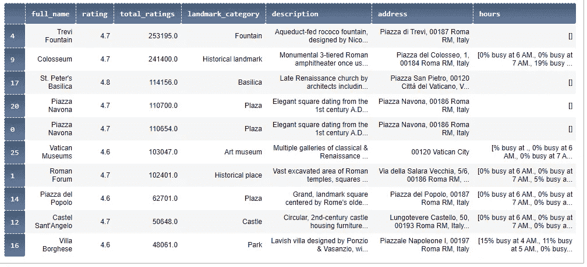

我们选择的罗马十大最受欢迎的景点(您的结果可能会有所不同)

我们主要关心的是在游览这些热门目的地时避开高峰时间。例如，让我们看看变量`hours`在罗马竞技场中是什么样子的:

```
str(list(HL10[HL10.full_name == 'Colosseum'].hours))
```

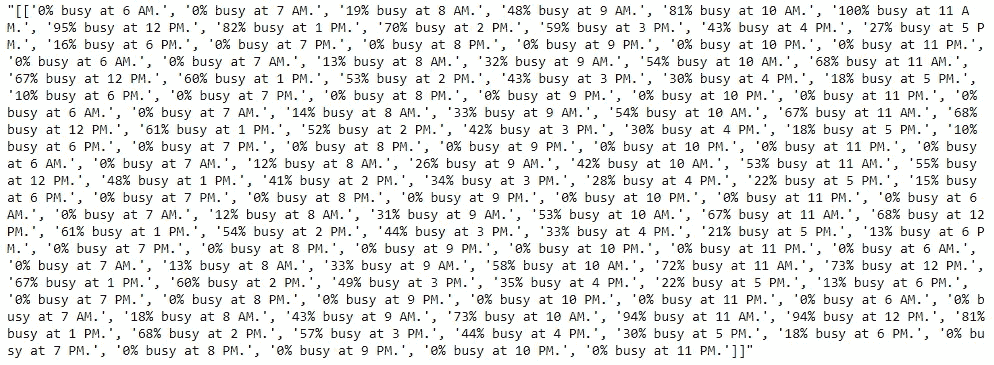

在我们的`HL10`数据帧中，`hours`是一个列表，描述了 7 天内(从周日到周六)任何一个小时(从早上 6 点到晚上 11 点)有多忙。为了使分析更容易，我们将为`HL10`中的 8 个位置中的每一个位置创建一个新的空数据帧，以天为索引，以小时为列。为此，我们将使用这个自定义函数:

让我们用**斗兽场**来测试一下:

```
colosseum = visit_planner('Colosseum')
colosseum
```

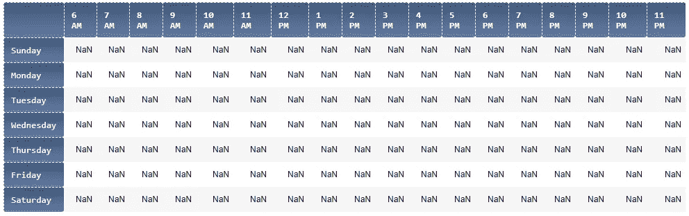

现在让我们用相应的值填充`10 AM`列。我们将在这里使用正则表达式:首先，我们捕获字符串`***% busy at 10 AM`，然后我们使用`\d+`捕获其中的数字，由于这里有 2 个数字(百分比和 10)，我们使用索引`[0]`选择第一个数字。最后，我们将向量转换为整数:

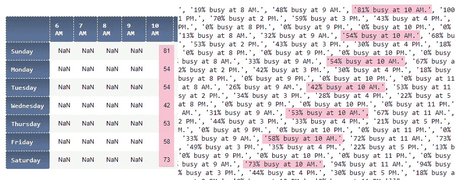

成功了！让我们将相同的代码应用于循环中的所有时间:


现在让我们在热图上显示这些数据:

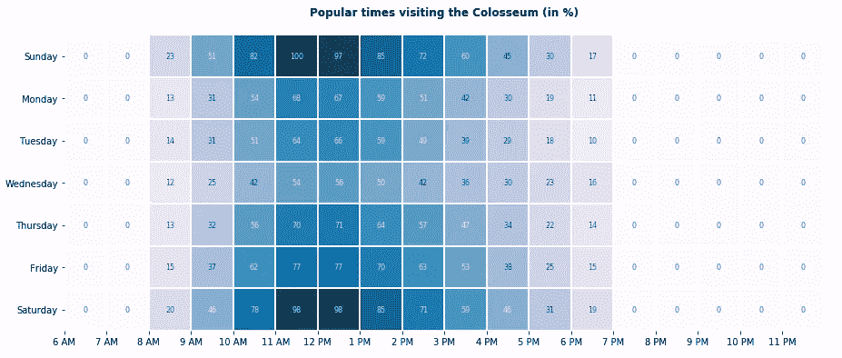

如果我们认为大约 50%的比率对团队来说已经足够舒适(其人口是一周中最繁忙时间的一半),并且我们需要至少 2 个小时才能参观完一个地方，那么参观罗马圆形大剧场的最佳日期和时间是:

*   **星期三**一天中的任何时间
*   **周一**、**周二**和**周四**上午**8 点到 11 点**和下午**2 点到 7 点**
*   **周五**和**周末**但仅从**下午 4 点到 6 点**
*   避开周末，尤其是从上午 11 点到下午 2 点(T42)

让我们在另一个地方尝试同样的事情，那就是**梵蒂冈博物馆**。在这种情况下，事情有点不同，因为**这个地方在周日**关闭，我们用于两个预览地方的方法将不起作用，除非我们将周日行从数据框中删除:

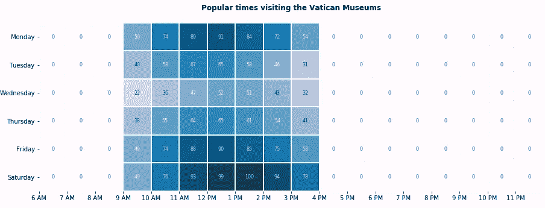

现在，这是一个很难安排的时间，因为我们只有 7 个小时的访问时间，从上午 9 点到下午 4 点。所以，参观梵蒂冈博物馆的最佳日子和时间是:

*   **周三**全天
*   **周二**下午**2 点到 4 点**和周四**上午**9 点到 11 点**和下午**2 点到 4 点****
*   周一**、**周五**和**周六**要避开**

安东尼奥对这一新获得的信息很满意。这将有助于他计划这次访问，最大限度地利用他与学生在欧洲最具历史意义的城市之一度过的三天时间。

注意:如果你想为一个地方做一个热图，你得到了错误`Length of values does not match length of index`，确保那个地方的`hours`列表有从早上 6 点到晚上 11 点的所有时间(总共 18 个，重复 7 次，总共 126 个元素)。如果缺少一个或多个，请尝试再次运行 web 抓取代码。

如果您有任何意见或问题，请随时在这里或 LinkedIn 上给我发消息。我很乐意回答。