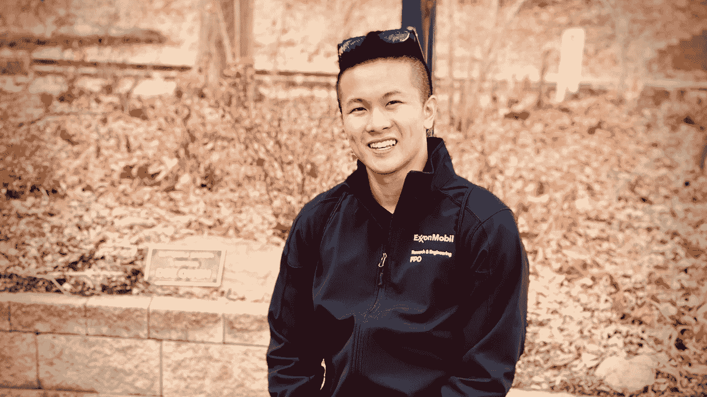
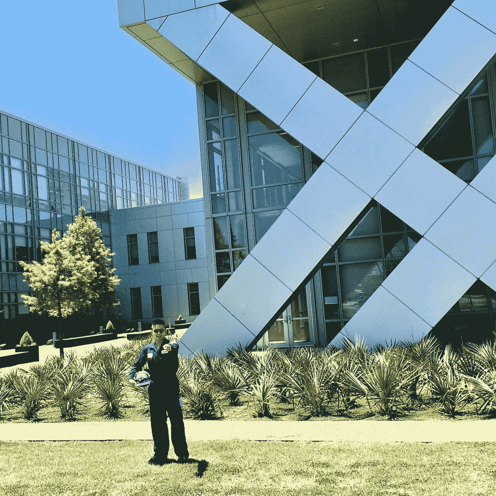

# 没有研究生学位就进入数据科学领域

> 原文：<https://towardsdatascience.com/getting-into-data-science-without-a-graduate-degree-59397401e6be?source=collection_archive---------12----------------------->

## 我是如何凭借一个学士学位得到一份最令人垂涎的工作的

作者照片

早在 2017 年，我曾休学一个学期，去埃克森美孚(ExxonMobil)的博蒙特炼油厂(Beaumont Refinery)做工程合作。我清楚地记得，在德克萨斯州华氏 95 度的潮湿天气里，我穿着阻燃工作服、钢头靴和安全帽，沿着大型管道和设备行走。作为一个最近才发现对编程有热情的中西部男孩，我感到格格不入。

如果你查看今天的任何数据科学家招聘信息，大多数(如果不是全部的话)都在寻找拥有数据科学硕士或博士学位的候选人。更不用说技术技能要求的[流水账了。](/ridiculous-requirements-from-data-scientist-job-ads-d84fa716af73)

这是一个关于我如何在没有硕士学位的情况下，用我的安全帽换来 21 世纪最性感的工作和 22 世纪最性感的工作的故事。

# 从基础开始

让我们倒回去。

2016 年，我在内布拉斯加大学林肯分校开始了大三化学工程和经济学双专业的学习。在各大学和美国国家航空航天局获得了大约一年的研究经验后，我决定要探索工业。

但是化学工程并不是我唯一的兴趣。我发现我也喜欢编码，所以我决定增加一个计算机科学辅修专业，并在 2016 年底报名参加 Udacity 的在线[数据分析师 Nanodegree](https://www.udacity.com/course/data-analyst-nanodegree--nd002) 。是的，我喜欢学习。

Udacity 的项目非常棒。他们与谷歌和脸书等顶级科技公司合作，建立在线课程，以帮助缩小技术技能差距。Nanodegree 现在有一个稍微不同的课程——当我参加它的时候，它曾经包括一个介绍性的机器学习和探索性的数据分析课程。

2017 年，我在埃克森美孚的第一个任期由与数据科学无关的工作组成。作为一个合作社，我推进资本项目，并帮助支持炼油厂的运作。到野外去，爬梯子，和操作员交谈是一种享受！

2017 年在埃克森美孚公司博蒙特办公室前穿着安全装备的我[作者图片]

我亲身体验了做一名化学工程师的感受，并对炼油厂的生活了如指掌。谢天谢地，他们给了我一个机会，我得到了一份返校邀请，回到博蒙特参加 2018 年夏天的实习。

在埃克森工作期间，我继续完成纳米学位，并在一年内完成。每天，我早上 8 点到下午 5 点工作，然后下午 6 点到 10 点学习。然后，在我的合作社，这是相同的时间表，但我切换到正常的大学课程工作。

很艰难吗？是的。我会再做一次吗？绝对的。

# 运用知识

自从完成了纳米学位，我对数据科学比对过程工程更感兴趣。有了新的证书，我联系了我大学的埃克森美孚招聘主管戴夫(他也是我第一任期的系主任)。

我问他是否有可能将我的实习工作转到他们的总部办公室，大部分数据科学工作都在那里进行。我想要这个有四个原因:

1.  获得数据科学的真实世界经验，看看我是否真的喜欢这份工作
2.  更多地了解公司，对全球产生影响，而不是在炼油厂进行特定的改进
3.  让自己在毕业时有更多的选择——在一个网站实习的毕业生几乎注定要在那个网站开始他们的早期职业生涯
4.  并且在崭新的现代化校园工作——这就像一个未来城市！

不幸的是，没有可用的开关。

所以在 2018 年，我又开始回到炼油厂实习。但这一次不同，我掌握了一些数据科学知识。

从第一天起，我就让我的新主管雷切尔知道我想进入数据科学领域。尽管精炼厂内没有任何数据科学职位，但我能够说服她将我将在夏天从事的三个项目中的一个与数据科学相关的项目进行交换。

更好的是，在那个项目中，Rachel 帮我联系了 George，他是炼油厂的一名高级工程师，之前有数据科学方面的经验。这是完美的一对。我们高度的正能量相匹配，他最终成为了一名导师。

我的项目？使用机器学习来建立一个[推理模型](http://pc-education.mcmaster.ca/Textbook%20WEB%20book%20with%20updates/Marlin-Ch17.pdf)并改善一个数百万美元炼油资产的过程控制。我非常兴奋，以至于我可以应用从 Nanodegree 学到的主题，如监督学习和超参数调整。

实习进行到一半的时候，我和我的主管以及我的伙伴(埃克森美孚为我们安排了一名全职员工作为导师)讨论了如果给我一份全职工作，我可能希望从哪里开始。我说的是作为数据科学家的总部办公室。

有人告诉我，进入那个角色最现实的途径至少需要 5 年。作为流程工程师在现场做几次轮换，担当协调员的角色，然后也许，仅仅是也许，能够转变为数据科学家。

但是我不想等。我想尽快在全球范围内产生影响。

因此，我需要证明，作为一名数据科学家，我会比作为一名流程工程师对埃克森美孚更有价值。我的策略？做好工作，确保合适的人知道这件事。

# 建立一个伟大的网络

我重新聘用了戴夫，他现在成了乔治主管的经理(多方便啊，对吧？).我负责的项目成了戴夫路线图上的一个大项目。所以我让他参与进来，并请他帮助我接触数据科学社区。

我也把网络掌握在自己手中。在成功交付数据科学项目后，我抓住机会，安排了一次与总部数据科学经理的通话。我有点害怕被拒绝，因为哪个忙碌的经理会有时间去数百英里外的炼油厂实习？

令我惊讶的是，她接受了。她很友好，虽然她重申如果我有多年的现场经验或研究生学位，我开始成为数据科学家的机会会更大，但她也给了我关于数据科学在埃克森美孚如何工作的深刻见解。

我了解到埃克森美孚不止有一个而是多个数据科学团队。有些已经很久了，而有些只有一两年的历史！

几个星期过去了，戴夫给我回复了。他联系了自己的关系网，提到一位数据科学主管愿意在总部接待我一天。然后我问雷切尔我是否可以去。她很支持我，但想确定我有计划。

我给了她一个计划。

上游。下游。它。我安排了一个时间，与尽可能多接触埃克森美孚数据科学领域的人交谈。取消我之前与之通话的数据科学经理也有所帮助。

在我的最后一周，我前一天开车一个小时去了休斯顿的一个大学朋友的公寓，那天晚上带着背包和毯子睡在了地板上(他刚刚在埃克森美孚开始工作，还没有任何家具)。

这是我第二天的日程安排:

*   上午 8:00—8:30 |上游研究公司—数据科学主管
*   上午 8:30—9:00 |埃克森美孚 IT —数据科学家
*   上午 9:00—10:00 |价值链优化—数据科学家
*   上午 10:00-11:00 |实时优化-优化工程师
*   上午 11:00—下午 12:00 |上游研究公司—数据科学家
*   中午 12:00—下午 1:00 |与数据科学家共进午餐
*   下午 1:00—1:30 |埃克森美孚 IT —数据科学顾问
*   下午 1:30—2:15 |燃料和润滑油—数据科学主管
*   下午 3:00—3:30 |埃克森美孚 IT —数据科学主管
*   下午 3:30—4:00 |价值链优化—部门主管
*   下午 4:00-5:00 | Python 兴趣交流活动

是的，我基本上给自己安排了一整天的信息采访，我学到了很多。

我遇到的一些人问我关于我从事的数据科学项目，而其他人分享了他们的工作和建议。由此，我意识到埃克森美孚有多大，以及正在处理的大量有趣的项目。

然而，我注意到的一个共同趋势是，每个人都有研究生学位。

# 最终结果

在我第二次实习的最后一天，雷切尔和我的朋友让我坐下来进行离职面谈。在那里，我会知道我是否收到了一份全职工作的回复。

令我惊讶的是，我获得了总部的一个数据科学家职位！

我付出的所有努力终于有了回报，这种感觉太棒了。我过去和现在都非常感谢所有支持我的人，他们帮助我打开大门，让这一切成为可能。

我后来得知，在我临时凑合的超级日那天和我交谈过的部门主管给我的主管打了电话，让他做出了改变。其中一个原因是因为我给数据科学团队带来了他们没有的新东西——我整整 8 个月的实习经历。

自 2019 年 5 月在埃克森美孚全职工作以来，我有机会参与各种项目，从交易建议到定价指导和设备优化，每年帮助获得 1500 多万美元。

有趣的事实:在我的一个新项目中，我帮助交付了一个全球性的产品，该产品扩展了我作为实习生所做的工作。猜猜谁是第一批产品所有者之一？——是乔治。这真是一个小世界。

# 外卖食品

获得数据科学职位可以归结为确保您了解基础知识，将这些知识应用到您当前的角色中，并与能够支持您并打开正确大门的正确人员联系。

所有这些都从你开始。你是司机，你的决心是带你到达目的地的燃料。

记住，你的背景是独一无二的。利用这一点，和那些认识到这一点的人在一起。当正确的门打开时，确保你准备好走进去！

最后，感激并善待你遇到的每一个人。你永远不知道将来什么时候会需要它们。

你想进入数据科学领域吗？在 LinkedIn 上留言 [me](https://www.linkedin.com/in/dominickhacnguyen/) ！我很乐意成为你旅程的一部分。