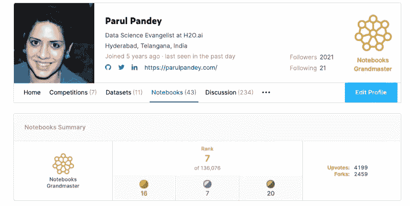
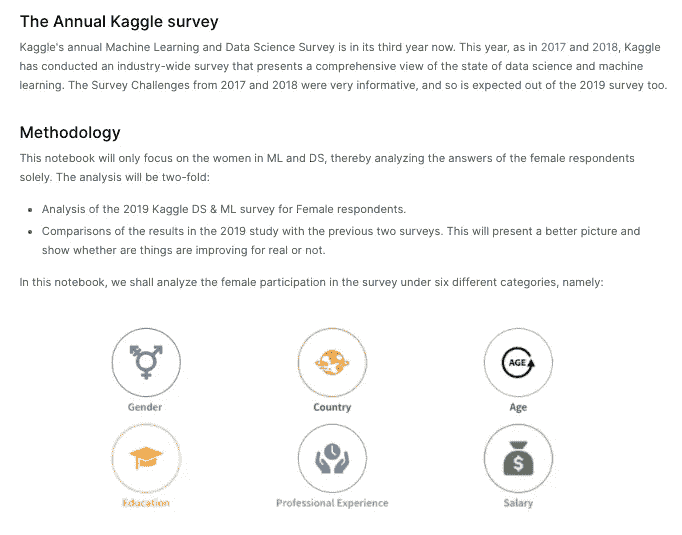
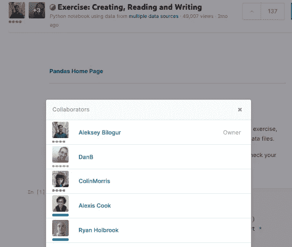
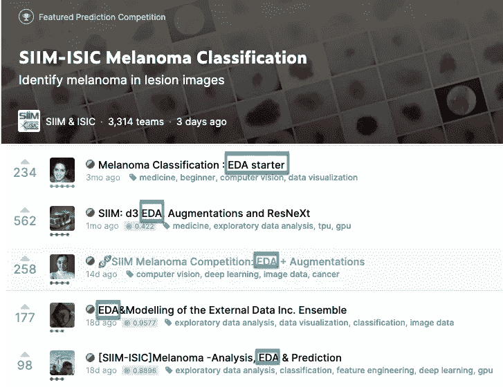
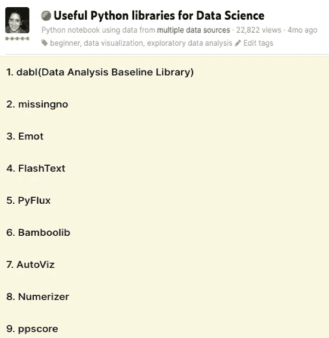
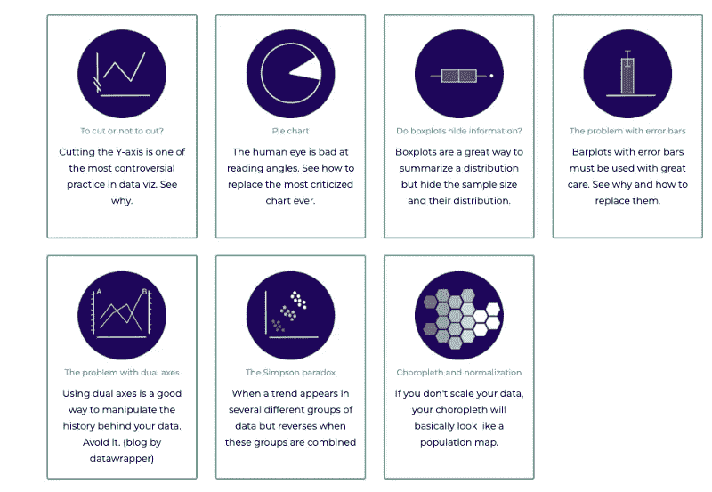
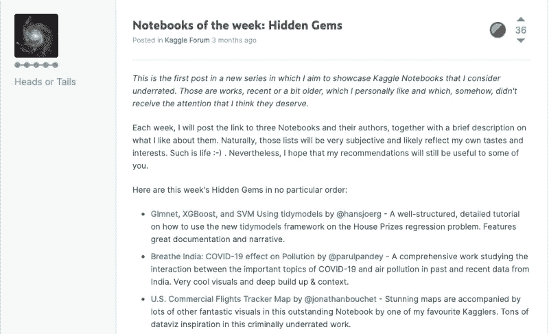

# 从 Kaggle 笔记本电脑中获得“更多”

> 原文：<https://towardsdatascience.com/getting-more-out-of-your-kaggle-notebooks-fb2530ece942?source=collection_archive---------40----------------------->

## 关于如何让你的 Kaggle 笔记本更具吸引力的一些建议

大约五年前，我加入了 Kaggle。我是从当时正在进行的一个 MOOC 项目中了解到这个网站的。从 2015 年到 2019 年，我一直只使用 Kaggle 下载数据集。我确实尝试了非常受欢迎的泰坦尼克号比赛来改变我的状态，从绿色变成蓝色，也就是从**新手**变成**贡献者。尽管如此，除此之外，我在平台上并不活跃。直到 2019 年末，我才开始在 Kaggle 上积极投稿和写笔记本。从分析到探索性的数据分析，我试验了很多想法。我研究了其他人的作品，获得了灵感，学到了很多东西。最后，经过几个月的 Kaggle，我在 2020 年 6 月成为了一名 Kaggle 笔记本电脑大师。**

这篇文章是我在写有效的笔记本时学到的知识的汇编。这不是指南，只是我几个月来的经历。我们先从了解什么是 Kaggle 笔记本以及如何使用开始。

# 什么是 Kaggle 笔记本？

一个[笔记本](https://www.kaggle.com/docs/notebooks)是一种分享代码和分析的讲故事的格式。这是一个云计算环境，支持可重复的协作工作。任何人都可以在 Kaggle 中创建一个笔记本，并将图表直接嵌入其中。Kaggle 笔记本分为两种:

*   **脚本** —按顺序执行所有代码的文件
*   **笔记本** —由一系列单元格组成的 Jupyter 笔记本

[*在笔记本 IDE 中，您可以访问在 Docker 容器中运行的交互式会话，其中包含预安装的软件包、安装版本化数据源的能力、GPU 等可定制的计算资源等等。*](https://www.kaggle.com/docs/notebooks)

# 让 Kaggle 笔记本发挥“更多”作用的技巧

现在，让我们快速进入我在创建新笔记本之前牢记的一些提示。

# 1.通过笔记本讲述引人入胜的故事

> 讲故事者的目的不是告诉你如何思考，而是给你问题去思考
> 
> *布兰登·桑德森，* [*王者之道*](https://www.goodreads.com/work/quotes/8134945)

笔记本是传达你想法的绝佳工具。它们允许您以交互方式探索数据，创建可视化效果，然后与世界共享结果。在某种程度上，你可以在同一个环境中把代码和文章结合起来。使用清晰的视觉效果来创造引人入胜的故事情节。请选择一个独特的问题，并尝试解决它。首先确定笔记本的目的，然后用一个合适的结论来总结，以创造一个有影响力的故事。

在名为 [***的笔记本中，极客女孩崛起:神话还是现实！***](https://www.kaggle.com/parulpandey/geek-girls-rising-myth-or-reality) 我分析了 2019 年 Kaggle ML 和 DS 关于机器学习和数据科学中女性代表性的调查数据。我选择的问题陈述是女性在 Kaggle 的参与度是否有所提高，与前几年相比如何。我通过分析性别、国家、年龄组等各种属性的数据创建了一份报告。最后，我总结了分析的要点和一些建议。

笔记本摘录: [***极客少女崛起:神话还是现实！***](https://www.kaggle.com/parulpandey/geek-girls-rising-myth-or-reality)

# 2.与他人合作

> "许多想法移植到另一个头脑中时，会比移植到它们产生的那个头脑中时长得更好。"
> 
> 奥利佛·文德尔·霍马斯

协作是数据科学不可或缺的一部分，无论是在研究领域还是开源领域。在 Kaggle 比赛中，团队合作的重要性怎么强调都不为过。然而，即使是 Kaggle 笔记本也有引人注目的协作功能。多个用户可以共同拥有和编辑一个笔记本*。*这在几种情况下可能会有帮助。

*   当你参加比赛时，你可以在笔记本上与你的队友一起协作编写你的代码。
*   在分析数据集时，您可以与他人协作并创建有影响力的项目报告。

[创作，阅读&写数据](https://www.kaggle.com/residentmario/creating-reading-writing-data)，[先进熊猫 Kaggle 学习轨迹](https://www.kaggle.com/learn/overview)的笔记本，就是一个巨大的协作笔记本的例子。

通过 Kaggle 笔记本进行协作

# 3.通过初学者笔记本电脑参与竞赛

> *贡献是关键*

你想为比赛做贡献，但还没有准备好比赛？好吧，当一个新的比赛开始时，开始写入门笔记本。这种笔记本通常有两种类型:

*   执行基本或高级探索性数据分析的笔记本电脑。这些笔记本帮助其他人快速理解数据的性质和模式，从而节省他们大量的时间。也有人高度赞赏一款优秀的 EDA 笔记本。
*   包含快速基线的笔记本。这种笔记本充当了寻求在比赛中竞争的人的垫脚石。他们可以使用基线来构建他们的分析。

以下是一些 EDA 和竞赛入门笔记本的浏览: [SIIM-ISIC 黑色素瘤分类](https://www.kaggle.com/c/siim-isic-melanoma-classification)用于识别病变图像中的黑色素瘤

[SIIM-ISIC 黑色素瘤分类](https://www.kaggle.com/c/siim-isic-melanoma-classification)竞赛笔记本

# 4.教一些新东西

> *学东西的最好方法是把它教给别人*

尝试教授一个新的库或一些新的功能。这对于有时难以理解官方文档的初学者尤其有用。但是，请确保使用一些新的数据集来展示库/函数的工作。照原样复制整个文档不是一个好主意。

在笔记本 [**对数据科学有用的 Python 库**](https://www.kaggle.com/parulpandey/useful-python-libraries-for-data-science) 中，我整理了一些有用但鲜为人知的 Python 库，可以在数据分析和机器学习任务中派上用场。

Kaggle 笔记本中涵盖的库:[对数据科学有用的 Python 库](https://www.kaggle.com/parulpandey/useful-python-libraries-for-data-science)

同样，在笔记本[用于探索性数据分析的高级 Pyspark](https://www.kaggle.com/tientd95/advanced-pyspark-for-exploratory-data-analysis)中， **Tien Tran** 展示了如何使用 py spark 及其相对于 Pandas 在处理大数据方面的优势。

[用于探索性数据分析的高级 py spark](https://www.kaggle.com/tientd95/advanced-pyspark-for-exploratory-data-analysis)ka ggle 笔记本

# 5.当心数据可视化陷阱

> 观想的目的是洞察力，而不是图画。
> 
> 本·施奈德曼

由[data-to-viz.com](https://www.data-to-viz.com/)收集的十大 DataViz 警告

一张图肯定胜过千言万语，但是太多的图就违背了清晰的目的。如果你想让形象突出，并有助于故事情节，有几点你应该考虑。

*   保持视觉效果简单明了。
*   简明地解释每个图表。不要把图表留给读者去理解。让别人意识到你的观点。
*   制作清晰易读的图表。注意色盲，制作每个人都能理解的图表。
*   不要过度动画。只有当它们符合故事情节时才使用它。
*   使轴和标签清晰可见。使用合适的字体选择和字体大小。显示图例和标题。

# 6.让您的笔记本具有可复制性

> *“你为什么要关心再现性呢？*
> 
> *因为最有可能需要复制你作品的人……就是你。”*
> 
> [*Rachael Tatman 博士——可复制的机器学习*](http://www.rctatman.com/files/Tatman_2018_ReproducibleML.pdf)

一个可重复的例子允许其他人使用相同的数据重新创建您的分析。这很有意义，因为你把你的作品公之于众，让他们使用。如果其他人不能不间断地复制你的作品，这个目的就失败了。Rachael Tatman 在 [**可重复研究最佳实践**](https://www.kaggle.com/rtatman/reproducible-research-best-practices-jupytercon) 上放了一个很棒的内核，里面列出了一些可重复工作的最佳实践。以下是来自上述研究的一些建议:

*   把你所有的导入，导入 x 或者库(x)放在你笔记本的顶部
*   在合乎逻辑的地方打断长行
*   让你的变量名变得有意义和易读
*   注释您的代码！
*   确保设置所有的随机数发生器(RNG)
*   确保你的代码和数据都是逻辑有序的。

下面的例子(同样取自 Rachel 的幻灯片)清楚地强调了编写干净、模块化和可重复代码的力量。

编写可重复代码的注意事项。[来源](https://www.kaggle.com/rtatman/reproducible-research-best-practices-jupytercon)

# 7.注意错误

> *“一个人的蹩脚软件是另一个人的全职工作。”*
> 
> 杰西卡·加斯顿

发布前运行整个笔记本。包含无法渲染的错误或图形的笔记本不是您想要与世界共享的东西；忘了拉选票吧。此外，确保连接到笔记本的数据集也没有错误。

# 8.分叉前向上投票

术语“分叉”来自[版本控制](https://en.wikipedia.org/wiki/Fork_%28software_development%29)。派生笔记本意味着按其当前状态制作一份副本。人们倾向于使用好的笔记本或基线来构建他们的代码。然而，有些人会叉一个笔记本或使用其他人的工作，但不会通过投票支持原来的工作来表示赞赏。如果你发现某人的代码如此有价值，以至于你最终使用了它，为什么不对作者表示一些感谢呢？

下面突出显示的笔记本的分叉数多于上行投票数。奇怪！

[**【推论，PyTorch】鸟叫 ResNet 基线**](https://www.kaggle.com/hidehisaarai1213/inference-pytorch-birdcall-resnet-baseline) **作者新井秀久**

# 9.遵循笔记本礼仪

> *获得灵感是人之常情，但抄袭是邪恶的*

*   不要直接从其他笔记本中提取内容。如果你认为你想重用一大块代码，给出明确的归属。
*   避免**通过要求投票来滥发**笔记本。一个好的笔记本会吸引其他同事的注意。你也可以把你的内容放在社交媒体上，比如 Linkedin 到 Twitter，告诉全世界你已经创建了一个新的笔记本。但是不要一直要求投票，尤其是为了回报你投的票。

# 10.对好的工作表示赞赏

> 表达感激是人类能为彼此做的最简单也是最有力的事情之一

最后，请不要回避欣赏伟大的笔记本，给他们投票并大声喊出来。这里有一个欣赏他人作品的好例子，作者是 Kaggle GM — [正面还是反面](https://www.kaggle.com/headsortails)。他定期展示 Kaggle 笔记本，他觉得这些笔记本没有得到应有的重视。

[正面或反面显示的隐藏宝石笔记本帖子](https://www.kaggle.com/general/150603)

# 结论

Kaggle 笔记本是传达你想法的好工具。搜索或管理一些很酷的数据集，并使用笔记本来创建一些出色的分析。最后，不要忘记享受这个过程。从奇妙的 Kaggle 社区可以学到很多东西。但最重要的是尝试——因为成功的秘诀在于开始。

*这个故事最初发表于* [*这里*](https://parulpandey.com/2020/08/23/getting-more-out-of-your-kaggle-notebooks/) *。*