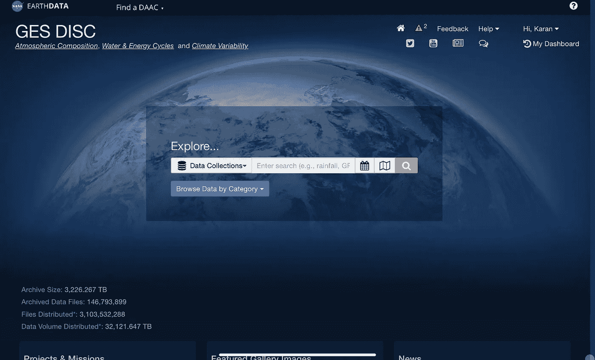
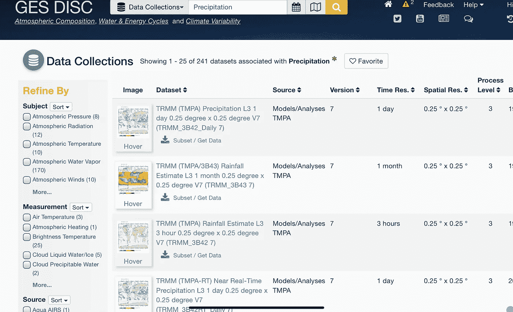
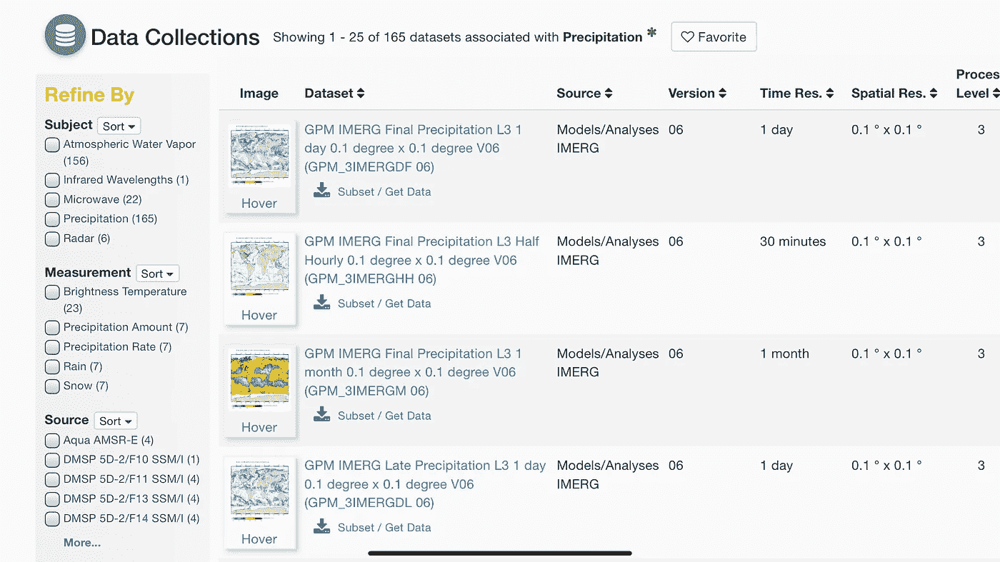
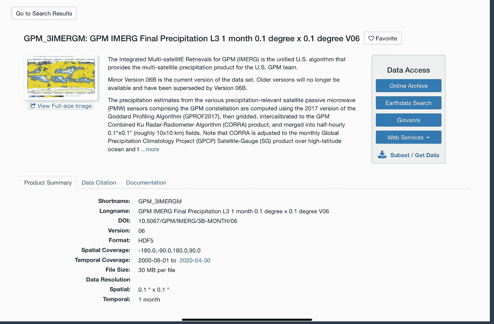
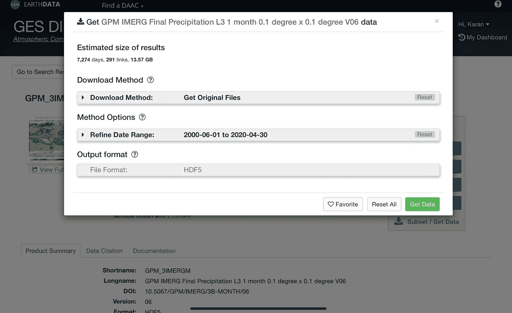
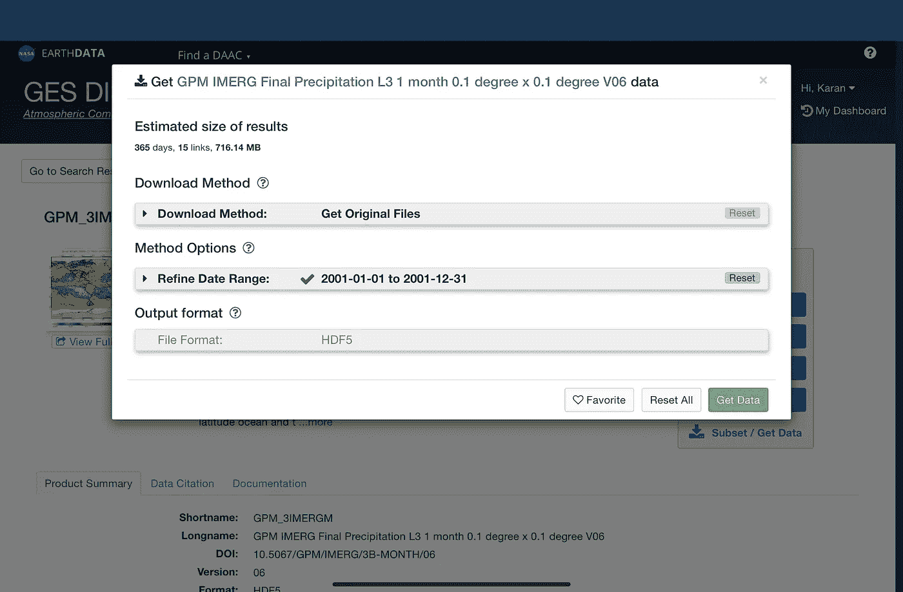
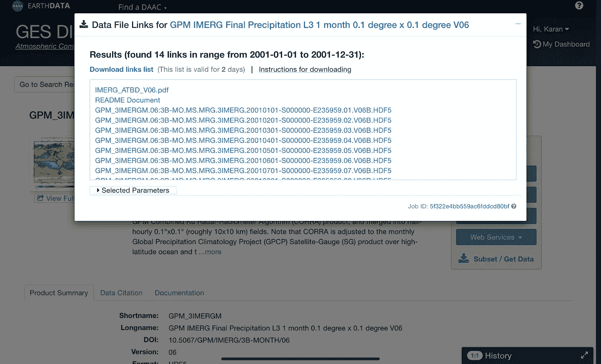
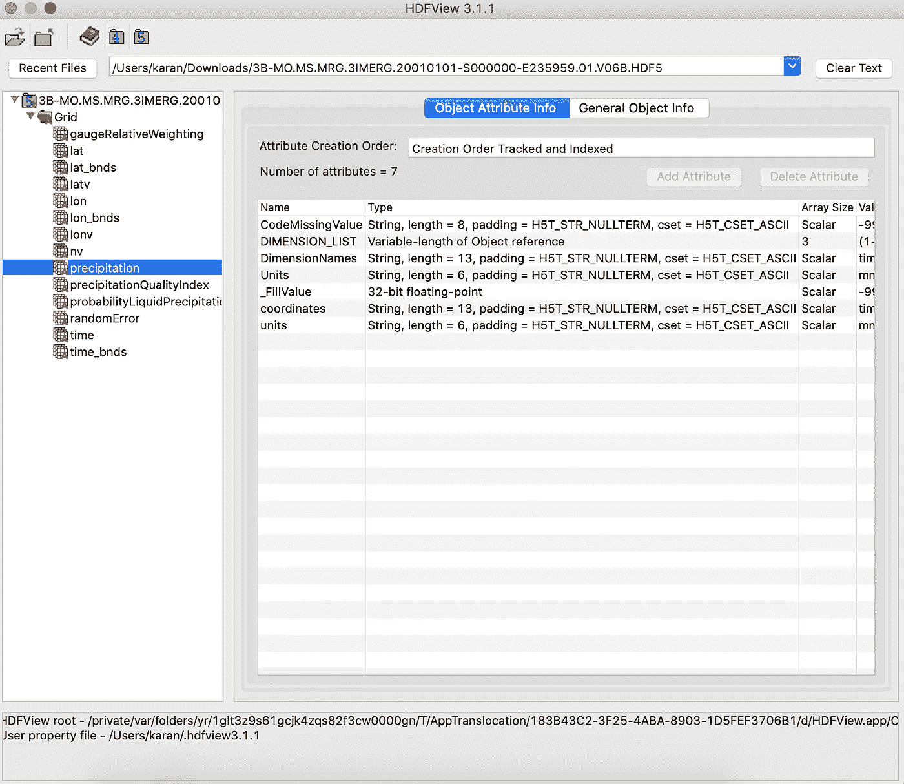

# 为你的下一个地理项目获取 NASA 数据

> 原文：<https://towardsdatascience.com/getting-nasa-data-for-your-next-geo-project-9d621243b8f3?source=collection_archive---------31----------------------->

## 访问 GES 光盘数据文件

美国宇航局在 [Unsplash](https://unsplash.com?utm_source=medium&utm_medium=referral) 拍摄的照片

**美国宇航局**提供了一个庞大的数据点库，这些数据点是他们多年来从卫星上捕捉到的。这些数据集包括温度、降水等。美国国家航空航天局将这些数据保存在一个网站上，你可以根据需要搜索和获取信息，无论你想要的是整个世界的数据还是特定区域的数据。用户可以选择特定的日期范围，寻找总的时间范围(小时，天，月等)。).可能性是无限的。

在本文中，让我们探索这个巨大的资源，我将描述一个从网站收集数据的一步一步的过程。

## GES 圆盘

GES 圆盘代表 *NASA 戈达德地球科学(GES)数据和信息服务中心*。这是一个数据仓库，存放着关于降水、水文、大气等方面的遥感数据。它旨在使研究人员和应用程序开发人员能够访问 NASA 的数据，然后他们可以使用这些数据进行分析和创建应用程序。

 [## GES 圆盘

### 美国宇航局统一用户界面，UUI，数据，GES 光盘，数据集

disc.gsfc.nasa.gov](https://disc.gsfc.nasa.gov/) 

## 数据收集

让我们浏览一下从 GES 光盘中检索数据的步骤。在这篇特别的文章中，我将介绍下载**降水**数据的步骤，为此，我将下载 **GPM** 月数据。 **GPM 代表全球降水测量**，这是 JAXA 和美国宇航局的一个合资项目，旨在获取全球降水数据。

## 1.注册

数据仓库位于[这里](https://disc.gsfc.nasa.gov/)。在下载数据之前，您需要在 earthdata 网站上创建一个帐户。只需在这个网站上创建一个帐户，验证你自己，你应该可以去。

选择右上角的**登录**按钮。如果您有帐户，请登录，否则选择**注册**按钮进行注册。

## 2.搜索

一旦我们登录，我们就可以开始了。网站会用一个搜索框来欢迎你，默认情况下会选择**数据收集**。我们正在这个集合本身中寻找数据，所以我们将顺其自然，并开始在搜索框中键入。

在这里，我将在搜索框中输入**降水**，然后按黄色搜索按钮来获取可用的数据集。您会注意到一个加载图标，表明系统正在处理我们的搜索查询，并将返回与搜索查询匹配的数据集列表。

GES 光盘主页

## 3.浏览数据集列表

搜索完成后，您将看到一个包含与查询匹配的各种数据集的表格，并在左侧看到一个过滤器部分。该表包括图像、数据集名称、源、空间半径、数据收集开始日期和数据收集结束日期等信息。根据您的具体要求，您可以使用左侧的过滤器，并选择有助于获得最精确数据的条件。

**降水**的搜索结果

在这个例子中，我在寻找 GPM 月度数据。因此，在过滤器中，在**项目**下，我选择了 GPM。这过滤了属于 GPM 的数据集。从**时间分辨率**列，我寻找分辨率为 **1 个月**的数据集。这意味着数据是按月汇总的。

使用 GPM 过滤器搜索**降水**的结果

从列表上看是第三个数据集叫做 **GPM IMERG 最终降水量 L3 1 月 0.1 度 x 0.1 度 V06 (GPM_3IMERGM 06)** 。为了探索关于这个数据集的更多信息，我只需单击它的名称(这是一个超链接)，它就会将我带到数据集页面。

## 4.浏览数据集页面

该页面包含数据集的详细信息以及一幅图像。接下来是数据集的汇总(称为**产品**)。最重要的部分是我们在屏幕右侧看到的按钮。您可以探索各种服务等等，但我们感兴趣的是链接**子集/获取数据**。这是我们开始下载数据的步骤。点击此链接。

数据集页面

## 5.选择数据

单击该链接时，会出现一个弹出窗口，如下图所示。

带有下载选项的弹出窗口

我们得到的数据集非常庞大，因为它涵盖了全球数年的信息。一个好主意是选择你正在寻找的某个日期范围和地球的某个区域。

在这里的例子中，我将捕获所有的原始文件，这意味着所有的变量。我把范围细化一下，从 2001 年 1 月 1 日到 2020 年 12 月 31 日。最后，根据上面的选择，您可能会看到输出格式的某些选项。当我选择原始文件时，我只看到 HDF5。

从完整数据集中选择特定数据

> 我使用过 **HDF5** 文件格式，有一个非常简单的包 [**h5py**](https://www.h5py.org/) 可以让你直接将这些文件读入 python。但是为了查看这些文件，经常使用一个流行的软件，HDFView。

接下来，按下按钮**获取数据**，它将开始运行，以生成一些链接，允许您下载数据。

## 6.下载数据

弹出窗口显示链接列表，每个链接对应于基于选择的一个数据文件。从这里下载数据有两种方式。

下载数据集的链接

## 6.1 一次一个文件

单击您要下载的数据文件的链接。如果您已登录，数据集将开始下载。它快速、简单，不需要额外的步骤来下载数据。

## 6.2 一次多个文件

但是，如果您正在下载多个文件(比如 30-40 个文件)，这不是最有效的方法。使用 **curl** ，你可以使用一个简单的命令下载所有的文件。

> **curl** 是一个命令行工具，用于使用各种网络协议传输数据。

然而，要使用 curl 下载这些数据文件，我们第一次需要执行一些步骤。完整的说明因操作系统而异，此处[提供](https://disc.gsfc.nasa.gov/data-access#mac_linux_curl)。

以下是以最简单的方式理解术语的步骤概述(在 MacOS 上是这样的):

**获取所有链接**

在链接列表上方，您会看到一个名为**下载链接列表**的链接。当你点击它，一个新的标签打开，所有的链接都在一个地方。选择并复制所有文本，并将其保存到机器上名为 **url.txt** 的文件中。

**创建所需文件**

在终端中，执行以下操作:

*   使用`cd ~`前往您的家
*   创建一个新文件**。使用`touch .netrc`的 netrc** 和使用`touch .urs_cookies`的另一个文件，用于在多个 curl 调用期间跟踪会话
*   我们现在将登录凭证保存在该文件中。键入命令`echo “machine urs.earthdata.nasa.gov login <uid> password <password>” >> .netrc`，同时用您的用户名替换 **< uid >** ，用您的密码替换 **<密码>**
*   使用`chmod 0600 .netrc`更改其访问权限
*   在您的文件 **url.txt** 所在的终端中键入命令`cat url.txt | tr -d ‘\r’ | xargs -n 1 curl -LJO -n -c ~/.urs_cookies -b ~/.urs_cookies`，所有文件将被一个接一个地下载。

> wget 也是另一个选项，但是我没有用过它，因为 curl 表现很好，而且我觉得没有必要尝试 wget。

## 7.图像数据

一旦下载了 HDF5 文件，您就可以使用 **HDFView** 打开这些文件并查看数据集。你需要一个帐户来下载这个软件。

 [## HDF 观点-HDF 集团

### 当前版本:HDFView 3.1.1 HDFView 软件由 HDFView 实用程序和 Java HDF 对象包组成…](https://www.hdfgroup.org/downloads/hdfview/) 

> 数据可以以其他格式下载，如 netCDF、ASCII 等。也有处理这些文件的方法，但是我没有亲自处理过。

高清视图

我们都准备好了！！

## 结论

您现在有一组数据文件，其中包含 NASA 多年来收集的丰富数据，您可以将这些数据用于自己的工作。在下一篇文章中，我将描述用 Python 读取 HDF5 文件并理解其组件以使用数据的步骤。

希望这是有见地的。如果你有任何问题、想法或建议，请在评论中提出。