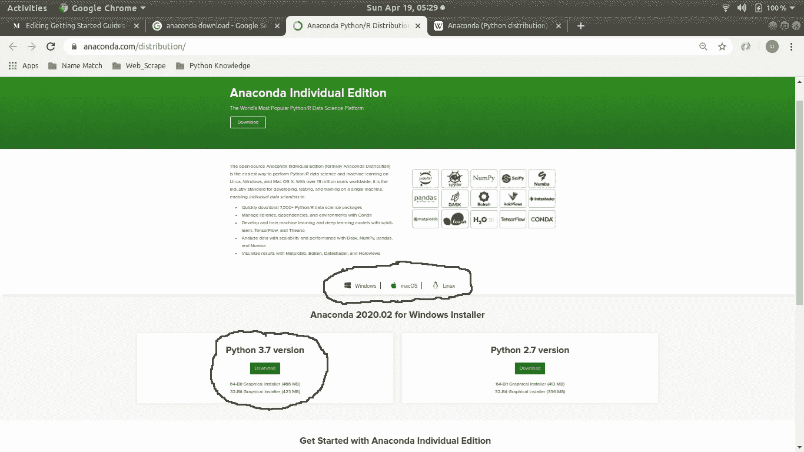
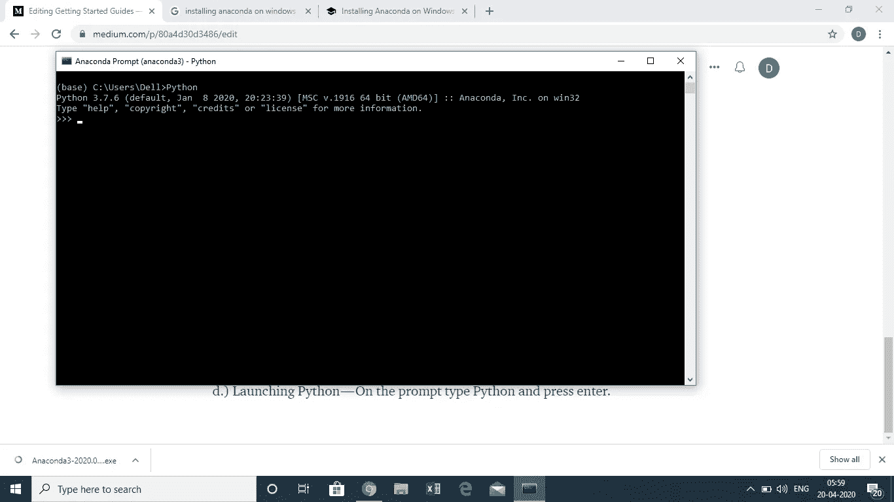
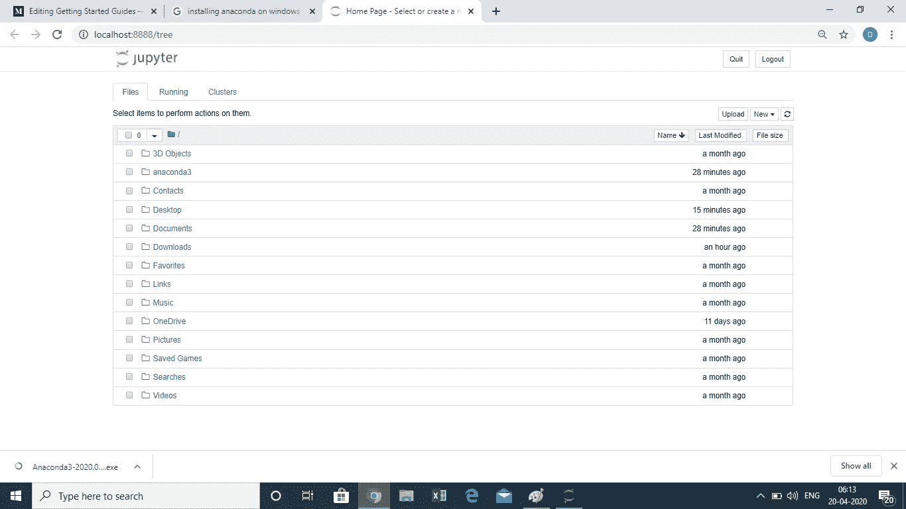
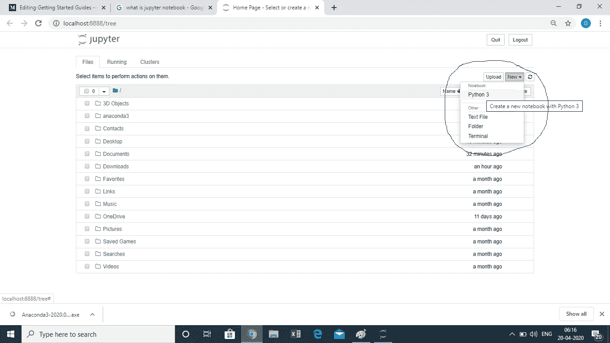
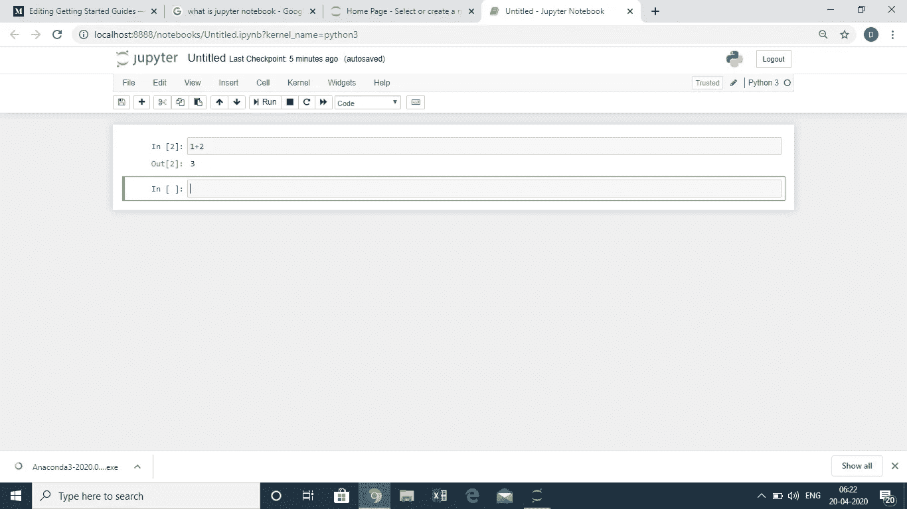

# 入门指南— Anaconda

> 原文：<https://towardsdatascience.com/getting-started-guide-anaconda-80a4d30d3486?source=collection_archive---------21----------------------->

## Python 发行版的开源平台

简·kopřiva 在 [Unsplash](https://unsplash.com?utm_source=medium&utm_medium=referral) 上的照片

随着对 Python 编程语言需求的不断增长，任何初学者都面临的第一个任务是建立正确的开发环境。

本教程旨在向您介绍 Anaconda 平台，这是 Python 和 R 编程语言的免费开源发行版，用于科学计算，以简化包管理和部署。

# a.)为什么是 Anaconda？

有多种原因使得 Anaconda 成为 Python 初学者的首选:

*   **一个完整的解决方案**——与其他 Python ide(py charm、Pydev、Spyder)不同，Anaconda 不仅提供了易于使用的编程接口，还使包管理、虚拟环境管理等任务变得简单。
*   **预装包**—Python 的强大来自于社区多年来开发的数千个包。如果使用标准 Python 安装，所有第三方 Python 包的安装都需要 pip (Python 事实上的标准包管理系统)。Anaconda 解决了这个问题，因为它预装了最常用的 Python 包。
*   **简单的 GUI—**Anaconda 发行版预装了两个最用户友好的 Python IDEs，Jupyter Notebook(本教程的重点)和 Spyder。

# b.)入门

下面列出了首次使用 Anaconda 的简单说明:

**1。)下载** —转到[此链接](https://www.anaconda.com/distribution/)并选择您系统的操作系统(Windows/ Mac/ Linux)。检查您的系统详细信息，确定您的系统是 64 位还是 32 位处理器。根据以上信息，下载 Python 的版本 3。X (X 是最新版本)。

Anaconda 下载屏幕(图片由作者提供)

2.)**启动安装程序** —在 Windows 上安装 Anaconda 就像安装其他任何软件一样简单。只需启动安装程序，并继续点击下一步下一步。安装程序会在几个地方寻求您的偏好。我的建议是去安装推荐的设置，不要改变任何东西。安装将在 8 到 10 分钟内完成。

3.)**启动 Anaconda 提示符** —默认情况下，Anaconda 发行版会安装 Python 和支持软件应用程序。你可以在你的**窗口开始菜单**的 **Anaconda 文件夹**中找到这些应用程序。启动名为 **Anaconda 提示符的 Python open 应用程序。**提示如下所示:

蟒蛇提示(图片由作者提供)

**4。)启动 Python** —在提示符下，键入 *python，*并按*回车*。您将看到屏幕上出现一个带有 **Python 版本号**的标准文本。除此之外，提示还会变成 **3 个尖括号> > >。现在，你可以开始编写你的 Python 代码了。要退出 Python 环境，请键入 **exit()** 并按 enter 键**

启动 Python(图片由作者提供)

**5。)一个更好的界面**——在上一步中，我们看到了 Anaconda 提示符，这是 Python 的**命令行界面**。Jupyter notebook 是一个基于 GUI 的 IDE，与 Anaconda 打包在一起。我们也可以从 Windows 开始菜单文件夹中启动它。由于应用程序是在**网络浏览器**中打开的，因此对于使用多种浏览器的用户来说，**在启动应用程序时会出现一个提示，要求输入您的首选浏览器选项**。主屏幕将如下所示:

Jupyter 主屏幕(图片由作者提供)

**6。)创建新笔记本**——Jupyter Notebook 是一个一站式商店，从**编写 Python 代码**、**创建可视化、**和**编写减价文档**。要创建一个新的笔记本，点击主屏幕右上角的 new 下拉菜单，然后点击 Python 3

启动笔记本(图片由作者提供)

**7。)编写您的第一个 Python 代码** —以上步骤将在 web 浏览器的新标签页上打开一个笔记本，其中有一个**单元格处于编辑模式**。在这个单元格中，您可以编写 Python 程序。写一个简单的数学运算(1+2)和**按 *shift+enter*** 。您将看到数学运算的结果，以及在前一个单元格之后在编辑模式中添加的**新单元格。下面是一个示例截图供您参考:**

Jupyter 笔记本(图片由作者提供)

**8。)快捷方式**—Jupyter 笔记本中的每个单元格既可以处于**编辑** ( **，光标闪烁，单元格以绿色高亮显示**)也可以处于选择模式(**，没有光标，单元格以蓝色高亮显示**)。每款笔记本都提供了一些快捷方式**和**，方便用户快速浏览笔记本:

**与单元模式无关的快捷键**:

*   执行写入当前单元格的代码— **Cntrl + Enter**
*   执行当前单元格中写入的代码，并在下面插入一个新代码— **Shift + Enter**

**选择模式下的快捷键**

*   在当前单元格之前添加新单元格— **A**
*   在当前单元格后添加一个新单元格— **B**
*   切割一个单元格— **X**
*   复制单元格— **C**
*   粘贴单元格— **V**
*   删除单元格— **D..D(按两次 D)**
*   撤消删除的单元格— **Z**
*   向下滚动笔记本— **空格键**
*   向上滚动笔记本— **Shift +空格键**
*   将单元格模式从选择改为编辑— **输入**

**处于编辑模式时**

*   退出编辑模式— **Esc**
*   自动完成 Python 命令— **选项卡**
*   右缩进代码—**Cntrl+】**
*   左缩进代码— **Cntrl+[**
*   撤消— **Cntrl+Z**
*   重做— **Cntrl+Y**

# c.)结束语

我希望该教程易于理解，并且您可以开始使用 Anaconda。

接下来，学习使用 Anaconda 管理 Python 环境。

快乐学习！！！！