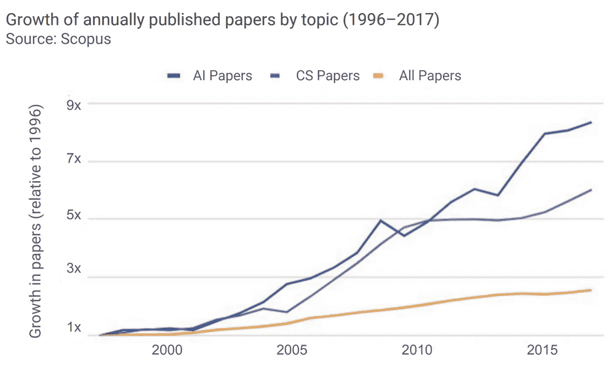
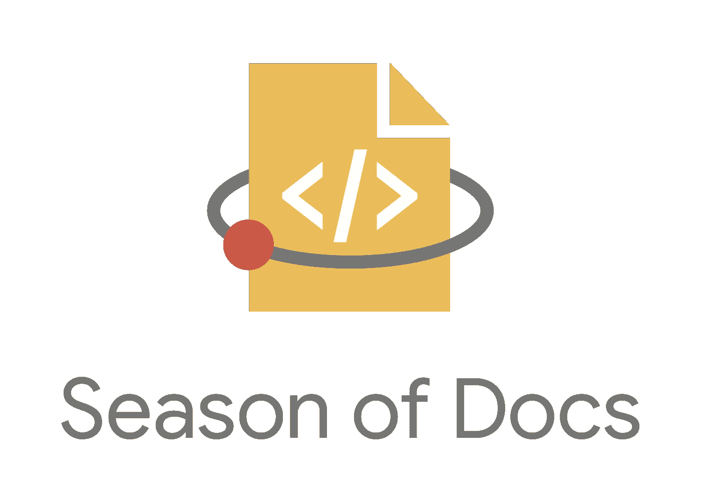

# 人工智能研究入门

> 原文：<https://towardsdatascience.com/getting-started-in-ai-research-a683e6845537?source=collection_archive---------45----------------------->

## 关于如何有助于确认一些最新论文的可重复性和加入开放搜索研究的指南。

菲利普·伯恩特在 [Unsplash](https://unsplash.com?utm_source=medium&utm_medium=referral) 上的照片

# 介绍

如今，对人工智能(AI)研究的关注每年都在增长，特别是在深度学习、强化学习和自然语言处理等领域(图 1)。

图 1:人工智能研究的增长[1]

人工智能的最新研究通常是在顶尖大学的研究小组和专注于研究的公司进行的，如 Deep Mind 或 Open AI，但如果你想在业余时间做出自己的贡献呢？

在这篇文章中，我们将探讨你可以采取的不同的方法，以便始终跟上最新的研究，以及如何提供你自己的贡献。

# 再现性挑战

影响人工智能研究领域的一个主要问题是可能无法有效地再现一些出版物中声称的模型和结果(再现性挑战)。

事实上，每年发表的许多研究文章只包含对被嘲笑的主题和开发的模型的解释，而没有源代码来重现他们的结果。研究人员有时可能会忽略这类信息的一些原因是:保持对其他机构的竞争优势、保密协议、将他们的研究转化为产品等…

为了使研究更容易获得并产生现实世界的影响，已经创建了不同的竞赛，以鼓励公众研究不同的出版物并试图再现他们的结果。这一领域最著名的两个竞赛是 [NeurIPS](https://reproducibility-challenge.github.io/neurips2019/) 和 [ICLR](https://reproducibility-challenge.github.io/iclr_2019/) 再现性挑战。如果你正在寻找任何实际的例子，我最近开始了一个关于这个主题的 [GitHub 知识库](https://github.com/pierpaolo28/Reproduced-Research-Papers/tree/master/Genetic%20Algorithms)。

此外，像代码为的[论文这样的网站最近已经创建，以便于找到已经公开代码的研究出版物。这样，任何人都可以完全免费地为自己的项目使用最先进的模型！](https://paperswithcode.com/)

 [## 带代码的论文——机器学习的最新进展

### 带代码的论文突出了 ML 研究的趋势和实现它的代码。

paperswithcode.com](https://paperswithcode.com/) 

# 医生的季节

“文档季”是 Google 组织的一项年度计划，旨在将技术作者与开源组织联系起来，以改进图书馆文档。

图 2:文档的季节[2]

事实上，通过加入该计划，作者将能够为诸如 Julia、Numpy、Matplotlib、Bokeh 等开源组织的文档做出贡献。

 [## 文档季|谷歌开发者

### 让我们把开源和技术作者社区聚集在一起，让双方都受益。我们一起提高意识…

developers.google.com](https://developers.google.com/season-of-docs) 

# GitHub 开源贡献

许多现在最流行的机器学习和深度学习库都可以在 GitHub 上获得，其中大多数都很乐意接受外部贡献者的帮助。一些流行的 GitHub 库的例子有许多问题和接受贡献者的拉请求:

*   [PyTorch](https://github.com/pytorch/pytorch)
*   [张量流](https://github.com/tensorflow/tensorflow)
*   [Keras](https://github.com/keras-team/keras)
*   [Scikit-learn](https://github.com/scikit-learn/scikit-learn)
*   [PySyft](https://github.com/OpenMined/PySyft)

如果你想探索更多可用的项目， [GitHub 集合](https://github.com/collections)是一个很好的起点(例如[机器学习](https://github.com/collections/machine-learning))。

# 两份会议记录文件

另一种保持与最新研究保持同步的方法是关注在线出版物，如[走向数据科学](https://towardsdatascience.com/)和关注研究的 YouTube 频道，如 Two Minute Papers。

 [## 两份会议记录文件

### 每个人都很棒的研究。每周两个新的科学视频。你会喜欢的！我们的链接:Web →…

www.youtube.com](https://www.youtube.com/channel/UCbfYPyITQ-7l4upoX8nvctg) 

事实上，这个 YouTube 频道每周都会为您回顾和总结一些最有趣的最新出版物，并提供演示和示例应用程序。

# 临时演员

最后，为了保持对人工智能的不断更新，其他可能的方法是:

*   关注该领域的重要人物，如[卡西·科济尔科夫](https://medium.com/u/2fccb851bb5e?source=post_page-----a683e6845537--------------------------------)、[安德烈·卡帕西](https://medium.com/u/ac9d9a35533e?source=post_page-----a683e6845537--------------------------------)和[吴恩达](https://medium.com/u/592ce2a67248?source=post_page-----a683e6845537--------------------------------)。
*   参加会议活动，如: [NeurIPS](https://nips.cc/) (神经信息处理系统) [ICLR](https://iclr.cc/) (国际学习表示会议) [ICML](https://icml.cc/) (国际机器学习会议) [AAAI](https://www.aaai.org/) (人工智能促进协会)等。
*   阅读策划期刊，如[distilt](https://distill.pub/)、 [Fermat's Library](https://fermatslibrary.com/journal_club) 和 [Papers We Love](https://paperswelove.org/) 。

如果你有任何可以添加到这个列表中的其他技术的建议，请在评论区告诉我！

希望你喜欢这篇文章，谢谢你的阅读！

# 联系人

如果你想了解我最新的文章和项目[，请在媒体](https://medium.com/@pierpaoloippolito28?source=post_page---------------------------)上关注我，并订阅我的[邮件列表](http://eepurl.com/gwO-Dr?source=post_page---------------------------)。以下是我的一些联系人详细信息:

*   [领英](https://uk.linkedin.com/in/pier-paolo-ippolito-202917146?source=post_page---------------------------)
*   [个人博客](https://pierpaolo28.github.io/blog/?source=post_page---------------------------)
*   [个人网站](https://pierpaolo28.github.io/?source=post_page---------------------------)
*   [帕特里翁](https://www.patreon.com/user?u=32155890)
*   [中等轮廓](https://towardsdatascience.com/@pierpaoloippolito28?source=post_page---------------------------)
*   [GitHub](https://github.com/pierpaolo28?source=post_page---------------------------)
*   [卡格尔](https://www.kaggle.com/pierpaolo28?source=post_page---------------------------)

# 文献学

[1]Yoav sho ham 等人的《人工智能指数 2018 年度报告》。艾尔。访问网址:[http://cdn . aiindex . org/2018/AI % 20 index % 202018% 20 annual % 20 report . pdf](http://cdn.aiindex.org/2018/AI%20Index%202018%20Annual%20Report.pdf)

[2] Reactome，Docs 的季节。访问地点:[https://reactome.org/about/news/136-season-of-docs](https://reactome.org/about/news/136-season-of-docs)