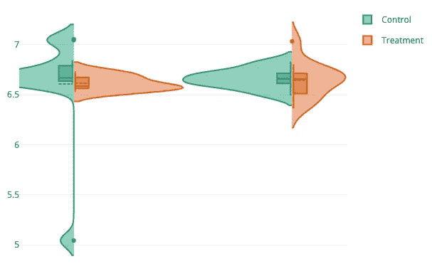
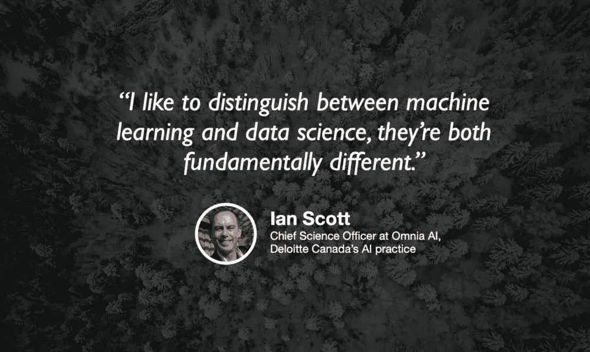
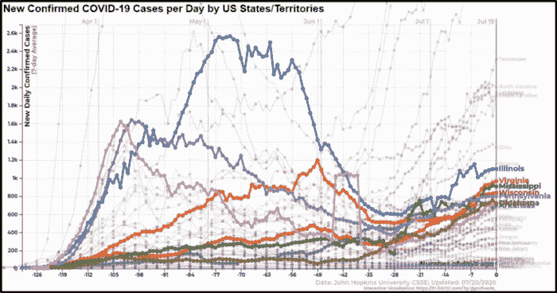

# 从 Ken Jee 开始学习数据科学

> 原文：<https://towardsdatascience.com/getting-started-in-data-science-with-ken-jee-98045a74651d?source=collection_archive---------71----------------------->

山姆·伯克的照片。

## [“你是如何开始机器学习和数据科学的？”【面试】](/howd-you-get-started-with-machine-learning-and-data-science-interview-693c33094c2)

由[丹尼尔·伯克](https://medium.com/u/dbc019e228f5?source=post_page-----98045a74651d--------------------------------) — 10 分钟阅读

有一天，绝对完整的活着的传奇人物，数据科学的负责人和令人难以置信的数据科学相关 YouTube 视频的创作者，Ken Jee 找到我，问我是否想合作一个(或两个)视频。

## [如何赋予您的微生物组数据生命](/how-to-give-life-to-your-microbiome-data-using-plotly-r-1892281183cf)

露丝·施密特 — 8 分钟阅读

我是一名微生物生态学家，这意味着我研究微生物如何相互作用及其环境。最近，我进入了数据科学的世界，这要感谢我从 Mitacs 获得的与数据分析和可视化公司 Plotly 合作的奖学金。

背景照片由[内森·奎洛兹](https://unsplash.com/@nathan030997)拍摄

## [德勤的数据科学](/data-science-at-deloitte-133457084a5)

由杰瑞米·哈里斯 — 3 分钟阅读

不同公司的数据科学看起来可能大相径庭，通常很难就数据科学家到底是什么这个问题达成一致意见。这就是为什么与在不同组织(从初创公司到企业)应用其技能的数据科学家交流如此重要。

## [在交互式可视化中最小化重叠标签](/minimizing-overlapping-labels-in-interactive-visualizations-b0eabd62ef0)

韦德·法詹-乌尔姆·施奈德——4 分钟阅读

用户控制和实时数据可视化最具挑战性的领域之一是标签放置。在我的许多可视化中，我试图设计标签不可能重叠的可视化——完全避免这个挑战性的问题——但在我最近的可视化中，这不是一个选项。