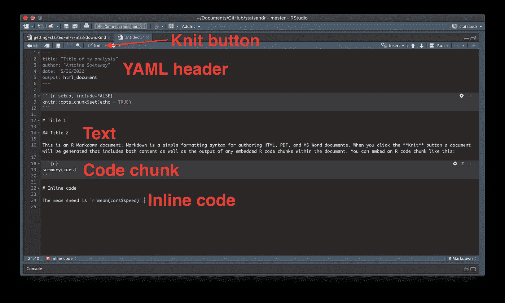

# R markdown 入门

> 原文：<https://towardsdatascience.com/getting-started-in-r-markdown-2d3de636bde3?source=collection_archive---------21----------------------->

## 如何在 R 中生成动态的、可复制的 PDF 或 HTML 文档


乔恩·泰森拍摄的照片

如果你花了一些时间用 R 编写代码，你可能听说过生成包含 R 代码、R 输出(结果)和文本或注释的动态报告。在本文中，我将解释 R Markdown 是如何工作的，并为您提供在制作这些动态报告时轻松入门所需的基本要素。

# R Markdown:什么、为什么和如何？

R Markdown 允许生成一个报告(大部分时间以 PDF、HTML、Word 或 beamer 演示的形式),该报告是从 RStudio 中编写的文件自动生成的。生成的文档可以作为您的分析的整洁记录，可以在详细和完整的报告中共享和发布。即使你从没想过要把结果展示给别人，它也可以作为一个个人笔记本来回顾，这样你就可以看到你当时做了什么。R Markdown 文件的扩展名为`.Rmd`，而 R script 文件的扩展名为`.R`。

与 R 相比，使用 R Markdown 的第一个主要优点是，在 R Markdown 文档中，您可以组合任何统计分析的三个重要部分:

*   r 代码显示分析是如何完成的。例如，您使用的数据和函数。这允许读者跟踪您的代码，并检查分析是否正确执行。
*   代码的结果，也就是分析的输出。例如，线性模型的输出、图或刚刚编码的假设检验的结果。这使得读者可以看到你的分析结果。
*   结果的文本、注释和解释。例如，在计算主要的[描述性统计数据](https://www.statsandr.com/blog/descriptive-statistics-in-r/)并绘制一些图表后，您可以在您的问题的上下文中解释它们并突出重要的发现。由于你的解释和评论，读者能够理解你的结果，就好像你写了一份文件来解释你的工作一样。

R Markdown 的另一个优点是报告是动态的，任何有权访问`.Rmd`文件(如果使用外部数据，当然还有数据)的人都可以复制，这使得它非常适合协作和结果的传播。所谓动态，我们的意思是，如果您的数据发生变化，您的结果和解释也会相应地发生变化，而无需您做任何工作。

报告的制作分两个阶段完成:

1.  包含 R 代码块(称为块)和文本的`.Rmd`文件被提供给`{knitr}`包，该包将执行 R 代码以获得输出，并创建 markdown ( `.md`)格式的文档。然后，这个文档包含 R 代码、结果(或输出)和文本。
2.  然后这个`.md`文件被基于 pandoc 的`markdown`包(即一个文档转换工具)转换成想要的格式(HTML、PDF 或 Word)。

# 开始之前

要创建一个新的 R Markdown 文档(`.Rmd`)，您首先需要安装并加载以下软件包:

```
install.packages(c("knitr", "rmarkdown", "markdown"))library(knitr)
library(rmarkdown)
library(markdown)
```

然后点击文件->新文件-> R Markdown，或者点击左上角带有绿色十字的白色小表格，然后选择`R Markdown`:


创建新的 R Markdown 文档

一个窗口将会打开，选择标题和作者，然后点击确定。默认的输出格式是 HTML。以后可以改成 PDF 或者 Word。


点击 OK 后，一个新的用作示例的`.Rmd`文件就创建好了。我们将使用这个文件作为我们更复杂、更个性化的文件的起点。

要将 R Markdown 文档编译成 HTML 文档，请点击顶部的`Knit`按钮:


编织一个 R 减价文件

出现 HTML 报告的预览，它也保存在您的工作目录中(参见什么是[工作目录](https://www.statsandr.com/blog/how-to-import-an-excel-file-in-rstudio/)的提示)。

# `.Rmd`文件的组成部分

R Markdown 文档的主要组成部分如下:



这些组件将在以下章节中详细介绍。

# YAML 头球

一个`.Rmd`文件以 YAML 头文件开始，由两个`---`序列包围。默认情况下，这包括报告的标题、作者、日期和格式。如果您想在 PDF 文档中生成报告，请将`output: html_document`替换为`output: pdf_document`。编译报告后(即编制文档后)，YAML 标题中的信息将出现在所生成报告的顶部。

要向您的文档添加目录，请将`output: html_document`替换为

```
output:
  html_document:
    toc: true
```

以下是我关于 HTML 文档格式的常用设置(如果你以 PDF 格式呈现文档，请删除`number_sections: true`之后的所有内容，因为 PDF 文档不接受 YAML 标题中的这些选项):

```
output:
  html_document:
    toc: true
    toc_depth: 6
    number_sections: true
    toc_float: true
    code_folding: hide
    theme: flatly
    code_download: true
```

除了添加目录外，它还设置了深度，添加了章节编号，向下滚动文档时目录是浮动的，默认情况下代码是隐藏的，使用了`flatly`主题，并增加了下载`.Rmd`文档的可能性。

甚至在编织文档之前，您就可以可视化您的目录，或者通过单击右上角的小图标直接转到特定部分。您的目录将会出现，单击一个部分即可转到您的`.Rmd`文档中的该部分:


可视化你的目录

除了这个增强的目录之外，我通常在 YAML 页眉中设置以下日期:


R 降价中的动态日期

这段代码允许我写下当前的日期，而不必自己修改。这对于持续几周或几个月的项目来说非常方便，因为在文档的顶部总是有一个更新的日期。

# 代码块

在 YAML 标题的下面，有一个第一代码块，用于你的**整个**文档的设置选项。目前最好就这样，如果需要的话，我们可以以后再换。

R Markdown 文档中的代码块用于编写 R 代码。每次你想包含 R 代码时，你都需要用三个反撇号把它括起来。例如，为了计算值 1、7 和 11 的平均值，我们首先需要通过点击位于顶部的`Insert`按钮并选择 R 来插入一个 R 代码块(见下图)，然后我们需要在刚刚插入的代码块中写入相应的代码:


在 R Markdown 中插入 R 代码块


代码块示例

在示例文件中，可以看到第一个 R 代码块(setup 代码块除外)包含了预加载数据集`cars` : `summary(cars)`的函数`summary()`。如果您查看从这个示例文件生成的 HTML 文档，您将会看到汇总度量就显示在代码块之后。

这个示例文件中的下一个代码块是`plot(pressure)`，它将产生一个绘图。尝试编写其他 R 代码并编织(即，通过单击编织按钮来编译文档)文档，以查看您的代码是否正确生成。

如果您已经用 R 脚本编写了代码，并且希望在 R Markdown 文档中重用它，那么您可以简单地将代码复制粘贴到代码块中。不要忘记总是将代码包含在代码块中，否则 R 会在编译文档时抛出错误。

如你所见，与我上面给出的平均值的代码块相比，该图的代码块中有两个额外的参数。字母`r`后面的第一个参数(两者之间没有逗号)用于设置块的名称。一般来说，不要为此费心，它主要用于指代特定的代码块。您可以删除程序块的名称，但是不要删除`{}`之间的字母`r`，因为它告诉 R 后面的代码对应于 R 代码(是的，您读得很好，这也意味着您可以包含来自另一种编程语言的代码，例如 Python、SQL 等。).

在块的名称之后(在示例文件中的`pressure`之后)，您可以看到有一个附加的参数:`echo=FALSE`。这个参数称为选项，表示您想要隐藏代码，只显示代码的输出。试着去掉它(或者改成`echo=TRUE`)，你会看到在编织文档之后，代码和输出都会出现，而之前只出现结果。

您可以为每个代码块单独指定是隐藏还是显示代码以及该代码的输出，例如，如果您希望显示某些代码块的代码，而不是其他代码块的代码。或者，如果您想总是隐藏/显示整个文档的代码和输出，您可以在位于 YAML 头后面的安装代码块中指定它。传递给此安装程序代码块的选项将决定所有代码块的选项，除了那些已被特别修改的代码块。

默认情况下，当您打开一个新的 R Markdown 文件时，唯一的设置选项是`knitr::opts_chunk$set(echo = TRUE)`，这意味着默认情况下，所有输出都将伴随有其相应的代码。如果您想只显示结果而不显示整个文档的代码，请用`knitr::opts_chunk$set(echo = FALSE)`替换它。通常传递给这个设置代码块的另外两个选项是`warning = FALSE`和`message = FALSE`，以防止在报告上显示警告和消息。如果要传递几个选项，不要忘记用逗号分隔它们:


代码块的几个选项

您也可以选择显示代码，但不显示结果。为此，传递选项`results = "hide"`。或者，使用选项`include = FALSE`，您可以防止代码和结果出现在完成的文件中，而 R 仍然运行代码，以便在以后的阶段使用它。如果你想阻止代码和结果出现，并且不想让 R 运行代码，使用`eval = FALSE`。要编辑图形的宽度和高度，使用选项`fig.width`和`fig.height`。另一个非常有趣的选项是`tidy = 'styler'`选项，它会自动[重新格式化输出中显示的 R 代码](https://www.statsandr.com/blog/rstudio-addins-or-how-to-make-your-coding-life-easier/#styler)。

在此查看所有选项及其描述[或通过运行`str(knitr::opts_chunk$get())`查看默认选项列表。](https://yihui.org/knitr/options/)

**提示**:在编写 R Markdown 时，你经常需要插入新的 R 代码块。要更快地插入新的 R 代码块，在 Windows 上按`CTRL + ALT + I`或在 Mac 上按`command + option + I`。如果你对这些让你更有效率的快捷方式感兴趣，请看 R Markdown 中的其他[提示和技巧。](https://www.statsandr.com/blog/tips-and-tricks-in-rstudio-and-r-markdown/)

请注意，如果您想检查某个特定代码块的结果，代码块可以在不需要编译整个文档的情况下运行。为了运行特定的代码块，选择代码并像在 R 脚本(`.R`)中一样运行它，方法是单击 run 或按 Windows 上的`CTRL + Enter`或 Mac 上的`command + Enter`。这个代码块的结果将直接显示在 R Markdown 文档中，就在代码块的下面。

# 文本

文本可以添加到代码块之外的任何地方。R Markdown 文档使用 Markdown 语法来格式化文本。在我们的示例文件中，就在安装代码块的下面，插入了一些文本。要插入文本，您只需简单地编写没有任何封闭的文本。尝试添加一些句子并编织文档，看看它在 HTML 文档中是如何出现的。


R 代码块示例下面的文本示例

Markdown 语法可用于更改出现在输出文件中的文本格式，例如将某些文本格式化为*斜体*粗体**粗体**等。下面是一些常见的格式化命令:

*   标题:`# Title`
*   字幕:`## Subtitle`
*   子标题:`### Subsubtitle`。如果您包含目录，这些标题将自动包含在目录中。
*   *斜体* : `*italics*`或`_italics_`
*   **加粗** : `**bold**`或`__bold__`
*   [链接](https://www.statsandr.com/) : `[link](https://www.statsandr.com/)`(如果是外部 URL，不要忘记`https://`)
*   方程式:

用一个`$`将你的方程式(用 LaTeX 写的)附在正文中:

```
$A = \pi*r^{2}$
```

这是一个众所周知的等式 a =π∫r^2.

用两个`$$`把你的 LaTeX 方程括起来，让它集中在新的一行上:

```
$$A = \pi*r^{2}$$
```

这是另一个众所周知的等式:


列表:

*   无序列表，项目 1: `* Unordered list, item 1`
*   无序列表，项目 2: `* Unordered list, item 2`

1.  有序列表，项目 1: `1\. Ordered list, item 1`
2.  有序列表，项目 2: `2\. Ordered list, item 2`

# 文本中的代码

在继续之前，我想介绍一下 R Markdown 的一个重要特性。通常情况下，当撰写解释或详细分析时，我们希望在文本中直接引用结果。例如，假设我们在`iris`数据集上工作(预加载在 R 中)。我们可能要用文字解释，花瓣长度的平均值是某个值，而中位数是另一个值。

如果没有 R Markdown，用户将需要计算平均值和中值，然后手动报告。由于 R Markdown，可以直接在文本中报告这两个[描述性统计数据](https://www.statsandr.com/blog/descriptive-statistics-by-hand/)，而无需手动编码。更好的是，如果数据集因为我们删除了一些观察值而发生了变化，那么生成的文档中报告的平均值和中值将会自动变化，而我们这边的文本不会有任何变化。

我们可以通过放置一个反撇号、字母`r`、空格、代码，然后用另一个反撇号结束它，直接在解释(即文本)中插入结果:


R Markdown 中的内联代码

以下是一个句子中整合的`iris`数据集的萼片长度的平均值和中值:


内联代码和文本的示例

文本和代码的组合将在生成的报告中给出以下输出:

> *萼片长度的平均值为 5.8433333，标准差为 0.8280661。*

这种技术被称为*内联代码*，允许您将结果直接插入到 R Markdown 文档的文本中。如前所述，如果数据集发生变化，包含在文本中的结果(在我们的例子中是平均值和标准偏差)将自动调整到新的数据集，就像数据集发生变化时代码块的输出会动态更新一样。

这种内联代码技术，以及可以组合代码、代码输出和文本来注释输出的事实，使得 R Markdown 成为我进行统计分析时最喜欢的工具。自从我发现了 R Markdown 的强大功能(我仍在学习，因为它有大量的可能性和特性)，我几乎再也不用脚本编写 R 代码了。我写的每一个 R 代码都由 R Markdown 文档中的文本和内联代码补充，从而产生一个专业而完整的最终文档，可以随时共享、发布或存储以供将来使用。如果您对这种类型的文档不熟悉，我邀请您了解更多，并在您的下一个分析中尝试一下，您很可能不会再使用 R 脚本了。

# 突出显示文本，就像它是代码

除了内联代码技术之外，您可能希望在生成的报告中让一些文本看起来像是一段代码，而不是实际运行它。

为此，用反勾号(内联代码使用的同一个反撇号)将文本括起来，不带字母`r`。写下以下内容:


将在生成的报告中生成以下内容:

> *例如，在这句话中，我想突出显示数据帧* `*iris*` *中的变量名* `*Species*` *，就好像它是一段代码。*

单词“物种”和“鸢尾”出现并被突出显示，就好像它是一段代码。

# 形象

除了代码、结果和文本，您还可以在最终文档中插入图像。要插入图像，请将其放在工作目录中，并放在代码块之外，编写:

``

请注意，文件/url 路径没有用引号括起来。要为您的图像添加替代文本，请将其添加到方括号`[]`之间:

``

# 桌子

在 R Markdown 文档中插入表格有两个选项:

1.  `{knitr}`包中的`kable()`功能
2.  `{pander}`包中的`pander()`功能

下面是一个没有任何格式的表格示例，同样的代码在`iris`数据集上应用了两个函数:

```
# without formatting
summary(iris)##   Sepal.Length    Sepal.Width     Petal.Length    Petal.Width   
##  Min.   :4.300   Min.   :2.000   Min.   :1.000   Min.   :0.100  
##  1st Qu.:5.100   1st Qu.:2.800   1st Qu.:1.600   1st Qu.:0.300  
##  Median :5.800   Median :3.000   Median :4.350   Median :1.300  
##  Mean   :5.843   Mean   :3.057   Mean   :3.758   Mean   :1.199  
##  3rd Qu.:6.400   3rd Qu.:3.300   3rd Qu.:5.100   3rd Qu.:1.800  
##  Max.   :7.900   Max.   :4.400   Max.   :6.900   Max.   :2.500  
##        Species  
##  setosa    :50  
##  versicolor:50  
##  virginica :50  
##                 
##                 
### with kable()
library(knitr)
kable(summary(iris))
```


```
# with pander()
library(pander)
pander(summary(iris))
```


`pander()`相对于`kable()`的优势在于，它可以用于比 table 更多的不同输出。尝试你自己的代码，例如线性回归或简单向量的结果。

# 附加说明和有用的资源

对于更高级的用户来说，R Markdown 文件也可以用来创建[闪亮的应用](https://www.statsandr.com/tags/shiny/)、网站(这个网站的建立得益于 R Markdown 和`{blogdown}`包)，根据几个国际期刊的模板写科学论文(用`{rticles}`包)，甚至写书(用`{bookdown}`包)。

要继续了解 R Markdown，请查看 R 工作室团队的两个完整的备忘单[这里](https://rstudio.com/wp-content/uploads/2015/02/rmarkdown-cheatsheet.pdf)和[这里](https://rstudio.com/wp-content/uploads/2015/03/rmarkdown-reference.pdf)，以及由 Yihui Xie、J. J. Allaire 和 Garrett Grolemund 编写的更完整的指南[这里](https://bookdown.org/yihui/rmarkdown/)。

感谢阅读。我希望这篇文章能说服你在未来的项目中使用 R Markdown。查看 R Markdown 中的更多[提示和技巧](https://www.statsandr.com/blog/tips-and-tricks-in-rstudio-and-r-markdown/)以进一步提高 R Markdown 的效率。

和往常一样，如果您有与本文主题相关的问题或建议，请将其添加为评论，以便其他读者可以从讨论中受益。

**相关文章:**

*   [聚类分析完全指南:k-means 和手动和 in R 系统聚类](https://www.statsandr.com/blog/clustering-analysis-k-means-and-hierarchical-clustering-by-hand-and-in-r/)
*   [安装和加载 R 包的有效方法](https://www.statsandr.com/blog/an-efficient-way-to-install-and-load-r-packages/)
*   我的数据符合正态分布吗？关于最广泛使用的分布以及如何检验 R 中的正态性的注释
*   [R 中的 Fisher 精确检验:小样本的独立性检验](https://www.statsandr.com/blog/fisher-s-exact-test-in-r-independence-test-for-a-small-sample/)
*   [R 中独立性的卡方检验](https://www.statsandr.com/blog/chi-square-test-of-independence-in-r/)

*原载于 2020 年 2 月 18 日 https://statsandr.com**[*。*](https://statsandr.com/blog/getting-started-in-r-markdown/)*