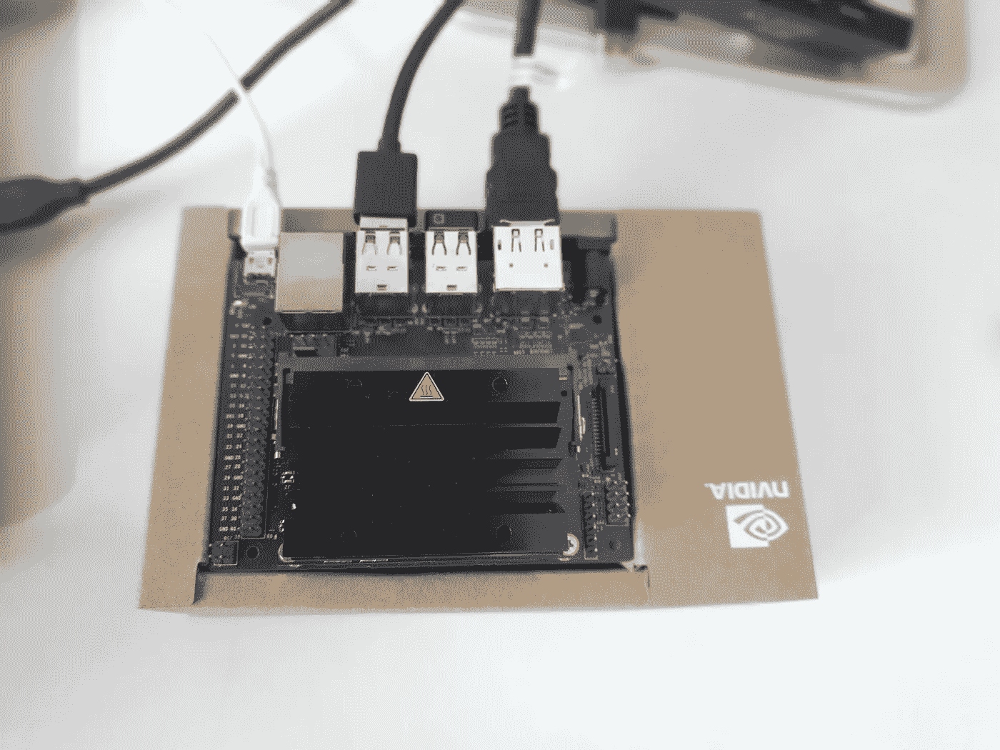

# 入门:Nvidia Jetson Nano，对象检测和分类

> 原文：<https://towardsdatascience.com/getting-started-nvidia-jetson-nano-object-detection-and-classification-161ad566d594?source=collection_archive---------17----------------------->

## 设置 Jetson Nano 进行物体检测的分步指南



Nvidia Jetson Nano

## 边缘计算的未来

由于传感器技术、网络连接和人工智能(AI)的发展，边缘计算预见到指数级[增长](https://www.grandviewresearch.com/industry-analysis/edge-computing-market)。对物联网、人工智能和数字化的大肆宣传已经让企业和政府机构做好准备，将这一技术作为真正的问题解决代理。随着新冠肺炎进一步[推动](https://enterprisersproject.com/article/2020/4/7-edge-computing-trends-watch-2020)数字化转型的需求，对于解决社会面临的一些问题，将会有更大的需求和期望。积极的一面是，我们看到了边缘计算领域新的[发展](https://medium.com/@ikbangesh/comparison-of-jetson-nano-google-coral-and-intel-ncs-edge-ai-aca34a62d58)，旨在解决延迟、隐私、可靠性和带宽方面的挑战。

存在不同的边缘计算平台。在本帖中，我们将介绍 Nvidia Jetson Nano 的安装过程。可以在 Nvidia 提供的[链接](https://developer.nvidia.com/embedded/learn/get-started-jetson-nano-devkit#intro)上找到详细的指南。然而，我使用了硬件和方法的组合，可以给出不同的见解。实验设置包括 Nvidia Jetson Nano、USB 摄像头、Gstreamer-CLI、分类和对象检测算法。

## 正在准备 SD 卡映像

1.  最好选择 32 GB SD 卡，使用 [SD 卡格式化器](https://www.sdcard.org/downloads/formatter/)对 SD 卡进行格式化。
2.  从 Nvidia [链接](https://developer.nvidia.com/jetson-nano-sd-card-image)下载图像
3.  使用 [BalenaEtcher](https://www.balena.io/etcher/) 在 SD 卡上刻录/蚀刻图像
4.  打开蚀刻软件 BalenaEtcher 并选择下载的图像
5.  闪现图像。
6.  当卡显示 100%完成时，卸载卡。

## 设置 Jetson Nano

1.  将 SD 卡插入捷信纳米板
2.  按照安装步骤，选择用户名、语言、键盘和时间设置。
3.  登录杰特森纳米
4.  使用 v4l-utils 安装媒体设备包。v4l-utils 是一系列用于处理媒体设备的软件包。

```
sudo apt-get update 
sudo apt-get install v4l-utils
```

5.检查连接的 USB 摄像头、支持的格式和分辨率。这些信息将有助于视频和图像数据处理。

```
v4l2-ctl --list-devices --list-formats
v4l2-ctl --list-formats-ext
```

6.检查摄像机是否退出。我会检查 id 为 0 的相机。

```
ls /dev/video0 
```

7.使用其中一个命令检查相机属性，更多[细节](https://www.mankier.com/1/v4l2-ctl)

```
v4l2-ctl — list-formats-ext — device /dev/video0
v4l2-ctl -d /dev/video0 -D 
v4l2-ctl -d 0 -D
```

## gstreamer:Jetson Nano 上的 USB 摄像头

jetson 的默认映像安装了 GStreamer。在示例中，我们将使用 USB 摄像头，并且我们已经安装了 v4l2 驱动程序(v4l2src)。由于本例中的摄像头是流 MJPG，我们必须在 device=/dev/video0 之前使用 pad `jpegdec` ，然后开始在管道中添加其他元素。下面的 GStreamer 管道将显示一个摄像机实时流。

```
gst-launch-1.0 -v v4l2src device=/dev/video0 ! jpegdec ! video/x-raw,framerate=30/1,width=1280,height=720 ! videoconvert ! xvimagesink 
```

在[链接](https://medium.com/lifesjourneythroughalens/implementing-gstreamer-webcam-usb-internal-streaming-mac-c-clion-76de0fdb8b34)可以找到一些好的资源。

# 设置 Jetson Nano 进行推理:对象检测和分类

在进行下一步之前，请检查对话框包的安装。对话框包将下载 CMake 中的模型。

```
sudo apt-get update sudo apt-get update
sudo apt-get install dialog
sudo apt-get install git cmake libpython3-dev python3-numpy 
git clone --recursive [https://github.com/dusty-nv/jetson-inference](https://github.com/dusty-nv/jetson-inference)
cd jetson-inference 
mkdir build $ cd build
cmake ../  # Make choice for the models. If the models are not downloading, make sure you have installed the dialog. Still see problems, please use link [https://github.com/dusty-nv/jetson-inference/releases](https://github.com/dusty-nv/jetson-inference/releases)
```


用于模型选择的对话窗口

```
make
sudo make install
sudo ldconfig
```

# 运行推理:对象分类和检测

在终端中，键入

```
cd /jetson-inference/build/aarch64/bin 
```

*   图像分类示例

```
./imagenet-console.py --network=googlenet images/orange_0.jpg output_0.jpg 
```

*   USB 摄像头馈送的分类示例

```
./imagenet-camera.py --camera=/dev/video0 
```

*   对象(行人)检测示例。
    V4L2 USB 摄像机通过指定其/dev/video 节点(/dev/video0，/dev/video1 等)来使用。).通过指定传感器索引(0 或 1 等)来使用 MIPI CSI 摄像机。)详见[链接](https://github.com/dusty-nv/jetson-inference/blob/master/docs/imagenet-camera-2.md)。

```
./detectnet-camera.py --network=pednet --camera=/dev/video0 
```

由于活跃的社区，有许多[例子](https://github.com/dusty-nv/jetson-inference/blob/master/README.md#code-examples)都是开源代码。

*   使用 SSD-Mobilenet-v2 进行对象检测

```
./detectnet-camera.py --network=ssd-mobilenet-v2 --camera=/dev/video0 
```


*   可以使用以下方式查看资源利用率

```
top or htop
```


资源利用


计时报告

*   表演

23-26 帧/秒

# 硬件和软件

NVIDIA Jetson Nano 开发者套件
32GB Scandisk Ultra SD card
微软 USB LifeCam 1080p HD(网络摄像头)
Raspberry Pi 官方通用电源 2.5A

发行商 ID: Ubuntu
描述:Ubuntu 18.04.3 LTS
发布时间:18.04
代号:仿生

**相关文章:**

[](/nvidia-jetson-nano-vs-google-coral-vs-intel-ncs-a-comparison-9f950ee88f0d) [## NVIDIA Jetson Nano vs Google Coral vs Intel NCS。比较

### 用于计算机视觉和机器学习的边缘人工智能硬件加速器

towardsdatascience.com](/nvidia-jetson-nano-vs-google-coral-vs-intel-ncs-a-comparison-9f950ee88f0d) [](/opencv-with-gstreamer-and-qt-on-windows-6f0fdb075993) [## 在 Windows 上使用 GStreamer 和 QT 的 OpenCV

### 使用 OpenCV 的 GStreamer 管道的分步指南和实例

towardsdatascience.com](/opencv-with-gstreamer-and-qt-on-windows-6f0fdb075993)