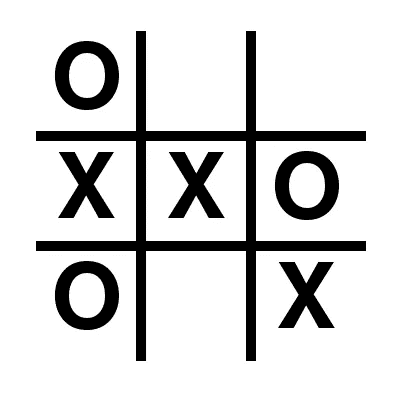
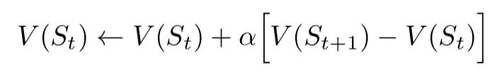
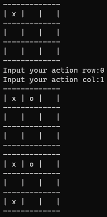

# 强化学习入门—井字游戏

> 原文：<https://towardsdatascience.com/getting-started-to-reinforcement-learning-tic-tac-toe-f1d32d53acb4?source=collection_archive---------45----------------------->

## 实现一个简单的双代理强化学习模型

想象你自己试图通过选择一系列活动(学习、疯狂观看、做白日梦)来最大化你的日常生产力。在这里，你是试图获得最大回报的代理人。生产力)通过选择一组合理的*行动。*你选择的每一个行动都会把你带到一个新的*状态*(例如，选择狂看而不是训练你的 RL 模型会影响你的情绪，这将进一步削弱你的生产力)。

强化学习(RL)很好地抓住了这个想法。它关注的是代理人如何通过采取特定的行动来最大化他们的奖励功能。每一个动作及其对应的奖励都会产生一种新的状态，这种新的状态会影响后续的动作-奖励交互。当我们开始实现我们自己的 RL 模型时，这些概念将变得更加清晰，这个模型可以和我们一起玩井字游戏。我们开始吧！

# **在 RL 世界中构建井字游戏**

图 1:井字游戏板设置

井字游戏的目标是第一个在水平、垂直或对角线排列中放置标记(十字或十字)。现在，让我们根据前面提到的 RL 关键字来定义游戏:

1.  *代理*涉及两个井字游戏玩家，他们试图通过轮流放置标记来智胜对方，
2.  *奖励*指的是获胜代理人获得的任意值，
3.  *动作*规定每个代理只允许在一个空盒子中放置他们相应的标记，
4.  *状态*是每回合后井字游戏棋盘的配置，直到游戏以赢或平结束。

# 国家

我们将初始化`State`类，它将监视每个代理如何交互、接收奖励和玩游戏。

这里我们用 0 初始化一个 3x3 的棋盘，2 个玩家和第一个开始游戏的玩家。`isEnd`是一个标志，表示游戏是否还可以继续，或者已经确定了获胜者。每个玩家被分配一个特定的`playerSymbol`，其中`p1`用 1 和`p2` -1 表示。

`getHash`是一个方便的功能，可以使电路板配置变平，便于以后的分析。输出形状从(3，3)转换为(9)。`getAvailablePosition`将获取棋盘上尚未被占据的箱子集合，因此可用于下一步棋。

在为代理定义了可用的动作空间之后，我们需要定义如何确定获胜者(这将打破边玩边循环)。这里，每轮游戏后可以获得 4 种可能的`break`结果:*列赢、行赢、对角赢、和棋*。

每次成功执行一个动作后，`updateStates`将使用当前的`playerSymbol`更新板卡配置。下一个玩家将会被选出来继续游戏。如果游戏结束(无论是赢还是平)，`giveReward`将输入一个任意值(即。赢的玩家得 1 分，输的玩家得 0 分，平局的情况下两者都得 0.1–0.5 分)。

# 代理人

现在让我们初始化`Agent`类来指定它们的行为(选择一个最大化奖励的动作，计算奖励)

以下超参数需要更多解释:

1.  `lr (learning_rate)`每个代理完成学习的速度，
2.  `decay_gamma`每回合奖励衰减的因子(即。迫使代理人以最少的可能移动赢得胜利，因为以更多的移动赢得胜利会导致*衰减的*奖励，
3.  `exp_rate`探索率，允许代理选择可用的随机位置，而不是贪婪地从当前学习的策略集合中寻找(利用)最佳的可能下一步行动。较高的值允许代理人的决策有更多的随机性。

`states`将存储给定游戏中每个玩家的棋盘配置列表，而`states_val`是一个键值字典，保存与特定棋盘配置/状态(‘key’)相关联的奖励(‘value’)。

然后我们定义`chooseAction`，它允许代理人或者*探索*(选择随机动作)或者*利用*(在给定当前棋盘配置/状态的情况下，选择具有最大回报的动作)。

代理采取行动后，`addStates` 会将结果板配置添加到`states`。当游戏结束时，`feedReward`会以一种(1)相反的方式给每个配置分配一个奖励:最新的移动/状态优先；以一种(2)折扣/衰减的方式:惩罚更多的移动。

图 2:值迭代(针对强化学习问题)

`feedReward`计算与特定状态相关的值(即 states_val)通过*累加* *当前值和给定学习率下一个和当前状态之间的折扣/衰减差(图 2)。*

对于内务处理，我们将保存训练过的策略，并在以后使用训练过的 RL 机器人时加载它们！:)

# 让机器人玩吧！

在定义了`States`和`Player`类之后，我们将实现游戏的实际运行！

`playBot`函数在`State`类中定义，作为我们玩游戏的逻辑。两位玩家将轮流选择一个动作(随机或贪婪)，直到选出一个赢家。奖励将根据我们之前定义的价值分配给两个代理。

# 让人类去玩吧！

在策略被保存后，现在是我们和我们训练过的机器人比赛的时候了！我们首先需要稍微修改之前定义的`playBot`函数来加载学习到的策略(让 bot 使用它之前学习到的智能！)

此外，我们还需要稍微修改一下`HumanPlayer`的定义:通过用户输入选择下一组动作！

图 3:我们试图击败超级机器人！

就这样，很酷吧？祝你训练愉快！你可以在这里查看完整代码和文档:[代码](https://github.com/juannat95/reinforcement_learning_projects/tree/master/tic-tac-toe)。

***做订阅我的邮件简讯:***[*https://tinyurl.com/2npw2fnz*](https://tinyurl.com/2npw2fnz)****在这里我定期用通俗易懂的语言和漂亮的可视化方式总结 AI 研究论文。****

# *参考*

*[1][https://github . com/JaeDukSeo/reinforcement-learning-an-introduction](https://github.com/JaeDukSeo/reinforcement-learning-an-introduction)*