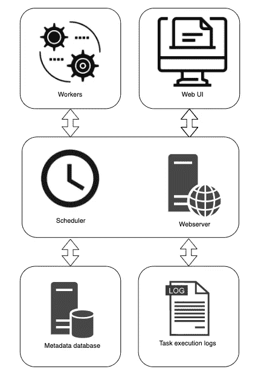
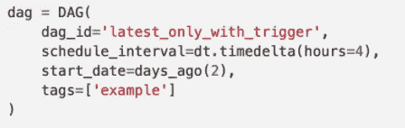
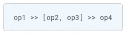
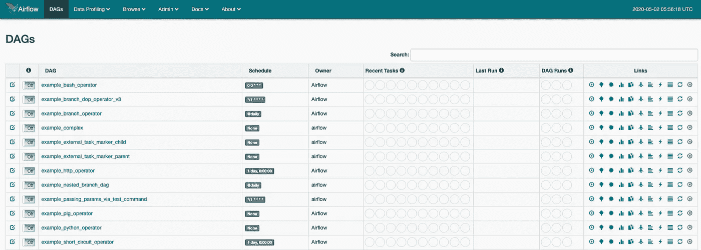

# 从本地和远程开始使用气流

> 原文：<https://towardsdatascience.com/getting-started-with-airflow-locally-and-remotely-d068df7fcb4?source=collection_archive---------6----------------------->

## 气流已经存在了一段时间，但最近它获得了很大的牵引力。那么什么是气流呢？怎么用呢？以及如何在本地和远程设置？


[图像信用](https://en.wikipedia.org/wiki/Apache_Airflow)

# 为什么是气流？

Airflow 是 AirBnB 于 2014 年开发并开源的工作流管理平台，旨在帮助该公司管理其复杂的工作流。快进到今天，数百家[公司](https://github.com/apache/airflow#who-uses-apache-airflow)正在利用气流管理他们的软件工程、数据工程、ML 工程管道。

Airflow 的开发遵循了四个原则，即可伸缩性、动态性、可扩展性和优雅性。**可扩展**意味着您可以毫不费力地横向扩展您的管道。**动态**意味着动态管道生成，**可扩展**意味着您可以轻松编写您的自定义操作符/集成。最后，**优雅的**意味着你可以通过参数和 Jinja 模板使你的管道简洁明了。



气流架构(我对气流文档的解释)

以下是气流的一些特征:

*   **用纯 Python 开发:**只用 Python 开发你的管道，Python 是数据科学家和数据工程师的首选语言。
*   **有用的用户界面:**气流用户界面有助于可视化您的工作流程，并为您的管道提供可见性。
*   **大量集成:**air flow 可能已经与您的数据系统集成。一些值得注意的集成包括 AWS、GCP、Spark 和大多数 SQL 数据库。
*   **易于使用:**任何懂 Python 的人都可以创建带有气流的管道，用于各种目的，包括数据工程师管道，自动构建机器学习模型，或者基础设施自动化。

您可以使用 Airflow 构建和自动化各种系统，它在数据专业人员中尤其受欢迎。几年前，我开始使用 Airflow 为我们公司在 GCP 的数据湖编排 ETL 过程。它已经成为我工具箱中必不可少的一部分。

# 你能用气流做什么？

通俗地说，气流是一个编排工具，这意味着它会按计划触发任务，或者在某些事件发生时(如 API 调用或传感器操作员感知到某个动作时)触发任务。以下是气流的一些可能使用案例:

*   替换 cron 作业:监控 cron 作业既困难又繁琐。您可以通过 UI 直观地查看您的代码是否运行，并让 Airflow 在作业失败时通知您，而不是手动 ssh 到服务器来找出您的作业是否/为什么失败。
*   **提取数据:** Airflow 具有许多集成，大量用于数据工程任务。您可以编写任务来从生产数据库中提取数据，检查数据质量，并将结果写入您的云上数据仓库。
*   **转换数据:**您可以与外部服务接口来处理您的数据。例如，您可以有一个管道向 EMR 提交一个作业，用 Spark 在 S3 处理数据，并将结果写入您的红移数据仓库。
*   **训练机器学习模型:**你可以从数据仓库中提取数据，进行特征工程，训练模型，并将结果写入 NoSQL 数据库，供其他应用程序使用。
*   **从互联网上抓取数据:**你可以编写任务来定期从互联网上抓取数据并写入你的数据库。例如，你可以从你公司的脸书页面获得每日竞争对手的价格或所有评论。

可能性是无限的。

# 词汇表

在我们继续设置气流之前，让我们看看一些基本的术语。

## 熟练的技艺

DAG 是有向无环图的首字母缩写，这是一种描述有向且不形成循环的图的奇特方式(后面的节点从不指向前面的节点)。可以把 Airflow 中的 DAG 想象成一个有节点(DAG 中的任务，比如“start”、“section-1-task-1”、…)和边(箭头)的管道。


气流 Dag 示例([来源](https://blog.invivoo.com/apache-airflow-what-it-is/))

您可以使用 Python 定义 dag，并且可以为 DAG(管道)设置各种属性。例如开始日期、结束日期、执行时间表等。



Python 中的 dag 定义

## 操作员、传感器、任务

操作员定义了在一个任务中完成什么。一些示例操作符是 PythonOperator(执行 python 脚本)、BashOperator(运行 bash 脚本)…

传感器是等待特定事件发生的操作员。例如，一个文件被写入 S3 桶，一个数据库行被插入，或者一个 API 调用发生。

任务只是一个实例化的操作符。在您的 dag 定义中，您可以使用 Python 代码定义任务依赖关系。即在任务 A 之后执行 B，C，在任务 B，C 之后执行 D。



任务相关性定义的示例

# 安装和设置

气流相当复杂，从上面的架构可以看出。对于本地开发，我们不需要架构中的所有组件，但是对于部署到服务器，我们当然需要所有组件。让我们先来看看局部安装气流

## 用于开发的本地安装

1.  创建一个空气流通的环境(可选，但推荐):您可以使用以下命令轻松创建一个有 [Anaconda](https://docs.anaconda.com/anaconda/install/) 的环境:

```
conda create -n airflow python=3.7
conda activate airflow
```

2.用 pip 安装气流

```
pip install -U apache-airflow
```

3.创建一个文件夹，并将其设置为气流主页

```
mkdir -p ~/airflow/dags
export AIRFLOW_HOME='~/airflow'
export PATH=$PATH:~/.local/bin
```

4.启动气流。初始化后，您可以在`airflow.cfg`中调整气流设置

```
cd ~/airflow
airflow initdb
```

5.启动气流调度程序

```
airflow scheduler
```

6.在新的终端窗口中启动 airflow webserver

```
# Activate airflow env if needed
conda activate airflow
airflow webserver
```

就是这样。

现在，如果您在`localhost:8080`访问您的 web 浏览器，您将能够看到加载了许多示例的 Airflow UI。您可以触发一些 Dag，它将在您的本地机器上运行。参考示例 Dag 将有助于开发新的 Dag。



本地主机的气流 UI:8080

现在你可以在目录`~/airflow/dags/`中定义一个新的 DAG 文件，Airflow 会将你的 DAG 渲染到 UI 中。我将为下一篇文章保存定义 DAG 的指令。现在，让我们看看如何将气流部署到服务器。

## 部署到服务器

如前所述，Airflow 的架构很复杂，从头开始设置所有组件既麻烦又容易出错。幸运的是，我们可以使用 Docker 毫不费力地将 Airflow 架构中的所有组件部署到服务器上。

1.  SSH 到您的服务器，并确保 Docker 已安装。如果不是，你将不得不安装`Docker`和`docker-compose`来使其工作。有很多在不同操作系统上安装 Docker 的指南，你可以简单地谷歌一下如何安装。
2.  在本指南中，我在这个[回购](https://github.com/puckel/docker-airflow)中使用由`puckel`管理的`docker-airflow`。我建议你把回购分叉到你的 GitHub 账户，把分叉的回购克隆到远程服务器。

```
# Replace the URL with your forked repo
git clone [https://github.com/puckel/docker-airflow](https://github.com/puckel/docker-airflow)
```

3.配置气流:在 repo 中，你会发现一个名为`docker-compose-CeleryExecutor.yml`的文件，这是 docker 为你的气流部署编写的配置文件。

*   为了安全起见，请确保您更改了所有默认的用户名和密码。
*   取消如下所示的三行注释，将元数据数据库文件保存到系统文件中

```
# Uncomment these lines to persist data on the local filesystem.                
  - PGDATA=/var/lib/postgresql/data/pgdata        
volumes:
  - ./pgdata:/var/lib/postgresql/data/pgdata
```

*   将以下代码添加到 webserver、worker 和 scheduler 的环境变量中，以启用基本登录。请注意，您必须使用以下[脚本](https://github.com/salt-formulas/salt-formula-airflow/blob/master/airflow/files/create_user.py)或使用 Airflow CLI 创建一个管理员用户。

```
- AIRFLOW__WEBSERVER__AUTHENTICATE=True- AIRFLOW__WEBSERVER__AUTH_BACKEND=airflow.contrib.auth.backends.password_auth
```

4.创建`.env`和`requirements.txt`(可选):您可以在 repo 中创建这两个文件。您可以在`.env`和`.requirements.txt`中为您的气流部署存储环境变量。通过将以下内容添加到 webserver、worker 和 scheduler 的卷中，确保将它们公开给容器。

```
- ./requirements.txt:/requirements.txt
```

5.启动容器:现在我们已经完成了所有的配置，您可以使用下面的命令启动容器。查看`docker-compose` [文档](https://docs.docker.com/compose/reference/)了解更多您可以使用的命令。

```
docker-compose -f docker-compose-CeleryExecutor.yml up
```

6.创建一个`Makefile`以便于管理(可选):您可以创建一个 Makefile 来发布长而重复的命令。看看下面我的:

```
up:. ./.env && docker-compose -f docker-compose-CeleryExecutor.yml uprun:. ./.env && docker-compose -f docker-compose-CeleryExecutor.yml up -d --scale worker=2 && docker-compose logs -tfdown:docker-compose -f docker-compose-CeleryExecutor.yml downrestart:docker-compose down && . ./.env && docker-compose up -d --scale worker=2logs:docker-compose logs -tf
```

这样，您可以简单地运行`make up`来启动容器，`make down`来停止，然后`make restart`来重启。

# 摘要

在这篇文章中，我将带你了解什么是气流，为什么，以及我们如何使用气流。我还展示了如何在本地安装和运行 Airflow，以及如何为远程服务器配置它。

希望你今天学到了一些东西:)