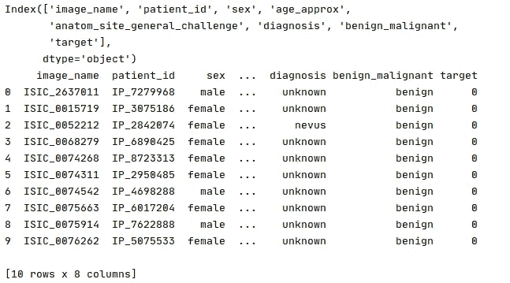
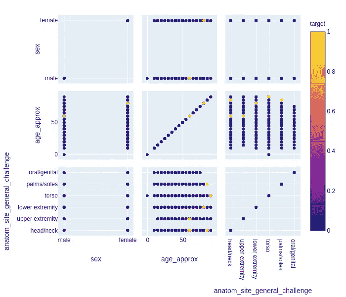
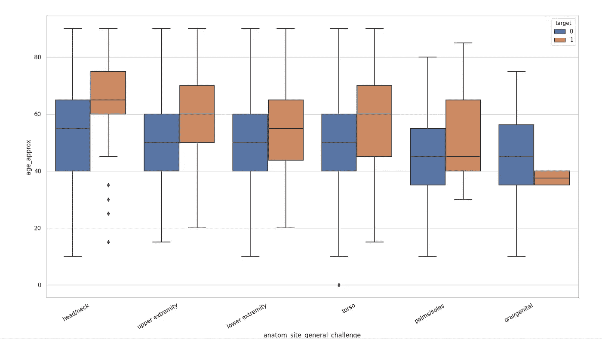
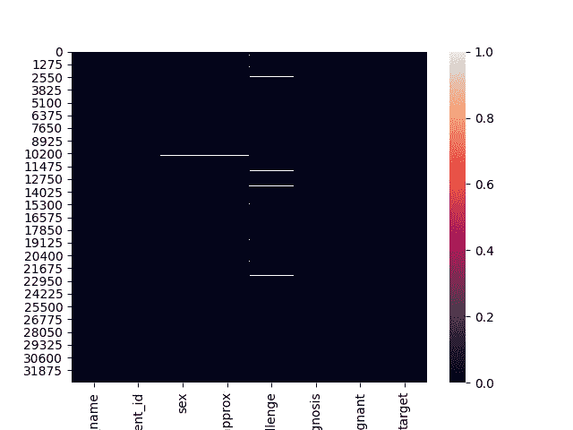
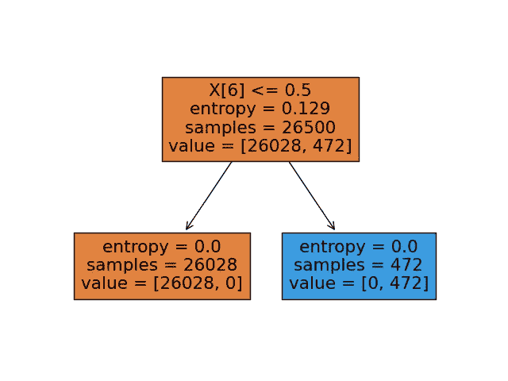

# 开始分析医疗保健中的表格数据

> 原文：<https://towardsdatascience.com/getting-started-with-analyzing-tabular-data-in-healthcare-d02041aae468?source=collection_archive---------71----------------------->

## 除了使用 Kaggle 提供的图像数据之外，还使用表格数据为医疗保健部门做出更明智的决策带来了挑战。

演职员表:弗兰基·查马基在 [Unsplash](https://unsplash.com/s/photos/healthcare-data?utm_source=unsplash&utm_medium=referral&utm_content=creditCopyText) 上的照片

如今，随着医疗保健领域中成熟的计算机视觉方法的使用越来越多，其他类型(如表格数据)的正确使用并不广为人知。使用与图像数据一起出现的现有数据的优点是，它可以用于得出关于整个场景的更好的结论。对于本教程，我们将使用[皮肤黑色素瘤数据集](https://www.kaggle.com/c/siim-isic-melanoma-classification)，虽然这主要是一个计算机视觉问题，但数据来自训练和测试 *csv 文件*，正如我们所讨论的，除了使用这些文件来准备图像数据集(*标记图像*之外，了解如何利用这些文件总是有用的。

1.  **实时数据(加载、检查、浏览、可视化)**

一旦您从上述链接下载了数据集，您就可以进入下一步，即加载 *csv 文件*并开始浏览表格数据，以发现数据中其他有趣的关系。有趣的是，稍后来自图像分类器和这个表格数据集的结果可以被组合以形成更健壮的模型。但是现在让我们把重点放在处理表格数据上。首次加载数据的代码如下:

**输出:**

现在我们已经加载了数据，绘制数据中不同变量之间的关系会很有趣。这些关系可能对以后的解决方案建模有用。从这个过程开始，我们在这里使用的第一种图是 SPLOM(**S**catter**Plo**t**M**atrix)，它是一种更方便的*散点图*形式，因为在这里可以一次使用多个变量来绘制数据，并且研究*相关性*更容易。下面是使用 *plotly* 的代码片段，这是 Python 中一个流行的数据可视化库。

**输出:**

上面我们有一个 SPLOM，其中有三个从数据集中精选的特征。这里我们有二元目标，即一个人是否患有黑色素瘤，因此该图仅显示两种颜色，但仍然可以从该图中推断出许多信息。首先清楚的是，一般来说，女性中发现/发现黑色素瘤的年龄高于男性。现在，这可能源于很多原因，如遗传或医疗保健系统的固有偏见。在详细研究这些主题时，这种观察可以派上用场。下一个有趣的关系是在*可疑斑块的解剖位置*和*年龄*之间，很明显，在头部/颈部有可疑斑块且年龄在 50-70 岁之间的人更有可能患有黑色素瘤，而任何年龄的人都有不同外观的口腔或生殖器皮肤斑块。

在绘制和分析 SPLOM 之后，我们已经对可能相互影响的特性有了一个粗略的想法，因此，我们将继续绘制**盒图**。根据 mighty Wikipedia 的说法, *boxplot 是一种通过四分位数*图形化描述数字数据组的方法。你问的四分位数是什么，四分位数可以想象为基于中位数的数据分段，有五个部分，即*最小值*、*第一个四分位数*、*中位数*、*第三个四分位数*和*最大值*。任何超出最小*或最大*T21 的数据点都被称为异常值。我们发现患者的*年龄*和可疑斑块的*解剖位置*之间存在有趣的关系，因此我们将使用这两列来绘制箱线图并详细研究这种关系。下面是基于 seaborn 的代码，用于绘制和显示箱线图。**

**输出:**

很明显，某些解剖结构比其他解剖结构具有更多的异常值。我们可以在这里看到以前在 SPLOM 中看不到关系。一些观察包括口腔/生殖器斑块仅在很小的年龄范围内可能是癌性的，并且 60 岁以上的人更可能患有癌性头部/颈部皮肤斑块，而这些斑块在 40 岁以下是非常不可能危险的。这种分析只是提供一种思路，即如果仔细分析数据，如何回答更大的问题，以及如何帮助形成一个更具包容性的系统。

在我们继续阅读缺失值之前，最后一个重要的主题是数据集中存在的不同类型的数据列，以及如何对它们进行*编码*以便有效使用。可用的三种主要数据列类型是:

a.*分类* : 这些列是那些假定有限值的列，例如在该数据集中片的解剖位置。这些变量取离散值，并且是可数的。

b.*序数*:这些变量是有一定顺序的变量，例如:学校的年级，如高中、初中、小学。这些可以被认为是*分类*变量的特殊情况。

c.*连续*:这些是数值变量，不取任何确定的离散值，在该数据集中，一个这样的变量是*年龄*。应该注意，年龄是可变的，可以取任何实数。

了解这些类型很重要，因为默认情况下大多数算法都需要数值，因此很多时候我们需要在使用它们之前对非数值变量进行编码。请记住，编码不会改变不同要素之间的关系，非数字值只是简单地转换为数字映射。我们将在下一节中更详细地讨论这个主题，作为机器学习算法的数据准备的一部分。

**2。处理缺失值、数据编码和插补**

可能会有许多数据行缺少某些变量的数据。数据缺失的原因可能包括测量仪器故障、受访者不愿意或信息不可用。尽管删除这些带有不完整数据的数据行似乎是一个显而易见的合理选择，但它对模型的性能没有好处，因为它可能会在数据中引入偏差。这使得仔细研究数据并建立无偏模型成为必要。

**缺失数据的类别:**尽管找出数据集缺失数据所属的类别很困难，但了解这些类别及其可能引入的偏差类型仍然很有用:

**1。完全丢失*随机*:完全随机记录数据，也就是说，数据记录是基于抛硬币，每次抛硬币出现反面时，就进行一次数据录入。在这种类型的采集之后丢失的数据完全是*随机的*，因此不会在训练模型中引入任何偏差。**

**2。随机丢失:**这里的数据收集过程不是完全随机的，它有一些规则，这些规则决定了必须收集数据，而数据收集的其余部分可能仍然依赖于一个相当随机的过程，比如上面提到的扔硬币。这是一种有条件的数据缺失，尽管导致该数据缺失的因素是所收集的信息的一部分。

***例如:*** 如果患者来诊所进行常规检查，并且其年龄超过 40 岁，则不变地检查其血糖水平，但是如果患者年龄小于 40 岁，则该数据收集可能基于掷硬币，或者如果患者具有影响血糖水平变化的其他状况。

**3。非随机缺失:**这种缺失数据最难发现，因为它无法从记录的数据中观察到，而且影响记录数据的不仅仅是随机因素。

既然我们已经知道了丢失的数据，那么深入研究寻找和可视化具有空值*的列的代码将会很有趣。*

下面我们可以看到一张 *seaborn 热图*，其中深色部分显示的值不为空，浅色部分显示的是缺失的值。*例如:*列“*良性 _ 恶性*”没有缺少值，而“*年龄 _ 大约*”缺少一些值。

包含来自数据框的数据的热图

在我们继续之前，让我们看一下代码，它可以帮助我们找出数据帧中丢失数据的行。

上面提到的代码将打印数据帧中带有 NaN 的行，后跟带有 NaN 的行数。当我们必须决定是应该估算(缺失值的近似计算)数据还是简单地删除有缺失数据的行或列时，这些值非常有用。现在，如果开发人员不想使用数据插补，他/她只需删除相应列中具有 NaN/null 值的行，并继续使用模型。

**数据插补:**现在我们知道缺失数据可以分为三类，下一步应该是找出可以对这些缺失数据做些什么。数据插补是指通过估计缺失值来填充/输入缺失值。需要记住的一点是*测试*和*训练*数据集应该使用相同的估算值。有两种主要的方法来计算要估算的数据。它们如下:

1.  *基于均值/中值/众数的插补*:顾名思义，这是通过计算所考虑特征的均值/中值/众数来实现的。虽然很容易计算，但它有一个问题，即这种类型的插补不一定能保持独立变量之间的关系。下面的代码演示了如何将*简单估算器*与替换策略“*most _ frequency*”一起使用，因为从策略的名称可以明显看出，它使用最频繁出现的值来替换丢失的值。

2.*基于回归的插补:*对于该方法，需要学习一个线性模型，显示带有缺失值的变量与其他独立变量的关系。这种数据插补方法被称为*迭代插补。*依次计算不同特征的所有缺失值，这些新计算的值用于预测后续特征的值。由于所用的估算器是回归算法，需要所有数值输入，但我们的数据集目前包含数值和非数值，我们不会使用*迭代估算器*来实现我们的目的，但下面是一段代码，可用于对数据集应用这种估算。

*注意:关于这个库和函数的更多信息可以在这个* [*链接*](https://scikit-learn.org/stable/modules/generated/sklearn.impute.SimpleImputer.html) *找到。*

**对数据进行编码:**因为我们已经了解了为什么要对数据进行编码(*提醒:机器学习算法喜欢处理数字*)。我们应该从顺序类别编码加标签编码开始，然后是一键编码。但是在我们开始编码之前，让我们做一些数据准备。下面的代码片段将分离数据帧中的因变量(*也称为:目标变量或标签*)和独立变量(*非目标列，它们有助于对数据进行分类*)变量，以便我们可以分别使用*标签*和*分类编码*。

*顺序类别和标签编码*:编码基本上是将所有列值的数据转换成数字(整数)。这里我们使用了来自 *scikit-learn* 库*的*编码器*。OrdinalEncoder* 用于对自变量进行编码，主要由多列*组成。*虽然有可能只对少数非数字列进行编码，但为了简单起见，我们已经对所有列进行了编码(为此，我们之前已将它们转换为字符串)*。*有一个单独的编码器，称为*标签编码器，*它主要将一列作为输入，并给出相应的输出，因此我们使用它来编码目标变量。尽管我们为这个特定的数据集提供了一个数字标签，但可能会有只使用字符串作为标签的情况，因此这是一个方便的概念。

*注意:如果特定变量没有数量限制或重复值，如该数据集的患者 Id，OrdinalEncoder 将为这些列分配一个唯一的整数值。*

*One-hot encoding* :这种类型的编码不是简单地将一个整数值分配给不同的类别，而是根据列中有多少个类别来分配长度向量。

*例如*:比方说*我们有两种类型的肿瘤，“良性”和“恶性”，那么我们会将“良性”编码为“01”，将“恶性”编码为“10”，反之亦然。这里 1 的位置决定了条件类型。为了详细说明这个例子，假设我们还有一个被标记为“未确定”的类型，那么这些类别将分别是“良性”、“恶性”和“未确定”的“001”、“010”和“100”(或者不同的顺序)。*

我们将再次使用来自 *scikit-learn 的内置函数 *OneHotEncoder* 。*上述*分类编码*代码可更新如下，使用 *OneHotEncoder* 代替 *OrdinalEncoder:*

**3。实现和分析不同的机器学习和深度学习方法**

既然我们已经为机器学习算法分析和准备了数据，现在是我们走向最终训练步骤的时候了。尽管在这个人工智能领域中，神经网络的使用受到青睐，尽管对于表格数据看不到这种趋势，即使在今天，像决策树和随机森林这样的传统算法也是优选的。虽然我们将学习实现一个基本的神经架构来处理表格数据，但我们将首先实现上面提到的方法。

*决策树*:与神经网络类似，决策树也可以很好地模拟非线性。在大多数情况下，基于*树的*方法是首选，因为它们具有*高的可解释性*并且*计算成本低*。以下代码显示了如何进行数据分割，使用决策树分类器和绘制树。为训练模型的初始验证保留一些保留数据集(也称为验证集)总是一个好主意。我们只使用了决策树分类器中的两个属性，尽管有可能使用许多其他的组合，细节可以在这里找到。

决策树图示例

尽管决策树很快，并且可以很好地对数据建模，但是它们仍然遭受过拟合(训练和测试精度之间的差距很大)，这个问题主要是因为因素 *max_depth 而引入的。为了克服这个问题，我们将使用下面讨论的随机森林，它们有助于算法生成多个决策树*

*随机森林:*如上所述，尽管决策树有其优点，但它们会遭受过拟合。因此，为了解决这个问题，我们现在来看看随机森林。随机森林性能更好的两个主要原因是:

a)他们从整个数据集中随机抽取样本，并进行替换。

b)当决定决策树边界时，他们使用特征的子集。

随机森林的实现也像决策树一样直接(如下所示)，关于参数的进一步细节可以在[这里](https://scikit-learn.org/stable/modules/generated/sklearn.ensemble.RandomForestClassifier.html?highlight=randomforestclassifier#sklearn.ensemble.RandomForestClassifier)查看。除了改变模型类型之外，没有任何改变，模型将以相同的方式被拟合和用于预测。

该模型的输出是在该过程中构建的所有子树的集合。

*梯度提升*:正如我们所看到的，随机森林是一种创建多个子决策树的方法，其结果在最终预测之前被聚合，还有其他被称为“*提升”*算法的方法，其本质上是多个弱分类器堆叠在一起，形成一个更强、更健壮的分类器。一个这样的例子是*梯度增强。更多关于它的用法的信息可以在[这里](https://scikit-learn.org/stable/modules/generated/sklearn.ensemble.GradientBoostingClassifier.html?highlight=gradient%20boosting#sklearn.ensemble.GradientBoostingClassifier)找到。*

*针对表格数据的深度学习:*现在我们已经重温了大量传统的机器学习方法，看看我们是否可以使用深度学习来解决这样的问题将会很有趣。对于我们能否使用深度学习这个问题的答案是肯定的，我们可以将深度学习方法应用于表格数据。下面是一小段代码，演示了同样的情况。在使用深度学习方法时要记住的一件重要事情是，*一次性编码*应该优先于*分类编码*。

至此，我们结束了这篇文章，在这里，我们定义了一组处理表格数据时要遵循的步骤。

**4。结论&未来工作**

在这里，我们讨论了在处理表格数据时需要遵循的基本流程，但是我们仍然没有讨论如何处理数据中的类别不平衡及其对机器学习方法的结果的影响。但是这将在下一篇文章中讨论。此外，讨论如何实现多模式(*处理多种形式的数据，如图像和文本数据*)网络对于未来也是很有意思的。