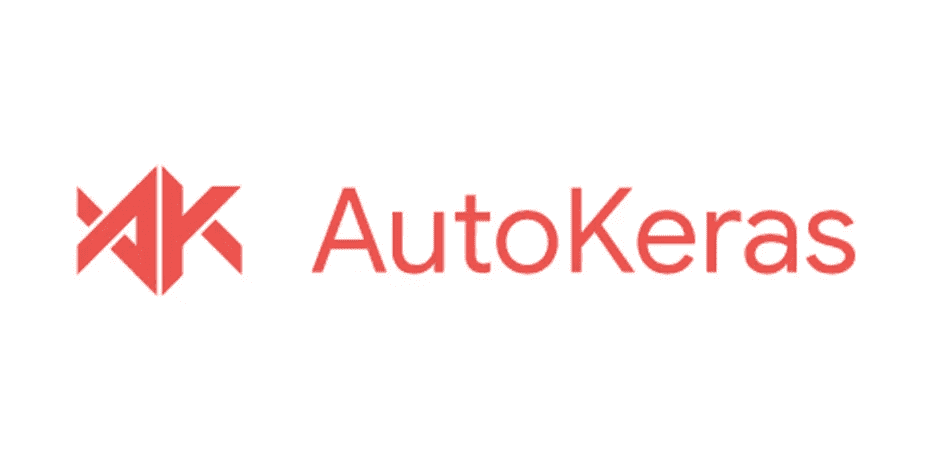
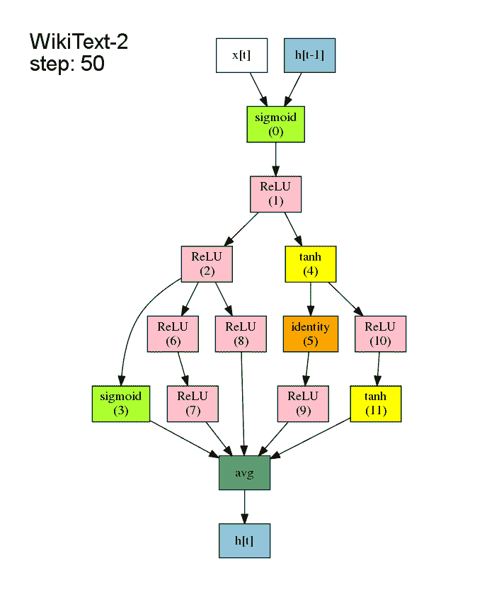
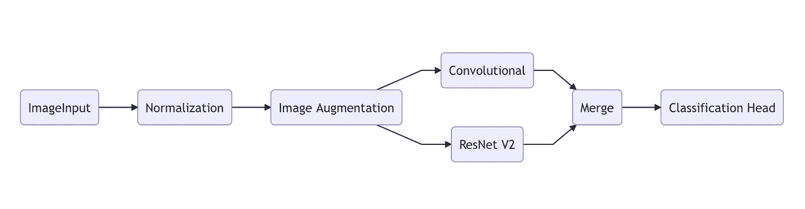

# AutoKeras 入门

> 原文：<https://towardsdatascience.com/getting-started-with-autokeras-8c5332b829?source=collection_archive---------8----------------------->

## 用几行代码利用神经结构搜索的能力



[来源](https://github.com/keras-team/autokeras)

我在 [*中提到的 2020 年人工智能的状态*](/the-state-of-ai-in-2020-1f95df336eb0) 中最强大的即将到来的概念之一是[神经架构搜索(NAS)](https://en.wikipedia.org/wiki/Neural_architecture_search) 。关于 NAS 有很多东西需要了解，但是为了理解本教程，我只做一个总结。简而言之，NAS 本质上是一种将人类设计的局限性从神经网络架构中去除的方法。为了实现这一点，许多不同的架构被并行考虑、训练和评估。接下来，可以基于所选择的算法来调整每一个，以尝试另一种架构。最终结果是在每个尝试的模型上模型损失的一种梯度下降(可能是几千个！)，而不是每一步。表现最好的模型是赢家，数据科学家可以在晚上睡得很好，因为他们知道他们可能没有使用低劣的算法。



动画来自 [ENAS PyTorch 实现](https://github.com/carpedm20/ENAS-pytorch)

过去，要实现成功的 NAS，需要非常复杂的 Tensorflow、PyTorch 或 Keras 脚本实现。除此之外，企业级的计算硬件要求。输入 [AutoKeras](https://autokeras.com) 。德克萨斯州 A & M 实验室的数据分析开发了一个用 Keras 构建的开源框架，为任何狂热的 Keras + python 用户带来 NAS。在一年的预发布版本之后，1.0 版本于 2019 年 1 月刚刚发布，这使它可以随时投入使用。对于年轻的数据科学家和小公司来说，这是一个非常好的工具，因为它允许他们跟上大型竞争对手发誓要采用的技术。

该库使用最先进的 NAS 算法，以及现有的预处理模块，以确保 NAS 培训会议顺利进行。这在 [AutoKeras 论文](https://dl.acm.org/doi/10.1145/3292500.3330648)中有详细阐述。这对于小型研究操作来说非常令人兴奋的部分原因是，他们已经优化了动态 GPU 内存的算法，以避免我们都习惯的邪恶的 OOM 异常。鉴于所有这些，AutoKeras 预装了以下功能:

*   **图像分类/回归**
*   **文本分类/回归**
*   **结构化数据分类/回归(典型的行 x 列数据类型)**
*   **多任务学习**

我将首先简要介绍一下设置和简单的实现，然后深入介绍定制实现和“块”的概念

# **设置**

AutoKeras 在 Tensorflow 之上的 Keras 上运行时有以下要求，特别是版本 2.1.0。

*   Python3
*   点
*   TensorFlow ≥ 2.1.0(重要！)

一旦这些都就绪，这个简单的 pip 命令就应该安装 AutoKeras 了

`pip3 install autokeras`

如果安装没有任何问题，你就可以开始了！

# **简单用例**

如果你的唯一目标是为一个分类任务训练最好的架构，那么代码是相当少的。使用内置的 mnist 数据集，您可以如下加载

`x_train, y_train = mnist.load_data()`

现在我们有了想要拟合的数据，我们可以创建`ImageClassifier`对象:

```
import autokeras as ak
model = ak.ImageClassifier(max_trial = 100)
```

这为我们的培训课程创建了结构。max_trials 指的是将尝试多少不同的模型。AutoKeras 已经实现了像 ResNet、Xception、可分离 CNN 这样的模型，这些模型必然是强大的。

接下来，我们需要拟合模型。这个极其复杂和漫长的过程取决于您的硬件，可以通过以下方式触发:

```
model.fit(x_train, y_train)
```

附加选项也有助于理解拟合方法:

```
ImageClassifier.fit(x=None, y=None, epochs=None, callbacks=None, validation_split=0.2, validation_data=None, **kwargs )
```

我们在这里可以看到，我们还可以选择设置时期的数量，并根据我们的选择进行验证分割。这对于验证数据来说很好，因为它不需要我们自己去分割它。

一旦模型完成了最大数量的试验，将选择具有最佳“分数”的模型。现在，您可以输入一个新的图像并保存模型，如下所示。

```
x = load_some_image()
model.predict(x) #Returns a softmax array
model.export_model()
```

导出方法的输出将是 TensorFlow 模型文件类型。这可以用来做典型的张量流模型可以用来做的任何事情。对于其他两种模型类型(文本、结构化),过程几乎是相同的。例如，文本分类器甚至可以接受一个字符串作为输入，并自己执行嵌入！

# **自动建模和模块**

如果 AutoKeras 被用于生产级软件，那么基本用例可能就不够用了。幸运的是，AutoModel 和 Blocks 允许用户构建他们可能需要的任何管道和潜在架构。



[来源](https://autokeras.com/tutorial/customized/)

上图是一个 AutoModel，它是上面列出的分类器对象的基类。建造一个这样的可以完成同样的任务，但是对管道有更多的控制。图中的每一步称为一个块。这些范围从预处理到完整的神经网络，并按顺序串在一起。初始模块(输入、标准化等。)很容易理解，但是网络可能会令人困惑。例如，当谈到卷积块时，我们不是在顺序网络中使用单个卷积，而是使用整个 CNN。上面的 CNN 和 ResNet 模块将把每种网络类型的完整架构添加到要尝试的网络列表中。与回归输出相反，合并块仅意味着将分类头信号视为相等，以执行分类(softmax/binary)。

对于`fit`和`predict`步骤来说，完成类似任务的代码是相同的，但是每个程序块需要一行代码。下面是我创建的一个自动模型的例子:

```
input_node = ak.ImageInput()
out_node = ak.Normalization()(input_node)
out_node1 = ak.ConvBlock()(out_node)
out_node2 = ak.XceptionBlock()(out_node)
out_node3 = ak.ResNetBlock()(out_node)out_node = ak.Merge()([out_node1, out_node2, out_node3])
out_node_c = ak.ClassificationHead()(out_node)auto_model = ak.AutoModel(inputs=input_node, outputs=[out_node_c], max_trials=20)auto_model.fit(x=x_train, y=y_train, epochs=100)
```

当这个 NAS 开始时，AutoKeras 将尝试 CNN、类 Xception 和类 ResNet 架构的变体，平均分布在我指定的 20 个试验中。同样重要的是要注意，这些块不是连续的，即使它们在代码中看起来是这样的。它们可以被认为是添加到每一行的 AutoModel 的服务。

除了网络模块之外，还有许多其他模块可以添加到流水线中。例如，在`ImageInput()`方法之后添加这个函数可以在搜索期间执行一系列的增强:

`ak.ImageAugmentation(percentage=0.25, rotation_range=180, random_crop=True)`

在反馈到网络之前，AutoKeras 现在会对我们的图像进行所有这些放大。

此外，如果我们需要切换到回归任务(图像质量从 0 到 1)，那么`ak.ClassificationHead()(out_node)`可以转换为:

```
ak.RegressionHead()(out_node)
```

我还可以举出更多关于块提供的适应性的例子。这同样适用于其他两种类型的任务，文本的自定义单词嵌入和结构数据的特征工程。

# **多任务学习**

我想介绍的最后一个复杂特性是多任务学习。神经网络体系结构的底层通常需要多种输出类型。例如，我最近为一个客户做的实现需要图像类别和质量输出。渴望在 AutoKeras 中实现这一点，我研究了如何用多任务框架来实现这一点。下面的代码实现了这一点。

```
input_node = ak.ImageInput()
out_node = ak.Normalization()(input_node)
out_node1 = ak.ConvBlock()(out_node)
out_node2 = ak.XceptionBlock()(out_node)
out_node3 = ak.ResNetBlock()(out_node)out_node = ak.Merge()([out_node1, out_node2, out_node3])
out_node_t = ak.ClassificationHead()(out_node)

out_node_q = ak.RegressionHead()(out_node)

auto_model = ak.AutoModel(inputs=input_node, outputs=[out_node_t, out_node_q], max_trials=20)
auto_model.fit(x=im_in, y=[ty_y, qual_y], epochs=100)
```

该模型同时创建 softmax 数组和原始浮点输出。您可能注意到的主要变化是在 ClassificationHead 旁边添加了 RegressionHead。接下来，在 AutoModel 的构造函数中描述这两个输出。最后，两个输出数据集被输入到`y=[ty_y, qual_y]`，这样模型就知道对每个头部进行什么样的训练。这总体上创建了初始块的两个独立的网络分支。来自 CNN 的相同输出被传递给每个分支，但是从每个分支接收所需的质量分数和分类数组。

AutoKeras 的附加功能几乎是无穷无尽的。除了给予任何数据科学家构建最佳的、强大的架构的能力之外；它还允许初学者获得新应用程序所需的张量流模型。我很高兴看到 AutoKeras 扩展到哪里，他们已经宣布了时间序列和其他功能即将推出。我希望这有助于你看到这项伟大技术的潜力，我期待着听到你可能已经能够使用它！

**参考文献**

[1][https://github.com/keras-team/autokeras](https://github.com/keras-team/autokeras)

[2][https://en.wikipedia.org/wiki/Neural_architecture_search](https://en.wikipedia.org/wiki/Neural_architecture_search)

[https://autokeras.com](https://autokeras.com)

[https://github.com/carpedm20/ENAS-pytorch](https://github.com/carpedm20/ENAS-pytorch)

[5][https://dl.acm.org/doi/10.1145/3292500.3330648](https://dl.acm.org/doi/10.1145/3292500.3330648)

[6][https://autokeras.com/tutorial/customized/](https://autokeras.com/tutorial/customized/)