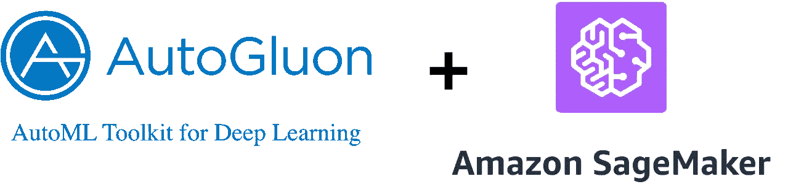

# AutoML 和 AWS 自动引导入门

> 原文：<https://towardsdatascience.com/getting-started-with-automl-and-aws-autogluon-6bc7ed7aef95?source=collection_archive---------32----------------------->

## 利用 AWS AutoML 库自动生成建立了一个目标检测模型

维克托·加西亚在 Unsplash 上拍摄的照片

*原载于 2020 年 4 月 20 日*[*https://www . philschmid . de*](https://www.philschmid.de/getting-started-with-automl-and-aws-autogluon)*。*

# 介绍

谷歌[首席执行官桑德尔·皮帅写道](https://blog.google/technology/ai/making-ai-work-for-everyone/)“…*设计神经网络是极其耗时的，并且需要专业知识，这限制了它在较小的科学家和工程师群体中的使用。*“在这之后不久，谷歌于 2018 年初推出了其服务 AutoML。

AutoML 旨在使机器学习专业知识有限的开发人员能够针对其业务需求训练高质量的模型。AutoML 的目标是自动化所有主要的重复性任务，如[特征选择](https://en.wikipedia.org/wiki/Feature_selection)或[超参数调整](https://en.wikipedia.org/wiki/Hyperparameter_optimization)。这允许在更短的时间内创建更多的模型，并提高质量和准确性。

机器学习的基本两步方法:首先，通过使模型符合数据来创建模型。第二，该模型用于预测新(以前未见过的)数据的输出。

这篇博客文章演示了如何快速开始使用 AutoML。它会给你一步一步的教程，如何建立一个对象检测模型使用自动旋转，具有一流的准确性。我用一个完整的例子创建了一个 [Google Colab 笔记本](https://colab.research.google.com/drive/1Z0F2FOowLWrJ-gYx72fiWLIpmEVMk4Bo)。

# AWS 正在进入 AutoML 领域

在 Re:Invent 2019 上，AWS 为他们的[托管机器学习服务 Sagemaker](https://aws.amazon.com/sagemaker/?nc1=h_ls) 以及其他“ [**Sagemaker 自动驾驶**](https://aws.amazon.com/sagemaker/autopilot/?nc1=h_ls) ”推出了一系列附加组件。Sagemaker Autopilot 是一项 AutoML 服务，可与 Google AutoML 服务相媲美。

2020 年 1 月，亚马逊网络服务公司(AWS)秘密推出了一个名为[**autoglon**](https://autogluon.mxnet.io/)的开源库，这是 Sagemaker Autopilot 背后的库。

AutoGluon 使开发人员能够编写基于机器学习的应用程序，这些应用程序使用图像、文本或表格数据集，只需几行代码。

凭借这些工具，AWS 进入了托管 AutoML 服务(MLaas)领域，并与谷歌的 AutoML 服务展开竞争。

# 什么是自转？

[*“autoglon*](https://autogluon.mxnet.io/index.html)*支持易于使用和易于扩展的 AutoML，专注于深度学习和跨图像、文本或表格数据的现实应用。面向 ML 初学者和专家，AutoGluon 使您能够…”*

*   快速原型化深度学习解决方案
*   自动超参数调整、模型选择/架构搜索
*   改进现有的定制模型和数据管道**

AutoGluon 使您只需 3 行代码即可构建机器学习模型。

目前，AutoGluon 可以为图像分类、对象检测、文本分类和使用表格数据集的监督学习创建模型。

如果你对 autoglon 如何在幕后完成所有的魔术感兴趣，可以看看 AWS 开源博客上的“[autoglon 机器学习，一个开源的 AutoML 库](https://aws.amazon.com/blogs/opensource/machine-learning-with-autogluon-an-open-source-automl-library/)”帖子。

# 辅导的

我们将建立一个目标检测模型，检测图像上的水果(苹果、橘子和香蕉)。我用大约 300 张图片建立了一个小数据集来实现快速训练过程。[你可以在这里找到数据集。](https://www.kaggle.com/philschmid/tiny-fruit-object-detection/metadata)

在本教程中，我使用了带有 GPU 运行时的 Google Colab。如果你不确定如何使用 GPU 运行时，看看这里的。

好了，现在让我们开始教程。

# 安装自动旋转

AutoGluon 为不同的硬件首选项提供不同的安装包。如需更多安装说明，请查看此处的[自动引导安装指南。](https://autogluon.mxnet.io/#installation)

第一步是用 pip 和 CUDA 支持安装`AutoGluon`。

为了让 AutoGluon 在 Google Colab 中工作，我们还必须安装`ipykernel`并重启运行时。

成功重启运行时后，您可以导入`autogluon`并打印出版本。

# 加载数据和创建数据集

下一步是加载我们用于对象检测任务的数据集。在 AutoGluon 的`ObjectDetection`任务中，通过将`Dataset()`的`format`参数调整为`coco`或`voc`，可以使用 PASCAL VOC 格式或 COCO 格式。 [Pascal VOC](https://gluon-cv.mxnet.io/build/examples_datasets/detection_custom.html#pascal-voc-like) 数据集包含两个目录:`Annotations`和`JPEGImages`。 [COCO](https://www.immersivelimit.com/tutorials/create-coco-annotations-from-scratch/#coco-dataset-format) 数据集的格式为`JSON`，是“信息”、“许可证”、“图像”、“注释”、“类别”的集合。

对于训练，我们将使用我构建的[tiny _ fruit _ object _ detection](https://www.kaggle.com/philschmid/tiny-fruit-object-detection/metadata)数据集。该数据集包含大约 300 张香蕉、苹果、橙子或它们的组合的图片。

我们使用 240 幅图像进行训练，30 幅用于测试，30 幅用于评估模型。

数据集的样本图像

使用下面的命令，我们可以`download`和`unzip`这个只有 29MB 的数据集。在这之后，我们用`task.Dataset()`创建我们的`Dataset`用于训练和测试。

# 训练模型

第三步是用创建的`dataset`训练我们的模型。在 AutoGluon 中，您将分类器定义为变量，此处为`detector`，并在训练期间在`fit()`函数中定义参数。例如，您可以定义一个`time_limit`，它会在特定时间后自动停止训练。您可以为自己的`learning_rate`定义一个范围或设置`epochs`的数量。最重要的参数之一是`num_trials`。该参数定义了可尝试的超参数配置的最大数量。您可以在这里找到[可配置参数的完整文档。](https://autogluon.mxnet.io/api/autogluon.task.html#autogluon.task.ObjectDetection)

我们将为`20 epochs`训练我们的模型，并通过设置`num_trials=3`训练 3 个不同的模型。

结果，我们得到了一个具有平均精度(mAP)和历元数的图表。地图是计算对象检测模型的准确度的常用度量。

我们最好的模型(蓝线)完成了`0.9198171507070327`的地图

# 评估模型

完成培训后，我们现在将在我们的`test`数据集上评估/测试我们的模型的性能。

测试数据集上的地图是`0.8724113724113725`,考虑到我们只使用 240 幅图像和 20 个时期进行训练，这已经很不错了。

# 预测图像

要使用我们训练好的模型进行预测，您可以简单地运行`detector.predict(image_path)`，它将返回一个元组(`ind`)，其中包含检测到的对象的类 id、置信度得分(`prob`)以及相应的预测边界框位置(`loc`)。

# 保存模型

*在撰写本文时，保存对象检测模型还没有在* `*0.0.6*` *版本中实现，但是将在下一个部署版本中实现。*

要保存你的模型，你只需要运行`detector.save()`

# 负载模型

*在撰写本文时，加载对象检测模型还没有在版本* `*0.0.6*` *中实现，但是将在下一个部署版本中实现。*

感谢阅读。你可以在这里找到 [Google Colab 笔记本](https://colab.research.google.com/drive/1Z0F2FOowLWrJ-gYx72fiWLIpmEVMk4Bo)包含完整示例[。](https://colab.research.google.com/drive/1Z0F2FOowLWrJ-gYx72fiWLIpmEVMk4Bo#scrollTo=XtuOeo_ZzLMq)