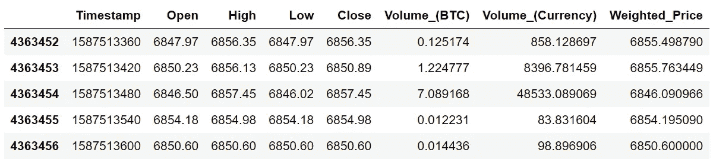
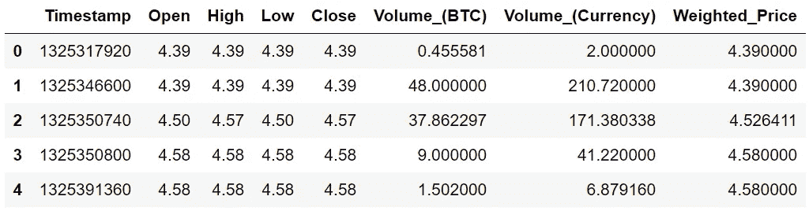
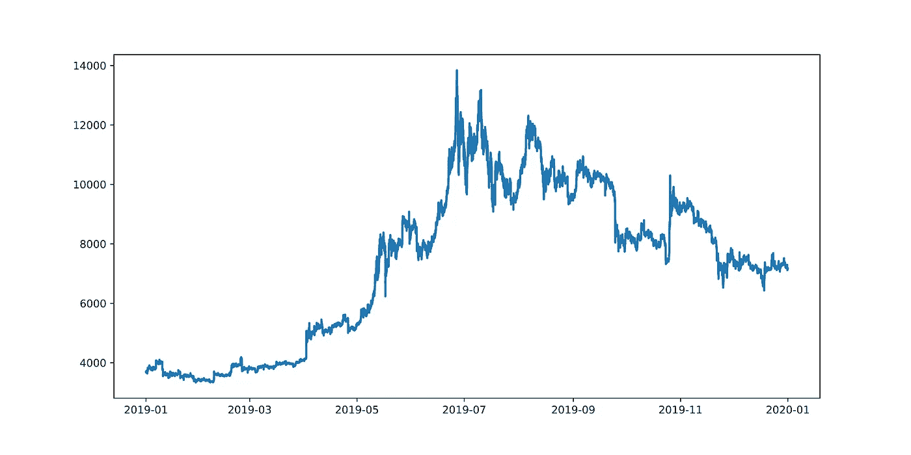

# 在 Python 中使用比特币数据

> 原文：<https://towardsdatascience.com/getting-started-with-bitcoin-historical-data-set-with-python-and-pandas-cd31417d1736?source=collection_archive---------27----------------------->

## 用 Python 和熊猫入门比特币历史数据集。

最近几个月，比特币和加密货币总体上一直在上涨。从 3 月份的突然崩盘开始，比特币的反应非常好，价格几乎翻了一倍。再加上本月早些时候大肆宣传的减半事件，现在有很多人好奇并希望开始投资和交易。


作者创建的图像

好吧，在这里我展示了你开始分析比特币并将其转化为可用形式所需的 Python 代码。我将满怀希望地展示使用 pandas 库在 Python 中做到这一点是多么容易。完整的代码可以在文章的底部找到。

如果您对加密货币不感兴趣，那么这可能也是一个很好的教程，展示了 Python 和 pandas 在数据操作和分析方面的强大功能，并且可能有一些有用的代码片段可以应用于其他项目。

## 安装熊猫图书馆

首先，如果你还没有熊猫库，你需要安装它。只需在命令行中运行以下命令。

```
pip install pandas
```

或者，如果您像我一样使用 Anaconda，您可以在您使用的环境中打开 Anaconda 终端，然后输入以下命令。

```
conda install pandas
```

如果没有出现错误，您应该已经正确安装了库。我们马上会做最后一次测试。

对于数据分析，我发现 Jupyter Notebook 是最好的 IDE，因为它允许您以块的形式运行代码片段，因此在导入和操作大型数据集时可以节省大量时间。但是，任何 IDE 都可以。

# 所以现在对于一些编码…

打开一个新脚本并保存它。第一个任务是测试 pandas 库是否安装正确。运行以下代码将库导入到脚本中。如果没有出现错误，那么您可以继续本教程的其余部分。如果没有，你必须正确安装熊猫图书馆——谷歌将是你的朋友。

```
import pandas as pd
```

## 获取数据集

我将使用的数据来自 Kaggle，这是世界上最大的数据科学社区，也是寻找大量数据集的最佳地点之一。这个特殊的[数据集](https://www.kaggle.com/mczielinski/bitcoin-historical-data)是比特币从 2012 年 1 月 1 日到 2020 年 4 月 22 日的历史分钟数据。

一旦您将 csv 文件下载并保存到与您的脚本相同的目录中，您现在将希望加载该数据。为此，我们在 pandas 中使用了 ***pd.read_csv()*** 方法，将数据文件名作为字符串传递。这将创建一个包含 csv 文件中所有数据的数据框。

我们还将运行 ***。***head()【方法】在数据帧上向我们显示我的前 5 行数据。如您所见，有一行数据后跟四行连续的 NaN 值。这是因为有些数据丢失了，因此我们需要做一些清理工作。这是由多种原因造成的，但似乎在这个数据集的早期，数据没有每分钟归档一次，因此丢失了大量数据块。

```
raw_data = pd.read_csv("bitstampUSD_1-min_data_2012-01-01_to_2020-04-22.csv")
raw_data.head()
```


运行 ***。数据帧上的 tail()*** 方法将显示最后 5 行，您可以看到这些行实际上已满。此外，请注意数据框索引列(最左侧)中该数据集中的行数。超过四百万！对于 Excel 来说太多了，但是 Python 和 pandas 可以轻松处理。

```
raw_data.tail()
```



## 清理并格式化数据框

因此，现在我们想要创建一个数据框，其中包含 NaN 值的所有行都被移除。对于熊猫来说，这非常简单，我们只需使用 ***。dropna()*** 方法，并将其分配给一个新的数据帧，我们称之为 **df** 。这是包含所有有用数据的数据框，我们将在以后的分析中使用这些数据。

我们也称之为。***reset _ index()***方法在数据帧上使索引列复位。这将为第一行数据分配一个从 0 开始的索引值，为第二行分配 1，依此类推。我们还将传递参数 **inplace=True** 。这在 pandas 中很常用，它告诉 Python 我们希望原始数据框成为该数据框的新编辑版本。如果 ***原位*** 未设置为 ***真*** ，那么我们正在处理的数据帧将在生产线运行后保持不变。使用 ***探究这种行为。*** 头()【方法】查看指标值。

我们还传递第二个参数 **drop=True** 。默认情况下。***reset _ index()***方法将重置我们数据的索引，但原始索引列将被复制到一个名为 **"index"** 的新列中。我们不需要这个额外的列，因此我们将删除它。这也可以使用 ***来实现。***drop()【方法】对数据框和指定列名进行 drop。

```
df = raw_data.dropna()
df.reset_index(inplace=True, drop=True)
df.head()
```



## 更改时间戳格式

您可以看到'**时间戳'**'列的格式很奇怪，这实际上是 UNIX 时间格式，因此我们想将其转换为 UTC 时间。我们使用 ***pd.to_datetime()*** 方法来实现。我们将传递我们想要对其执行此函数的数据的参数，这是我们数据的**‘时间戳’**列，我们还将传递参数**unit =‘s’**，它告诉函数我们输入的 UNIX 时间的单位是秒。我们使用下面的代码行将该函数的输出保存到数据框中的**‘Timestamp’**列。注意，在 pandas 中引用列中的数据，我们使用下面的概念**df[‘Timestamp’]**。其中方括号内传递的字符串是列的名称。

```
df['Timestamp'] = pd.to_datetime(df['Timestamp'], unit='s')
df.head()
```


我们可以看到，部分数据集实际上来自 2011 年。为了完整起见，我将删除这四行。当只有几行要删除时，最简单的方法是简单地指定列表中行的索引，并将其传递给 ***。*降()**法。我们还必须再次传入参数 **inplace=True** 。最后像之前一样修正指数。

```
df.drop([0,1,2,3], inplace=True)
df.reset_index(inplace=True, drop=True)
df.head()
```


## 绘制数据以进行目视检查

现在，我们的数据有了一个很好的结构，希望所有数据都在我们的数据框中。验证此时一切正常的一个非常快速的方法是简单地绘制比特币随时间变化的价格。我们将通过以下方式做到这一点

运行 ***。plot()*** 方法在数据帧上然后指定我们想要在 x 轴和 y 轴上的列。 ***。pandas 中的 plot()*** 方法实际上在后台使用 matplotlib 库来显示图形，并将尝试为轴选择合理的默认设置。如果你愿意，这个图表当然可以定制。

```
df.plot(x="Timestamp",y="Weighted_Price")
```


## 创建新列

太好了！因此，我们的数据看起来是正确的，因此我们可以进行更有趣的部分，即分析或处理数据。您可能想做的一件事是创建一个新列，以某种方式处理数据。一个例子是找出每个连续时间点之间的差异。

我们可以使用 pandas 内置的一个名为 ***的方法来做到这一点。*diff()**。我们只需使用下面的符号 **df["新列的标题"]** 指定我们希望创建的列，并将其设置为我们希望找到的与 ***不同的列。*diff()**方法。

```
df["closeDiff"] = df["Close"].diff()
df.head()
```


注意我们创建的名为**“closeDiff”**的新列。

现在，让我们假设我们想要为数据中的每一年创建数据框。比如 2019 年所有数据的一个数据帧 **df19** 。一种方法是首先创建一个名为“**year”**的列，其中包含每个数据点的年份值。然后我们将创建一个新的 dataframe，只包含“**年”**列等于 2019 年的数据行。

为此，我们将首先创建一个' **year'** 列。我们将'**时间戳'**列输入到 **pd 中。DatetimeIndex** 类并请求。**年份**属性。这将返回我们每个时间戳的年值，我们将该数据分配给一个新列，我们将其定义为' **year'** 。

```
df["year"] = pd.DatetimeIndex(df["Timestamp"]).year
df.head()
```


所以现在我们想要一个新的数据帧 **df19** ，它包含我们的数据帧 **df** 中的所有行，这些行在“**year”**列中的值为 2019。为此，我们编写了下面一行代码。这种表示法可能有点令人困惑，但在这里我们只是说，获取所有带有数据框 **df** 的行，其中“**year”**列等于 2019，并将其分配给一个名为 **df19** 的新数据框。

```
df19 =  df[df["year"] == 2019]
df19.reset_index(inplace=True, drop=True)
df19.head()
```


现在，我们可以像之前的数据一样绘图，但这一次只针对 2019 年。

```
df19.plot(x="Timestamp",y="Weighted_Price")
```



## 保存数据

现在你有了干净的数据，也许你已经增加了数据或者产生了一个子集。通常，您希望保存这些数据，这样就不必再次运行这些代码。使用**和*非常简单。*to _ CSV()**数据帧上的方法。下面是我用来保存 **df19** 数据帧的代码，这样我将来就可以很容易地使用它。您传递给该方法的第一个参数是您希望保存它的文件名，并且 **index=False** 告诉 Python 不要将数据帧的索引保存到 csv 文件中通常不需要的列。

```
df19.to_csv('btc19.csv', index=False)
```

现在你有了它，一个让你开始使用这个比特币历史数据集的基本框架，以及一些你可以在 Python 和 pandas 中做的基本事情。没有**的全精简代码*。头()*** 和 ***。*** 尾巴()【通话记录】见下图。