# 散景入门

> 原文：<https://towardsdatascience.com/getting-started-with-bokeh-effortlessly-elegant-interactive-data-visualisations-in-python-703249565bb3?source=collection_archive---------27----------------------->

## [入门](https://towardsdatascience.com/tagged/getting-started)

## 轻松优雅的 Python 交互式数据可视化


照片由[丹尼斯·约翰逊](https://unsplash.com/@auntneecey?utm_source=medium&utm_medium=referral)在 [Unsplash](https://unsplash.com?utm_source=medium&utm_medium=referral) 拍摄

在这篇文章中，我的目标是给你一个关于散景的介绍，详细说明它是什么，为什么你应该使用它，以及如何可以轻松开始！

# 什么是散景？

Bokeh 是一个简洁的 Python 库，它允许我们快速、轻松地创建高性能、专业的交互式数据可视化和 web 应用程序。你可以在这里 查看一些例子，看看散景可以做什么 [**。**](https://docs.bokeh.org/en/latest/docs/gallery.html)

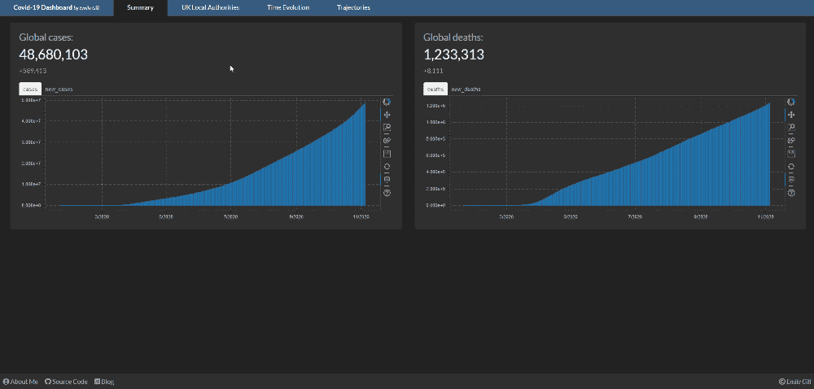

用散景可以做什么的一个例子。

Bokeh 最吸引人的品质是它成功地平衡了简单性(创建复杂的交互式可视化所需的代码很少)和高级定制的灵活性(如果你需要的话)。无论您只是想在 Jupyter 笔记本上创建更漂亮的图形，还是开发和部署完整的 web 应用程序，Bokeh 对于任何 Python 用户来说都是一个很好的可视化工具。

# 散景的基础

## 情节

Bokeh 的 *Plot* 类提供了画布，我们可以在上面构建我们的可视化。要开始在散景中创建可视化效果，我们可以简单地实例化一个`figure`对象:

如果我们要运行上面的代码，我们将生成一个空白的图形对象，然后输出为 HTML 文件，保存到指定的路径，然后显示在 web 浏览器的新选项卡中。如果我们在 Jupyter 笔记本上工作，并且想要在输出单元格中直接显示我们的可视化，我们也可以使用`output_notebook()`函数。

到目前为止，这还不是很鼓舞人心，因为我们还没有添加任何数据——但是我们将在下一节中看到我们如何开始在我们的数字基础上快速添加细节。

## **字形**

*字形*是散景中最基本的绘图单位。它们本质上由可视标记组成，带有可能与我们的数据相关联的属性。从简单的线条象形文字，到六边形的瓷砖格子([六边形象形文字](https://docs.bokeh.org/en/latest/docs/reference/models/glyphs/hex_tile.html#bokeh.models.glyphs.HexTile))，根据我们的观想需要，有许多不同的象形文字可供我们使用。

我们可以扩展上面的代码，为我们的图形添加一个字形，就像:

散景的威力显而易见。通过一行额外的代码，我们向我们的绘图添加了一些数据，我们可以利用散景的开箱即用交互性立即摆弄和探索这些数据。图右侧的绘图工具使我们能够拖动、缩放和重置我们的绘图。我们甚至可以使用`SaveTool`功能将视图保存到图像文件中。

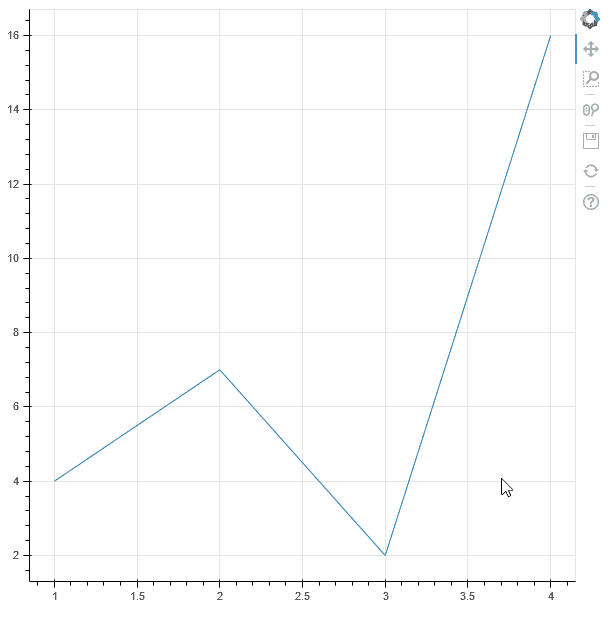

探索散景的内置绘图工具，用一个简单的线条字形。

你可以探索我们能够选择的各种字形，以及它们的相关属性， [**这里**](https://docs.bokeh.org/en/latest/docs/reference/models/glyphs.html#bokeh-models-glyphs) 。

向一个图形添加多个字形不成问题，我们只需分别调用我们需要的所有字形方法，Bokeh 就会按照指定的顺序将它们分层到我们的图形上。

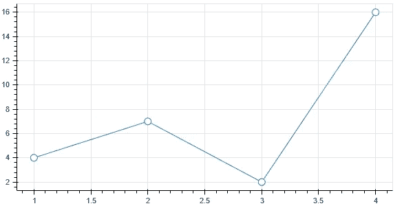

覆盖在图形上的多个字形。

## 数据源

将我们的数据指定为散景对象再简单不过了。Bokeh 兼容大家熟悉的数据格式 lists、NumPy 数组和 pandas*data frames*；所有这些我们都可以作为参数直接传递给 glyph 方法。

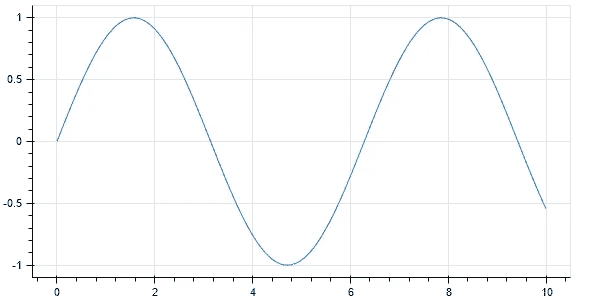

NumPy 源数据的线条标志符号。

散景也内置了自己的数据格式，即 **ColumnDataSource** 。这形成了散景对象使用的基本底层数据结构。事实上，当我们向 Bokeh 提供列表、NumPy 数组或 pandas*data frame*时，这些在后台被隐式转换为 *ColumnDataSource* 对象。ColumnDataSource 使在字形之间共享数据和链接所选数据变得容易，并允许我们提供额外的数据，正如我们将在后面看到的，这些数据可以用来给我们的可视化添加注释。

我们可以用以下方式定义 ColumnDataSource:

一旦我们定义了一个 *ColumnDataSource* ，我们可以通过简单地指定它的列名，并将我们的 *CDS* 作为绘图方法的`source`参数来轻松地访问数据。下面我们使用 Bokeh 的一个 CSV 样本数据集创建一个示例图，我们将它读入熊猫*数据帧*，然后转换为*列数据源。*

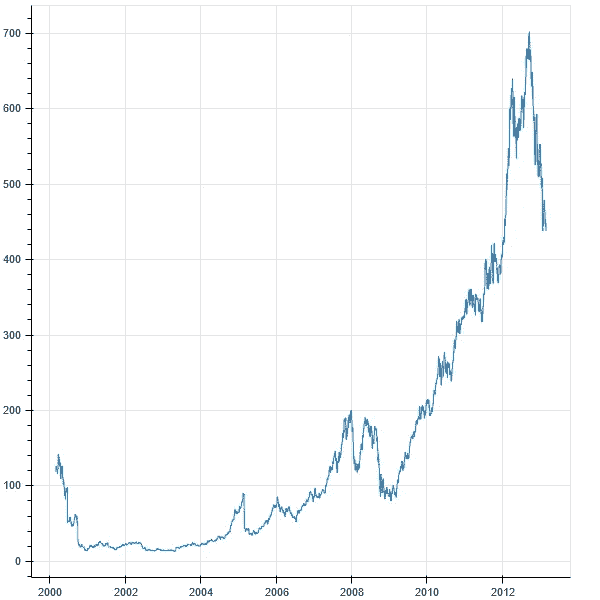

一段时间内苹果股票的开盘价(来自 Bokeh 样本数据的数据集)。

# 定制可视化

## 配置绘图工具

正如我们在 Bokeh 中实例化一个`figure`对象时所看到的，绘图带有各种内置的交互特性。如果我们不明确表达这些，Bokeh 将提供默认的工具套件。然而，如果我们愿意，我们也可以在创建我们的图形对象时定义它们:

您可以在此 浏览官方文档 [**中提供的所有绘图工具选项。**](https://docs.bokeh.org/en/latest/docs/user_guide/tools.html)

## 悬浮工具

Bokeh 中的一个绘图工具是 HoverTool 类，值得单独列出来。这是一个很好的功能，让我们只需将鼠标悬停在一个对象上，就可以从数据中发现更多的细节。

我们可以通过为我们希望包含的数据提供一个`(label, value)`元组列表来指定一个 HoverTool。

前缀为`@`的字段名称与`ColumnDataSource`列标题相关联，以`$`开头的名称是“特殊字段”，对应于绘图元数据，如`$index` (数据点索引)、`$x` (光标的 x 坐标)。


向我们的苹果股票图添加悬停工具。

## 色彩映射

散景提供了各种内置调色板供我们选择，完整的列表可以在 [**这里**](https://docs.bokeh.org/en/latest/docs/reference/palettes.html#bokeh-palettes) 找到。用特定的调色板来设计我们的可视化数据的一个有用的特性是在散景中我们可以使用的“颜色映射器”。这些允许我们直观地阐明数据的一些属性，取决于它的值。

例如，`linear_cmap`功能允许我们根据数值在线性标尺上的位置来分配颜色:

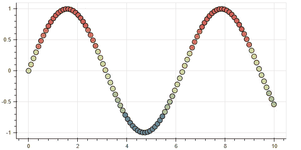

线性颜色映射示例，应用于我们之前的正弦图。

类似地，还有一个`log_cmap`函数，以完全相同的方式工作，但是使用对数标度。我们甚至可以在图的旁边加入一个`ColorBar`来解释颜色到值的映射。

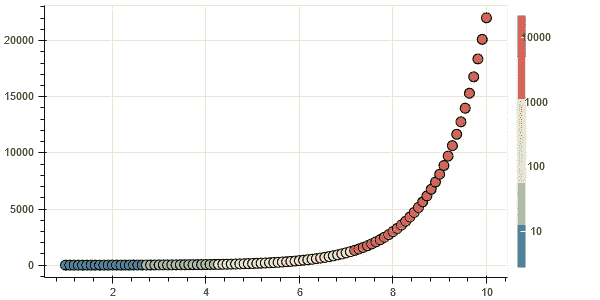

对于分类数据，我们可以使用`CategoricalColorMapper`类来定义各种分类因子和指定调色板之间的关系。Bokeh 有一个处理分类数据的详细指南 [**这里**](https://docs.bokeh.org/en/latest/docs/user_guide/categorical.html) ，如果你愿意，你可以在这里读到更多。

## 释文

标题、图例、轴标签、数据标签等注释也可以添加到绘图中。这里有许多不同的选项来定制我们的地块；我不会在这些问题上深究太多细节，因为有很多好的文档说明可以做什么[这里](https://docs.bokeh.org/en/latest/docs/user_guide/styling.html)和[这里](https://docs.bokeh.org/en/latest/docs/user_guide/annotations.html)。

以下示例显示了我们在创建图形时可能想要定义的一些最常见的属性:

# 安排情节

如果我们想要在同一个输出中组合多个图，我们可以使用`bokeh.layouts`模块来定义这些图是如何排列的。

## 行和列

`row`和`column`功能允许我们将图形组织成行、列或由两者组合而成的嵌套布局。

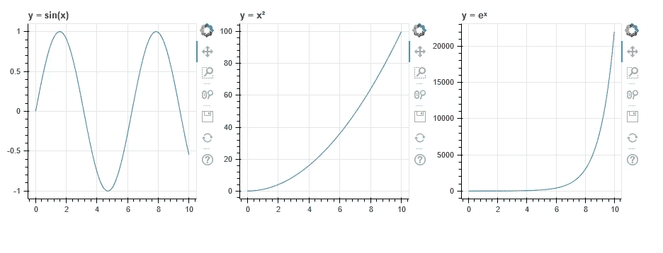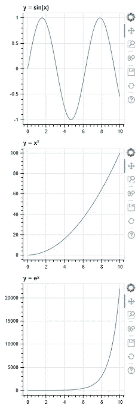

## 网格

使用`gridplot`功能可以轻松创建统一的网格图。

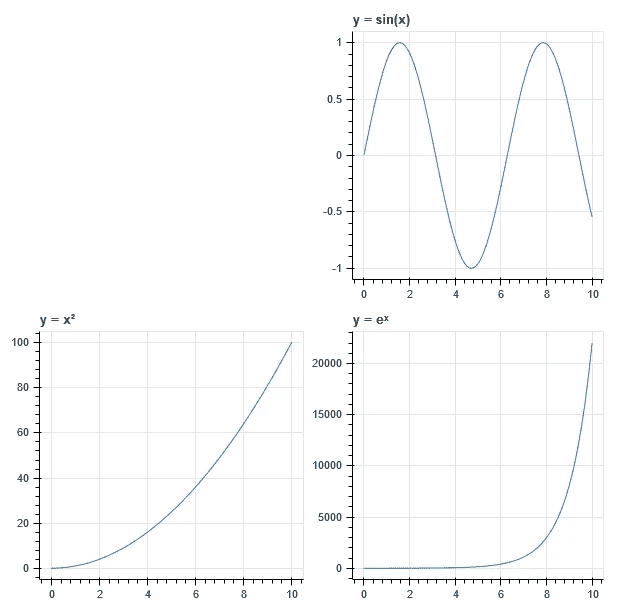

## 制表符

我们甚至可以在选项卡式布局中显示我们的可视化，能够在不同的图之间切换。

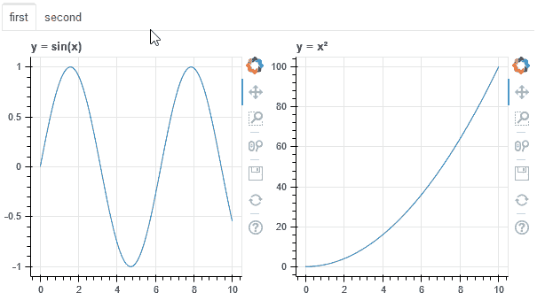

## 关联图

要链接图的轴，我们可以简单地将它们的轴范围属性定义为相等:

```
p3.x_range = p2.x_range = p1.x_range
p3.y_range = p2.y_range = p1.y_range
```

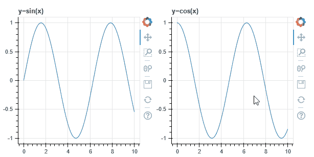

为了在我们的可视化中链接数据选择，所有需要的是它们共享相同的数据源:

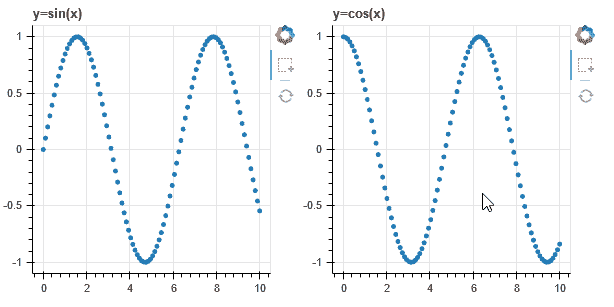

# 结论


照片由 [Josh Boot](https://unsplash.com/@joshboot?utm_source=medium&utm_medium=referral) 在 [Unsplash](https://unsplash.com?utm_source=medium&utm_medium=referral) 上拍摄

我们现在已经很好地掌握了散景的基础知识，应该已经具备了开始实验和创建我们自己的自定义可视化所需的一切。也就是说，就散景作为可视化工具的全部功能而言，这只是冰山一角。

在我的下一篇文章中，我们将探索如何将我们所学的知识更进一步，从创建美丽的可视化过渡到开发具有更多交互性的迷人的 web 应用程序。到时见，但现在:

***感谢阅读！***

这篇文章的所有源代码都可以在这里找到:

[](https://github.com/emilegill743/bokeh-basics) [## Emile gill 743/散景基础

### 我在 Medium 上的博文附带的源代码，介绍了 Python 中的 Bokeh 库以及它所提供的功能。

github.com](https://github.com/emilegill743/bokeh-basics) 

如果你喜欢这篇文章，可以看看我的其他文章:

[](/launch-a-website-for-free-in-5-simple-steps-with-github-pages-e9680bcd94aa) [## 使用 GitHub 页面，通过 5 个简单的步骤免费创建一个网站

### 不到 10 分钟就能在网上建立你的个人投资组合网站。

towardsdatascience.com](/launch-a-website-for-free-in-5-simple-steps-with-github-pages-e9680bcd94aa) [](/finding-a-grocery-delivery-slot-the-smart-way-f4f0800c4afe) [## 聪明的方法是找到一个杂货递送点

### 使用 Python、Heroku 和 Twilio 从一个杂货网站的 API 中抓取数据，并在出现插槽时获得文本通知…

towardsdatascience.com](/finding-a-grocery-delivery-slot-the-smart-way-f4f0800c4afe) [](/a-practical-guide-to-getting-set-up-with-postgresql-a1bf37a0cfd7) [## PostgreSQL 入门实用指南🐘

### Python 的 PostgreSQL、pgAdmin 和 SQLAlchemy 入门。将 SQL 融入 Python 的核心…

towardsdatascience.com](/a-practical-guide-to-getting-set-up-with-postgresql-a1bf37a0cfd7)