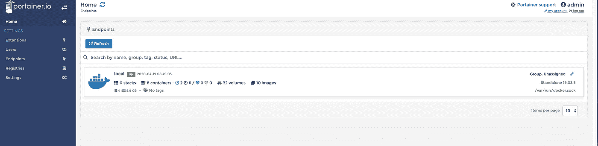
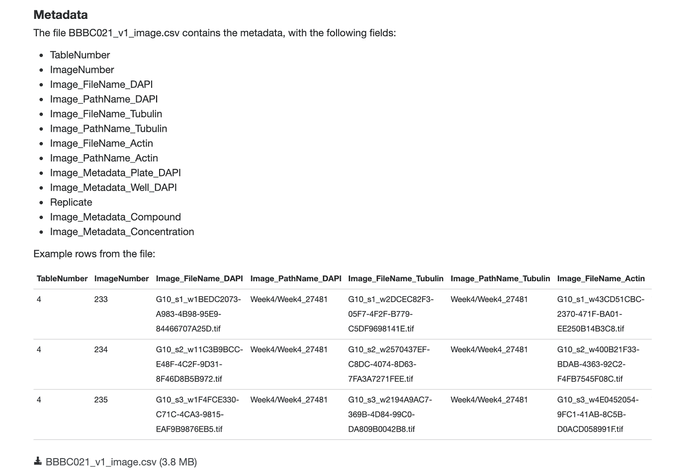
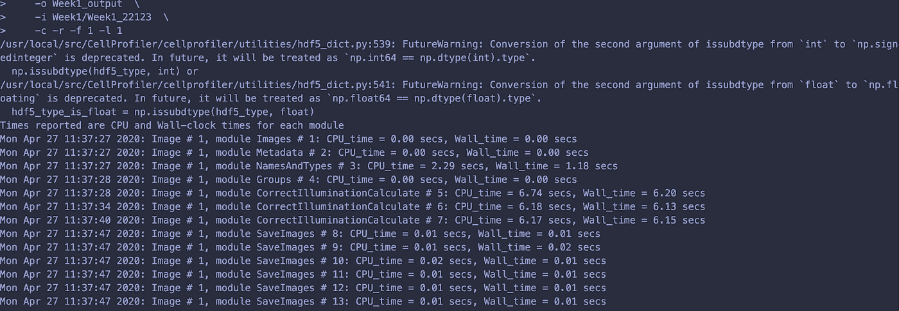
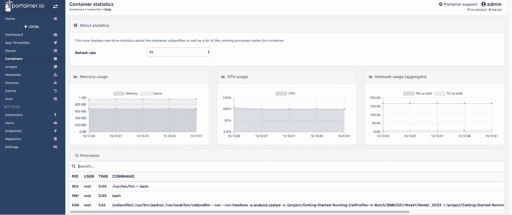
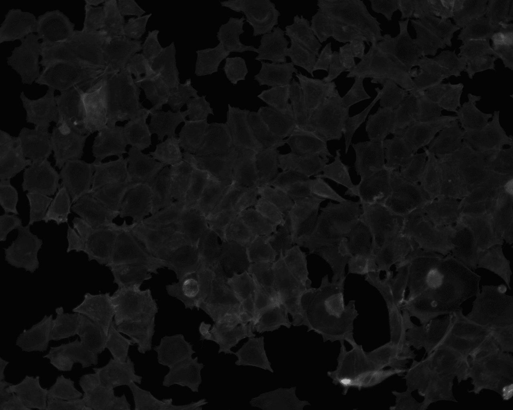
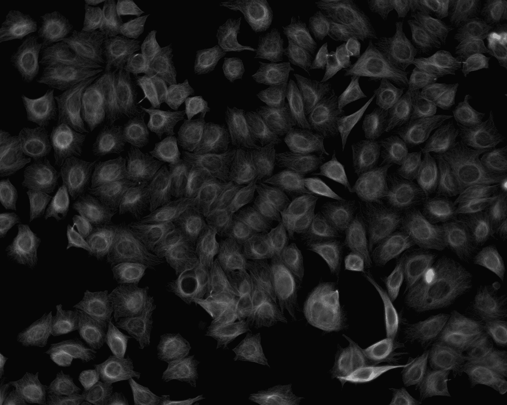

# 批量使用 CellProfiler 入门

> 原文：<https://towardsdatascience.com/getting-started-with-cellprofiler-in-batch-31dcb8001a5a?source=collection_archive---------83----------------------->

## 在[批处理模式](http://cellprofiler-manual.s3.amazonaws.com/CellProfiler-3.0.0/help/other_batch.html)下运行 [CellProfiler](https://cellprofiler.org/) 是自动化大规模分析的理想方式。或者没有你喜欢自动化的大规模分析！

批量运行 CellProfiler 的好处之一是您可以拆分您的分析。当您有一个非常大的数据集时，这很有帮助。假设您有一个需要 1 小时才能完成的大型数据集。你可以将分析分成 4 个部分，每个部分在 15 分钟内完成。

如果内存或 CPU 不足，这也是一个重要的考虑因素。您分析的数据集越大，它消耗的内存就越多。如果你需要找到一种方法来减少你的计算资源，你通常可以分割你的数据集。CreateBatchFiles 模块的说明描述了如何设置 CellProfiler 管道并将其提交给群集。这里有一个步骤 7 的教程，提交你的批处理到集群。我们开始吧！

如果你喜欢看，[这里有一个视频](https://www.youtube.com/embed/gDOCYsxsEQY)，我会按照描述的步骤进行。

Docker 是一种打包应用程序的方式。docker 容器就像一个虚拟机，只是没有可视界面。一旦你设置好了，你就可以像对待一台普通电脑一样对待它。

快速免责声明，如果您对命令行感到非常不舒服，您可能需要寻求帮助。这不需要太多的 Linux 命令行知识，但是您需要能够键入命令和导航目录结构。这里有一个来自 Ubuntu 的快速解释和教程来帮助你开始。

我们将使用默认的 [CellProfiler docker 图像](https://hub.docker.com/r/cellprofiler/cellprofiler)，稍作修改。我们进行这些更改是因为映像的设置方式非常适合作业队列环境，但我们在这里想要的是进行一些探索性分析。

在其中创建一个项目目录、cellprofiler-batch-tutorial 和 cd。

```
mkdir cellprofiler-batch-tutorial 
cd cellprofiler-batch-tutorial
```

然后用下面的代码创建一个名为 Dockerfile 的文件:

```
FROM cellprofiler/cellprofiler:3.1.9RUN apt-get update -y; apt-get install -y unzip imagemagickENV TINI_VERSION v0.16.1 ADD 
[https://github.com/krallin/tini/releases/download/](https://github.com/krallin/tini/releases/download/)${TINI_VERSION}/tini /usr/bin/tini 
RUN chmod +x /usr/bin/tini
```

现在我们将构建新的 CellProfiler 图像！

```
docker build -t cellprofiler .
```

# 使用示例人类数据集进行简单分析

我们将从一个非常简单的例子开始，来感受一下我们如何使用批处理模式运行。一旦我们到达那里，我们将进入更复杂的管道。(WOOOO！)

让我们来看看第一批数据集。

```
wget [http://cellprofiler-examples.s3.amazonaws.com/ExampleHuman.zip](http://cellprofiler-examples.s3.amazonaws.com/ExampleHuman.zip)
unzip ExampleHuman
```

这是数据集的样子-

```
. 
├── ExampleHuman.cppipe 
├── README.md 
└── images 
 ├── AS_09125_050116030001_D03f00d0.tif 
 ├── AS_09125_050116030001_D03f00d1.tif 
 └── AS_09125_050116030001_D03f00d2.tif
```

“ExampleHuman.cppipe”是一个 CellProfiler 管道,“README”是通常的 README，图像是我们要用 CellProfiler 管道分析的图像！

之前我说过你的 docker 镜像是一台电脑。它(大部分)是。我们现在要把它当电脑用。

现在，您将 docker 容器用作外壳。Cd 到您的项目目录，并检查您期望的文件是否在那里。

```
cd /project/ExampleHuman
ls -lah # Should show the ExampleHuman dataset
```

确保您可以通过在帮助下执行 CellProfiler 来运行 CellProfiler CLI。(这总是一张不错的支票。)

```
cellprofiler — run — run-headless — help
```

现在让我们运行我们的示例人类数据集！

```
cellprofiler — run — run-headless \ 
 -p ExampleHuman.cppipe \ 
 -o output -i images
```

首先，这个 CellProfiler 分析只使用了一个 imageset，所以它并不有趣，但是它提供了很多信息。

您可以使用-f 和-l 标志来告诉 CellProfiler 启动，或者使用-f 作为第一个标志，使用-l 作为最后一个标志来拆分数据集。

完成后，您应该会在输出目录中看到一个图像和一些 csv 文件！

如果你正在用 CellProfiler 设计一个大规模的批处理管道，你需要知道你使用了多少内存和 CPU。我们将使用名为 [Portainer](https://www.portainer.io/installation/) 的工具来获取这些信息。

Portainer 做了很多事情，这些事情非常酷，但现在我们只使用它来分析在 docker 容器中运行的 cellprofiler 进程。

像这样启动 portainer 服务:

```
docker volume create portainer_data 
docker run -d -p 8000:8000 -p 9000:9000 — name=portainer — restart=always -v /var/run/docker.sock:/var/run/docker.sock -v portainer_data:/data portainer/portainer
```

转到浏览器并打开 localhost:9000 来查看 Portainer 服务。可能会提示您创建用户名和密码。如果是这样，就这样做，然后您应该会看到一个如下所示的主页:



现在像这样分析数据集:

请注意，运行单个映像的命令会很快退出。您必须快速地实时查看内存分析，否则您可能需要多次重新运行它。

现在，我们已经讨论了如何通过一个简单的例子开始计划和考虑批处理我们的 CellProfiler 管道。现在让我们进入一个真实的数据集！让我们使用来自 Broad bio image Benchmark Collection 的 [BBBC021。我们将使用第 1 周的数据，大约 15GB。](https://data.broadinstitute.org/bbbc/BBBC021/)

我将向您展示我是如何运行这个数据集的，但 CellProfiler 非常灵活，我相信还有其他方法。

你应该还在你的码头集装箱里。到了那里，让我们获取一些数据！

```
cd /project
mkdir -p BBBC021/Week1
mkdir -p BBBC021/Week1_output
cd BBBC021/Week1
wget https://data.broadinstitute.org/bbbc/BBBC021/BBBC021_v1_images_Week1_22123.zip
wget https://data.broadinstitute.org/bbbc/BBBC021/BBBC021_v1_images_Week1_22141.zip
wget https://data.broadinstitute.org/bbbc/BBBC021/BBBC021_v1_images_Week1_22161.zip
wget https://data.broadinstitute.org/bbbc/BBBC021/BBBC021_v1_images_Week1_22361.zip
wget https://data.broadinstitute.org/bbbc/BBBC021/BBBC021_v1_images_Week1_22381.zip
wget https://data.broadinstitute.org/bbbc/BBBC021/BBBC021_v1_images_Week1_22401.zip
find $(pwd) -name "*zip" | xargs -I {} unzip {}
# Clean up the zips, we don't need them anymore
find $(pwd) -name "*zip" | xargs -I {} rm -rf {} 
cd ../..
# Run $(pwd) to check where you are. You should be in /project/BBBC021
wget https://data.broadinstitute.org/bbbc/BBBC021/BBBC021_v1_image.csv
wget https://data.broadinstitute.org/bbbc/BBBC021/BBBC021_v1_compound.csv
wget https://data.broadinstitute.org/bbbc/BBBC021/BBBC021_v1_moa.csv
wget https://data.broadinstitute.org/bbbc/BBBC021/analysis.cppipe
wget https://data.broadinstitute.org/bbbc/BBBC021/illum.cppipe
```

我认为最好从[数据集本身](https://data.broadinstitute.org/bbbc/BBBC021/)来解释。



您还会看到有两条管道，一条是照明校正管道，另一条是分析管道。我不得不摆弄精确的输入和输出，以使它正确无误地工作，但它是如何工作的:

```
illum.cppipe 
Week1/Week1_22123/ 
 # Inputs to the Illumination AND Analysis Pipeline 
 Week1*.tif 
 # Outputs to the Illumination Pipeline 
 # Inputs to the Analysis Pipeline 
 Week1_22123_Illumctin.npy 
 Week1_222123_IllumActinAvg.npy 
 Week1_222123_IllumDAPI.npy 
 Week1_222123_IllumDAPIAvg.npy 
 Week1_222123_IllumTubulin.npy 
 Week1_222123_IllumTubulinAvg.npy 
 # Outputs to the Analysis Pipeline 
 overlay 
 labels 
 measurements 
 illum_corrected
```

illum_corrected、labels 和 overlay 目录中应有图像，measurements 目录中应有 csv 文件。

分析管道似乎期望来自照明管道的输出存在于相同的目录中。

器械包附带的数据文件包含所有周的数据。我们只使用第 1 周，因为我在笔记本电脑上做这个。

```
cd /project/BBBC021 
head -n 1 BBBC021_v1_image.csv > images_week1.csv 
cat BBBC021_v1_image.csv | grep Week1_ >> images_week1.csv
```

我们实际上不会使用这个文件，但是它有助于理解分析的结构。

让我们确保至少能处理第一张图像。

您应该会看到如下所示的输出:



这是一张支票，而且只是一张支票。因为照明管道计算一些平均照明文件，我们不应该使用分而治之的方法。当您希望将整个管道作为一个整体运行时，您应该不带-f 或-l 重新运行 illum.cpipe。对于故障排除和考虑您希望如何批处理您的分析，您只需运行第一个图像集就可以了。

```
# Rerun this when you want to run the entire analysis 
# It will take some time, so don’t run until you’re sure! 
cellprofiler — run — run-headless \ 
 -p illum.cppipe \ 
 -o Week1/Week1_22123 -i Week1/Week1_22123
```

该数据集附带一个 BBBC021_v1_image.csv，这是一个 CellProfiler CSV 数据文件。这些是根据实验中的分组创建的，创建它们的具体细节取决于您的具体情况。您还可以使用-f 和-l 标志来选择第一个和最后一个进行批处理，或者两者的某种组合。声明，我不是生物学家，实际上生成这些管道超出了我的能力。；-)

因为我们可以分割分析，所以我们希望确保每个分割都有自己的输出目录。这是必要的，以确保我们不会每次都破坏输出！

这将需要一些时间来完成。在我的笔记本电脑上，花了大约 10 分钟完成。为了好玩，让我们看看门户网站的统计数据！



# 奖金-人类可读的图像

当在常规文件查看器中打开时，HCS 图像经常显得非常暗。当用 CellProfiler 打开时，它们很好，但在其他情况下非常暗。如果您希望能够使用系统图像查看器或通过网络浏览器查看图像，您可以使用 imagemagick 对其进行转换。

```
cd /project/BBBC021/Week1/Week1_22123/f1-l1/labels/Week1_22123 
find -name ‘*tiff’ | sed ‘s/tiff//g’ | xargs -I {} convert -auto-level -quality 100 {}tiff {}png
```

请注意，产生的。png 图像不适合在 CellProfiler 中进行后续的重新分析。它们仅供人类观赏！



就是这样！我希望您更好地了解如何运行 CellProfiler 管道批处理！

*特别感谢 Carpenter Lab 对内容和客座博文的指导和反馈！*

# 引用和数据集

我们使用图像集 [BBBC021v1](https://data.broadinstitute.org/bbbc/BBBC021/) 【蔡锷等人，分子癌症治疗学，2010】，可从广泛的生物图像基准收集获得【Ljosa 等人，自然方法，2012】。

https://cellprofiler.org/examples/页面[中的](https://cellprofiler.org/examples/)直接生成了[示例人类数据集](http://cellprofiler-examples.s3.amazonaws.com/ExampleHuman.zip)。

*原载于 2020 年 5 月 18 日 https://carpenterlab.broadinstitute.org*[](https://carpenterlab.broadinstitute.org/blog/getting-started-cellprofiler-batch)**。**