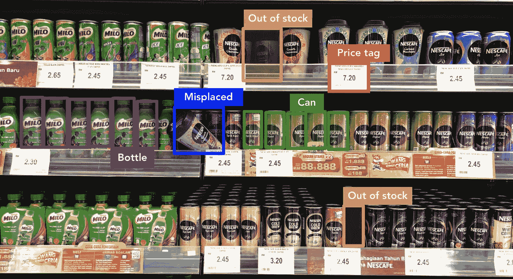
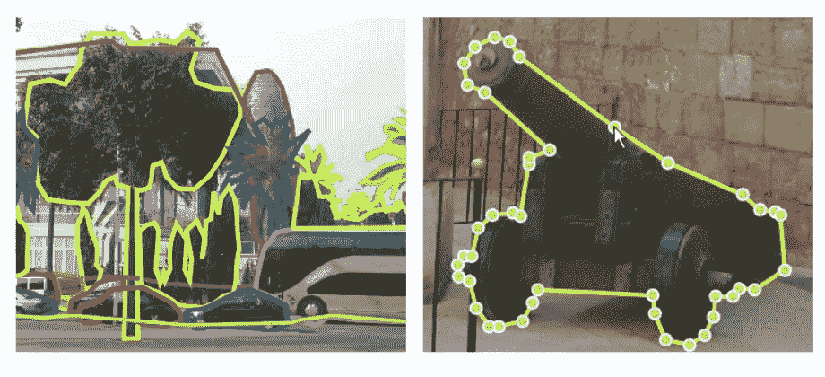
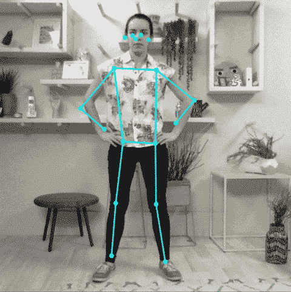
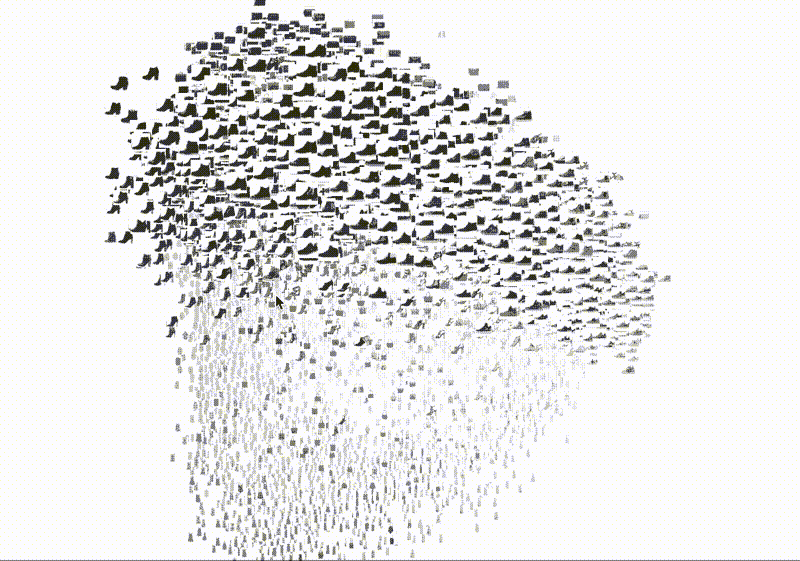
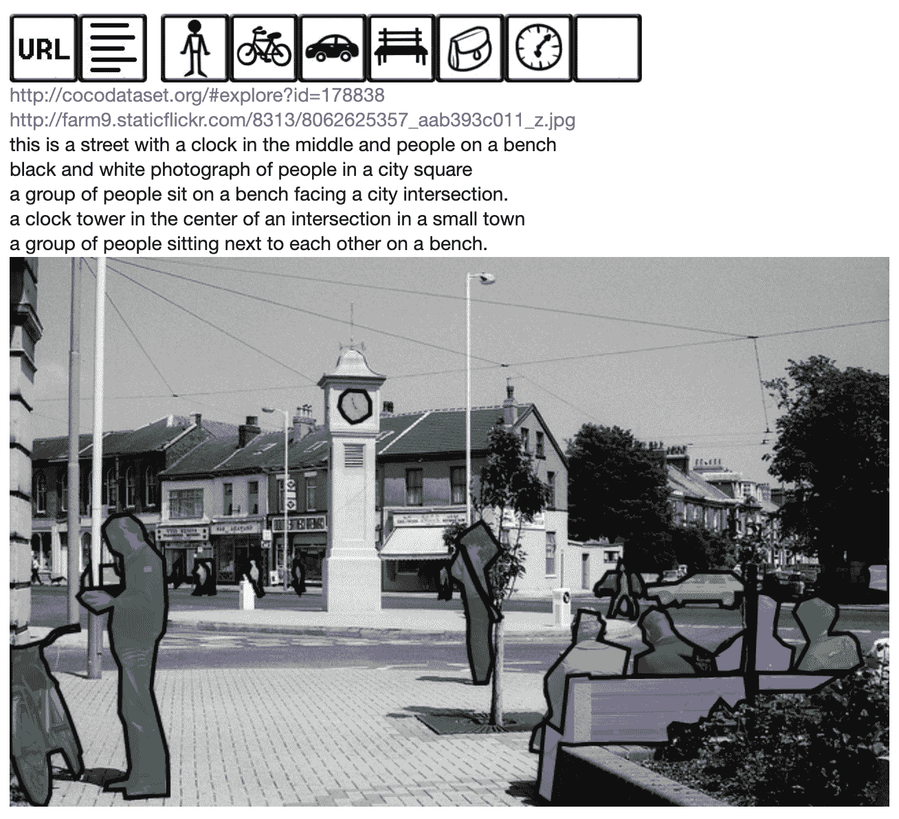
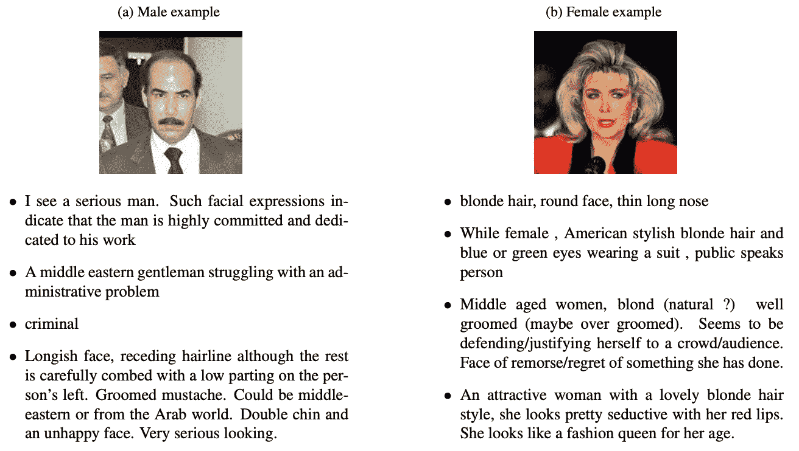
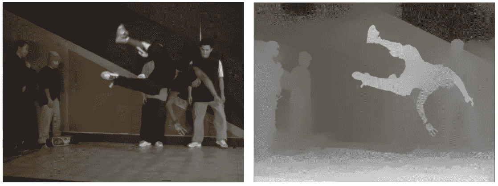
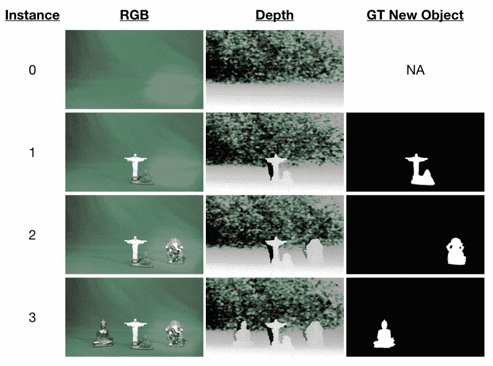

# 计算机视觉数据集入门:5 步入门

> 原文：<https://towardsdatascience.com/getting-started-with-computer-vision-datasets-a-5-step-primer-5aaf6d63552b?source=collection_archive---------30----------------------->

## 人工智能时代 CV 数据集的原因/时间/内容/地点/内容

就像我们需要教科书/博客/视频等材料来学习新技能和测试我们的知识一样，机器学习算法需要数据集来做同样的事情。

明信片不就是我们学习如何识别一个地方的真实数据集吗？(图片由[埃克托·里瓦斯](https://unsplash.com/@hjrc33)在 [Unsplash](https://unsplash.com/photos/QNc9tTNHRyI) 上拍摄)

数据集的选择至关重要。这恰恰是杰出的机器学习模型或另一项实验之间的区别。

有很多关于基于文本的数据集的优秀文章。在过去几年讲授计算机视觉主题的过程中，我注意到学生们很难理解计算机视觉数据集的内容/时间/地点/方式。

下面是我通常给那些新手的入门指南:

1.  为什么我们需要数据集？
2.  我们什么时候需要数据集？
3.  我们衡量什么？
4.  哪些数据集可用？
5.  我们在哪里可以找到数据集？

我们开始吧。

# 1-为什么我们需要数据集？

根据定义，数据集是用于定型和测试模型的相关示例的集合。这可以是属于特定主题或领域的示例的选择，数据集通常旨在迎合一个或多个应用。数据集可以被标记，因此非常适合训练和测试监督模型。然而，也存在用于训练无监督模型的未标记数据集。

## 培训和测试

从机器学习的角度来看，我们需要数据集来训练模型，并随后测试它们。这一过程要求我们选择数据集的一部分(例如 70%)并将其“展示”给机器学习算法以用于学习目的。然后，我们选择数据集中剩余的未看到的示例(例如，剩余的 30%)，并使用它们来测试模型的学习效果。至关重要的是，我们不要使用已经用于训练的示例进行测试，因为模型将预测它已经知道的东西，这被称为“过度拟合”模型。这是我们不想要的，因为一旦在不同的数据集上使用它，它只会保证模型的失败。组织训练测试集的方法有很多种，您可以看看这些例子。

## 标杆管理

当涉及到机器学习技术的性能时，数据集也可以作为一种测量工具。需要对执行相同任务的模型进行公平的比较。这是通过对一系列数据集运行不同的方法来实现的。因此，每种方法的性能测量将是可比较的，并且允许结果的简单比较。

[Ali Borji](https://medium.com/u/9fdf3479c58d?source=post_page-----5aaf6d63552b--------------------------------) 实施并发布了一套关于显著性技术的杰出基准测试练习。这些是我推荐给我学生的一些他的论文:

1.  [显著目标检测:一项调查](https://link.springer.com/article/10.1007/s41095-019-0149-9) (2019)
2.  [重访视频显著性:大规模基准和新模型](https://arxiv.org/abs/1801.07424) (2018)
3.  [显著物体检测:基准](https://arxiv.org/abs/1501.02741) (2015)

## 旁注:理解偏见

偏见本身就是一个巨大的话题。我们需要记住一些重要的事情。

> 就像任何其他信息来源一样，数据集本身带有一定程度的偏见。

这不一定会有负面影响，尤其是如果你想让你的模型在一个已经有偏见的世界里经受住相关性的考验。然而，非常重要的是，我们要意识到任何偏见，并衡量任何影响。

# 2-我们什么时候需要数据集？

本文的目的不是关注特定的计算机视觉技术。但是，我将快速向您介绍一些主题，并强调对数据集的需求。

## 目标检测和识别

[目标检测](/r-cnn-fast-r-cnn-faster-r-cnn-yolo-object-detection-algorithms-36d53571365e)处理识别和定位图像中特定类别的目标。可以用各种方式来解释对象定位。数据集标注中常用的方法包括在对象周围绘制边界框或多边形，如下所述。这种注释允许数据集用于检测。如果每个注释都附有标签，则可以使用相同的数据集进行识别。一旦选择了对象，它们也可以用于标记图像中包含该对象的每个像素(分割)。

## 对象分割

分割是将图像分割成对应于特定区域或对象的多个片段(像素组)的过程。这可以应用于使用阈值技术的对象，例如 Otsu 的方法。
分割也可以利用特征。现代方法利用深度学习方法，其中模型在包含数千个像素级注释标签的数据集上训练。这些方法包括[语义分割](https://medium.com/free-code-camp/diving-into-deep-convolutional-semantic-segmentation-networks-and-deeplab-v3-4f094fa387df)(带标签的区域选择)和[实例分割](https://engineering.matterport.com/splash-of-color-instance-segmentation-with-mask-r-cnn-and-tensorflow-7c761e238b46)(每类识别多个独立对象的语义分割)。

## 视觉显著性

视觉显著性是计算机视觉中一个不太受欢迎的领域，它回答了以下问题:图像的哪一部分更吸引人的注意？显著性检测技术接收彩色图像作为输入，并返回 8 位显著性图，其中像素值越亮(最大 255)意味着像素非常显著。视觉显著性用于从数据压缩到产品放置和图像处理的不同应用中。数据集，如下面介绍的 MSRA10K，提供了一个二进制图像作为基本事实，表明哪些像素是显著的或不显著的。

# 3-我们衡量什么？

数据集中可用注释的类型和质量对其相关性至关重要。在这一节中，我将快速向您介绍注释的主要类型。这要归功于 [@jiayin_Supahands](http://twitter.com/jiayin_Supahands) 对这方面的简洁概述，我鼓励你阅读她的文章。这里，我只给出最常用的注释和它们与主题的关系的概述。

## 边界框

边界框方法是最简单的注释类型，自然包括围绕感兴趣的对象绘制边界框。它通常由一对坐标和相应的宽度和高度来定义。如果用于分类或识别，边界框定义通常需要附有标签。使用边界框的主要缺点是，它以与目标对象像素相同的方式标记边界框中捕捉到的任何背景像素。从错误度量的角度来看，它有助于追踪回忆，但是对于精确度来说它是弱的，因此产生了对更具体的东西的需求。

使用边框注释的简单例子(来源:[佳音](https://medium.com/supahands-techblog/what-is-image-annotation-caf4107601b7)

## 多边形

边界框的限制带来了对更精确的东西的需求:多边形注释。多边形标注的思想类似于边界框，但是通过减少被误标注的背景像素的数量，允许标注中更好的像素精度。这种注释需要一种工具，如 [LabelMe](http://labelme.csail.mit.edu/Release3.0/) 。Label me 是一个开源的在线注释工具，用于为计算机视觉研究建立图像数据库。它还提供自己的数据集。

来自[官方 LabelMe 网站](http://labelme.csail.mit.edu/Release3.0/)的多边形注释示例

## 线条注释

顾名思义，这种方法使用线条来注释图像中的特定区域。在边界框会占用大量像素区域的情况下，线条会很有用。车道检测是使用这种注释的一种容易应用的情况。这也可用于监控队列和质量控制情况。

用于车道检测的线标注(来源:[佳音](https://medium.com/supahands-techblog/what-is-image-annotation-caf4107601b7))

## 点注释

这些注释是图像上关键点组的规范，通常带有语义内涵。这种方法非常常用于姿态估计和面部识别。不同点之间的几何属性被用作特征，并且使用这些特征来训练机器学习算法。这种方法被用于我们最近在 2019 年发表的题为“通过视频生成模型 检测异常人类行为”的工作中。

你想要一些实际的东西吗？查看这个优秀的姿态估计 [TensorFlow](https://medium.com/u/b1d410cb9700?source=post_page-----5aaf6d63552b--------------------------------) 教程，这是这张图的[来源。](https://www.tensorflow.org/lite/models/pose_estimation/overview)

# 4-哪些数据集可用？

嗯，很多:)

有几十个出色的计算机视觉数据集，它们对于正在改变世界的模型的开发至关重要。在本节中，我将重点介绍每个计算机视觉专业人员都应该了解的一些标志性数据集。

## 图像网络

*官网*:[http://www.image-net.org/](http://www.image-net.org/)

Image-Net 是传说中的计算机视觉数据集，它促进了深度学习的兴起。这是一个根据 WordNet 层次结构组织的图像数据库，其中每个有意义的概念，可能由多个单词描述，被称为“同义词集”或“同义词集”。图像网络通常用于物体分类/识别。该数据集总共包含 14，197，122 个带有边界框注释的图像，共计 1，034，908 个。

这个数据集因 [Image-net 竞赛](http://www.image-net.org/challenges/LSVRC/)而广受欢迎，在 AlexNet 于 2012 年赢得这场竞赛后，深度学习通过它获得了牵引力。它是由[费-李非](https://medium.com/u/7a81f3024ce?source=post_page-----5aaf6d63552b--------------------------------)创建的，她在我下面的 Ted 演讲中分享了这个数据集背后的非凡历程:

不管你认为/感觉自己在计算机视觉方面多么有经验，我强烈建议你花点时间听听这个鼓舞人心的演讲。尽管自 2015 年发布以来，技术已经有所进步，但该视频中呈现的心态和谦逊仍然高度相关。

## MNIST

*   原数字 http://yann.lecun.com/exdb/mnist/[MNIST](http://yann.lecun.com/exdb/mnist/)
*   时尚 MNIST:[https://github.com/zalandoresearch/fashion-mnist](https://github.com/zalandoresearch/fashion-mnist)

由 [Yann Le Cun](https://medium.com/u/cbdda5bf53df?source=post_page-----5aaf6d63552b--------------------------------) 领导的[原始 MNIST](http://yann.lecun.com/exdb/mnist/) 数据集由大量手写图像组成。它为早期的卷积神经网络提供了一个非常需要的简单的基准。到 2017 年，CNN 在 MNIST 上实现了持续出色的准确性(超过 99%)，对更具挑战性的基准数据集的需求出现了。这是时尚 MNSIT 数据集的一个动机。后一个版本包括 60，000 个样本的训练集和 10，000 个样本的测试集，其中每个样本都是来自 10 个不同类别的 28×28 像素的时尚项目。

这是来自官方 GitHub 库[的时尚 MNIST 数据库的一个很酷的可视化。](https://github.com/zalandoresearch/fashion-mnist)

## CIFAR-10

*官网*:[https://www.cs.toronto.edu/~kriz/cifar.html](https://www.cs.toronto.edu/~kriz/cifar.html)

该数据集由加拿大高级研究所(CIFAR)发布，并可能通过 Geoffrey Hinton 及其同事的参与而获得了一定的知名度。CIFAR-10 数据集包含 10 个不同类别的 60，000 幅 32x32px 彩色图像。它用于训练/测试对象识别模型。

从 CIFAR-10 数据集的 10 个类别中选择的图像(来源: [CIFAR 网站](https://www.cs.toronto.edu/~kriz/cifar.html)

## 椰子树

*官网*:【http://cocodataset.org/】T4

上下文中的公共对象(COCO)数据集是一个对象检测、分割和字幕数据集。COCO 2017 具有 123，287 个图像的训练和验证集合，包含总共 886，284 个实例。这些实例分布在 80 个对象类别中。

这是 [COCO 数据集](http://cocodataset.org/)中一幅图像的截屏。

## Face2Text

*官网*:[https://rival.research.um.edu.mt/](https://rival.research.um.edu.mt/)

有大量的数据集涵盖了不同种类的面部数据。在这里，我选择了一个新的和创新的数据集，由我在马耳他大学的同事编辑。与其他面部检测或识别数据集不同，这个数据集使用描述性文本进行注释。这允许机器学习模型被训练来返回仅给定图像的人脸的文本描述。介绍该数据集的[出版物的全部详细信息可在此处找到](http://www.lrec-conf.org/proceedings/lrec2018/pdf/226.pdf)并且数据集本身可通过填写该项目官方网站上的联系表获得。

从官方出版物中提取的数据集样本[。](http://www.lrec-conf.org/proceedings/lrec2018/pdf/226.pdf)

## MSRA10K

*官网*:[https://mmcheng.net/msra10k/](https://mmcheng.net/msra10k/)

这是一个显著目标图像数据库。该数据集中的每个图像都有一个用于图像中最显著区域的遮罩。MSRA10K 数据集从其包含的大量图像中获得了相关性。它由 10，000 幅彩色图像和相应的显著物体的二进制图像掩模组成。

图像中最突出的是什么？在 [MSRA10K 数据集](https://mmcheng.net/msra10k/)中的每一幅彩色图像都伴随着一幅二进制图像，作为地面实况。

## MSR 3D

*官网*:【https://www.microsoft.com/en-us/download/details.aspx? id=52358

微软研究数据集(MSR)包括一系列 100 幅图像(颜色和深度)，这些图像是从 8 台摄像机捕捉的，显示了霹雳舞和芭蕾场景。该数据集包含每个场景的帧。每一帧都有一幅彩色图像和高质量的灰度深度图像，由红外相机拍摄。

这是 MSR3D 数据集中“霹雳舞”序列的样本帧，通过 8 个摄像机的线性设置拍摄。还有另一个序列，通过 8 个摄像机的圆形配置拍摄的“芭蕾”序列。

## 集装箱卸货与传输系统

*官网*:[www . cots dataset . info](http://www.cotsdataset.info)

这是我去年精心设计和构建的数据集，用于评估图像处理技术。这样的应用之一是在物体从图像中移除的地方进行修补。修复技术通常使用主观或基于意见的方法进行评估，因为数据集将缺乏足够的地面真相。这是该数据集背后的一个动机，该数据集有一系列渐进的场景，如下所示。关于此数据集的更多细节及其构建背后的经验将在单独的工作中分享。

来自 COTS 数据集的样本显示了场景的渐进性质，其中在每个实例中都引入了新的对象。这意味着修补可以应用于第 n 个实例，并使实例 n-1 充当基础事实。

# 5-我们在哪里可以找到数据集？

在学术界，你通常会在同行评审的出版物中遇到关于你感兴趣的主题的数据集。然而，你有时只需要浏览你的选项，为此，你需要一个好的平台。以下是我最喜欢的 4 个来源:

## 谷歌数据集搜索

 [## 数据集搜索

### 了解有关在数据集搜索中包含数据集的详细信息。‫العربية‬‪deutsch‬‪english‬‪español(españa)‬‪español…

datasetsearch.research.google.com](https://datasetsearch.research.google.com/) 

*   优点:非常广泛
*   **缺点**:比较不同数据集时容易迷失。

## VisualData

[www.visualdata.io](http://www.visualdata.io)

*   **优点**:专注于计算机视觉数据集，界面优秀，易于使用，快速到达直接存储库。
*   **缺点**:在可用数据集的选择方面仍然有限。

## 卡格尔

[www.kaggle.com](http://www.kaggle.com)

*   **优点**:不同领域的各种数据集，活跃的社区，竞争。
*   **缺点**:可能需要更长时间才能看到每个数据集提供了什么。

## 张量流

 [## 张量流数据集

### 一个数据集集合，可以与 TensorFlow 或其他 Python ML 框架(如 Jax)一起使用，实现易用性…

www.tensorflow.org](https://www.tensorflow.org/datasets) 

*   **优点**:为每个数据集提供广泛的直截了当的页面选择。每一个数据集还伴随着优秀的使用资源。
*   **缺点**:为了完整，我需要挤出一个缺点。这样的话，缺点就是(很明显)这个网站只提供 Tensorflow 资源。

这篇文章旨在提供一个覆盖所有基础知识的初级读本，让你习惯计算机视觉这个令人兴奋的领域。我希望现在你对数据集更有信心了，这个话题本身已经为你揭开了神秘的面纱。如果没有，我期待收到您的反馈，以便我可以解决您可能会发现的任何挑战。

我们已经了解了如何使用数据集，以及哪些数据集适合不同的情况。然而，这并不是故事的结尾。机器学习和数据集有着非常复杂和苛刻的关系。有时，机器学习模型无法满足需求，数据集可能会有局限性。这就是需要数据扩充的地方。在这篇博客中，我还解释了数据集对于不同技术的基准测试是多么重要。话说回来，说起来容易，做起来也容易，因为评估指标的选择是一个微妙的配方，需要进行调整。

总之，这篇文章离计算机视觉数据集的主题还很远。这是一个快速发展的领域，有许多主题有待探索。我只能承诺在这个过程中继续分享我的观点。

*Dylan Seychell 是马尔他大学人工智能系的常驻学者，专攻计算机视觉。出版了几本国际同行评审的出版物和两本书。他的工作获得了许多国际奖项，如 CeBit 的电子卓越金章，2010 年欧洲航天局卫星导航竞赛的一等奖和 2017 年的亚军。2015 年，迪伦被选中领导马耳他的谷歌开发者小组，并担任马耳他政府国家人工智能特别工作组成员。迪伦在创业领域也非常活跃，他创立了屡获殊荣的创业公司，并指导其他创业公司，帮助他们超越商业的最初挑战。*

可以通过 [Twitter](http://www.twitter.com/dylanseychell) 、 [LinkedIn](https://www.linkedin.com/in/dylanseychell/) 或者 [Instagram](http://www.instagram.com/dylanseychell) 联系。