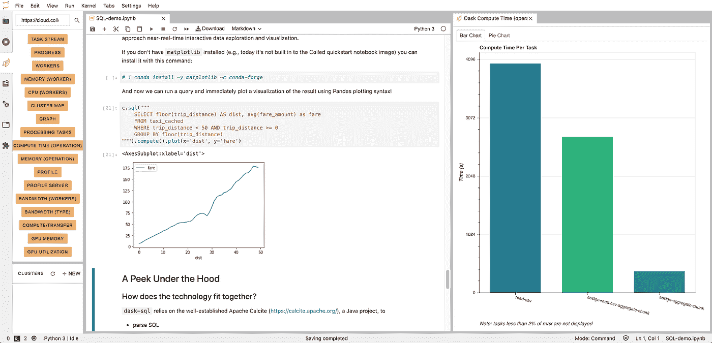
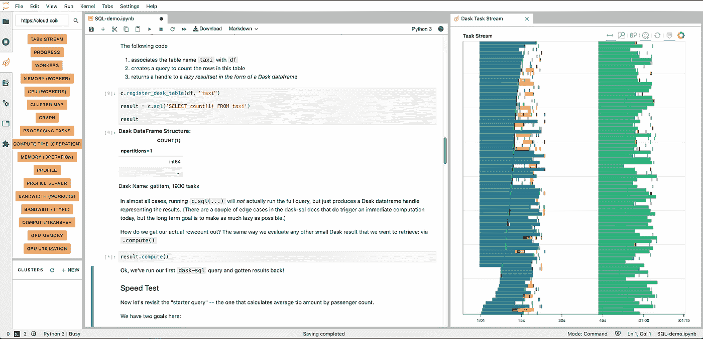
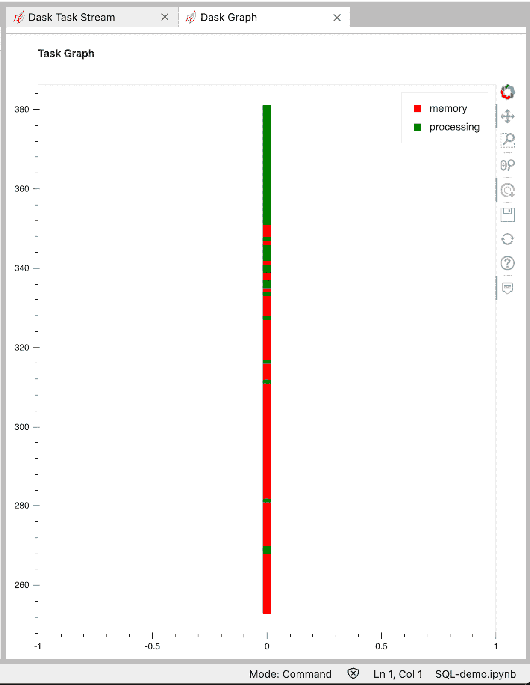
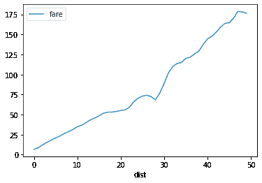

# Dask 和 SQL 入门

> 原文：<https://towardsdatascience.com/getting-started-with-dask-and-sql-b8e2058dd563?source=collection_archive---------51----------------------->

*免责声明:作者为 Coiled 工作，Coiled 是这篇文章中的一个供应商。*

很多人谈论“民主化”数据科学和机器学习。从可广泛访问的意义上来说，还有什么比 SQL、PyData 和将数据科学扩展到更大的数据集和模型更民主呢？

Dask 正迅速成为可扩展计算的首选技术。尽管有强大而灵活的 dataframe API，Dask 在历史上并不支持 SQL 来查询大多数原始数据。

在本文中，我们来看看 dask-sql，这是一个令人兴奋的新开源库，它为 dask 提供了一个 sql 前端。跟着一起的还有[这本笔记本](https://github.com/coiled/notebooks-blog/blob/main/notebooks/dask-sql-demo.ipynb)。如果你想免费访问一些严肃的 Dask 集群，你也可以把它加载到 Coiled Cloud 上。为此，在此登录 [Coiled Cloud，导航到](https://cloud.coiled.io/?utm_source=distrib_ml_future_post&utm_medium=blog&utm_campaign=blog_referalls_3)[我们的示例笔记本](https://cloud.coiled.io/examples/notebooks)，并启动 dask-sql 笔记本。

在本帖中，我们:

*   启动 Dask 集群并使用 dask-sql 在其上运行 sql 查询！
*   进行一些基本的速度测试，
*   使用 SQL 和缓存数据来加速我们的分析，
*   调查 dask-sql 中的 SQL 内置助手函数，
*   提供一个从大数据快速绘图的例子。

非常感谢 dask-sql 的创建者 Nils Braun，感谢他对这篇文章的深思熟虑和建设性的反馈。



(图片由作者提供)

# 启动 Dask 集群并为 SQL 做好准备

dask-sql 是免费的+开源的，可以在任何 dask 集群上运行，所以你可以在任何环境下运行它(只需要很少的修改)。在 AWS (Azure 和 GCP 即将推出)上运行集群的一个简单方法是使用盘绕云。简单的一个原因是你不需要和 Docker 和/或 Kubernetes 混在一起！这就是我们在这里要做的，并且可以随意编码。

如果你还没有注册 Coiled beta，[你可以在这里用 Github 或 Google ID 免费注册。](https://cloud.coiled.io/?utm_source=dask_sql_post&utm_medium=blog&utm_campaign=blog_referalls_2)

然后，我们执行导入并启动我们的集群！

```
import coiled from dask.distributed
import Clientcluster = coiled.Cluster(n_workers=20)
client = Client(cluster) client
```

接下来，我们将安装 dask-sql。这是一个简单的安装，但可能需要一两分钟。

# 分析云中的数据

至此，我们已经准备好开始查询数据了！

在运行我们的第一个 SQL 查询之前，让我们在感兴趣的数据集上用一个“starter”查询来测试一下:这个查询计算纽约出租车数据集中 2019 年记录的乘客计数的平均小费金额。

然后我们用 SQL 再试一次。

```
import dask.dataframe as dddf = dd.read_csv(
       "s3://nyc-tlc/trip data/yellow_tripdata_2019-*.csv", 
       dtype={ "payment_type": "UInt8", 
               "VendorID": "UInt8", 
               "passenger_count": "UInt8", 
               "RatecodeID": "UInt8" },
       storage_options={"anon": True} ) df.groupby("passenger_count").tip_amount.mean().compute()
```

太好了！

我们的集群和代码正在运行。

# 现在让我们用 dask-sql 来尝试一些 SQL！

dask-sql 使用一些代码来“自动地”定位我们将需要的 JVM 共享库，但是它在这个部署在云上的 Jupyter 容器中没有找到正确的路径。

正如我们稍后看到的，dask-sql 使用一个 Java 库来处理一些查询分析，所以我们将给出一个关于 JVM 路径的提示。

```
import os os.environ["JAVA_HOME"] = "/opt/conda/lib/server"
```

dask-sql 使用一个完善的 Java 库 Apache 方解石来解析 sql 并对查询执行一些初始工作。这是一件好事，因为这意味着 dask-sql 没有重新发明另一个查询解析器和优化器，尽管它确实创建了对 JVM 的依赖。注意，启动和管理 JVM 的速度缺点只是在解析查询时出现的问题，而不是在执行查询时出现的问题。我们很快就会看到，这并没有显著增加开销。

```
from dask_sql import Context c = Context()
```

这个上下文实例将让我们运行查询…但首先我们需要一些数据源。

用 dask-sql 定义数据源有多种方法，但最简单的一种方法是提供 dask 数据帧作为数据源。Dask 数据帧:

*   是懒惰的，所以直到需要时才检索数据，
*   可以发现数据模式，
*   支持核外访问—这是一种不需要将数据加载到内存中的奇特说法(例如，数据可能不适合内存，或者您可能希望内存用于其他计算)，
*   知道如何从底层来源检索数据(例如，“S3 的 CSV 文件”)。

为了在我们的 SQL 查询中使用数据，我们需要在 dask-sql 中为它分配一个标识符(名称)。

以下代码:

1.  将表名 taxi 与 df 相关联
2.  创建一个查询来计算该表中的行数
3.  以 Dask 数据帧的形式返回惰性结果集的句柄

```
c.register_dask_table(df, "taxi")result = c.sql('SELECT count(1) FROM taxi') result
```

在几乎所有情况下，运行 c.sql(…)实际上不会运行完整的查询，而只是产生一个表示结果的 Dask dataframe 句柄。(在 dask-sql 文档中有一些边缘情况确实会触发即时计算，但长期目标是尽可能地减少懒惰。)

我们如何得到实际的行数？同样的方式，我们评估任何其他小 Dask 结果，我们想检索:通过。计算()

```
result.compute()
```



(图片由作者提供)

好了，我们已经运行了第一个 dask-sql 查询并获得了结果！

# 转速试验

现在让我们再来看一下“起始查询”——根据乘客数量计算平均小费金额的查询。

我们有两个目标:

*   用 Dask/Python 和 SQL 编写相同的查询，可以看到它们工作并产生相同的结果，
*   对执行进行计时，以验证 SQL 不会增加任何显著的性能开销

如果您正在尝试这样做，这也是查看 Dask 任务流仪表板的好时机，可以看到集群的运行情况。您可以通过 JupyterLab 扩展或通过 Coiled Cloud GUI 来实现这一点。

```
%%time df.groupby("passenger_count").tip_amount.mean().compute() %%time c.sql('SELECT avg(tip_amount) FROM taxi GROUP BY passenger_count').compute()
```

您应该看到相同的输出(我们看到两者都是大约 25 秒)。此外，您应该会看到几乎相同的挂钟时间。SQL 处理增加了 100 毫秒或更少的时间，并且是一次性的固定成本。

# SQL +缓存数据=涡轮增压分析

让我们看看如何通过在集群中缓存该数据集，然后对缓存的数据运行 SQL 查询来加速分析。

这不仅速度快，而且有利于整个团队，因为:

*   我们可以向其他 Dask 分析师公开这个数据集，鼓励他们共享一个“大型 RAM 池”集群来分析数据，
*   [dask-sql 公开了 Presto wire 协议](https://dask-sql.readthedocs.io/en/latest/pages/server.html)，因此使用 Presto 兼容客户端或可视化工具的人可以零编程访问这些数据！

首先，我们将要求 Dask 缓存该表。

```
dfp = df.persist()
```

可能需要几秒钟(对于非常大的数据集，可能需要更长时间)才能加载到集群 RAM 中。

我们可以在 Dask Graph 仪表板中实时查看块加载情况。这显示任务在计算时变成绿色，然后在结果载入内存时变成红色。在这种情况下，每个任务从 S3 检索数据的一个分区。



(图片由作者提供)

在其他情况下，我们可能不想查看 GUI，而是以编程方式等待数据加载。

我们可以使用 distributed.wait(…)来实现:

```
import dask.distributedcached_tasks = dask.distributed.wait(dfp)print(f'cached {len(cached_tasks[0])} results')
```

接下来，我们将为数据集的这种新的缓存风格赋予一个新的表名(上面我们将 df.persist 的结果分配给它的 dfp)。

dfp 有点不透明，所以我们将这个表命名为 taxi_cached。

```
c.register_dask_table(dfp, "taxi_cached")
```

作为一个快速测试，看看它在内存不足的情况下运行的速度有多快，让我们再次计算行数。

```
result = c.sql('SELECT count(1) FROM taxi_cached')result.compute()
```

让我们也尝试一下按乘客计数查询平均小费，这次是从缓存中查询。

```
%%time c.sql('SELECT avg(tip_amount) FROM taxi_cached GROUP BY passenger_count').compute()
```

不足为奇的是，由于从缓存的数据中工作消除了作业中的大部分 I/O、解析和服务，它的运行速度比以前快得多。

# SQL 内置函数

dask-sql 还在 sql 中公开了许多助手函数——就像传统的关系数据库公开数学、日期/时间处理、字符串操作等助手函数一样。

下面是对静态文字值运行的 floor 函数:

```
c.sql('SELECT floor(3.14)').compute()
```

使用 floor 来离散化(或划分)行程距离，我们可以查看距离桶的粗粒度平均费用。

我们的下一个查询查看距离在 0 到 50 之间的乘车，拆分(分组)分段(floor())距离，然后对于每个分段，返回分段距离、平均费用和乘车次数。

因为我们知道——基于我们的查询——报告输出将只包含 50 行和 3 列，我们可以安全地*计算*,并在本地获得一个作为常规 Pandas 数据帧的结果。如果我们的结果非常大——或者是我们希望在后续操作中使用的中间转换——我们要么将它写入持久存储，要么将结果保存在集群中。毕竟，大型数据集不适合我们的本地流程，Dask *客户端*和 *dask-sql 上下文*对象就在本地流程中(注意，dask-sql 查询的输出可以再次输入 Dask-sql——这使得在 SQL 中获得类似的“视图”成为可能)。

```
%%timec.sql("""SELECT floor(trip_distance) 
AS dist, avg(fare_amount) as fare, count(1) as t 
FROM taxi_cached 
WHERE trip_distance < 50 AND trip_distance >= 0 
GROUP BY floor(trip_distance)
""").compute()
```

由于 Dask 已经实现了如此多的计算构建块，dask-sql 能够涵盖大多数 sql 组件——包括子查询、连接和聚合。

# 贡献的机会

如果您查看 dask-sql 文档，您会注意到还没有实现多少帮助函数。例如，大多数数据库都有几个日期和时间处理助手函数，而现在 dask-sql 并没有实现所有这些函数。

大多数数据库都有几个字符串处理辅助函数，而今天 dask-sql 只有一个。

这是一个添加有价值的功能并对库做出贡献的好机会，因为实现这些功能只需要找到现有的 Dask 函数并将其连接起来。

我们可能想添加很多功能，但每个功能都很小，所以这是一个很好的众包机会。点击这里可以看到现有的实现[。](https://github.com/nils-braun/dask-sql)

# 再举一个例子:从大数据中快速绘图

因为我们的结果反馈很快，而且作为熊猫的数据框架，我们可以很容易地进行可视化。这种模式可以帮助我们接近实时的交互式数据探索和可视化。

如果您没有安装 matplotlib，可以使用以下命令安装它:

```
! conda install -y matplotlib -c conda-forge
```

现在，我们可以运行一个查询，并立即使用 Pandas 绘图语法绘制结果的可视化图形！

```
c.sql("""SELECT floor(trip_distance) 
AS dist, avg(fare_amount) as fare 
FROM taxi_cached 
WHERE trip_distance < 50 AND trip_distance >= 0 
GROUP BY floor(trip_distance) 
""").compute().plot(x='dist', y='fare')
```



(图片由作者提供)

# 引擎盖下的一瞥

***技术如何契合？***

dask-sql 依赖于完善的 Apache 方解石([https://calcite.apache.org/](https://calcite.apache.org/))，一个 Java 项目

*   解析 SQL
*   将查询表示为操作符树
*   规范化和优化查询
*   方解石的优化器是可扩展的，因此有许多“插件”可以在将来添加更多的功能

太多了！还剩下什么？

方解石的输出是一个逻辑操作符树的查询表示。这些是像投影(把它们想象成选择的抽象)和过滤器(哪里的抽象)这样的东西。

dask-sql 的下一项工作是提供插件，将纯粹抽象的操作符转换成用 Dask APIs 表达操作的逻辑。结果仍然是逻辑操作符，但是更具体一些——类似于您自己编写 Dask dataframe 查询所得到的结果，因此它可以在您的 Dask 集群上执行。在执行时，Dask 提供操作的物理实现，例如，根据数据的存储方式而变化。

# 创造更多机会

协同增效如今已经是老生常谈了。但是向 Dask 添加一个 SQL 前端使大量新用户和新用例能够共享最先进的 Python 数据解决方案。

例如，精通 SQL 但不写命令性代码的分析师和商务人士现在可以利用 Dask、PyData、Coiled 等等……同时与喜欢编码的人合作。

dask-sql 中的自定义函数支持意味着编码人员可以围绕复杂的流程创建简单的包装器(例如，应用机器学习模型对记录进行评分)，sql 用户可以使用这些函数创建报告。

最后，通过 Presto 的数据库服务器功能(也许很快就是 JDBC，因为方解石包括 JDBC 支持)，可以采用像 Tableau 这样的可视化解决方案，并将其指向 Dask 集群进行大规模可视化分析。

链接:

*   Dask、Coiled 和 PyData[https://coiled.io/blog/pydata-dask/](https://coiled.io/blog/pydata-dask/)
*   https://dask-sql.readthedocs.io/的 Dask SQL 文档
*   Dask SQL 来源【https://github.com/nils-braun/dask-sql 
*   阿帕奇方解石[https://calcite.apache.org/](https://calcite.apache.org/)

最后，如果您喜欢这种方法，“感觉需要速度”，并且有可用的 GPU，一定要看看 [BlazingSQL](https://blazingsql.com/) ，它在 GPU 计算的基础上提供了类似的 SQL+Dask 架构，以获得令人惊叹的查询速度。

*原载于 2020 年 10 月 30 日*[*https://coiled . io*](https://coiled.io/blog/getting-started-with-dask-and-sql/)*。*