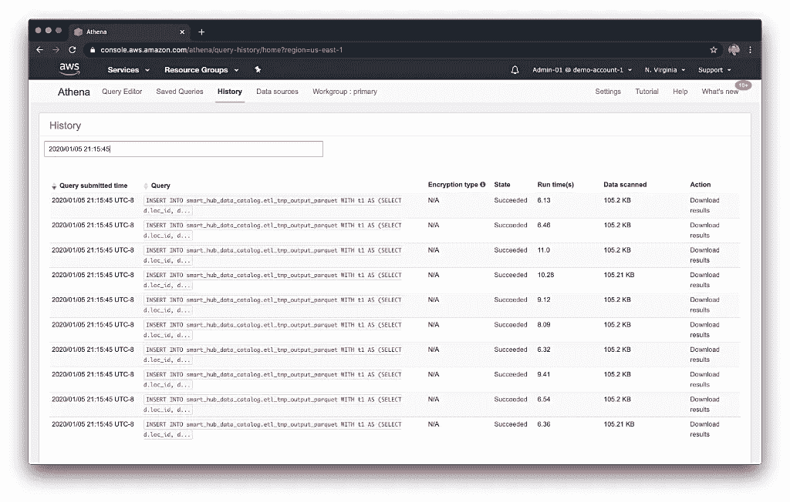
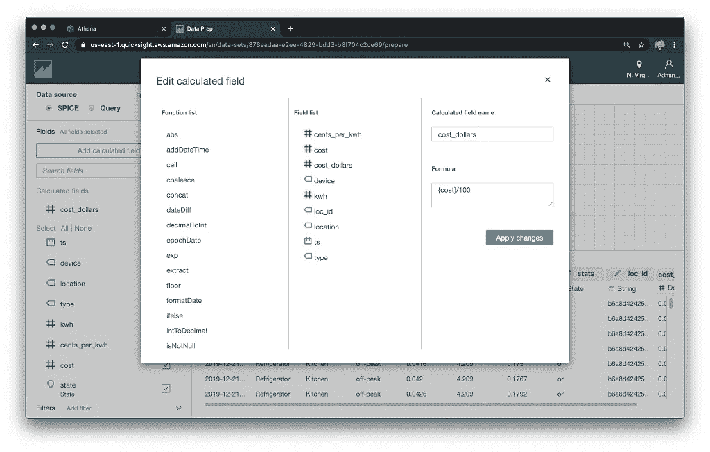
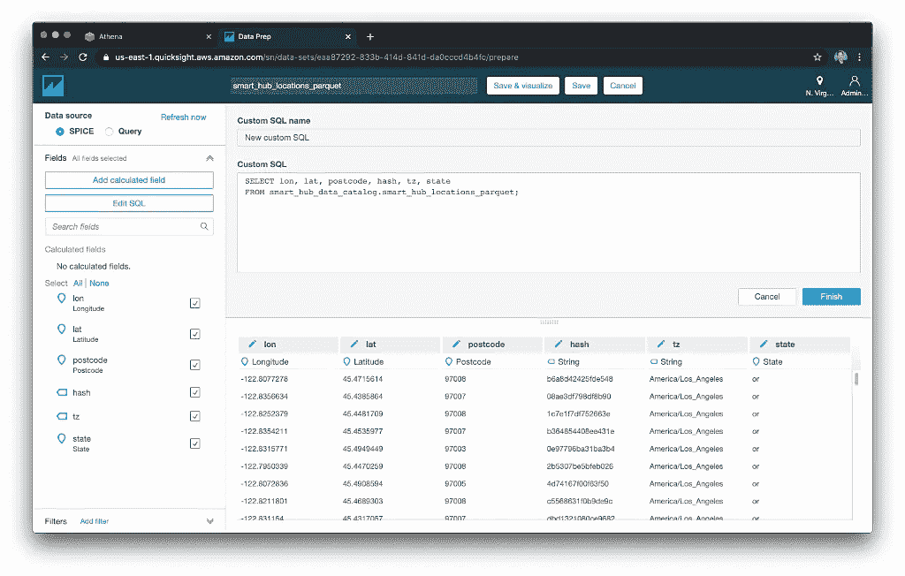
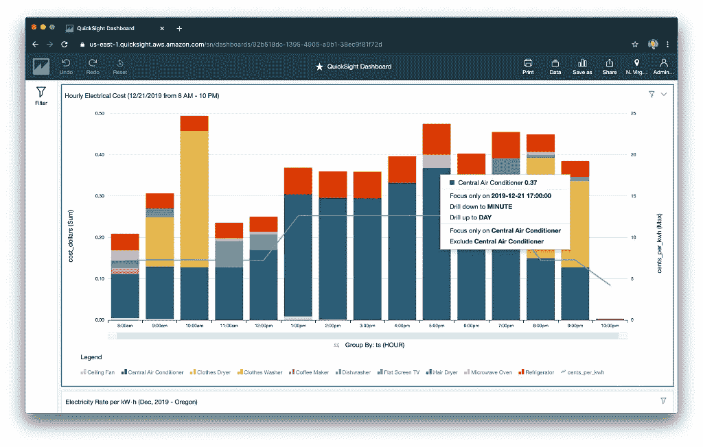

# AWS 数据分析入门

> 原文：<https://towardsdatascience.com/getting-started-with-data-analysis-on-aws-7b74ecbfe572?source=collection_archive---------14----------------------->

## 了解如何使用 AWS Glue、Amazon Athena 和 Amazon QuickSight 来转换、丰富、分析和可视化半结构化数据。

帖子的音频介绍

# 介绍

根据[维基百科](https://en.wikipedia.org/wiki/Data_analysis)的说法，数据分析是"*一个检查、清理、转换和建模数据的过程，目的是发现有用的信息，告知结论，并支持决策。*“在这篇文章中，我们将探索如何开始在 AWS 上进行数据分析，使用亚马逊 Athena、AWS Glue、亚马逊 QuickSight、亚马逊 S3 和 AWS Lambda 的无服务器功能。我们将学习如何使用这些补充服务来转换、丰富、分析和可视化半结构化数据。

> 数据分析——发现有用的信息，提供结论，支持决策。–维基百科

我们将学习如何使用亚马逊 S3、AWS Glue、亚马逊 Athena 和 AWS Lambda 以多种格式接收、转换和丰富原始的半结构化数据。我们将构建一个基于 S3 的数据湖，并了解 AWS 如何利用开源技术，如 Presto、Apache Hive 和 Apache Parquet。

亚马逊[最近增加了](https://aws.amazon.com/about-aws/whats-new/2019/11/amazon-quicksight-adds-api-support-for-data-dashboard-spice-and-permissions/)全套`aws quicksight`API，用于与 QuickSight 交互。然而，对于演示的最后一部分，我们将从亚马逊 QuickSight 控制台进行操作，而不是 AWS CLI、AWS CDK 或 CloudFormation 模板。

# 示范

在本次演示中，我们将扮演一家美国大型电力供应商的角色。这家能源提供商开发了其下一代智能电力监控中心(Smart Hub)。他们已经向美国的大量居民客户出售了智能集线器。这个假想的智能集线器通过无线方式从分散在住宅各处的单个智能电源插座和电路仪表中收集详细的用电数据。电力使用数据经过加密，并安全地从客户的智能枢纽传输到电力供应商，后者在 AWS 上开展业务。

客户能够以精细的粒度、每台设备和一段时间来分析他们的用电情况。智能集线器的目标是使客户能够利用数据降低电力成本。由于客户将使用转移到非高峰时间以节省资金，该提供商受益于现有电网上负载的减少和每日电力负载的更好分配。

*亚马逊 QuickSight 中 post 的数据预览。*

这篇文章将关注数据分析，而不是数据捕获的实时流方面或数据如何在 AWS 上持久化。

*演示的高级 AWS 架构图。*

# 特色技术

以下 AWS 服务和开源技术是这篇文章的重点。

## 基于亚马逊 S3 的数据湖

一个[基于亚马逊 S3 的数据湖](https://docs.aws.amazon.com/whitepapers/latest/building-data-lakes/amazon-s3-data-lake-storage-platform.html)使用亚马逊 S3 作为其主要存储平台。亚马逊 S3 为数据湖提供了一个最佳的基础，因为它具有几乎无限的可扩展性，从千兆字节到千兆字节的内容。亚马逊 S3 提供“11 个 9”(99.999999999%)的耐用性。它具有可扩展的性能、易于使用的特性以及本机加密和访问控制功能。

## AWS 胶水

[AWS Glue](https://aws.amazon.com/glue/) 是一个完全托管的提取、转换和加载(ETL)服务，用于准备和加载数据进行分析。AWS Glue 发现您的数据，并将关联的元数据(例如，表定义和模式)存储在 AWS Glue 数据目录中。一旦编目，您的数据就可以立即被搜索、查询和用于 ETL。

## AWS 粘合数据目录

[AWS 粘合数据目录](https://aws.amazon.com/glue/faqs/#AWS_Glue_Data_Catalog)是一个 [Apache Hive](https://hive.apache.org/index.html) Metastore 兼容的中央存储库，用于存储数据资产的结构和操作元数据。对于给定的数据集，存储表定义、物理位置、添加与业务相关的属性，以及跟踪数据随时间的变化。

## AWS 胶水爬行器

一个 [AWS Glue Crawler](https://aws.amazon.com/glue/faqs/) 连接到一个数据存储，通过一个优先的分类器列表提取数据和其他统计数据的模式，然后用这些元数据填充 Glue 数据目录。爬网程序可以定期运行，以检测新数据的可用性以及对现有数据的更改，包括表定义的更改。爬网程序会自动添加新表、现有表的新分区以及新版本的表定义。你甚至可以定制胶水爬虫来分类你自己的文件类型。

## AWS 粘合 ETL 作业

AWS Glue ETL 作业是在 AWS Glue 中执行提取、转换和加载(ETL)工作的业务逻辑。当您启动一个作业时，AWS Glue 运行一个脚本，该脚本从源中提取数据，转换数据，并将其加载到目标中。AWS Glue 生成 PySpark 或 Scala 脚本，运行在 Apache Spark 上。

## 亚马逊雅典娜

[Amazon Athena](https://aws.amazon.com/athena/) 是一种交互式查询服务，使用标准 SQL 可以轻松分析亚马逊 S3 的数据。Athena 支持并使用各种标准数据格式，包括 CSV、JSON、Apache ORC、Apache Avro 和 Apache Parquet。Athena 集成了现成的 AWS 粘合数据目录。Athena 是无服务器的，所以不需要管理基础设施，您只需为运行的查询付费。

亚马逊 Athena 背后的底层技术是 [Presto](https://prestodb.io/) ，这是由脸书创建的用于大数据的开源分布式 SQL 查询引擎。根据 AWS，Athena 查询引擎基于[Presto 0.172](https://docs.aws.amazon.com/athena/latest/ug/DocHistory.html)(2017 年 4 月 9 日发布)。除了 Presto 之外，Athena 还使用 [Apache Hive](https://cwiki.apache.org/confluence/display/Hive/LanguageManual+DDL) DDL 来定义表。

## 亚马逊 QuickSight

[Amazon QuickSight](https://aws.amazon.com/quicksight/) 是一项完全托管的商业智能(BI)服务。QuickSight 允许您创建和发布包含 [ML Insights](https://aws.amazon.com/quicksight/features-ml/) 的交互式仪表盘。仪表板可以从任何设备访问，并嵌入到您的应用程序、门户和网站中。QuickSight 无需服务器即可自动从数十名用户扩展到数万名用户，无需任何基础架构管理。

## 自动气象站λ

[AWS Lambda](https://aws.amazon.com/lambda/) 自动运行代码，无需配置或管理服务器。AWS Lambda 通过运行代码来响应触发器，从而自动扩展应用程序。Lambda 代码并行运行。有了 AWS Lambda，您的代码每执行 100 毫秒就要付费，代码被触发的次数也是如此。您只需为消耗的计算时间付费。

# 智能枢纽数据

这篇文章中的一切都围绕着数据。为了这篇文章的演示，我们将从四类原始的合成数据开始。这些数据类别包括智能集线器用电数据、智能集线器传感器映射数据、智能集线器住宅位置数据和电费数据。为了展示 AWS Glue 处理多种数据格式的能力，四类原始数据由三种不同的文件格式组成:XML、JSON 和 CSV。我试图将尽可能多的“真实世界”的复杂性融入到数据中，同时又不忽略这篇文章的主题。样本数据集故意很小，以使您的 AWS 成本在演示中保持最低。

为了进一步降低成本，我们将使用多种数据分区方案。根据 [AWS](https://docs.aws.amazon.com/athena/latest/ug/partitions.html) 的说法，通过对你的数据进行分区，可以限制每次查询扫描的数据量，从而提高性能，降低成本。我们只有很少的数据用于演示，在这种情况下，分区可能会对查询性能产生负面影响。然而，在“真实世界”的场景中，将会有数百万潜在的住宅用户产生万亿字节的数据。在这种情况下，数据分区对于成本和性能都是至关重要的。

## 智能集线器用电数据

Smart Hub 的时序用电数据是从客户的 Smart Hub 中收集的。在演示的示例用电数据中，每一行代表完全任意的五分钟时间间隔。总共有十个电传感器，其用电量以千瓦小时(kW)为单位进行记录和传输。每个智能集线器记录并传输 10 个设备传感器的用电量，每天 288 次(24 小时/ 5 分钟间隔)，每个智能集线器每天总共 2，880 个数据点。该演示有两天的使用数据，总共有 5，760 个数据点。数据以 [JSON 行](http://jsonlines.org/)格式存储。使用数据将按照日期(例如，“dt = 2019–12–21”)在基于亚马逊 S3 的数据湖中进行分区。

请注意，用电数据包含嵌套数据。十个传感器中的每一个传感器的用电量都包含在 JSON 数组中的每个时间序列条目中。该数组包含十个 double 类型的数值。

真实数据通常很复杂，而且嵌套很深。在这篇文章的后面，我们将看到 AWS Glue 可以映射许多常见的数据类型，包括嵌套的数据对象，如下图所示。

## 智能集线器传感器映射

智能集线器传感器映射数据将使用数据中的传感器列(例如“s_01”)映射到相应的实际设备(例如“中央空调”)。该数据包含设备位置、瓦特数和上次修改记录的时间。数据也以 [JSON 行](http://jsonlines.org/)格式存储。传感器映射数据将在基于亚马逊 S3 的数据湖中按照居住的州进行划分(例如，俄勒冈州的“state=or”)。

## 智能枢纽位置

智能中心位置数据包含每个住宅智能中心的地理空间坐标、家庭地址和时区。数据以 CSV 格式存储。本次演示中包含的四个城市的数据来自 [OpenAddresses](https://openaddresses.io/) 、*免费开放的全球地址收集。*‘大概有 4k 的位置记录。位置数据将在基于亚马逊 S3 的数据湖中按照安装智能中心的居住州进行划分(例如，俄勒冈州的“state=or”)。

## 电费

最后，电价数据包含电费。在本演示中，假设汇率因州、月份和一天中的小时而异。数据存储在 XML 中，这种数据导出格式在旧的遗留系统中仍然很常见。电价数据不会在基于亚马逊 S3 的数据湖中被分割。

# 数据分析过程

由于演示中的数据分析过程涉及的步骤很多，我将该过程分为四个逻辑阶段:1)原始数据接收，2)数据转换，3)数据丰富，以及 4)数据可视化和商业智能(BI)。

*全数据分析工作流程图(点击放大…)*

## 原始数据摄取

在原始数据接收阶段，半结构化 CSV、XML 和 JSON 格式的数据文件被复制到一个安全的[亚马逊简单存储服务](https://aws.amazon.com/s3/) (S3)桶中。在存储桶中，数据文件根据其物理数据结构(模式)组织到文件夹中。由于数据文件的数量可能没有限制，文件被进一步组织(分区)到子文件夹中。数据文件的组织策略基于日期、时间、地理位置、客户 id 或其他常见的数据特征。

这种半结构化数据文件、S3 桶和分区的集合形成了所谓的数据湖。根据 AWS 的说法，数据湖是一个集中式存储库，允许您存储任何规模的所有结构化和非结构化数据。

一系列的 [AWS 胶合爬虫](https://docs.aws.amazon.com/glue/latest/dg/add-crawler.html)处理原始的 CSV-、XML-和 JSON-格式文件，提取元数据并在 [AWS 胶合数据目录](https://docs.aws.amazon.com/glue/latest/dg/populate-data-catalog.html)中创建表定义。根据 AWS，AWS Glue 数据目录包含元数据表，其中每个表指定一个数据存储。

## 数据转换

在数据转换阶段，转换前一阶段的原始数据。数据转换可以包括修改数据和改变数据格式。数据修改包括数据清理、重新转换数据类型、更改日期格式、字段级计算和字段连接。

然后，数据从 CSV、XML 和 JSON 格式转换成 [Apache Parquet](https://parquet.apache.org/) 格式，并写回到基于亚马逊 S3 的数据湖。Apache Parquet 是一种压缩的、高效的列存储格式。和许多基于云的服务一样，Amazon Athena 按每次查询扫描的数据量收费。因此，使用数据分区、分桶、压缩和列存储格式(如 Parquet)将降低查询成本。

最后，将转换后的 Parquet 格式数据编目到新的表中，与原始的 CSV、XML 和 JSON 数据放在一起，放在 Glue 数据目录中。

## 数据丰富

根据 [ScienceDirect](https://www.sciencedirect.com/topics/computer-science/data-enrichment) 的说法，数据丰富或扩充是通过补充缺失或不完整的数据来增强现有信息的过程。通常，数据丰富是通过使用外部数据源实现的，但情况并非总是如此。

> *数据丰富——通过补充缺失或不完整的数据来增强现有信息的过程。–科学指导*

在数据丰富阶段，Parquet 格式的 Smart Hub 使用数据会增加来自其他三个数据源的相关数据:传感器映射、位置和电费。基于客户的地理位置和一天中的时间，客户的 Smart Hub 使用数据丰富了客户的设备类型、客户的时区以及每个监控期的客户电力成本。

一旦数据得到丰富，它就被转换成 Parquet 并针对查询性能进行优化，存储在数据湖中，并被编目。此时，原始的 CSV、XML 和 JSON 格式的原始数据文件、转换后的 Parquet 格式的数据文件和 Parquet 格式的丰富数据文件都存储在基于亚马逊 S3 的数据湖中，并在 Glue 数据目录中编目。

## 数据可视化和商业智能

在最后的数据可视化和商业智能(BI)阶段，呈现和分析丰富的数据。有许多企业级服务可用于可视化和商业智能，它们与 Athena 集成。亚马逊服务包括[亚马逊 QuickSight](https://aws.amazon.com/quicksight/) 、[亚马逊 EMR](https://aws.amazon.com/emr/) 、[亚马逊 SageMaker](https://aws.amazon.com/sagemaker/) 。来自 AWS 合作伙伴的第三方解决方案可在 [AWS Marketplace](https://aws.amazon.com/marketplace) 上获得，包括 [Tableau](https://aws.amazon.com/marketplace/seller-profile?id=0ef849c5-c2fa-4699-9f67-c47555e148a5&ref=dtl_prodview-f4r47zzmas57k) 、 [Looker](https://aws.amazon.com/marketplace/seller-profile?id=f2b415a2-1013-4f3f-ba68-ad1895504098) 、 [Sisense](https://aws.amazon.com/marketplace/seller-profile?id=b9a3a7ee-d8b2-4322-a03a-eec7853e8610) 和 [Domo](https://aws.amazon.com/marketplace/seller-profile?id=7b1d10b8-b3fc-469e-a33d-d5bcc84caba9) 。在本次演示中，我们将重点介绍 Amazon QuickSight。

# 入门指南

## 要求

为了进行演示，您需要一个 AWS 帐户和当前版本的 [AWS CLI](https://aws.amazon.com/cli/) 。为了从演示中获得最大收益，您还应该在您的工作环境中安装 [Python 3](https://www.python.org/downloads/) 和 [jq](https://stedolan.github.io/jq/) 。

## 源代码

这篇文章的所有源代码可以在 [GitHub](https://github.com/garystafford/athena-glue-quicksight-demo) 找到。使用以下命令克隆项目的副本。

本文中的源代码示例显示为 GitHub [Gists](https://help.github.com/articles/about-gists/) ，在一些移动和社交媒体浏览器上无法正确显示。

## TL；博士？

不看说明书就想跳进去？这篇文章中的所有 AWS CLI 命令都整合在 GitHub 项目的 README 文件中。

## 云形成堆栈

首先，使用[smart-hub-Athena-glue . yml](https://github.com/garystafford/athena-glue-quicksight-demo/blob/master/cloudformation/smart-hub-athena-glue.yml)模板创建“smart-hub-Athena-glue-stack”cloud formation 堆栈。该模板将创建(3)亚马逊 S3 桶，(1) AWS 胶水数据目录数据库，(5)数据目录数据库表，(6) AWS 胶水爬虫，(1) AWS 胶水 ETL 作业，以及(1)AWS 胶水 IAM 服务角色。

首先，确保将`DATA_BUCKET`、`SCRIPT_BUCKET`和`LOG_BUCKET`变量更改为您自己唯一的 S3 存储桶名称。我总是建议使用标准的 AWS 三部分约定来命名您的存储桶(例如，“smart-hub-data-123456789012-us-east-1”)。

## 原始数据文件

接下来，将原始的 CSV、XML 和 JSON 格式的数据文件从本地项目复制到`DATA_BUCKET` S3 存储桶中( [*中的*步骤 1a-1b)工作流程图**](https://programmaticponderings.files.wordpress.com/2020/01/athena-glue-0-4.png) )。这些文件代表了 S3 数据湖的开端。每一类数据都使用不同的策略来组织和分离文件。注意使用了 [Apache Hive 风格的分区](https://cwiki.apache.org/confluence/display/Hive/LanguageManual+DDL#LanguageManualDDL-AlterPartition)(例如`/smart_hub_data_json/**dt=2019-12-21**`)。如前所述，假设数据湖中实际的大量数据需要使用分区来提高查询性能。

用以下命令确认`DATA_BUCKET` S3 桶的内容。

在`DATA_BUCKET` S3 桶中应该总共有(14)个原始数据文件。

## λ函数

接下来，打包(5)基于 Python3.8 的 AWS Lambda 函数进行部署。

将五个 Lambda 包复制到`SCRIPT_BUCKET` S3 桶中。第二个 CloudFormation 堆栈 [smart-hub-serverless](https://github.com/garystafford/athena-glue-quicksight-demo/blob/master/cloudformation/smart-hub-lambda.yml) 访问 [ZIP 存档 Lambda 包](https://docs.aws.amazon.com/lambda/latest/dg/lambda-python-how-to-create-deployment-package.html)。如果在`SCRIPT_BUCKET` S3 桶中没有找到包，这个创建 Lambda 函数的 CloudFormation 栈将无法部署。

我选择将包放在不同的 S3 桶中，然后是原始数据文件。在真实的生产环境中，出于安全考虑，这两种类型的文件至少会被分隔到不同的存储桶中。请记住，只有数据应该进入数据湖。

使用[smart-hub-lambda . yml](https://github.com/garystafford/athena-glue-quicksight-demo/blob/master/cloudformation/smart-hub-lambda.yml)cloud formation 模板创建第二个“smart-hub-lambda-stack”cloud formation 堆栈。该模板将创建(5) AWS Lambda 函数和(1) [Lambda 执行 IAM 服务角色](https://docs.aws.amazon.com/lambda/latest/dg/lambda-intro-execution-role.html)。

此时，我们已经使用 CloudFormation 部署了演示所需的所有 AWS 资源。我们还复制了亚马逊 S3 数据湖中所有原始的 CSV、XML 和 JSON 格式的数据文件。

## AWS 胶水爬行器

如果您还记得，我们在 Glue Data Catalog 数据库中创建了五个表，作为 CloudFormation 堆栈的一部分。四种原始数据类型各有一个表，一个表用于保存稍后演示中的临时 ELT 数据。要确认这五个表是在粘合数据目录数据库中创建的，请使用粘合数据目录控制台，或者运行以下 AWS CLI / jq 命令。

五个数据目录表应该如下所示。

我们还创建了六个 Glue 爬虫作为 CloudFormation 模板的一部分。其中四个爬虫负责将来自 S3 的原始 CSV、XML 和 JSON 格式的数据编目到相应的现有 Glue Data Catalog 数据库表中。爬行器将检测任何新的分区，并将它们添加到表中。每个爬虫对应于四种原始数据类型中的一种。爬虫可以被[调度](https://docs.aws.amazon.com/glue/latest/dg/schedule-crawler.html)定期运行，编目新数据并更新数据分区。爬虫还会创建一个数据目录数据库表。我们使用爬虫来创建新的表格，稍后在文章中。

使用 AWS CLI 运行四个胶水爬行器( [*工作流程图*](https://programmaticponderings.files.wordpress.com/2020/01/athena-glue-0-4.png) 中的*步骤 1c)。*

您可以检查 Glue Crawler 控制台，以确保四个 Crawler 成功完成。

或者，使用另一个 AWS CLI / jq 命令。

完成后，所有爬网程序都应处于“仍在估计=假”和“TimeLeftSeconds = 0”的状态。根据我的经验，爬虫程序在估计阶段后需要一分钟来启动，完成后需要一分钟来停止。

成功运行四个爬行器完成了演示的原始数据接收阶段。

## 用 CTAS 改造成拼花地板

原始数据接收阶段完成后，我们现在将使用三个 AWS Lambda 函数将原始 Smart Hub 使用数据、传感器映射数据和位置数据转换为 Parquet 格式。每个 Lambda 随后调用 Athena，后者执行一个`CREATE TABLE AS SELECT` SQL 语句(又名 [CTAS](https://docs.aws.amazon.com/athena/latest/ug/ctas.html) )。每个 Lambda 都执行类似的命令，不同之处仅在于数据源、数据目的地和分区方案。下面是用于智能集线器用电数据的命令示例，取自基于 Python 的 Lambda，[Athena-JSON-to-parquet-data/index . py](https://github.com/garystafford/athena-glue-quicksight-demo/blob/master/lambdas/athena-json-to-parquet-data/index.py)。

这个简洁而强大的 CTAS 语句将原始 JSON 和 CSV 格式数据文件的副本转换为 Parquet 格式，并将结果文件分区并存储回基于 S3 的数据湖。此外，CTAS SQL 语句将拼花地板格式的数据文件编入胶合数据目录数据库的新表中。不幸的是，这种方法不适用于 XML 格式的原始数据文件，这是我们接下来要解决的问题。

从 Lambda 控制台的 functions 选项卡上应该可以看到五个已部署的 Lambda 函数。

使用 AWS CLI 调用三个 Lambda 函数。(*[*工作流程图*](https://programmaticponderings.files.wordpress.com/2020/01/athena-glue-0-4.png) 中步骤 2a 的一部分)。*

*这是同一个 CTAS 命令的一个例子，上面显示了 Smart Hub 电力使用数据，因为它是由 Athena 成功执行的。*

*我们可以从 Athena 控制台的 History 选项卡中查看任何 Athena SQL 查询。单击一个查询(粉色)会将其复制到查询编辑器选项卡并执行它。下面，我们看到 Lamba 函数执行的三个 SQL 语句。*

**

## *AWS 为 XML 粘合 ETL 作业*

*如果您还记得，电价数据是 XML 格式的。我们刚刚执行的 Lambda 函数使用 Athena 将 CSV 和 JSON 数据转换为 Parquet。目前，与 CSV、JSON、ORC、Parquet 和 Avro 不同， [Athena 不支持](https://docs.aws.amazon.com/athena/latest/ug/supported-format.html)更老的 XML 数据格式。对于 XML 数据文件，我们将使用 AWS Glue ETL 作业将 XML 数据转换成 Parquet。Glue ETL 作业是用 Python 编写的，使用了 [Apache Spark](https://spark.apache.org/) ，以及几个 [AWS Glue PySpark 扩展](https://docs.aws.amazon.com/glue/latest/dg/aws-glue-programming-python-extensions.html)。对于这项工作，我使用在 Glue ETL 作业控制台中创建的现有脚本作为基础，然后修改脚本以满足我的需要。*

*脚本期望的三个 Python 命令行参数(上面的第 10-12 行)在 CloudFormation 模板[smart-hub-Athena-glue . yml](https://github.com/garystafford/athena-glue-quicksight-demo/blob/master/cloudformation/smart-hub-athena-glue.yml)中定义。下面，我们在 CloudFormation 代码片段的第 10–12 行看到了它们。它们是在作业运行时自动注入的，并且可以在启动作业时从命令行覆盖。*

*首先，将 Glue ETL Job Python 脚本复制到`SCRIPT_BUCKET` S3 桶中。*

*接下来，启动 Glue ETL 作业( [*工作流程图*](https://programmaticponderings.files.wordpress.com/2020/01/athena-glue-0-4.png) 中步骤 2a 的*部分)。虽然转换是一组相对简单的任务，但是创建 Apache Spark 环境来执行这些任务需要几分钟的时间。尽管 Glue Crawlers 平均需要大约 2 分钟，但是根据我的经验，Glue ETL 工作可能需要 10-15 分钟。实际执行时间只需要 10-15 分钟中的 1-2 分钟。在我看来，等待 15 分钟对于针对较小数据集的临时作业来说太长了；Glue ETL 作业肯定是针对大数据的。**

*要检查作业的状态，请使用 Glue ETL 作业控制台，或者使用 AWS CLI。*

*完成后，您应该会看到类似下面的结果。请注意,“JobRunState”为“SUCCEEDED”这个特定的作业总共运行了 14.92 分钟，而实际执行时间是 2.25 分钟。*

*作业的进度和结果也可以在 AWS Glue 控制台的 ETL 作业选项卡中看到。*

**

*CloudWatch 管理控制台中也提供了详细的 Apache Spark 日志，可以从 AWS Glue 控制台的 ETL Jobs 选项卡中的 logs 链接直接访问。*

**

*数据转换阶段的最后一步是使用另一个 Glue Crawler(在 [*工作流图*](https://programmaticponderings.files.wordpress.com/2020/01/athena-glue-0-4.png) 中的*步骤 2b 的一部分)将之前的 Glue ETL 作业创建的拼花格式的电费数据转换成目录。启动下面的 Glue Crawler 来编目 Parquet 格式的电费数据。**

*数据转换阶段到此结束。原始数据和转换后的数据在数据湖中，下面的九个表应该在 Glue 数据目录中。*

*如果我们检查这些表，我们应该观察到我们用来组织基于亚马逊 S3 的数据湖中的数据文件的数据分区包含在表元数据中。下面，我们看到了基于状态的拼花格式位置数据的四个分区。*

**

## *数据丰富*

*为了开始数据丰富阶段，我们将调用 AWS Lambda，[Athena-complex-ETL-query/index . py](https://github.com/garystafford/athena-glue-quicksight-demo/blob/master/lambdas/athena-complex-etl-query/index.py)。这个 Lambda 接受输入参数(下面的第 28–30 行)，在 Lambda 处理程序的事件参数中传递。参数包括 Smart Hub ID、请求数据的开始日期和请求数据的结束日期。演示的场景是，一个具有位置 id 值的客户使用电力供应商的应用程序请求特定日期范围(开始日期和结束日期)的数据，以进行可视化和分析。*

*Lambda 执行一系列 Athena `INSERT INTO` SQL 语句，每个语句对应一个可能的 Smart Hub 连接的电气传感器`s_01`到`s_10`，Smart Hub 电气使用数据中有这些传感器的值。亚马逊[刚刚在 2019 年 9 月发布了](https://aws.amazon.com/about-aws/whats-new/2019/09/amazon-athena-adds-support-inserting-data-into-table-results-of-select-query/)亚马逊 Athena `INSERT INTO`一个使用选择查询功能结果的表，这是对 Athena 的一个重要补充。Athena 的新功能在[发行说明](https://docs.aws.amazon.com/athena/latest/ug/release-notes.html)中列出。*

*这里，选择查询实际上是一系列链式子查询，使用 Presto SQL 的 [WITH 子句](https://prestodb.io/docs/current/sql/select.html)功能。这些查询将基于 S3 的数据湖中的拼花格式智能集线器用电数据源与其他三个基于 S3 的拼花格式数据源(传感器映射、位置和电费)连接起来。拼花格式的数据作为单独的文件写入 S3，并插入到现有的“etl_tmp_output_parquet”胶合数据目录数据库表中。与传统的基于关系数据库的查询相比，Glue 和 Athena 能够跨存储在 S3 的多个半结构化数据文件进行复杂的 SQL 查询，这真是令人惊叹！*

> **Glue 和 Athena 能够对存储在 S3 的多个半结构化数据文件进行复杂的 SQL 查询，这真是令人惊叹！**

*下面，我们看到从第 43 行开始的 SQL 语句。*

*下面是 Athena 对`s_10`传感器执行的最终查询之一的示例。所有输入参数值、Python 变量和环境变量都已被解析到查询中。*

*在丰富数据的同时，该查询使用其他数据源执行额外的数据转换。例如，根据客户的位置，Unix 时间戳被转换为包含日期和时间的本地化时间戳(上面的第 7 行)。转换日期和时间是一项频繁且痛苦的数据分析任务。数据丰富的另一个例子是用新的计算列增加数据。该列的值是使用另外两列的值计算的(上面的第 33 行)。*

*使用有效负载中的以下三个参数调用 Lambda([*工作流图*](https://programmaticponderings.files.wordpress.com/2020/01/athena-glue-0-4.png) 中的*步骤 3a)。**

*十个`INSERT INTO` SQL 语句的结果状态(每个设备传感器一个)可从 Athena 控制台的 History 选项卡中看到。*

**

*每次 Athena 查询执行都将查询结果作为单独的、未压缩的 Parquet 格式数据文件保存到基于 S3 的数据湖中。数据在基于亚马逊 S3 的数据湖中按照智能电表位置 ID(例如‘loc _ ID = b6a8d 42425 FDE 548’)进行分区。*

*以下是客户洗衣机(传感器 s _ 04’)的丰富数据片段。请注意，时间戳现在是客户当地时区的实际日期和时间(例如，“2019–12–21 20:10:00.000”)。传感器 ID ('s_04 ')被替换为实际的设备名称('洗衣机')。增加了设备的位置(“地下室”)和用电时段的类型(如“高峰”或“部分高峰”)。最后，计算成本列。*

*为了将丰富的 CSV 格式数据转换为 Parquet 格式，我们需要使用另一个爬虫对 CSV 格式的结果进行编目，首先( [*中的*步骤 3d，工作流图**](https://programmaticponderings.files.wordpress.com/2020/01/athena-glue-0-4.png) )。*

## *优化丰富的数据*

*上一步创建了丰富的拼花格式数据。然而，这些数据在查询效率方面并没有得到应有的优化。使用 Athena `INSERT INTO WITH` SQL 语句，允许对数据进行分区。然而，该方法不允许拼花数据被容易地组合成更大的文件并被压缩。为了执行这两个优化，我们将使用最后一个 Lambda，[Athena-parquet-to-parquet-ELT-data/index . py](https://github.com/garystafford/athena-glue-quicksight-demo/blob/master/lambdas/athena-parquet-to-parquet-elt-data/index.py)。Lambda 将在基于亚马逊 S3 的数据湖中创建一个新位置，在一个文件中包含所有丰富的数据，并使用 [Snappy](https://en.wikipedia.org/wiki/Snappy_(compression)) 压缩进行压缩。*

*生成的拼花文件可以在 S3 管理控制台中看到。*

**

*数据丰富阶段的最后一步是对优化的 Parquet 格式的丰富 ETL 数据进行编目。为了对数据进行分类，运行下面的 Glue Crawler(在 [*工作流程图*](https://programmaticponderings.files.wordpress.com/2020/01/athena-glue-0-4.png) 中的步骤 3i)*

## *最终数据湖和数据目录*

*在基于 S3 的数据湖中，我们现在应该有以下十个分区数据的顶级文件夹。可以忽略“tmp”文件夹。*

*类似地，我们现在应该在 Glue 数据目录中有以下十个对应的表。使用 AWS Glue 控制台确认这些表是否存在。*

**

*或者，使用以下 AWS CLI / jq 命令列出表名。*

## *“未知”错误*

*您可能已经注意到，使用 CTAS SQL 语句，用 AWS Lambda 函数创建的四个表错误地将“分类”设为“未知”,而不是“拼花”。我不知道为什么，我相信这是一个与 CTAS 功能可能的错误。这似乎对桌子的功能没有负面影响。但是，要解决此问题，请运行以下命令集。这个`aws glue update-table`攻击将把桌子的“分类”切换到“拼花”。*

*从 AWS Glue 控制台可以看到修复的结果。所有十个表现在都被正确分类。*

**

# *探索数据*

*在开始使用 Amazon QuickSight 可视化和分析数据之前，尝试使用 Athena 查询编辑器对 Glue Data Catalog 数据库中的表执行一些 Athena 查询。在编辑器中工作是理解数据、学习 Athena 以及调试 SQL 语句和查询的最佳方式。Athena 查询编辑器具有方便的开发人员特性，如 SQL 自动完成和查询格式化功能。*

*在编写查询和在互联网上搜索 SQL 参考时要注意，Athena 查询引擎是基于 Presto [0.172](https://docs.aws.amazon.com/athena/latest/ug/DocHistory.html) 的。Presto 的当前版本， [0.229](https://github.com/prestodb/presto/releases/tag/0.229) ，比当前雅典娜版本领先 50 多个版本。Athena 和 Presto 的功能都发生了变化和分化。对于 Athena 中的 SQL 查询，还有一些额外的[注意事项和限制](https://docs.aws.amazon.com/athena/latest/ug/other-notable-limitations.html)。*

**

*下面是一些在 Athena 查询编辑器中运行的简单的特别查询。*

# *使用 QuickSight 实现数据可视化和商业智能*

*对于演示的最后一部分，我们将使用 Amazon QuickSight 控制台，而不是 AWS CLI、CloudFormation 模板和 Python 脚本。*

## *注册 QuickSight*

*要使用 Amazon QuickSight，您必须注册 QuickSight。*

**

*亚马逊 QuickSight 有两个版本，标准版和企业版。对于这个演示，标准版就足够了。*

**

## *QuickSight 数据集*

*Amazon QuickSight 使用数据集作为所有数据可视化的基础。据亚马逊称，QuickSight 数据集可以从各种各样的数据源中创建，包括亚马逊 RDS、亚马逊 Aurora、亚马逊 Redshift、亚马逊 Athena 和亚马逊 S3。您还可以上传 Excel 电子表格或平面文件(CSV、TSV、CLF、ELF 和 JSON)，连接到 SQL Server、MySQL 和 PostgreSQL 等内部数据库，并从 Salesforce 等 SaaS 应用程序导入数据。下面，我们看到了 QuickSight 新数据集控制台中可用的最新数据源列表。*

**

## *演示数据集*

*为了演示，我创建了三个 QuickSight 数据集，它们都基于 Amazon Athena 作为数据源。当使用 Amazon Athena 作为数据源时，您有两种选择。第一个选项是从 AWS Glue Data Catalog 数据库中选择一个表，比如我们在文章的第一部分“smart_hub_data_catalog”中创建的数据库第二个选项是基于 AWS Glue 数据目录数据库中的一个或多个表创建一个定制的 SQL 查询。*

**

*在本演示第二部分创建的三个数据集中，两个数据集直接使用数据目录中的表，包括“etl_output_parquet”和“electricity_rates_parquet”第三个数据集使用自定义 SQL 查询，基于单个数据目录表“smart_hub_locations_parquet”用于创建数据集的所有三个表都代表了位于 S3 的数据湖中丰富、高效的 Parquet 格式数据源。*

**

## *数据集特征*

*创建和配置数据集时，有大量功能可用。我们不可能在这篇文章中涵盖所有的内容。让我们来看三个特性:地理空间字段类型、计算字段和自定义 SQL。*

## *地理空间数据类型*

*QuickSight 可以智能地检测数据源中常见类型的地理字段，并分配 QuickSight 地理数据类型，包括国家、县、城市、邮政编码和州。QuickSight 还可以检测[地理空间数据](https://docs.aws.amazon.com/quicksight/latest/user/geospatial-data-prep.html)，包括纬度和经度。我们将利用 QuickSight 特性来处理三个数据集的数据源，包括州、邮政编码、纬度和经度字段类型。*

**

## *计算字段*

*一个常用的 QuickSight 数据集功能是“计算字段”对于“etl_output_parquet”数据集，我创建了一个新字段(列)“cost_dollar”*

**

*`cost`字段是设备在五分钟时间间隔内的电力成本，单位为美分()。计算出的`cost_dollar`字段是`cost`字段除以 100 的商。该值表示设备在五分钟时间间隔内的电力成本，单位为美元($)。这是一个简单的例子。但是，计算字段可能非常复杂，由多个算术、比较和条件函数、字符串计算和数据集字段构成。*

**

*数据集计算字段也可以从 QuickSight 分析控制台创建和编辑(稍后讨论)。*

**

## *自定义 SQL*

*第三个 QuickSight 数据集基于 Amazon Athena 定制 SQL 查询。*

*虽然您可以在 QuickSight 数据准备控制台中编写查询，但我更喜欢使用 Athena 查询编辑器编写自定义 Athena 查询。首先，使用编辑器，您可以编写、运行、调试和优化查询，以确保它们正常运行。*

**

*然后 Athena 查询可以粘贴到自定义 SQL 窗口中。在窗口中单击“完成”相当于在 Athena 查询编辑器控制台中单击“运行查询”。查询运行并返回数据。*

**

*与 Athena 查询编辑器类似，在 QuickSight 数据准备控制台中执行的查询将显示在 Athena 历史选项卡中，带有一个`/* QuickSight */`注释前缀。*

**

## *香料*

*您会注意到三个 QuickSight 数据集被标记为“SPICE”据亚马逊网站称，首字母缩写 SPICE 代表“超高速、并行、内存计算引擎”。QuickSight 的内存计算引擎 SPICE 可在大规模应用中实现极快的性能。SPICE 自动复制数据以实现高可用性，允许成千上万的用户同时执行快速、交互式的分析，同时保护您的底层数据基础架构，节省您的时间和资源。使用 QuickSight 的标准版，作为第一作者，您可以免费获得 1 GB 的 SPICE 内存数据。*

## *快速视力分析*

*QuickSight 分析控制台是创建分析的地方。特定的 QuickSight 分析将包含一组数据集和[数据可视化](https://docs.aws.amazon.com/quicksight/latest/user/working-with-visuals.html)(视觉效果)。每个视觉与单个数据集相关联。*

*QuickSight 分析视觉效果的类型包括:水平和垂直、单个和堆叠条形图、折线图、组合图、面积折线图、散点图、热图、饼图和圆环图、树状图、数据透视表、仪表图、关键性能指标(KPI)、地理空间图和文字云。可以轻松修改单个可视标题、图例、轴和其他可视方面。视觉效果可以包含[下钻](https://docs.aws.amazon.com/quicksight/latest/user/adding-drill-downs.html)。*

*可以从分析控制台中修改数据集的字段。可以为显示自定义字段类型和格式，如日期、数字、货币字段。该分析可以包括标题和副标题。有一些可定制的主题可以用来改变分析的整体外观。*

**

## *分析过滤器*

*使用[过滤器](https://docs.aws.amazon.com/quicksight/latest/user/filtering-visual-data.html)、[条件格式](https://docs.aws.amazon.com/quicksight/latest/user/conditional-formatting-for-visuals.html)和[参数](https://docs.aws.amazon.com/quicksight/latest/user/parameterize-a-filter.html)的组合，可以进一步调整视觉效果中显示的数据。下面，我们将看到一个基于日期和时间范围的典型过滤器示例。数据集包含两整天的数据。在这里，我们将数据过滤到 14 小时的用电高峰期，即 2019 年 12 月 21 日上午 8 点到晚上 10 点。*

**

## *向下钻取、向上钻取、聚焦和排除*

*根据 [AWS](https://docs.aws.amazon.com/quicksight/latest/user/adding-drill-downs.html) 的说法，除了数据透视表之外的所有可视类型都提供了为可视元素创建字段层次结构的能力。层次结构允许您向下或向上钻取，以查看层次结构不同级别的数据。焦点可以让你专注于字段层次结构中的单个元素。“排除”允许您从字段层次结构中删除元素。下面，我们看到一个例子，所有这四个特点，可适用于“中央空调”。由于空调设备是平均每天最大的电力消耗者，应用这些滤波器来了解其对整体电力使用的影响可能有助于分析。我们还可以从几小时深入到几分钟，或者从几小时深入到几天。*

**

# *示例 QuickSight 分析*

*分析作者将 QuickSight 分析作为 QuickSight 仪表板进行共享。下面，我们将看到一个 QuickSight 仪表盘示例，它是为本次演示而构建和共享的。“住宅用电分析”是根据之前创建的三个数据集构建的。根据这些数据集，我们构建了几个视觉效果，包括地理空间图、圆环图、热图、关键性能指标、堆叠垂直条形图和折线图。每个视频的标题、布局和字段显示都是定制的。视觉效果中显示的数据经过了不同的过滤，包括按日期和时间、按客户 id ( `loc_id`)和按州。条件格式用于增强视觉效果的视觉外观，例如“总电力成本”KPI。*

**

# *QuickSight APIs*

*虽然我们在这次演示中没有使用它们，但 Amazon [最近添加了一整套用于以编程方式与 QuickSight 交互的](https://aws.amazon.com/about-aws/whats-new/2019/11/amazon-quicksight-adds-api-support-for-data-dashboard-spice-and-permissions/)API。例如，要预览在演示的这一部分创建的三个 QuickSight 数据集，使用 AWS CLI，我们可以使用`list-data-sets`命令。*

*要使用 AWS CLI 检查单个数据集的细节，我们可以使用`describe-data-set`命令。*

# *清理*

*要清理在本演示中创建的 AWS 资源，请执行以下 AWS CLI 命令。为了避免失败，请确保在运行后续命令之前完成每个命令。您需要使用 AWS CloudFormation 控制台或 AWS CLI 确认 CloudFormation 堆栈已删除。请注意，这些命令不会删除您可能从控制台创建的任何 Amazon QuickSight 数据集、分析和仪表板。但是，删除 AWS 粘合数据目录和底层数据源将影响在 QuickSight 中可视化数据的能力。*

# *结论*

*在这篇文章中，我们学习了如何使用亚马逊 S3、AWS Glue、亚马逊 Athena 和 AWS Lambda 以多种格式接收、转换和丰富原始的半结构化数据。我们建立了一个基于 S3 的数据湖，并了解了 AWS 如何利用开源技术，包括 Presto、Apache Hive 和 Apache Parquet。最后，我们使用存储在数据湖中的经过转换和丰富的数据集，通过 Amazon QuickSight 创建引人注目的可视化效果。*

*本文表达的所有观点都是我个人的，不一定代表我现在或过去的雇主或他们的客户的观点。*