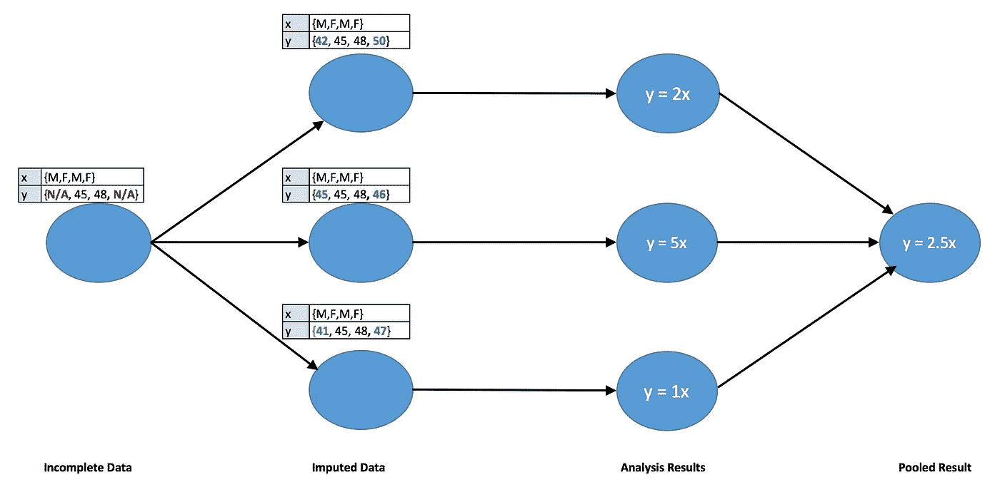
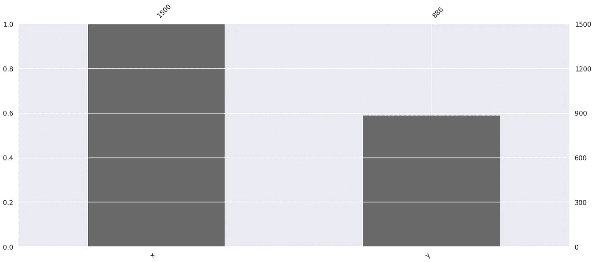
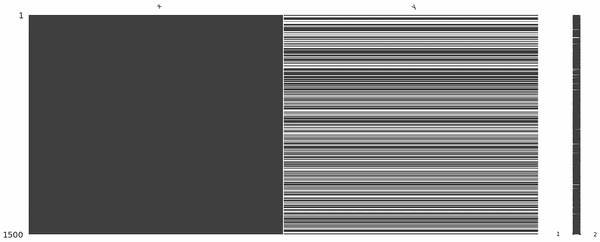
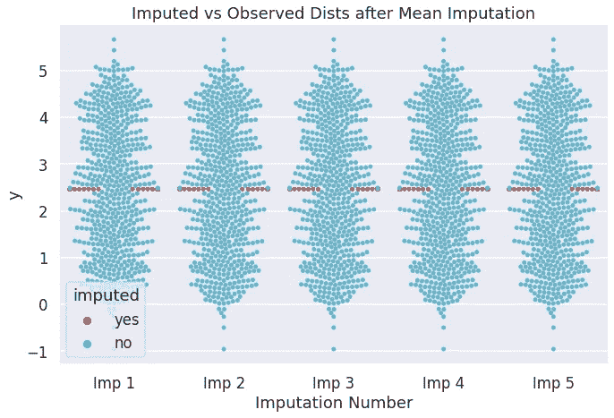
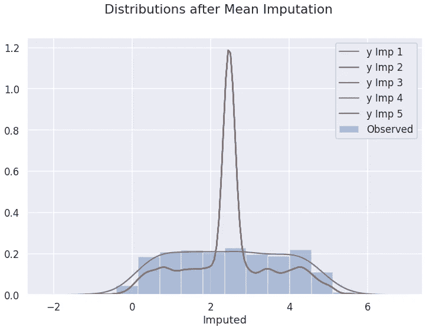
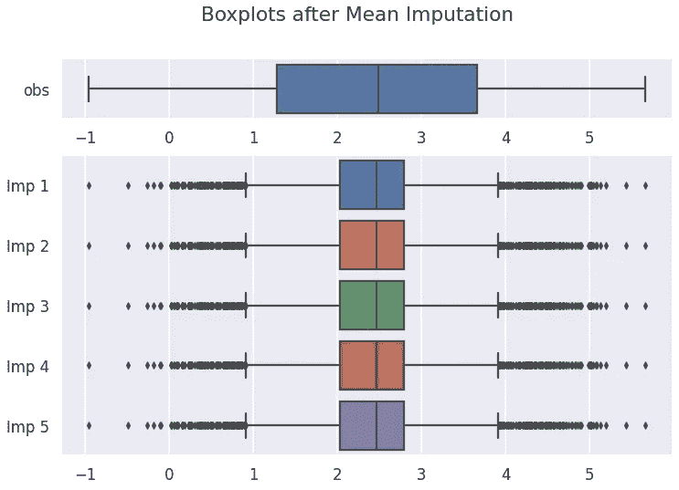
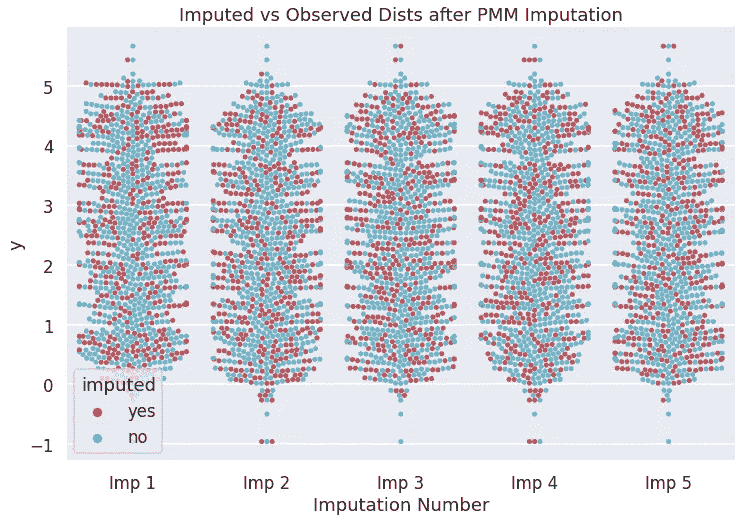
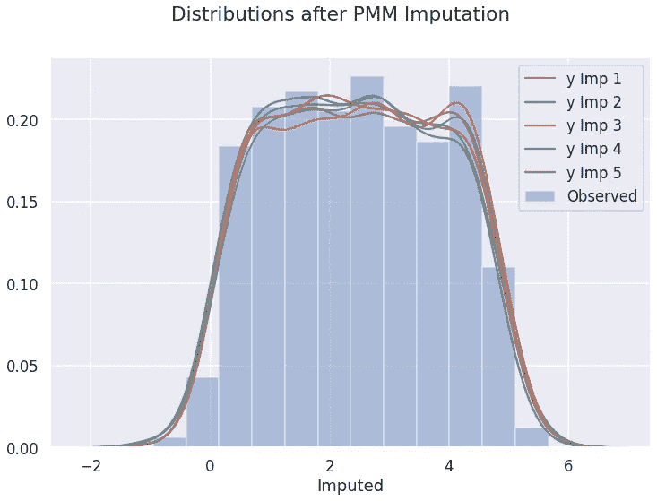
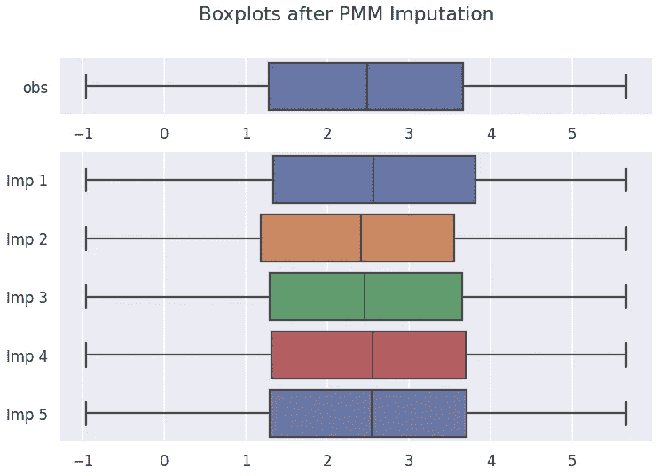

# 使用自动计算开始数据插补

> 原文：<https://towardsdatascience.com/getting-started-with-data-imputation-using-autoimpute-c3d53484a4bf?source=collection_archive---------23----------------------->

## 使用 Autoimpute 实现数据插补技术，并了解它们对机器学习模型的影响。


马库斯·斯皮斯克在 [Unsplash](https://unsplash.com?utm_source=medium&utm_medium=referral) 上的照片

现实世界中的大多数数据集都包含缺失数据。这导致了一个问题，因为大多数 Python 机器学习模型只能处理干净的数据集。因此，在进行建模步骤之前，分析师需要弄清楚如何处理丢失的数据。不幸的是，大多数数据专家主要关注建模方面，他们不太注意丢失的值。他们通常要么删除有缺失值的行，要么依靠简单的数据插补(替换)技术，如均值/中值插补。这些技术会对模型性能产生负面影响。这就是 Autoimpute 库的用武之地——它为您提供了一个适当处理缺失数据的框架。

## **插补类型**

1.  **单变量插补:**仅使用目标变量本身对值进行插补，例如均值插补。
2.  **多元插补:**基于其他变量的插补值，例如，使用线性回归来估计基于其他变量的缺失值。
3.  **单一插补:**对数据集中的任何缺失值仅进行一次插补，以创建单一插补数据集。
4.  **多重插补:**对数据集中相同的缺失值进行多次插补。这基本上包括多次运行单个插补，以获得多个插补数据集(下一节将详细举例说明)。

# **使用自动输入**

现在让我们演示如何使用 Autoimpute 库来解决缺失问题。这个库提供了一个框架，用于处理从探索阶段到建模阶段的缺失数据。下图显示了使用多重插补的回归过程的基本流程图。



**展示多重插补如何与线性回归一起工作的流程图。(图片由作者提供)**

在上图中，原始数据集被估算三次以创建三个新数据集，每个数据集都有自己的新估算值。对每个新数据集运行单独的回归，并且从这些回归中获得的参数被汇集以形成单个模型。该过程可以推广到' *n* '(估算数据集的数量)的其他值和各种其他模型。

为了理解获得多个数据集的一个主要优点，我们必须记住缺失值实际上是未知的，我们并不寻求获得它们的精确点估计。相反，我们试图抓住这样一个事实，即我们不知道真正的价值，而且这个价值可能会变化。这种拥有多个包含不同值的估算数据集的技术有助于捕捉这种可变性。

## 导入库

我们将从导入所需的库开始。

```
import numpy as np
import pandas as pd
import matplotlib.pyplot as plt
from scipy.stats import norm, binom
import seaborn as snsfrom autoimpute.utils import md_pattern, proportions
from autoimpute.visuals import plot_md_locations, plot_md_percent
from autoimpute.visuals import plot_imp_dists, plot_imp_boxplots
from autoimpute.visuals import plot_imp_swarmfrom autoimpute.imputations import MultipleImputer
```

本文的完整代码可以从这个资源库下载:【https://github.com/haiderwaseem12/Autoimpute

## 创建虚拟数据集

出于演示目的，我们创建了一个包含 1000 个观察值的虚拟数据集。数据集包含两个变量；预测器' *x'* 和响应' *y '。*'*y '*中 40%的观察值被随机替换为缺失值，而' *x'* 被完全观察到。' *x'* 和' *y'* 的相关性约为0.8 *。*数据散点图如下所示。


**显示虚拟数据集分布的散点图(图片由作者提供)**

## 思念 EDA

作为起点，检查数据的缺失以从中提取模式是很重要的。这有助于我们理解缺失和选择合适的插补技术。下面演示了 Autoimpute 库为此任务提供的可视化技术。

函数`plot_md_percent(df)`的结果如下所示。这可用于显示数据集中每个要素的缺失百分比。在我们的例子中，我们可以看到' *x* '被完全填充，而 y 缺失了 40%。



**柱状图，显示每列中缺失值的比例(图片由作者提供)**

另一个函数`plot_md_locations(df)`通过将缺失的行显示为白色条来帮助我们可视化数据帧中缺失数据的位置。当试图寻找缺失的模式时，这个图会非常方便。

因为我们从' *y* '列中随机删除了值，所以我们的数据没有丢失的模式。我们可以看到' *y'* 列的值在' *x'* 的所有值中随机缺失。



**显示缺失值位置的条形图(图片由作者提供)**

然而，在某些情况下，这个情节可以帮助我们理解这种缺失。例如，如果我们在底部附近看到更多的白条，我们就会知道遗漏的概率随着 x 值的增加而增加。

一旦我们探索了缺失，我们就可以进入插补阶段。

## 多输入函数

函数`MultipleImputer`为我们的数据集提供了多重插补。这个函数可以以一种极其简单的方式使用，并且执行得相当好，即使使用它的默认参数。

```
imputer = MultipleImputer()                 #initialize the imputer
imputations = imputer.fit_transform(df)     #obtain imputations
```

但是，该功能非常灵活，可以通过多种方式进行定制。下面讨论一些常用的论点:

1.  **n:** 插补数量(要创建的新插补数据集的数量)。
2.  **策略:**可使用策略栏指定插补方法。该函数为我们提供了各种插补方法，从简单的单变量技术(如均值插补)到其他更高级的多变量技术(如预测均值匹配)。如果没有指定策略，则应用默认方法。默认方法取决于列数据类型。
3.  **预测值:**该参数可用于设置哪些列用于特定列的插补。如果未指定预测值，则使用所有列，这是默认选项。
4.  **imp_kwgs:** 该参数可用于指定定制特定策略所需的任何其他参数。

下面给出了一个使用`MultipleImputer`及其参数的例子。假设我们有一个包含四列的数据集:性别、工资、教育和年龄。

```
MultipleImputer(
    n=10,
    strategy={'salary':'pmm', 'gender':'binary logistic'},
    predictors={'salary':'all', 'gender':['salary','age']},
    imp_kwgs={'pmm':{'fill_value':'random', 'neighbors':5}}
    )
```

该函数将创建 10 个插补。薪资和性别将分别使用预测均值匹配和二元逻辑进行估算。为了估算工资，将使用所有列；而对于性别，将只使用工资和年龄变量。最后，PMM 策略将使用随机填充值，相邻点的数量将设置为 5。

> **注意:** Autoimpute 遵循与 Scikit-learn 相同的 API，这使得代码为许多 Python 用户所熟悉。

## 平均插补

我们从最基本的插补类型开始:均值插补。由于均值插补非常常用，我们首先实现它，然后将其与 Autoimpute 库提供的另一种技术进行比较。

```
mi_mean = MultipleImputer(n=5, strategy="mean", seed=101) 

imp_mean = mi_mean.fit_transform(df)
```

Autoimpute 还为我们提供了一些可视化技术来查看估算值如何影响我们的数据集。我们将使用这些图来比较不同技术的性能。

```
plot_imp_swarm(d=imp_mean,
             mi=mi_mean,
             imp_col=”y”,
             title=”Imputed vs Observed Dists after Mean Imputation”
             )
```



**群体图，显示均值插补后的均值与插补分布(图片由作者提供)**

从上面的蜂群图中，我们可以看到所有的估算值都是完全相同的。由于均值插补用列均值替换每个缺失值，并且每次插补一列时均值保持不变，因此无论我们插补一列多少次，这种技术都会给出完全相同的结果。因此，多次平均值估算不会给估算带来任何变化。这一观察结果得到了下面两幅图的进一步支持，因为我们可以清楚地看到**所有五种插补的分布也完全相同**。

此外，下图还显示了**均值插补如何改变数据的分布**。我们仍然有与原始数据相同的平均值，但是数据现在更紧密地围绕平均值，导致更低的方差。这可能导致模型在平均值附近做出预测时过于自信。

```
plot_imp_dists(d=imp_mean, 
               mi=mi_mean, 
               imp_col="y",
               separate_observed=False,  
               hist_observed=True,
               title="Distributions after Mean Imputation"
               )plot_imp_boxplots(d=imp_mean, 
                  mi=mi_mean,
                  imp_col="y",
                  title="Boxplots after Mean Imputation"
                  )
```



**分布图(左)和箱线图(右)显示了均值插补后的均值分布与插补分布(图片由作者提供)**

## 预测均值匹配插补

现在我们来看看一种更先进的技术:预测均值匹配(PMM)插补。这种方法使用贝叶斯回归模型来预测插补值。然后找到最接近预测值的观察值，随机替换其中一个值作为插补值。

> **注意:**以下演示不需要详细了解 PMM 算法的工作原理。但是，如果你对算法不熟悉，希望理解它，请看看下面的链接:[https://statisticalhorizons.com/predictive-mean-matching](https://statisticalhorizons.com/predictive-mean-matching)。

```
mi_pmm = MultipleImputer(n=5, strategy="pmm", seed=101) imp_pmm = mi_pmm.fit_transform(df)
```

为了展示 PMM 插补的性能，我们将使用与上述相同的可视化技术。

```
plot_imp_swarm(d=imp_pmm, 
             mi=mi_pmm,
             imp_col=”y”,
             title=”Imputed vs Observed Dists after Mean Imputation”
             )
```



**显示 PMM 插补后平均分布与插补分布的群体图(图片由作者提供)**

当我们查看群集图时，我们注意到的第一件事是估算值分布在' *y'* 的实际值上。这有助于保持分布，我们可以从下图中清楚地看到，估算列的**分布与实际列**相似。尽管不同插补的分布略有不同，但平均值和方差都与实际列相似。

我们从上面的图中观察到的第二点是，估算值在不同的列中有所不同。下面的两个图进一步支持了这一观察结果，这两个图清楚地向我们展示了所有五个**估算列的分布略有不同。**这有助于我们捕捉缺失值的可变性。

```
plot_imp_dists(d=imp_pmm, 
               mi=mi_pmm, 
               imp_col="y",
               separate_observed=False,  
               hist_observed=True,
               title="Distributions after Mean Imputation"
               )plot_imp_boxplots(d=imp_pmm, 
                  mi=mi_pmm,
                  imp_col="y",
                  title="Boxplots after Mean Imputation"
                  )
```



**分布图(左)和箱线图(右)显示平均插补后的平均分布与插补分布(作者提供的图片)**

# 结论

在我们的论证中，PMM 插补的表现优于均值插补。大多数数据集都是如此。然而，PMM 插补并不总是最好的技术，因为它有自己的缺点，例如，它可能计算量很大。在缺失值数量很少的情况下，即使像均值插补这样的简单技术也能给出最佳结果。

正如机器学习中的一切一样，没有单一的最佳技术。最佳技术因情况而异，取决于给定数据集的特征。找到最佳技术依赖于领域知识和实验的结合。Autoimpute 库为我们提供了一种简单的方法来试验各种插补策略，并找出最有效的策略。

本文的完整代码可以从这个资源库下载:【https://github.com/haiderwaseem12/Autoimpute