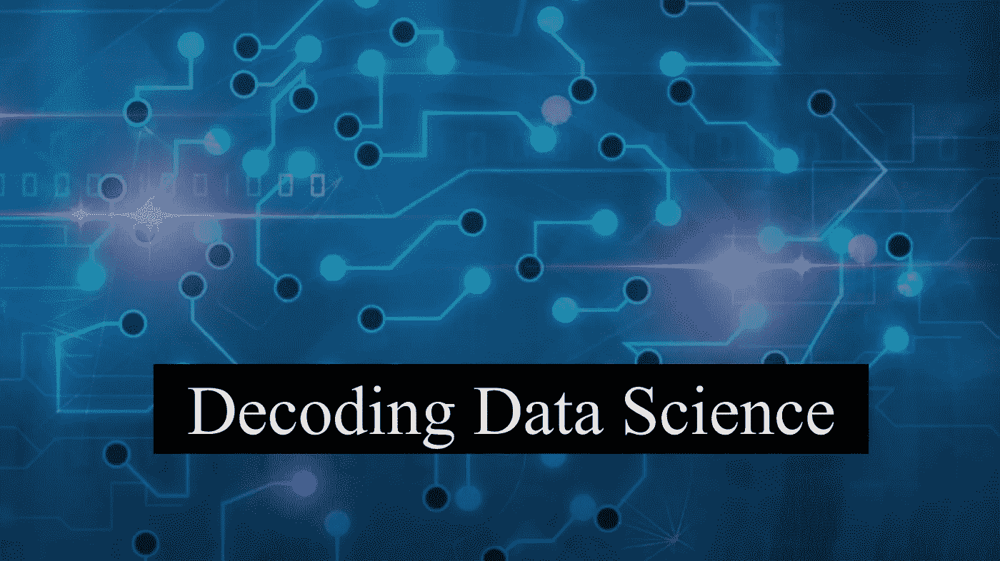
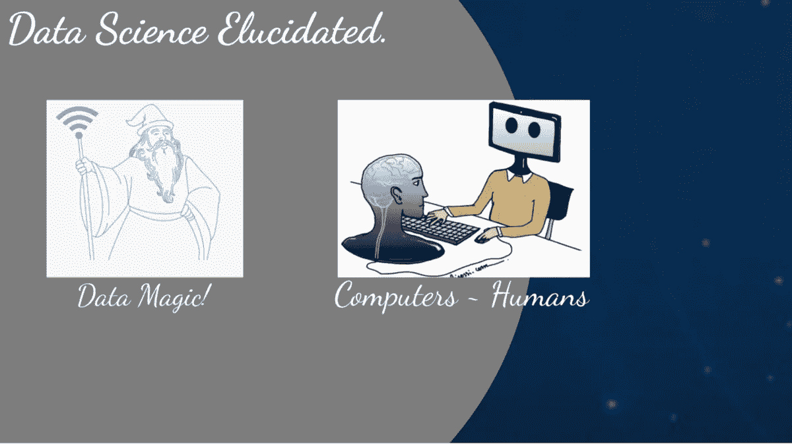
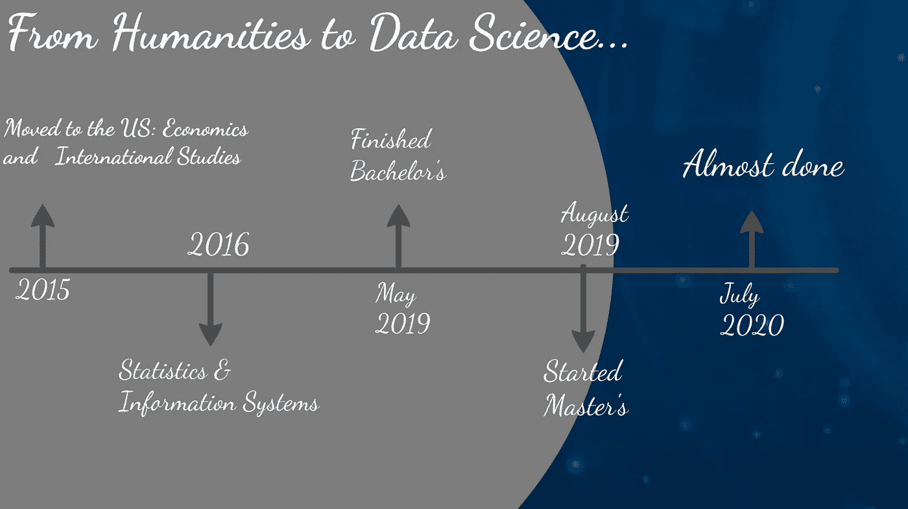
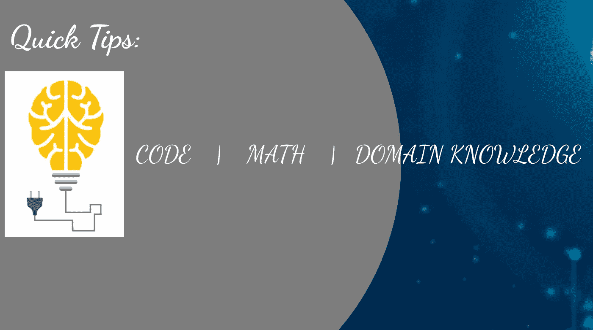

# 数据科学入门

> 原文：<https://towardsdatascience.com/getting-started-with-data-science-e6b2ebf10663?source=collection_archive---------44----------------------->

[跳板](https://www.google.com/url?sa=i&url=https%3A%2F%2Fwww.springboard.com%2Fblog%2Fmachine-learning-engineer-vs-data-scientist%2F&psig=AOvVaw1qqjkKOioImqy7yavQ6T5f&ust=1592168598841000&source=images&cd=vfe&ved=0CAMQjB1qFwoTCPjAhbfY_-kCFQAAAAAdAAAAABAD)

## 总结我在 WomenTech Network 2020 上的演讲“如何开始学习数据科学——分享一些技巧和资源，以及我从一名人文学科学生到获得数据分析硕士学位的旅程。

[ihbRRmh _ transparent-wizard-beard-png-data-wizard-png-下载](https://www.pngitem.com/middle/ihbRRmh_transparent-wizard-beard-png-data-wizard-png-download/)， [Steemit](https://www.google.com/url?sa=i&url=https%3A%2F%2Fsteemit.com%2Fhumanbrain%2F%40souravxbox%2Fdifference-between-human-and-computer&psig=AOvVaw1mn-12vaspsgujG3l-zcya&ust=1592168121169000&source=images&cd=vfe&ved=0CAMQjB1qFwoTCLCjqNPW_-kCFQAAAAAdAAAAABAG)

**从解释什么是数据科学开始:**
数据科学有许多定义，有些人可能会说它的计算机程序确实很酷。或者，数据奇才会把数据科学定义为用数据做神奇的事情！

或者有人喜欢将其定义为人机关系:他们可能会将数据科学视为“转换人类问题，将其放入计算机中，从而使其成为计算机问题，并期望计算机解决最初的人类问题。”在这里，我们本质上是在制造我们的问题，把它放在另一边，让它成为别人的问题来解决。

**我的故事:从人文科学到数据科学:**

照片由 Simran Yadav 在 Prezi 上拍摄

当我在 2015 年离开印度时，我是一名经济学和国际关系专业的学生。但是，在我大二的时候，作为课程的一部分，我不得不选了一门信息系统和统计学的课。通过这些课程，我积累了如何在现实世界中使用 MS access、MS excel 和回归等统计工具的知识。我对信息系统产生了真正的兴趣，并决定也主修这个专业。

学习三个非常不同的科目最初是一件麻烦事，但我很高兴我做到了。通过信息系统，我意识到我无疑喜欢通过数字，主要是通过趋势来理解世界。

在我的学士学位结束时，我知道我想进入数据和信息系统领域。但是，在那个时候，我对分析并不完全适应，并且肯定缺乏工作知识，需要在数据科学方面进行改进。所以我决定提高技能的最好方法是回到研究生院。(还有其他方法可以提高您的数据科学技能，其中一些将在本文结尾部分提到)。但是，我决定申请罗耀拉大学的*商业数据分析*项目(这是芝加哥地区最好的 MSBDA 项目，在全国排名第 33 位，所以我立刻觉得这是对的。).

这个项目基本上为我在 Excel 中处理统计数据做好了准备，让我知道如何在营销和供应链中使用数据(这个领域的知识确实有助于理解你正在做的所有数字运算)。除此之外，我非常欣赏这个项目的一点是，课程总体上强调实践经验，以学习不同的机器学习方法。因此，在过去的 8-9 个月里，我一直在积极参与 6 个不同的项目，其中一些是与实际的公司，涉及帮助他们解决他们面临的业务问题。而且，对于一些人来说，我可以灵活地在我感兴趣的领域工作，并且能够自己选择数据集并构建我认为对解决问题最有效的模型。

**提示:**在选择数据分析或数据科学的硕士项目时，
寻找一个理论和实践知识相结合的项目。这将极大地有助于获取知识，并有助于以后专业地展示这些技能。

最后，在我的硕士课程中，我学到了一些软技能，比如组织一个真正好的演示，以及如何创造引人注目的视觉效果来讲述一个故事。我认为数据科学中真正被忽视的一点是故事讲述方面。是的，编码很重要！是的，造型很重要！
但是，要真正将这些应用于实践，我们需要人们理解什么是信息，以及你的发现如何在商业意义上得到应用。这在很大程度上取决于你如何设计它，传递它，并激发你的观众理解它的兴趣。

那么我现在在做什么呢？我目前正在格林威治人力资源公司完成硕士学位。这是一家劳动力市场情报公司，收集实时、全面的招聘和薪酬数据。非常有趣，但具有挑战性，因为由于新冠肺炎，我们几乎每天都在处理数据的动态更新。

照片由 Simran Yadav 在 Prezi 上拍摄

**一些小技巧:
1。一定要学习编码:**如果你没有多少编码技能，没关系，根据一项对所有数据科学家的研究，他们中大约 22%的人有 1-2 年的编码经验，大约 19%的人有不到一年的编码经验。

Python 和 R 是行业标准。大约 70%的数据科学家更喜欢 Python。这对于非结构化数据尤其有用。我个人更喜欢 R，那只是因为我倾向于统计学。但是这两个都可以。

熟悉数据的存储、检索、访问、操作和充分利用，以便做出有成效的决策。

**2。掌握一些数学知识**:不要太广泛，比如高等微积分或导数(我必须做这些，但那是我的经济学专业。)但是，是的，熟悉代数、统计和概率。

**3。领域知识:**如果你想进入数据科学的特定领域，如体育分析、金融科技或供应链分析，会很有帮助。

**你如何获得并提高上述技能？**

**1。在线学习:**选择并完成课程，获得一些在线证书。Coursera 有一个非常好的机器学习入门课程，IBM 大数据大学有不同语言的学习路径，如 Python、R 甚至 Hadoop。

**2。讲故事技巧** : Tableau 和 Power BI 利于数据可视化。Tableau 甚至有数据科学家、数据分析师等的学习路径。这里的问题是，他们现在免费提供这些课程。否则，他们通常从 200 美元到 300 美元不等。

**3。实时项目:** Apache projects、Kaggle 和 Pivigo 拥有大量资源和参与实时项目的良好资源。

**4。开始:**我认为这是最重要的，一旦你掌握了一些编码技巧，就可以开始使用你喜欢的数据集并建立初始模型。大多数人从 Titanic 或 HR 数据集开始，但对我来说，在我感兴趣的数据集上工作确实帮助我提高了技能，因为我在分析和可视化方面做得更好。最近，我开始处理来自 Kaggle 的钻石质量和卡地亚珠宝数据集。

***成为一名彻底的专业数据科学家的过程是永无止境的，因此最关键的部分是识别问题，用数据驱动的方法解决问题，你将像交易一样学习模型和技术技能。***

**链接以上来源:**
1 .在线课程:[https://www.coursera.org/learn/machine-learning-duke](https://www.coursera.org/learn/machine-learning-duke)
[https://www . coursera . org/professional-certificates/IBM-data-science](https://www.coursera.org/professional-certificates/ibm-data-science)

2.讲故事:[https://www.tableau.com/learn/get-started](https://www.tableau.com/learn/get-started)
https://www.udemy.com/course/powerbi-complete-introduction/

3.实时项目:[https://www.kaggle.com](https://www.kaggle.com)
[https://projects.apache.org/projects.html](https://projects.apache.org/projects.html)