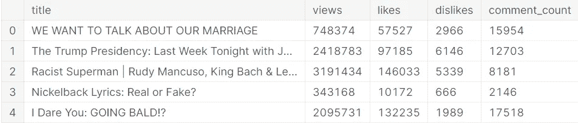

# Python 数据科学入门

> 原文：<https://towardsdatascience.com/getting-started-with-data-science-in-python-92326c171622?source=collection_archive---------36----------------------->


在 [Unsplash](https://unsplash.com?utm_source=medium&utm_medium=referral) 上由 [Yash Jain](https://unsplash.com/@_yashrjain?utm_source=medium&utm_medium=referral) 拍摄的照片

## 在 YouTube 趋势数据集上执行简单的 OLS 线性回归

数据科学和 Python 携手并进。有很多地方和方法可以让你学习和使用 Python。一个很棒的地方是一个叫做 [Kaggle](https://www.kaggle.com/) 的网站。

[](https://www.kaggle.com/) [## Kaggle:你的机器学习和数据科学社区

### Kaggle 是世界上最大的数据科学社区，拥有强大的工具和资源来帮助您实现您的数据…

www.kaggle.com](https://www.kaggle.com/) 

如果你想免费访问课程、笔记本、数据集、大型社区和竞赛，那么 Kaggle 是不二之选。在这个练习中，我们将使用 Kaggle 笔记本来探索 YouTube 趋势数据集，并对其进行深入了解。

在这本笔记本中，我将执行一个构建和运行 OLS 线性回归模型的基本示例，以探索 YouTube 视频浏览量和特征数据(包括喜欢、不喜欢和评论数)之间的一些相关性。

# 来源

我将使用 Mitchell J .在 Kaggle 上通过 YouTube API 获得的趋势 YouTube 视频统计数据集:

 [## 米切尔 J |卡格尔

### Kaggle 是世界上最大的数据科学社区，拥有强大的工具和资源来帮助您实现您的数据…

www.kaggle.com](https://www.kaggle.com/datasnaek) 

源代码可以在这里找到:

[](https://github.com/mitchelljy/Trending-YouTube-Scraper) [## Mitchell jy/Trending-YouTube-Scraper

### 最初用于在 Kaggle 上建立这个数据集，其中有大约 6 个月的 YouTube 趋势视频。这个…

github.com](https://github.com/mitchelljy/Trending-YouTube-Scraper) 

该数据集可在以下位置找到:

[](https://www.kaggle.com/datasnaek/youtube-new) [## 趋势 YouTube 视频统计

### 热门 YouTube 视频的每日统计数据

www.kaggle.com](https://www.kaggle.com/datasnaek/youtube-new) 

数据集的许可可以在这里找到。

[](https://creativecommons.org/publicdomain/zero/1.0/) [## 知识共享- CC0 1.0 通用版

### 此页面有以下语言版本:CC0 1.0 通用版(CC0 1.0)公共领域专用公地…

creativecommons.org](https://creativecommons.org/publicdomain/zero/1.0/) 

# 我的内容

我的 GitHub 库可以在这里找到:

[](https://github.com/third-eye-cyborg/LinearRegressionOLS-YouTubeTrends.git) [## 第三只眼-电子人/线性回归-YouTube 趋势

### 此时您不能执行该操作。您已使用另一个标签页或窗口登录。您已在另一个选项卡中注销，或者…

github.com](https://github.com/third-eye-cyborg/LinearRegressionOLS-YouTubeTrends.git) 

我的 Kaggle 笔记本可以在这里找到:

[](https://www.kaggle.com/thirdeyecyborg/ols-linear-regression-youtube-trends) [## OLS 线性回归| YouTube 趋势

### 使用 Kaggle 笔记本探索和运行机器学习代码|使用趋势 YouTube 视频统计数据

www.kaggle.com](https://www.kaggle.com/thirdeyecyborg/ols-linear-regression-youtube-trends) 

# 参考

如果您是 Python 新手，我还推荐一些我撰写的其他文章。

[](https://medium.com/python-in-plain-english/a-brief-history-of-the-python-programming-language-4661fcd48a04) [## Python 编程语言的简史

### Python 编程语言是一种通用的编程语言，它已经在主流编程语言中占有一席之地

medium.com](https://medium.com/python-in-plain-english/a-brief-history-of-the-python-programming-language-4661fcd48a04) [](https://medium.com/python-in-plain-english/python-basic-overview-76907771db60) [## Python 基本概述

### Python 有许多独特的特性，这些特性帮助它成为现在的样子。这些功能包括:

medium.com](https://medium.com/python-in-plain-english/python-basic-overview-76907771db60) [](https://medium.com/python-in-plain-english/python-beginners-reference-guide-3c5349b87b2) [## Python 初学者完全参考指南

### Python 是一种很好的初学者语言，但也适合高级用户。我将深入核心…

medium.com](https://medium.com/python-in-plain-english/python-beginners-reference-guide-3c5349b87b2) [](https://medium.com/analytics-vidhya/the-best-ides-and-text-editors-for-python-872ff1176c92) [## Python 的最佳 ide 和文本编辑器

### 我无法告诉你正确的 IDE(集成开发环境)对任何编程项目有多重要。只是…

medium.com](https://medium.com/analytics-vidhya/the-best-ides-and-text-editors-for-python-872ff1176c92) [](/an-overview-of-the-anaconda-distribution-9479ff1859e6) [## Anaconda 发行版概述

### 科学 Python 发行版将改变你研究数据科学的方式。

towardsdatascience.com](/an-overview-of-the-anaconda-distribution-9479ff1859e6) [](/an-overview-of-the-pep-8-style-guide-5672459c7682) [## PEP 8 风格指南概述

### 让您的 Python 代码具有风格。

towardsdatascience.com](/an-overview-of-the-pep-8-style-guide-5672459c7682) [](/exploring-design-patterns-in-python-be55fbcf8b34) [## 探索 Python 中的设计模式

### 如何在您的编程体验中实现可重用模型？

towardsdatascience.com](/exploring-design-patterns-in-python-be55fbcf8b34) [](/introduction-to-pandas-cc3bc6355155) [## 熊猫简介

### 使用 Pandas API 增强您的 Python 数据科学技能。

towardsdatascience.com](/introduction-to-pandas-cc3bc6355155) 

# 目录

[**什么是 OLS 线性回归？**](https://medium.com/@third_eye_cyborg/getting-started-with-data-science-in-python-92326c171622#f5c4)

[**什么是 sklearn 模块？**](https://medium.com/@third_eye_cyborg/getting-started-with-data-science-in-python-92326c171622#79c8)

[**导入&加载数据集**](https://medium.com/@third_eye_cyborg/getting-started-with-data-science-in-python-92326c171622#7ddc)

[**准备数据**](https://medium.com/@third_eye_cyborg/getting-started-with-data-science-in-python-92326c171622#3a3e)

[**建立并运行 OLS 线性回归模型**](https://medium.com/@third_eye_cyborg/getting-started-with-data-science-in-python-92326c171622#675d)

[**在文本编辑器或 IDE 中运行代码**](https://medium.com/@third_eye_cyborg/getting-started-with-data-science-in-python-92326c171622#1ef9)

[**结论**](https://medium.com/@third_eye_cyborg/getting-started-with-data-science-in-python-92326c171622#7e9f)

## 什么是 OLS 线性回归？

在统计学中，普通最小二乘法(OLS)是一种用于估计线性回归模型中未知参数的线性最小二乘法。OLS 通过最小二乘法原理选择一组解释变量的线性函数的参数:最小化给定数据集中观察到的因变量(被观察变量的值)与线性函数预测的因变量之间差异的平方和。

**来源&确认:**

[](https://en.wikipedia.org/wiki/Ordinary_least_squares) [## 普通最小二乘法

### 在统计学中，普通最小二乘法(OLS)是一种估计未知变量的线性最小二乘法

en.wikipedia.org](https://en.wikipedia.org/wiki/Ordinary_least_squares) 

维基百科贡献者。(2020 年 10 月 4 日)。普通最小二乘法。在*维基百科，免费百科*。2020 年 11 月 9 日 16:21 从[https://en.wikipedia.org/w/index.php?检索 title =普通 _ 最小二乘& oldid=981750893](https://en.wikipedia.org/w/index.php?title=Ordinary_least_squares&oldid=981750893)

## 什么是 sklearn 模块？

python 的`sklearn`模块用于预测数据分析。你可以从他们的网站和文档中了解更多信息。

[](https://scikit-learn.org/stable/index.html#) [## sci kit-学习

### “我们使用 scikit-learn 来支持前沿基础研究[...]" "我认为这是我设计过的最棒的 ML 套装…

scikit-learn.org](https://scikit-learn.org/stable/index.html#) 

您也可以在此查看`pandas`网站和文档:

[](https://pandas.pydata.org/) [## 熊猫

### pandas 是一个快速、强大、灵活且易于使用的开源数据分析和操作工具，构建于…

pandas.pydata.org](https://pandas.pydata.org/) 

## 导入和加载数据集

第一步是进行必要的导入并加载数据集。

```
*# import modules*
import matplotlib.pyplot as plt
import pandas as pd
import os

from sklearn.model_selection import train_test_split
from sklearn.preprocessing import StandardScaler
from sklearn import linear_model
from sklearn.metrics import mean_squared_error, r2_score

for dirname, _, filenames **in** os.walk('/kaggle/input'):
    for filename **in** filenames:
        print(os.path.join(dirname, filename))

*# load data*
data = pd.read_csv('../input/youtube-new/USvideos.csv')
```


作者输出的 Kaggle 笔记本

## 准备数据

然后对数据进行预处理，为 OLS 线性回归模型做准备。

```
*# break data down for analysis*
df = data[['title', 'views', 'likes', 'dislikes', 'comment_count']]
views = data[['title', 'views']]
likes = data['likes']
dislikes = data['dislikes']
comment_count = data['comment_count']

*# create feature list*
train_list = [likes, dislikes, comment_count]

*# print head to important data*
df.head()
```



作者输出的 Kaggle 笔记本

## 构建和运行 OLS 线性回归模型

接下来从`sklearn`模块创建并运行模型。确保检查均方误差和 r2 分数。

```
*# create scaler variable*
scaler = StandardScaler()

*# get feature titles ready*
labels = ['likes', 'dislikes', 'comment_count']

*# get y ready and preprocessed*
y = views['views']
y_scaled = y.values.reshape(-1, 1)
y_scaled = scaler.fit_transform(y_scaled)
*# get x ready and preprocessed*
for i, x **in** enumerate(train_list):
    x_scaled = x.values.reshape(-1, 1)
    x_scaled = scaler.fit_transform(x_scaled)

    *#split data for fitting and predicting with the model*
    X_train, X_test, y_train, y_test = train_test_split(x_scaled, y_scaled, test_size=0.33, random_state=42)

    *# create model*
    reg = linear_model.LinearRegression()

    *# fit model*
    reg.fit(X_train, y_train)

    *# make prediction*
    y_pred = reg.predict(X_test)

    *# check the mean squared error*
    mse = mean_squared_error(y_test, y_pred)

    *# check the score function*
    r2s = r2_score(y_test, y_pred) *#print feature labels*
    print(labels[i])

    *# print mse*
    print(f'Mean squared error: **{**mse**}**')

    *# 1 equals perfect prediction*
    print(f'Coefficient of determination: **{**r2s**}**')

    *# plot the visuals for a sanity check*
    plt.plot(x, y, label=labels[i])
    plt.title(f'**{**labels[i]**}** effect or YouTube views')
    plt.xlabel = "views"
    plt.ylabel = labels[i]
    plt.legend()
    plt.plot()
```


作者输出的 Kaggle 笔记本

视觉输出和模型输出都表明喜欢和视频观看之间的相关性比不喜欢和评论计数之间的相关性更高。

## 在文本编辑器或 IDE 中运行代码

如果你想在文本编辑器或者像 PyCharm 这样的 IDE 中运行它，你可以使用我的 GitHub 库中的代码。

作者 GitHub 要点

# 结论

虽然 OLS 线性回归可以很好地识别一些数据的更基本的相关性和洞察力，但它有时可能是有限的，不准确的，或对某些类型的问题有限制。确保为正确的任务选择正确的型号。这是一个探索 Python 中数据科学基础的简单示例。本文也是对 Kaggle 笔记本和数据集以及`sklearn`和 OLS 线性回归的简要介绍。我希望这能帮助任何开始学习 Python 数据科学的人。谢谢大家，编码快乐！