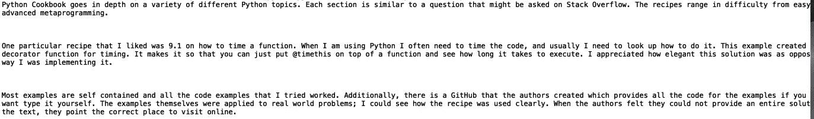

# Python 数据结构入门

> 原文：<https://towardsdatascience.com/getting-started-with-data-structures-in-python-466634b1f05f?source=collection_archive---------22----------------------->

## Deque 数据结构介绍


照片由[克里斯蒂娜·莫里洛](https://www.pexels.com/@divinetechygirl)在[的像素](https://www.pexels.com/photo/woman-wearing-red-and-black-checkered-blouse-using-macbook-1181472/)上拍摄

数据结构是一种数据管理格式，可以有效地访问和修改数据值集合。它由数据值、值之间的关系以及可以对它们使用的函数组成。在本帖中，我们将讨论如何在 python 中使用‘deque’数据结构。这篇文章中的例子是基于 [*Python 食谱*](https://d.cxcore.net/Python/Python_Cookbook_3rd_Edition.pdf) 的“数据结构和算法”一章。

# 理解德克

“双端队列”是双端队列的首字母缩写。它是一个序列容器，可以从任意一端添加或删除元素。当您想保留在迭代或其他形式的处理过程中看到的最后几项的有限历史时,‘deques’非常有用。例如，假设您想要对以下文本中的一系列行执行简单的文本匹配，该文本包含对 [*Python Cookbook*](https://d.cxcore.net/Python/Python_Cookbook_3rd_Edition.pdf) 的 Amazon 评论:


让我们从集合包中导入“deque ”:

```
from collections import deque
```

接下来，让我们定义一个最大长度为 5 的“deque”对象:

```
previous_lines = deque(maxlen=5)
```

为了促进“deque”数据结构的使用，让我们从遍历文本文件并打印每一行开始:

```
with open('amazon_review.txt') as f:
    for line in f:
        print(line)
```



接下来，让我们检查每一行中是否存在“Python ”,如果存在，则打印该行:

```
with open('amazon_review.txt') as f:
    for line in f:
        if 'Python' in line:
            print(line)
```


现在我们定义一个生成器函数，它是一个行为类似迭代器的函数。当我们遍历文本文件时，每一行都被附加到“deque”，“previous_line”，然后再继续下一行:

```
def search_text(pattern):
    previous_lines = deque(maxlen=5) 
    with open('amazon_review.txt') as f:
        for line in f:
            if pattern in line:
                yield line, previous_lines
            previous_lines.append(line)
```

然后，我们可以使用搜索模式“Python”迭代“search_text()”函数。我将截断输出，以包含一些附加的行:

```
for line, previous_lines in search_text('Python'):
    print(line, previous_lines)
```


我们可以进一步迭代“deque”数据结构。这里我们将历史限制为最大长度= 5:

```
for line, previous_lines in search_text('Python'):
    for pline in previous_lines:
        print(pline, end='')
```


同样，使用“deque”数据结构的目的是将历史限制在迭代期间看到的最后几项。

我们可以定义一个函数来概括这个逻辑:

```
def search_text(lines, pattern, history=5): 
    previous_lines = deque(maxlen=history) 
    for line in lines:
        if pattern in line:
            yield line, previous_lines
        previous_lines.append(line)
```

并用我们的输入值调用我们的函数:

```
if __name__ == '__main__':
    with open('amazon_review.txt') as f:
        for line, previous_lines in search_text(f, 'Python', 5): 
            for pline in previous_lines:
                print(pline, end='') 
            print(line, end='') 
            print('-'*150)
```


接下来，我将介绍一些可用于“取消队列”对象的方法。让我们定义一个长度为 3 的固定大小的“deque”对象:


现在，让我们添加一些字符串值。让我们添加几个网址:


如果我们添加另一个元素:


如你所见，“https://pythonprogramming.net”被添加到“deque”中，“https://www.kaggle.com”和“https://www . kdnugges . com”被下移，“https://www.python.org”被删除。

我们可以使用“appendleft()”方法将一个元素添加到“deque”的底部。让我们添加熊猫图书馆文档的链接:


我们可以使用“pop()”方法删除“deque”顶部的元素:


我们还可以使用' popleft()'从' deque '的底部删除:


与具有 O(N)(线性时间复杂度)的列表不同，向/从队列的任一端添加(追加)或移除(弹出)项目具有恒定的时间 O(1)复杂度。

我就讲到这里，但是您可以随意将这段代码应用到其他文本文件中，并尝试搜索方法输入值。例如，您可以尝试更改最大长度(历史)并搜索替代文本模式。

# 结论

总之，在这篇文章中，我们讨论了使用 python 实现的“deque”数据结构的用例。当您需要保留有限的信息历史时，这些数据结构非常有用。尽管我们使用了一个文本匹配的例子，但是“deques”对于存储 web 浏览器历史也是有用的。类似于所示的最后一个例子，最近访问过的 URL 被添加到‘dequee’的前面，并且在‘dequee’后面的 URL 在一定数量的插入之后被移除。我希望这篇文章对你有帮助/有意思。如果你有任何问题，请留言。这篇文章的代码可以在 GitHub 上找到。