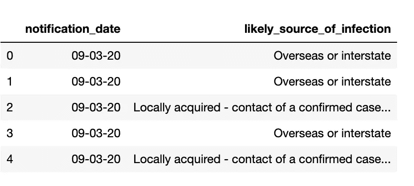
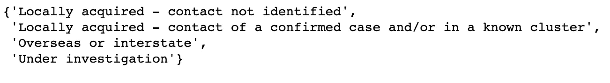
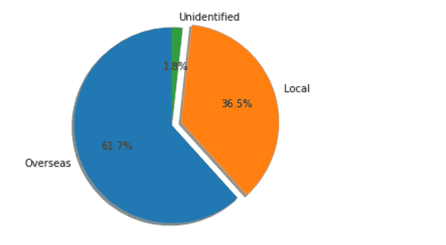
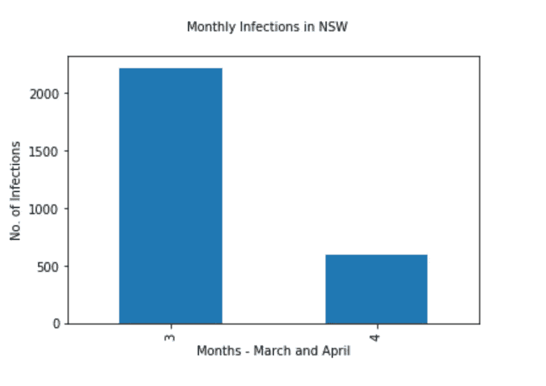
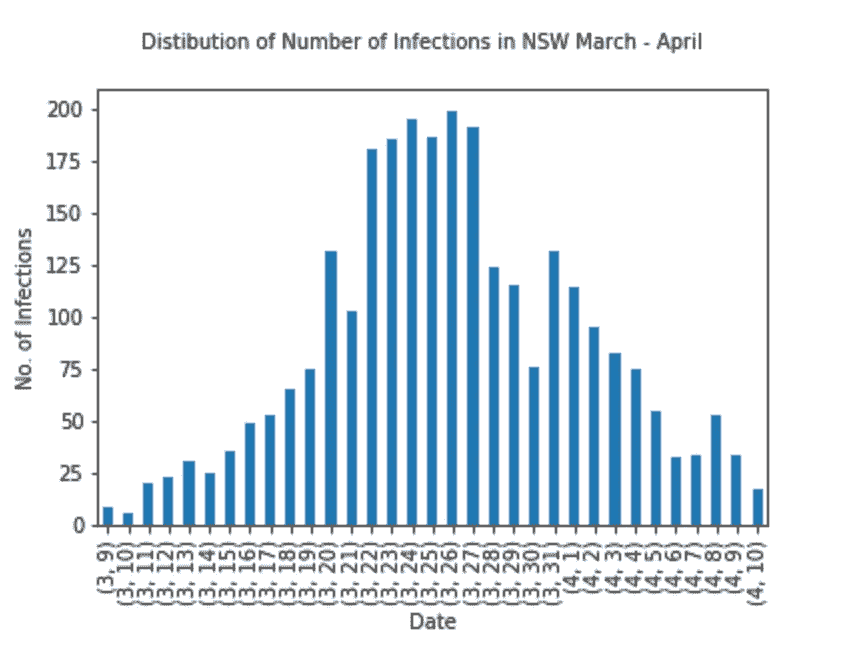
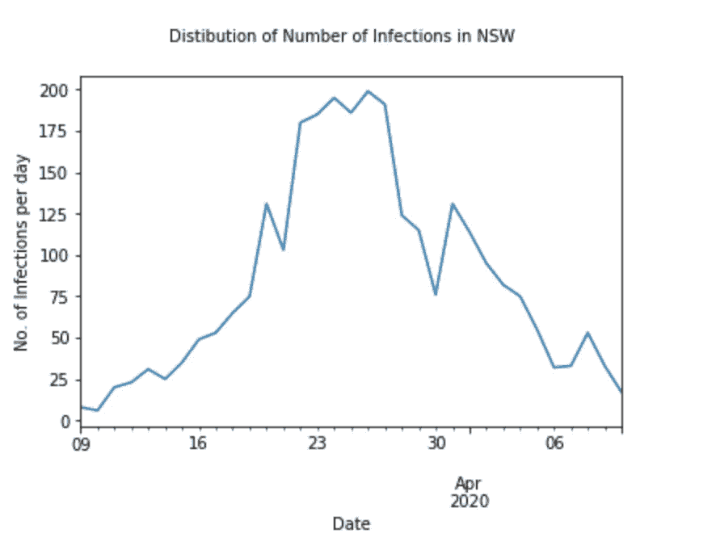

# 数据可视化入门

> 原文：<https://towardsdatascience.com/getting-started-with-data-visualisation-7b3ae8ca71ba?source=collection_archive---------62----------------------->

## 使用新冠肺炎新南威尔士州数据集理解 Pandas 和 Matplotlib 库如何工作。


数据可视化图片由[https://unsplash.com/@emilep](https://unsplash.com/@emilep)

***编者注:*** [*走向数据科学*](http://towardsdatascience.com/) *是一份以研究数据科学和机器学习为主的中型刊物。我们不是健康专家或流行病学家，本文的观点不应被解释为专业建议。想了解更多关于疫情冠状病毒的信息，可以点击* [*这里*](https://www.who.int/emergencies/diseases/novel-coronavirus-2019/situation-reports) *。*

数据驱动着我们生活的世界，它经常帮助我们理解像现在这样的前所未有的时代正在发生什么。自今年年初以来，新冠肺炎改变了我们的生活和社交方式。了解病毒的传播和可视化感染率帮助我变得不那么焦虑，并理解社会距离如何有助于减少澳大利亚新南威尔士的感染人数。

要开始数据争论和可视化，必须从可靠的来源获取数据。我在 nsw.gov.au 找到了我需要的 CSV 文件形式的数据(对于那些刚刚开始使用 pandas 分析数据的人来说，逗号分隔值文件是首选)。CSV 文件包括通知日期和每个检测为阳性的患者从哪里获得病毒。

让我们编码

1.  将必要的库导入到您的 Jupyter 笔记本中，开始使用。

```
**import** **numpy** **as** **np**
**import** **pandas** **as** **pd**
**from** **matplotlib** **import** pyplot **as** plt
%matplotlib inline
```

2.将 CSV 文件作为熊猫数据框读入 Jupyter 笔记本。

```
data = pd.read_csv('covid-19-cases-by-notification-date-and-likely-source-of-infection.csv')
```

3.尝试使用 Pandas 库中可用的 head()函数来理解数据框的内容。

```
data.head()
```



4.现在，让我们试着理解“可能感染源”一栏中的所有类别。要做到这一点，一个简单的方法是将整个列转换成一个列表，并获得唯一的值。

```
sources = list(data['likely_source_of_infection'])
set(sources)
```



5.日期条目的问题是，它通常可以是一个字符串或一个对象，当我们试图可视化“时间”时，它会变得棘手。为了防止任何此类问题，我们将包含日期的列转换为 DateTime，这样我们就可以毫无困难地访问日、月和年。

```
data['notification_date'] = pd.to_datetime(data['notification_date'],dayfirst=**True**)
```

6.查询功能允许用户从数据帧中检索他们需要的信息，很像 SQL 查询。获得每个类别的计数将有助于相应地可视化数据。

```
overseas = len(data.query('likely_source_of_infection == "Overseas or interstate"'))
local = len(data.query('likely_source_of_infection == "Locally acquired - contact not identified"')) + len(data.query('likely_source_of_infection == "Locally acquired - contact of a confirmed case and/or in a known cluster"'))
unidentified = len(data.query('likely_source_of_infection == "Under investigation"'))
print(f'The number of cases acquired from overseas in NSW : **{overseas}**.**\n**')
print(f'The number of cases acquired locally in NSW : **{local}**.**\n**')
print(f'The number of cases acquired from unidenitified sources in NSW : **{unidentified}**.**\n**')
```


7.人类是视觉动物，所以让我们把上面得到的数字放在一个饼图中，以便更好地理解比例。

```
labels = ['Overseas','Local','Unidentified']
no = [overseas,local,unidentified]
explode = (0, 0.1, 0) 
fig1, ax1 = plt.subplots()
ax1.pie(no, labels=labels, explode = explode,autopct='**%1.1f%%**',shadow=**True**, startangle=90)
ax1.axis('equal')  *# Equal aspect ratio ensures that pie is drawn as a circle.*

plt.show()
```



看，这比盯着无聊的数字要好得多。

8.那么，我们如何可视化 notification_date 列呢？一种方法是比较三月和四月的病例数。

```
data['notification_date'].groupby(data["notification_date"].dt.month).count().plot(kind="bar")
plt.suptitle('Monthly Infections in NSW', fontsize=10)
plt.xlabel('Months - March and April', fontsize=10)
plt.ylabel('No. of Infections', fontsize=10)
```



另一种方法是在我们可用的整个数据集期间，绘制每天的感染数。

```
data['notification_date'].groupby([data["notification_date"].dt.month, data["notification_date"].dt.day]).count().
plot(kind="bar")
plt.suptitle('Distibution of Number of Infections in NSW March - April', fontsize=10)
plt.xlabel('Date', fontsize=10)
plt.ylabel('No. of Infections', fontsize=10)
```



第二张图更深入地展示了案例数量的频率分布。很明显，曲线正在变平，每天的感染人数也在减少。

了解感染率趋势的另一种方法是绘制整个时间段的线形图。

```
data['notification_date'].groupby(data['notification_date']).count().plot(kind='line')
plt.suptitle('Distibution of Number of Infections in NSW', fontsize=10)
plt.xlabel('Date', fontsize=10)
plt.ylabel('No. of Infections per day', fontsize=10)
```



瞧啊。在不到十分钟的时间里，我们使用简单而强大的函数成功地洞察了数据集。这是让自己习惯熊猫和 matplotlib 的好方法。

整个笔记本和数据集可以在下面的 Github 链接中找到。

[https://github.com/Vandhana-Visaka/NSW-COVID-ANALYSIS](https://github.com/Vandhana-Visaka/NSW-COVID-ANALYSIS)