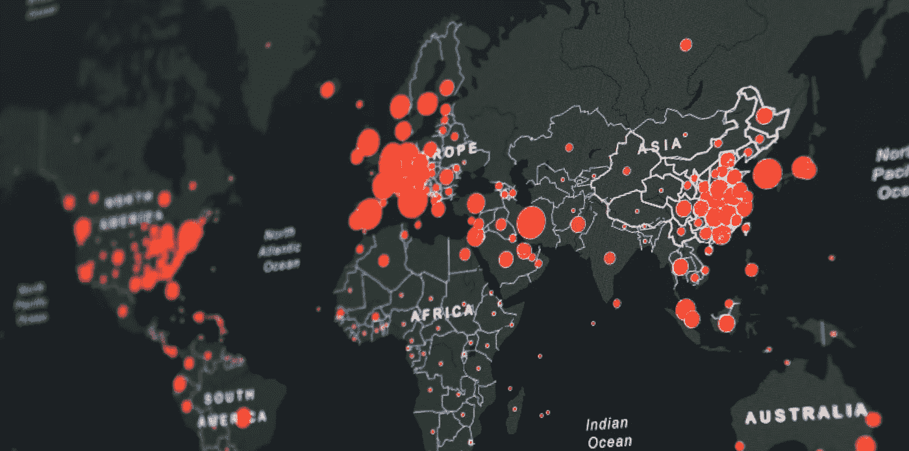
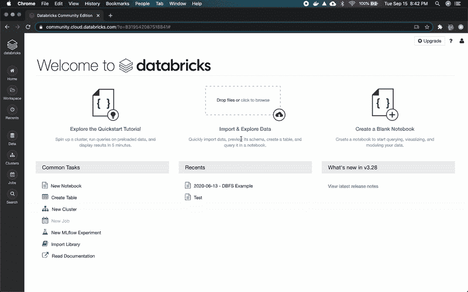
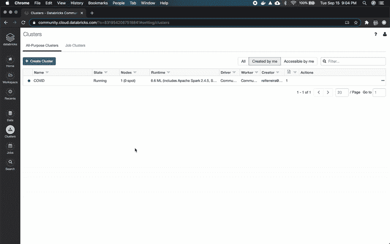
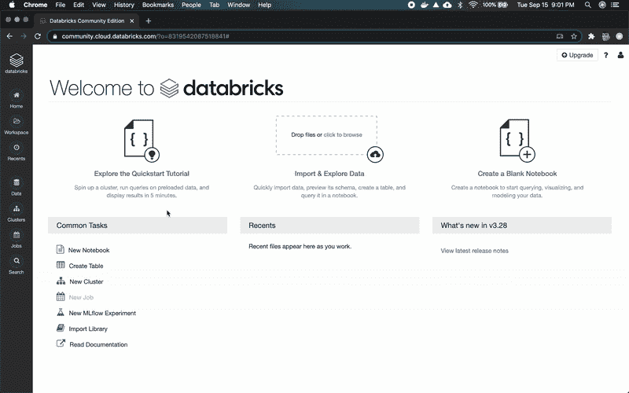
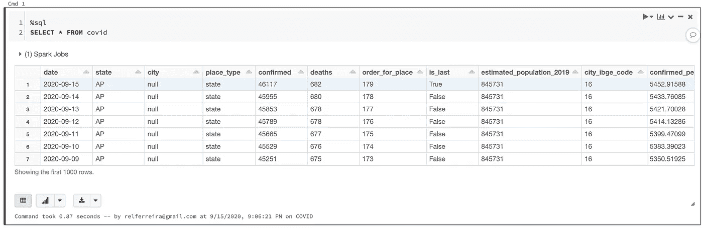
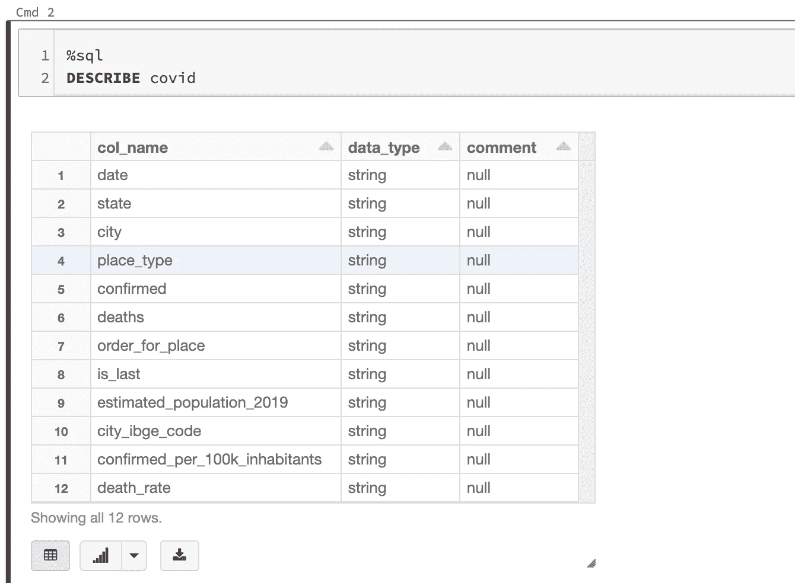
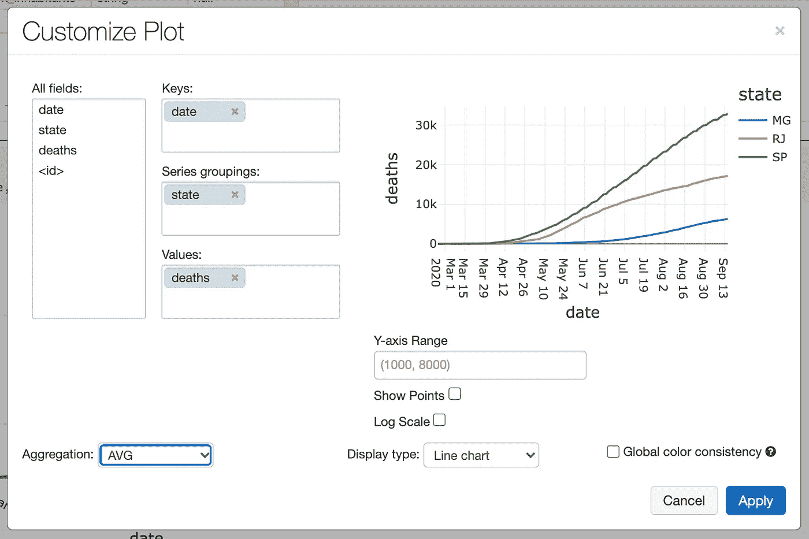
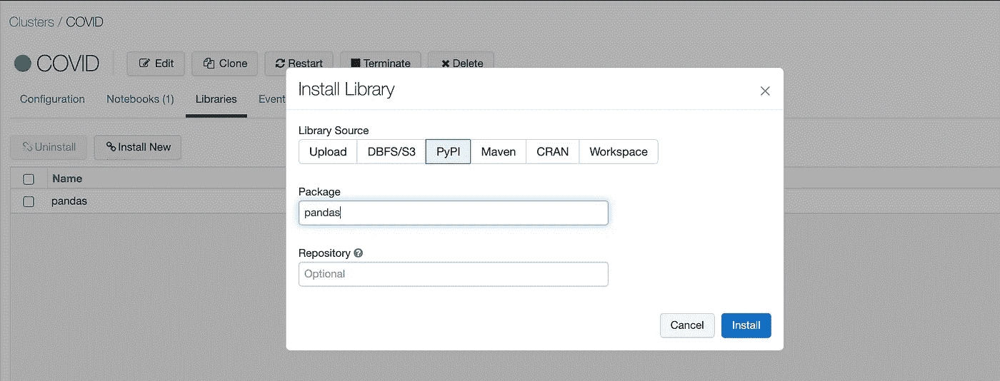
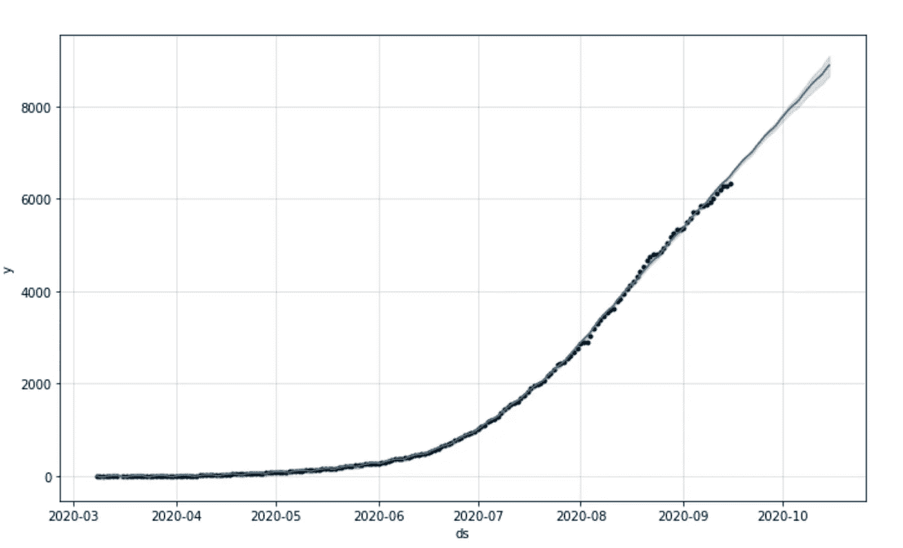

# Databricks 入门—分析新冠肺炎

> 原文：<https://towardsdatascience.com/getting-started-with-databricks-analyzing-covid-19-1194d833e90f?source=collection_archive---------30----------------------->



马丁·桑切斯在 [Unsplash](https://unsplash.com/?utm_source=unsplash&utm_medium=referral&utm_content=creditCopyText) 上的照片

## 深入了解 Databricks 平台

***来自《走向数据科学》编辑的提示:*** *虽然我们允许独立作者根据我们的* [*规则和指导方针*](/questions-96667b06af5) *发表文章，但我们并不认可每个作者的贡献。你不应该在没有寻求专业建议的情况下依赖一个作者的作品。详见我们的* [*读者术语*](/readers-terms-b5d780a700a4) *。*

典型的数据科学工作流由以下步骤组成:

```
Identify Business Needs -> Data Ingestion -> Data preparation -> Data analysis -> Sharing data insights
```

这些步骤中的每一步都需要一组专业知识，这些专业知识可以分为:

数据工程师:开发、建造、测试和维护数据管道

**数据科学家**:使用多种方法提取洞察(机器学习模型)

数据分析师:获取数据工程师准备的数据，以图形、图表和仪表板的形式从中提取见解(商业智能)

**平台管理员**:负责管理和支持数据基础设施(DevOps)

Databricks 是一个统一的平台，为这些工作提供了必要的工具。在本文中，我们将通过创建数据管道和指定每个团队成员的职责来分析巴西的新冠肺炎数据。

# 准备

要完成接下来的步骤，您需要访问 Databricks 帐户。最简单的方法就是在 https://community.cloud.databricks.com创建一个 Databricks 社区账户

# 集群创建(平台管理员)

第一步是配置集群。Databricks 是一个基于 Spark 的平台，是最流行的大数据分析框架之一。Spark 本质上是一个分布式系统，这就是为什么集群创建过程包括为驱动程序和工作节点选择虚拟机。基本上，驱动程序是集群的指挥者，工作节点负责繁重的工作。

平台管理员负责根据用例、spark 版本、工作节点数量和自动扩展配置选择合适的虚拟机系列。例如，ETL 过程可能需要内存优化的设备，繁重的机器学习训练过程可能在 GPU 上运行。



集群创建过程

转到`Clusters`页面，使用 6.6 ML 运行时创建一个新集群。如果您使用 Azure Databricks 或 AWS，您将需要选择驱动程序和工作节点的 VM 系列。对于这个教程，你可以选择最便宜的。

# 数据接收(数据工程师)

数据摄取可能是一个具有挑战性的领域。通常，公司将数据存储在多个数据库中，现在使用数据流非常普遍。幸运的是，Databricks 与 Spark 和 Delta Lake 一起，可以帮助我们用一个简单的接口进行批处理或流式 ETL(提取、转换和加载)。

在本教程中，我们将从最简单的 ETL 开始，从 CSV 文件加载数据。

首先，我们需要下载数据集。请访问以下 URL:

[https://github . com/relferreira/databricks-tutorial/tree/master/covid](https://github.com/relferreira/databricks-tutorial/tree/master/covid)

并下载文件`caso.csv.gz`

解压文件，进入数据菜单，点击`Add Data`按钮。接下来，上传之前下载的 CSV 文件。

上传完成后，我们将使用数据集中显示的信息创建一个新表。单击`Create Table UI`，将表格重命名为`covid`，将第一行设置为标题，最后，单击 create 按钮。



表创建过程

# 数据分析(数据分析师)

创建好表后，我们可以开始分析数据集了。首先，我们需要创建一个新的 python 笔记本。去

`Worspace > Users > YOUR EMAIL`

点击箭头，创建一个新的笔记本



笔记本创建流程

虽然是一个 python 笔记本，但 Databricks 支持笔记本中的多种语言。在我们的例子中，我们将主要使用 **SparkSQL** 。如果你熟悉 SQL，SparkSQL 会给你家的感觉。

让我们先来看看我们的新表格:

```
%sql
SELECT * FROM covid
```

您应该会看到这样一个表格:



作为数据分析师，您应该能够从数据中提取有价值的信息。首先，我们需要理解表格中每一列的含义。一种方法是使用`DESCRIBE`功能:

```
%sql
DESCRIBE covid
```



分析这两个表，我们可以推断出，当列`place_type`等于`state`时，每一行代表该状态的总数。让我们试着画出人口最多的三个州的死亡人数的变化图:

```
%sql
SELECT date, state, deaths FROM covid WHERE state in (“MG”, “RJ”, “SP”) and place_type = “state”
```

点击`Bar Chart`按钮`Plot Options`，用以下配置配置一个`Line chart`:



现在我们有了疫情时期死亡人数演变的一个很好的代表。例如，我们可以将这个图表嵌入到仪表板中，以提醒这些州的人口。

# 数据科学(数据科学家)

接下来，我们将尝试预测之前绘制的时间序列的未来值。为此，我们将使用一个名为 [Prophet](https://facebook.github.io/prophet/) 的脸书库

首先，我们需要安装一些依赖项。去…

```
Clusters > COVID > Libraries
```

并使用`PyPI`安装以下依赖项

*   熊猫
*   pystan
*   FB 先知



库安装过程

我们将尝试预测米纳斯吉拉斯州(MG)未来的死亡人数。所以第一步是收集我们的数据。

*也许您需要清除笔记本的状态

```
import pandas as pd
import logginglogger = spark._jvm.org.apache.log4j
logging.getLogger("py4j").setLevel(logging.ERROR)query = """
 SELECT string(date) as ds, int(deaths) as y FROM covid WHERE state = "MG" and place_type = "state" order by date
"""df = spark.sql(query)
df = df.toPandas()
display(df)
```

接下来，我们将使用`Prophet`来拟合模型，并最终绘制“未来”

```
from fbprophet import Prophetm = Prophet()
m.fit(df)future = m.make_future_dataframe(periods=30)forecast = m.predict(future)fig1 = m.plot(forecast)
```

您应该会看到以下带有预测的图表:



米纳斯吉拉斯州的时间序列预测

# 结论

我们的目标是展示数据科学工作流程的所有步骤。这就是为什么我们没有描述时间序列模型是如何工作的。如果您遵循本教程，您应该对 Databricks 平台有了很好的了解。

完整的笔记本可以在这个公共存储库中获得

[](https://github.com/relferreira/databricks-tutorial) [## relferreira/data bricks-教程

### 此时您不能执行该操作。您已使用另一个标签页或窗口登录。您已在另一个选项卡中注销，或者…

github.com](https://github.com/relferreira/databricks-tutorial) 

如果您有任何疑问，可以通过以下方式找到我:

[https://twitter.com/relferreira](https://twitter.com/relferreira)

#住宿之家#住宿安全