# Keras 数据集入门

> 原文：<https://towardsdatascience.com/getting-started-with-datasets-in-keras-468ee92236ee?source=collection_archive---------16----------------------->

## Keras 数据集简介


照片由[卢卡斯](https://www.pexels.com/@goumbik)在[像素](https://www.pexels.com/photo/computer-data-display-documents-577210/)上拍摄

Keras 是一个用于神经网络的开源 python 库。它使得各种神经网络架构的实施和实验变得容易。除了为神经网络提供许多构建模块，Keras 还有许多内置数据集。

在本帖中，我们将看看 Keras 库中的一些基准数据。这些数据集通常用于展示新的机器学习算法相对于现有技术方法的改进性能。

我们开始吧！

# **CIFAR10 数据**

我们要看的第一个数据集是 *'* CIFAR10 '小型图像分类数据集。“CIFAR10”数据集包含飞机、汽车、鸟类、猫、鹿、狗、青蛙、马、船只和卡车的图像。

让我们导入“CIFAR10”数据:

```
from keras.datasets import cifar10  
(x_train, y_train), (x_test, y_test) = cifar10.load_data()
```

接下来，让我们看看数据中的图像和标签列表。这可以在“CIFAR10”数据的[文档](https://www.cs.toronto.edu/~kriz/cifar.html)中找到。

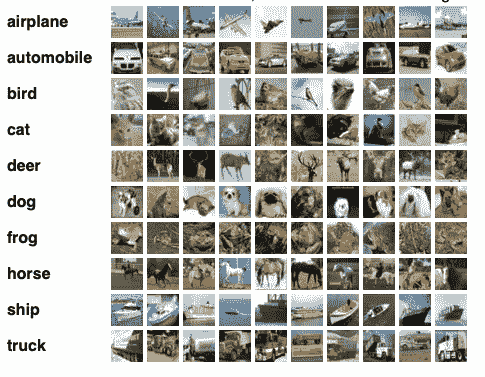

[来源](http://cifar dataset tensorflow)

如果我们打印训练输入数据的第一个值，我们得到:

```
print(X_train[0])
```

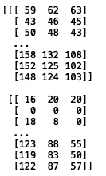

对应于该记录的标签是:

```
print("Label: ", y_train[0])
```


由于标签从 0 到 9，这对应于第 7 个标签，即一只青蛙。

让我们导入“matplotlib”并使用“imshow”方法来显示一些示例:

```
import matplotlib.pyplot as plt
plt.imshow(X_train[0])
plt.show()
```

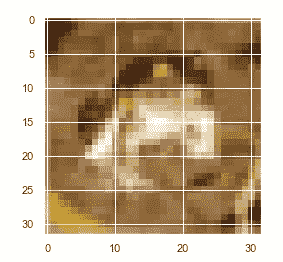

我们可以为 inpsection 打印一些其他值:

```
import matplotlib.pyplot as plt
plt.imshow(X_train[1])
plt.show()
```

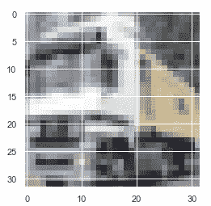

对应于该记录的标签是:

```
print("Label: ", y_train[0])
```

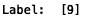

这对应于第 10 个标签，即卡车。

让我们再试一个:

```
import matplotlib.pyplot as plt
plt.imshow(X_train[2])
plt.show()
```

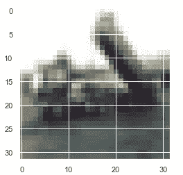

对应于该记录的标签是:

```
print("Label: ", y_train[0])
```


这也对应于卡车的图像。

# IMDB 数据

“IMDB”数据集包含 25K 个电影评论。它通常用于构建基线自然语言处理模型或简单的文本分析。数据集包含每个评论的二进制分数(1 & 0 ),分别表示积极或消极的情绪。文本经过预处理，每个单词都用索引进行了编码。每个单词都根据在数据集中出现的总频率进行索引。

让我们加载“IMDB”数据:

```
from keras.datasets import imdb
(x_train, y_train), (x_test, y_test) = imdb.load_data(path="imdb.npz", num_words=None,skip_top=0, maxlen=None, seed=113, start_char=1, oov_char=2,index_from=3)
```

让我们打印第一份培训记录:

```
print(X_train[0])
```

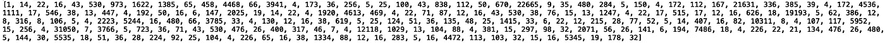

相应的标签:

```
print("Label: ", y_train[0]) 
```

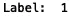

鉴于文本是编码的，这里没有太多可看的。如果你有兴趣分析原始数据，可以在这里找到[。让我们继续下一组数据。](https://www.kaggle.com/lakshmi25npathi/imdb-dataset-of-50k-movie-reviews)

# MNIST 数据

我们要看的下一个数据集是“MNIST”数据集。数据集包含 60K 28x28 灰度手写数字(0-9)。它还被用作验证新的图像分类方法的基准数据集。

让我们加载数据:

```
from keras.datasets import mnist(X_train, y_train), (X_test, y_test) = mnist.load_data()
```

让我们打印第一条记录:

```
print(X_train[0])
```

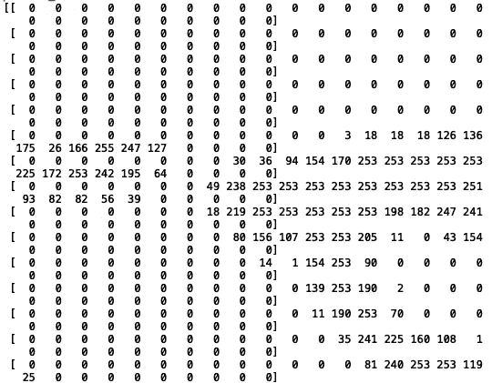

对应于该记录的标签是:

```
print("Label: ", y_train[0])
```

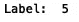

现在让我们使用“imshow”来显示图像:

```
plt.imshow(X_train[0], cmap='gray')plt.show()
```

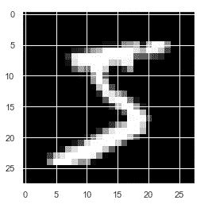

让我们打印下一条记录:

```
plt.imshow(X_train[1], cmap='gray')plt.show()
```

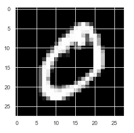

让我们再试一个:

```
plt.imshow(X_train[2], cmap='gray')plt.show()
```

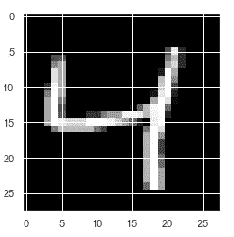

现在让我们看看“时尚 MNIST”的数据集。

# 时尚-MNIST 数据

“时尚-MNIST”数据集包含来自 Zalando 文章的 6 万张标记时尚类别的灰度图像。它还用于测试图像分类的机器学习算法。

标签代码如下:

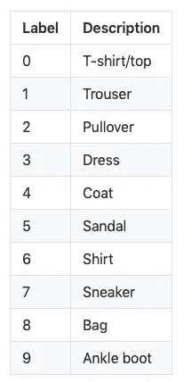

让我们导入数据:

```
from keras.datasets import fashion_mnist(X_train, y_train), (X_test, y_test) = fashion_mnist.load_data()
```

让我们显示第一个图像及其标签:

```
plt.imshow(X_train[0], cmap='gray')
plt.show()
print("Label: ", y_train[0])
```

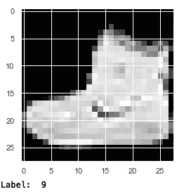

标签“9”对应于踝靴。

让我们试试另一个:

```
plt.imshow(X_train[1], cmap='gray')
plt.show()
print("Label: ", y_train[1])
```


最后，还有一个:

```
plt.imshow(X_train[2], cmap='gray')
plt.show()
print("Label: ", y_train[2])
```

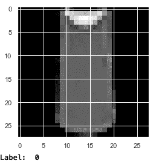

# 结论

我将在这里停下来，但是您可以自由地进一步探索这些数据集。考虑到这些数据集是结构化的和有标签的，它们对于有志于加强建模技能的初露头角的数据科学家来说是一个很好的资源。

总之，在这篇文章中，我们讨论了如何从 Keras 库中提取数据。我们查看了“CIFAR”、“MNIST”和“时尚-MNIST”数据，所有这些数据都是图像分类的通用基准数据集。我们还查看了“IMDB”数据集，其中包含编码的评论，并附有与积极和消极情绪相对应的标签。这是另一个常用于情感分析的基准数据集。我希望你觉得这篇文章很有趣。这篇文章的代码将在 GitHub 上发布。感谢您的阅读！