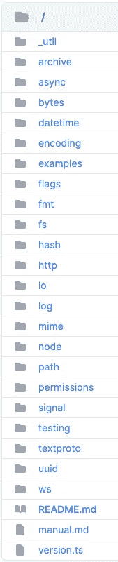
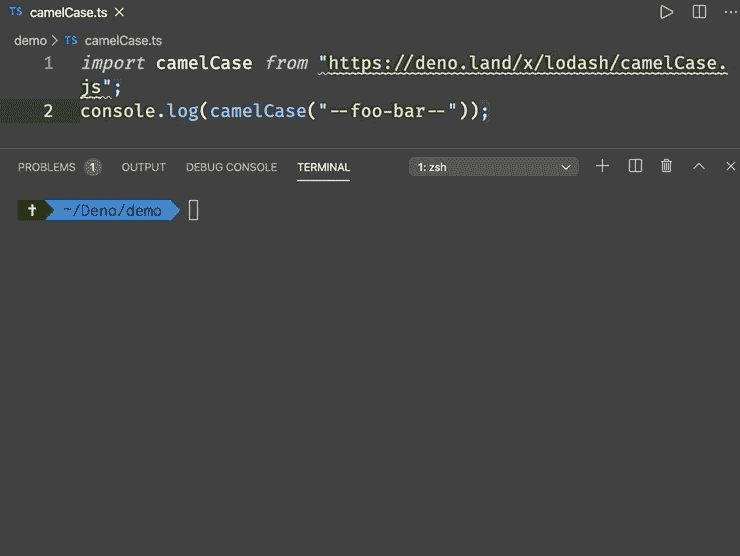
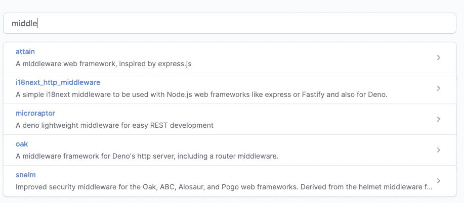
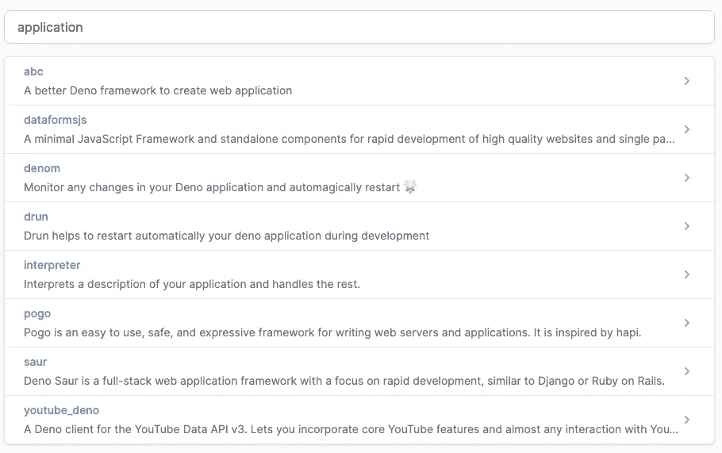

# Deno: Nodejs 替代方案入门

> 原文：<https://towardsdatascience.com/getting-started-with-deno-nodejs-alternative-c06f820f259b?source=collection_archive---------28----------------------->

## 编程；编排

## V8 和 Rust 上的安全类型脚本运行时


福斯托·加西亚在 [Unsplash](https://unsplash.com?utm_source=medium&utm_medium=referral) 上拍摄的照片

```
**Table of Contents**[**Introduction**](#91be)🦕 [Installation](#288e)
🦕 [Deno Built-in tools](#3da7)
🦕 [ES Modules and No Package Manager](#c6ce)
🦕 [Deno Standard library](#3397)
🦕 [Security with Deno sandbox](#c773)
🦕 [Web-API compatible](#caca)
🦕 [TypeScript](#7de5)
🦕 [Import maps](#a4f1)
🦕 [Test](#b83a)
🦕 [Third-party modules](#b4f7)
🦕 [HTTP request](#627c)
🦕 [Limitation](#44bb)[**Conclusion**](#945c)
```

# 介绍

2018 年 6 月，Node.js 的最初开发者 Ryan Dahl 在 JSConf EU 发表了演讲[“关于 Node.js 我后悔的 10 件事”](https://www.youtube.com/watch?v=M3BM9TB-8yA&feature=youtu.be)。下半年，他公布了自己的新项目 Deno。

他后悔在创建 Node.js 时做了 10 件本可以做得更好的事情。这促使他创建了 Nodejs 替代方案。

2020 年 5 月 13 日， [Ryan Dahl，Bert Belder，Bartek iwan czuk](https://deno.land/v1)发布 Deno 1.0。开发者可以期待定期的稳定发布。

Deno 是一个使用 JavaScript 和 TypeScript 编写应用程序的新平台。它基于 V8 JavaScript 引擎和 Rust。

Deno 与系统的最低级别绑定层与承诺(称为`ops`)绑定在一起。Deno 在默认情况下是安全的，提供了一流的类型脚本支持，内置了依赖检查器之类的工具，并支持第三方模块，如`lodash`。

在本文中，我将探讨 Deno 的一些特性。

听起来有趣吗？请继续阅读。

# 装置

Deno 可以在 macOS、Linux 和 Windows 上运行。Deno 是一个单一的二进制可执行文件，它没有外部依赖性。

查看所有[安装](https://github.com/denoland/deno/blob/master/docs/getting_started/installation.md)。

对于自制软件用户:

```
$ brew install deno
...
Bash completion has been installed to:
  /usr/local/etc/bash_completion.dzsh completions have been installed to:
  /usr/local/share/zsh/site-functions
==> Summary
🍺  /usr/local/Cellar/deno/1.0.0: 9 files, 41.7MB
```

安装后，您可以检查版本和帮助。

```
$ deno --version
deno 1.0.0
v8 8.4.300
typescript 3.9.2
$ deno help
...
OPTIONS:
    -h, --help                     Prints help information
    -L, --log-level <log-level>    Set log level [possible values: debug, info]
    -q, --quiet                    Suppress diagnostic output
    -V, --version                  Prints version information

SUBCOMMANDS:
    bundle         Bundle module and dependencies into single file
    cache          Cache the dependencies
    completions    Generate shell completions
    doc            Show documentation for a module
    eval           Eval script
    fmt            Format source files
    help           Prints this message or the help of the given subcommand(s)
    info           Show info about cache or info related to source file
    install        Install script as an executable
    repl           Read Eval Print Loop
    run            Run a program given a filename or url to the module
    test           Run tests
    types          Print runtime TypeScript declarations
    upgrade        Upgrade deno executable to given version

ENVIRONMENT VARIABLES:
    DENO_DIR             Set deno's base directory (defaults to $HOME/.deno)
    DENO_INSTALL_ROOT    Set deno install's output directory
                         (defaults to $HOME/.deno/bin)
    NO_COLOR             Set to disable color
    HTTP_PROXY           Proxy address for HTTP requests
                         (module downloads, fetch)
    HTTPS_PROXY          Same but for HTTPS
```

# Deno 内置工具

Deno 提供了一套内置工具来改善开发人员的体验。

*   运行测试:`deno test`
*   格式化源文件:`deno fmt`
*   邦德勒:`deno bundle`
*   调试`deno --inspect <file>`
*   棉绒(即将推出)`deno lint`

`deno lint`是提高代码质量的 TypeScript 类型检查。它还没有发布。

您可以使用`deno fmt`来格式化文件。(当我保存一个文件时，VS 代码为我做了这件事。)

# ES 模块和无软件包管理器

使用 Deno 时，您注意到的第一件事是 Deno 使用 es 模块作为默认模块系统，而 Node.js 使用 CommonJS。并且使用 URL 加载外部依赖项，

在 Node.js 中:

在 Deno:

Deno 是网络兼容的，你可以从一个网址运行`deno`。

```
$ deno run https://deno.land/std/examples/welcome.ts
Download https://deno.land/std/examples/welcome.ts
Warning Implicitly using master branch https://deno.land/std/examples/welcome.ts
Compile https://deno.land/std/examples/welcome.ts
Welcome to Deno 🦕
```

你用`deno run <URL/file>`运行一个程序。你可以找到更多关于`deno run --help`的帮助。

或者你可以在 REPL 的`deno`经营。

```
$ deno
Deno 1.0.0
exit using ctrl+d or close()
> console.log("Welcome to Deno 🦕");
Welcome to Deno 🦕
```

因为您可以从 URL 导入库，所以您可以在互联网上的任何地方托管模块。不需要 package.json 文件和依赖列表。没有像 npm 那样的集中注册中心。

# Deno 标准库

Deno 在 https://deno.land/std 提供了一个标准库。

下面使用来自标准库的`datetime`库。

在您的终端中:

```
$ deno run datetime.ts
Compile file:///Users/shinokada/Deno/demo/datetime.ts
2019-01-19T15:00:00.000Z
```



德诺标准图书馆

# Deno 沙盒的安全性

Deno 在沙箱中执行代码，这意味着运行时无法访问网络、文件系统和环境。

Deno 提供权限白名单。对于文件系统，可以使用`--allow-read`和`--allow-write`。您可以使用`--allow-net`标志来访问主机/url。因为。env 文件，可以将`--allow-env`与 [load.ts](https://deno.land/x/dotenv/load.ts) 一起使用。

创建 demo.js:

您需要`--allow-net`标志来运行 demo.js:

```
$ deno run --allow-net demo.js
http://localhost:8000/
```

# Web-API 兼容

网络浏览器使用 [Web-API](https://developer.mozilla.org/en-US/docs/Web/API) 。Deno [为](https://doc.deno.land/https/raw.githubusercontent.com/denoland/deno/master/cli/js/lib.deno.shared_globals.d.ts)提供了一些 Web-API。例如，在 Nodejs 中需要`fetch`。

```
const fetch = require('node-fetch')

fetch('[https://jsonplaceholder.typicode.com/posts/](https://jsonplaceholder.typicode.com/posts/1)1')
  .then(res => res.json())
  .then(data => console.log(data) )
```

在 Deno 中，可以使用`fetch`:

```
# fetch.ts
const res = await fetch("[https://jsonplaceholder.typicode.com/posts/1](https://jsonplaceholder.typicode.com/posts/1)");
const json = res.json();
const data = await json;
console.log(data)
```

然后在您的终端中:

```
$ deno run --allow-net fetch.ts
{
    userId: 1,
    id: 1,
    title: "sunt aut facere repellat provident occaecati excepturi   optio reprehenderit",
    body: "quia et suscipit\nsuscipit recusandae consequuntur expedita et cum\nreprehenderit molestiae ut ut quas..."
}
```

# 以打字打的文件

Deno 支持 TypeScript，不需要额外的工具。你可以通过`deno types | less`看到 Deno 的 TypeScript 声明或者看到[https://deno.land/typedoc/index.html](https://deno.land/typedoc/index.html)。

`deno types`输出包含三个库。

*   [lib.deno.ns.d.ts](https://github.com/denoland/deno/blob/master/cli/js/lib.deno.ns.d.ts)
*   [lib . deno . shared _ globals . d . ts](https://github.com/denoland/deno/blob/master/cli/js/lib.deno.shared_globals.d.ts)
*   [lib.deno.window.d.ts](https://github.com/denoland/deno/blob/master/cli/js/lib.deno.window.d.ts)

# [导入地图](https://deno.land/manual/linking_to_external_code/import_maps)

尽管在撰写本文时它仍然是一个不稳定的特性，Deno 支持[导入映射](https://github.com/WICG/import-maps)。`Import maps`控制 JavaScript 导入的行为。

例如，在 import_map.json 中:

在 hello_server.ts 中:

在您的终端中:

```
$ deno run --allow-net --importmap=import_map.json --unstable hello_server.ts
```

然后访问 [http://localhost:8000/](http://localhost:8000/) 查看输出。

# 试验

您可以使用 Deno 的内置测试运行器来测试 Javascript 或 TypeScript。使用 Deno 的标准库[测试/断言](https://deno.land/std/testing/asserts.ts)，可以使用`equal`、`assert`、`assertEquals`、`assertNotEquals`、`assertStrictEq`、`assertStrContains`、`assertArrayContains`、`assertMatch`等函数。

在 mytest.ts 中:

在终端中:

```
$ deno test mytest.ts                                                        
Compile file:///Users/shinokada/Deno/demo/.deno.test.ts
running 1 tests
test title ... ok (5ms)test result: ok. 1 passed; 0 failed; 0 ignored; 0 measured; 0 filtered out (6ms)
```

# 第三方模块

你可以在 https://deno.land/x/找到在 Deno 上工作的第三方模块。

Deno 上有许多现成的模块，`lodash`就是其中之一:



您可以搜索不同的类别。还有受 Express、Koa、哈比神等启发的 Deno 中间件和 web 框架。



第三方模块中的中间件



第三方模块中的应用程序

## 。包封/包围（动词 envelop 的简写）

Deno [使用`Deno.env.set/Deno.env.get`设置/获取](https://deno.land/typedoc/index.html#env-1)环境变量的值。

你需要使用`--allow-env`标志来运行这个。

```
$ deno run --allow-env denoenv.ts
8888
```

使用。env 是一种常见的做法。可以使用第三方模块`[dotenv](https://deno.land/x/dotenv)`。

在`.env`文件中:

在 app.ts 文件中:

你需要`--allow-read`标志来读取`.env`文件。

```
$ deno run --allow-read app.ts
Compile file:///Users/shinokada/Deno/demo/app.ts
8777
```

# HTTP 请求

在 Deno 中，可以使用 Web API [fetch](https://developer.mozilla.org/en-US/docs/Web/API/Fetch_API) 进行 HTTP 调用。在下面的代码中，您将第一个参数存储到`const url`，获取`url`，然后将响应解析为一个 [ArrayBuffer](https://developer.mozilla.org/en-US/docs/Web/JavaScript/Reference/Global_Objects/ArrayBuffer) ，等待响应，将其转换为一个 [Uint8Array](https://developer.mozilla.org/en-US/docs/Web/JavaScript/Reference/Global_Objects/Uint8Array) 并存储在变量体中。

在终端中:

```
deno run --allow-net=example.com https://deno.land/std/examples/curl.ts [https://example.com](https://example.com)
```

产出:

```
Download https://deno.land/std/examples/curl.ts
Warning Implicitly using master branch https://deno.land/std/examples/curl.ts
Compile https://deno.land/std/examples/curl.ts
<!doctype html>
<html>
<head>
    <title>Example Domain</title><meta charset="utf-8" />
    ...
```

# [由于正在进行的进度限制](https://deno.land/v1#limitations)

由于 Deno 仍处于早期阶段，因此存在一些局限性。一些标准库在运行时需要`--unstable`标志。

## 不稳定标志

[节点模块](https://deno.land/std/node/)是 [NodeJS 标准库](https://nodejs.org/docs/latest-v12.x/api/)的一层。

在撰写本文时，您仍然需要使用`--unstable`标志来处理 node。

```
$ deno run --unstable path.ts
Compile file:///Users/shinokada/Deno/demo/path.ts
quux.html
```

# 结论

Deno 的目标不是取代 Node.js，而是提供一种替代方案。观察 Node.js 如何以不同的方式实现是很棒的。

Deno 的成功取决于许多因素，特性、稳定性、性能、社区、学习曲线、文档、工具等。

尽管 v1.0 刚刚发布，但第三方模块开发者社区正在迅速发展，这对 Deno 来说无疑是一个积极的信号。你觉得瑞安·达尔的最新作品怎么样？

**通过** [**成为**](https://blog.codewithshin.com/membership) **会员，可以完全访问媒体上的每一个故事。**


[https://blog.codewithshin.com/subscribe](https://blog.codewithshin.com/subscribe)

# 资源

🦕 [Deno Github 回购](https://github.com/denoland/deno)
🦕[德诺手动](https://deno.land/manual)🦕 [Deno 标准库](https://deno.land/std)
🦕[节点标准库](https://deno.land/std/node)
🦕 [Deno 第三方模块](https://deno.land/x)🦕[Deno doc](https://doc.deno.land/)🦕 [Visual Studio 代码 Deno 扩展](https://github.com/denoland/vscode_deno)