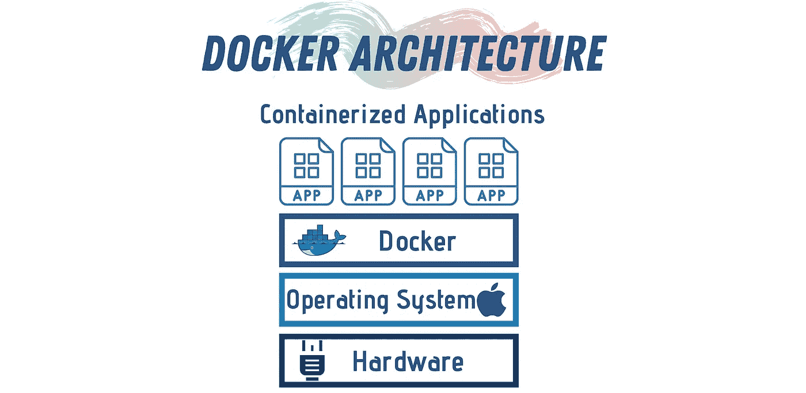
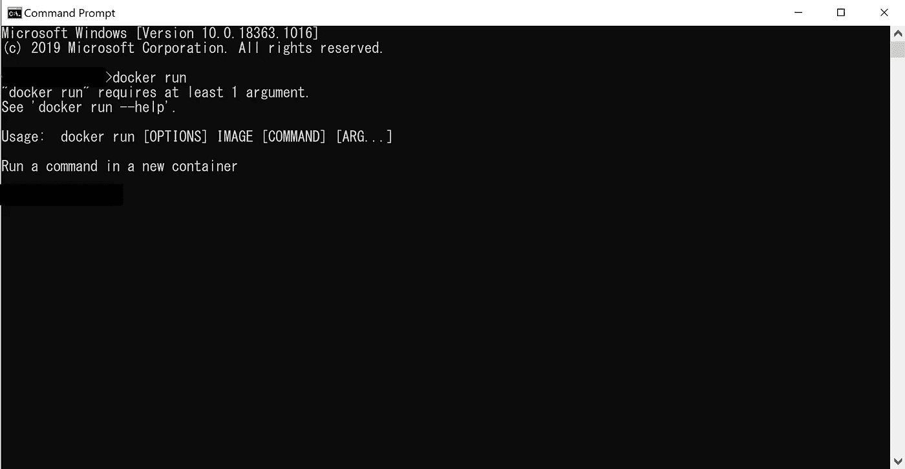
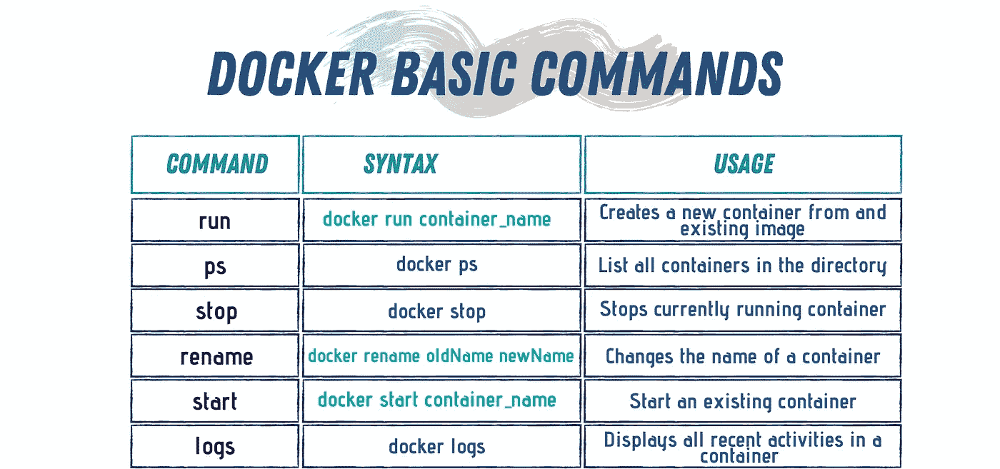
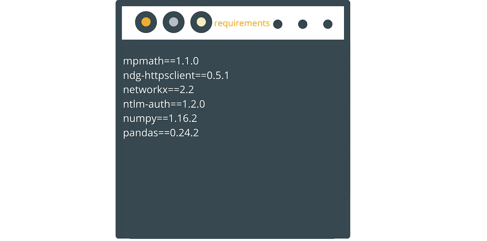
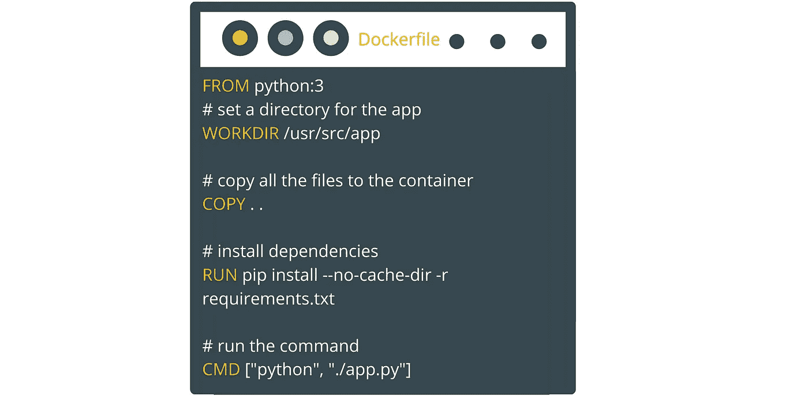
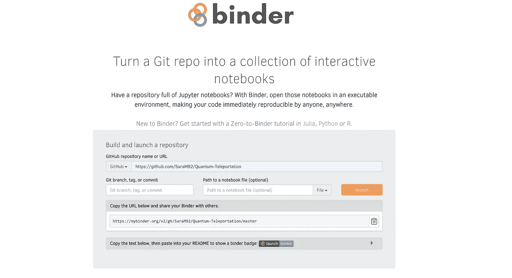
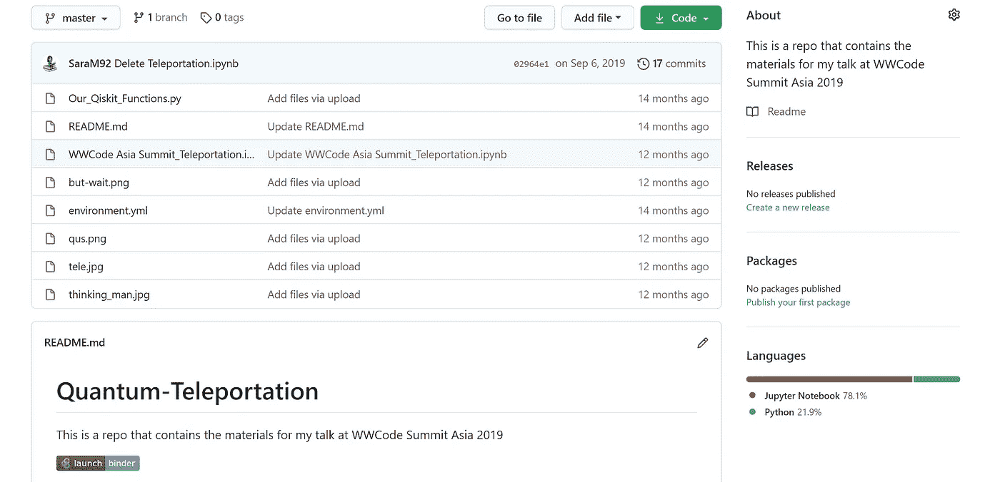

# 面向数据科学家的 Docker 入门

> 原文：<https://towardsdatascience.com/getting-started-with-docker-for-data-scientists-a2ed505e2a09?source=collection_archive---------13----------------------->

## 使用 Docker 的快速入门指南和最佳实践


图片由作者提供(使用 [Canva](https://www.canva.com/) 制作)

我们都经历过，

"*它在我的机器上工作！！*”。

谁不在声明的两端？

作为开发人员、数据科学家、软件工程师，我们在复杂的代码基础上工作，这些代码基础依赖于后台的*许多*项。当我们想与同事分享我们的代码或作为开源项目放在 Github 上时，我们需要*确保*代码能在所有不同的环境下工作。

有时候——比我们愿意承认的更多——我们试图运行朋友的代码或我们从互联网上得到的代码，这时计算机对我们大喊“ ***导入错误。”那个错误意味着代码需要更多它在你的计算机上找不到的信息。***

解决方法是使用 *Docker* 。Docker 是一个容器管理系统，旨在促进共享项目，并在不同的环境中运行它们。基本上，Docker 通过将代码及其所有依赖项封装在一个容器中，使得在其他具有不同操作系统的机器上编写和运行代码变得容易。

这个容器使代码独立于操作系统。



图片由作者提供(使用 [Canva](https://www.canva.com/) 制作)

## 我们为什么使用码头工人？

当我们为数据科学或机器学习应用程序编写代码时，我们经常会有许多顾虑，使得使用 Docker 成为我们应用程序的最佳选择。这些问题是:

1.  确保应用程序能够以相同的方式在所有环境中工作。
2.  为那些将要使用/运行你的应用程序的人省去处理依赖和安装问题的麻烦。
3.  避免使用虚拟机。
4.  专注于构建应用程序，而不是担心管理依赖关系。

# 码头基础知识

*那么，Docker 是如何工作的呢？*

为了理解这一点，我们首先需要了解一些 Docker 术语，让我们深入了解一下。

## 形象

图像与运行应用程序所需的所有数据一起存档。如果你熟悉编程语言，你可以想象一个*图像*，就像你想象一个*类*一样。班级是蓝图；它们包含生成密集的必要数据，而图像是包含创建容器所需数据的蓝图。

图像不会改变，这意味着您对特定图像所做的任何更改都不会被保存，除非您保存了该图像的副本。

## 容器

容器是运行应用程序的封闭环境。容器只能访问允许它访问的资源(存储、CPU、内存)，并不知道它所运行的机器的任何其他信息。容器只能访问包含运行应用程序所需信息的 Linux 发行版。

默认情况下，容器不会留下任何数据。只要您没有将容器保存为新图像，对容器所做的任何更改都会在移除后立即丢失。

## 码头文件

docker 文件是包含运行应用程序所需信息的文件。每个图像必须至少包含——最好是 Dockerfile。docker 文件可以分为三个主要部分:

1.  **基础镜像:**应用的核心。例如，如果应用程序需要 Python3 才能正确运行，那么 Python 3 将是基础映像，而附加库将包含在指令集中。
2.  **指令集:**指令集包括*运行*命令；每一个都代表需要安装或运行的额外的库或二进制文件。
3.  **Entry 命令:**这些是在安装了所有需要的库之后运行的命令。例如，一个输入命令可以是*打开 Jupyter 笔记本*，或者*运行命令行*等。

你可以把一个图像想象成一个洋葱，基础图像是洋葱的心脏，每条指令都是图像中的一个新层。这就是为什么你需要注意如何分层你的指令。


图片由作者提供(使用 [Canva](https://www.canva.com/) 制作)

## 卷

由于图像是固定的，容器的内存很短——类似于 ram——如果我们有运行应用程序所需的数据，会发生什么呢？

这就是体积解决问题的地方。当我们拥有应用程序所需的数据时，我们可以采用两种方法之一:本地访问数据或从卷中访问数据。本地访问数据—具有本地挂载点—需要您在本地机器上选择一个存储数据的特定目录。

当您对主机(应用程序将在那里运行)一无所知时，卷用于共享数据。

## 注册

注册表是 Docker 映像的存储库等价物。它允许你拉和推容器图像。你可以直接从你的 Docker 主机上分发你的图片，或者使用云代理，如 [Kubernetes](http://kubernetes.io/) 、 [Docker Swarm](https://docs.docker.com/swarm/) 或 [DockerHub](https://hub.docker.com/signup) 。使用这样的服务可以让您获得有用的特性，比如自动化部署和扩展。

# 如何开始使用 Docker？

## 步骤 1:安装 Docker

要在您的设备上安装 Docker，请访问官方 Docker 网站并为您的机器安装正确的版本。要使您的安装正确进行，请尝试运行以下命令:

```
docker run
```

如果您得到如下内容，那么一切都已启动并运行，您已经准备好开始工作了！



作者的屏幕

## 步骤 2:了解基本命令

码头工人是一个相当宽泛的概念。但是，只要知道基本的 6 个命令，*运行*， *ps* ，*重命名*，*停止*，*启动*，以及*日志*，你就可以走得很远。



图片由作者提供(使用 [Canva](https://www.canva.com/) 制作)

## 步骤 3:准备需求文件

您可以直接将二进制文件和所需的库添加到 docker 文件中；最好把它们放在一个独立的文件里。这个文件通常被称为 requirements.txt。



图片由作者提供(使用 [Canva](https://www.canva.com/) 制作)

## 第四步:准备文档

写一个简单有效的 Dockerfile 文件。是时候把洋葱从里面组装出来了。我们需要设置一个基本图像和输入命令。



图片由作者提供(使用 [Canva](https://www.canva.com/) 制作)

## 步骤 5:创建一个 Docker 图像

通常我们的代码被托管在 GitHub 上，这使得创建代码的图像变得非常容易。如果本地有 GitHub，可以使用命令行并运行 repo2docker 命令从 repo 创建一个映像。

然而，如果你试图为其创建图像的代码在 GitHub 上，那么你可以使用 [myBinder](https://mybinder.org/) 来生成和托管你的回购图像。您将能够使用 myBinder 提供的链接访问该图像。如果您使用的是 myBinder，requirement.txt 将被称为 envrionment.yml，它将包含与需求相同的信息。

要使用 myBinder，您需要有回购主分行的链接。对于本文，我使用的是我为一个事件创建的[回购](https://github.com/SaraM92/Quantum-Teleportation)。



作者的屏幕

如果您使用的是 Anaconda navigator，那么您可以使用 conda 命令行来生成特定环境的 envrionment.yml 文件，使用以下命令:

```
conda env export --name ENVNAME > envname.yml
```

## 步骤 6:运行容器

要运行容器，如果容器已经下载到您的机器上，您可以使用我们前面提到的 run 命令。但是，如果您使用 myBinder 并且图像托管在云上，您可以通过使用图像生成的链接来访问它。该链接将添加到您的 readme.md 文件中，并导致一个启动容器的徽章。



作者的屏幕

# 最佳实践的提示和技巧

1.  始终确保您使用的是最有效的基础映像。例如，在 Python3 的情况下，选择*苗条克星*或*伸展克星*。他们有充分的支持，并与大多数 DS 和 ML 库配合良好。
2.  使用**标签**提供重要信息，如使用技巧和关于应用程序和所需库以及如何使用它们的额外信息。
3.  拆分运行命令，使它们更具可读性。将所有需要的库放在 requirments.txt 文件中以保持有序。
4.  仅安装必要的**包。这使得构建和运行映像更加高效。**
5.  显式忽略文件*以避免安全风险(将它们添加到。忽略文件)。*
6.  **避免**添加数据，从数据库或云中提取数据(使用绑定挂载)，但不要在映像中硬编码。
7.  如果您从 Docker 开始并想要一个*标准项目模板*，请使用 [CookieCutter 数据科学](https://drivendata.github.io/cookiecutter-data-science/)或 [CookieCutter docker 科学](https://github.com/docker-science/cookiecutter-docker-science)项目模板。

要掌握 Docker 可能会变得非常复杂和具有挑战性，但是最好的办法是坚持练习，并尝试利用 Docker 提供的强大功能。

即使您并不完全熟悉 Docker，它的主要用途是为您的应用程序提供极大的控制和能力。只需使用本文中介绍的基本命令，您就可以利用 Docker 的强大功能来共享、部署和开发您的应用程序。