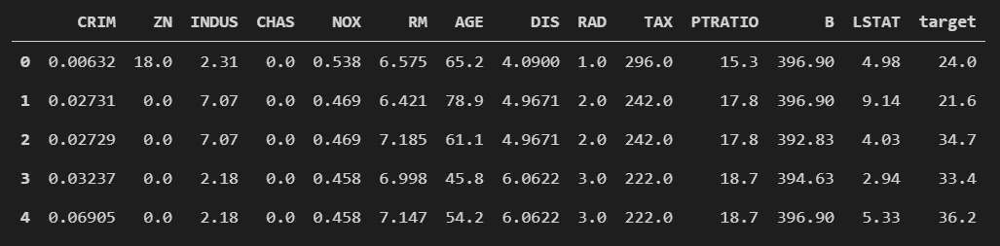
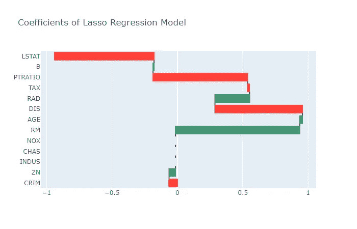

# 特征选择入门

> 原文：<https://towardsdatascience.com/getting-started-with-feature-selection-3ecfb4957fd4?source=collection_archive---------51----------------------->

## 选择有用功能的初学者指南

你不会用你能做的俯卧撑的数量来决定巴士到达的时间吧？同样，在预测建模中，我们删除无用的特征，以降低最终模型的复杂性。简而言之，在开发预测模型时，特征选择减少了输入特征的数量。

在这篇文章中，我讨论了特性选择的三个主要类别；过滤方法、包装方法和嵌入方法。此外，我使用 Python 示例并利用一些框架，如用于机器学习的 scikit-learn(参见[文档](https://scikit-learn.org/stable/))、用于数据操作的 Pandas ( [文档](https://pandas.pydata.org/docs/))和用于交互式数据可视化的 Plotly ( [文档](https://plotly.com/python/))。要访问本文中使用的代码，请访问下面共享的链接中的 my Github。

[](https://github.com/kurtispykes/demo) [## kurtispykes/演示

### 与中等博客文章相关的演示代码。-路径/到/文件；链接到文章有效的数据可视化…

github.com](https://github.com/kurtispykes/demo) 

图 1:[Zui Hoang](https://unsplash.com/@zuizuii?utm_source=medium&utm_medium=referral)在 [Unsplash](https://unsplash.com?utm_source=medium&utm_medium=referral) 上拍摄的服装架照片

**为什么要做特征选择？**

第一段旨在传达的信息是，有时有些特征不能为预测最终结果提供足够有用的信息，因此通过将它包括在我们的模型中，我们正在使我们的模型变得不必要的复杂。丢弃无用的特征导致了简约的模型，这又导致了减少的评分时间。此外，特征选择也使得解释模型变得更加容易，这在所有的商业案例中都是非常普遍的。

> “在大多数实际情况下，应用特征选择不太可能提供大的性能增益。但是，它仍然是功能工程师工具箱中的一个有价值的工具。”—(穆勒(Müller，(2016)，用 Python 介绍机器学习，奥瑞利传媒)

**方法**

有各种方法可用于执行特征选择，它们属于 3 个类别之一。每种方法都有自己的优缺点。Guyon 和 Elisseeff (2003 年)对这些类别描述如下:

*   **过滤方法** -选择变量子集作为预处理步骤，独立于所选预测值。
*   **包装器方法** -利用感兴趣的学习机作为黑盒，根据变量的预测能力对变量子集进行评分。
*   **嵌入式方法**——在训练过程中进行变量选择，通常针对给定的学习机。

**过滤方法**


图 2:由[泰勒·尼克斯](https://unsplash.com/@jtylernix?utm_source=medium&utm_medium=referral)在 [Unsplash](https://unsplash.com?utm_source=medium&utm_medium=referral) 上过滤一张热饮照片

过滤方法使用单变量统计来评估每个输入要素与目标要素(目标变量/因变量)之间是否存在统计意义上的显著关系，这正是我们试图预测的。提供最高置信度的特征是我们为最终模型保留的特征，因此该方法独立于我们决定用于建模的选择模型。

> “即使变量排序不是最佳的，它也可能比其他变量子集选择方法更可取，因为它的计算和统计可伸缩性。”——Guyon 和 Elisseeff (2003 年)

过滤方法的一个例子是皮尔逊相关系数——你可能在高中的统计课上遇到过。这是一种统计数据，用于测量输入 X 要素和输出 Y 要素之间的线性相关量。范围从+1 到-1，其中 1 表示完全正相关，而-1 表示完全负相关，因此 0 表示没有线性相关。

要计算皮尔逊相关系数，请将输入要素 X 和输出要素 y 的协方差除以两个要素标准差的乘积，公式如图 3 所示。


图 3:皮尔逊相关系数公式，其中 Cov 是协方差，σX 是 X 的标准差，σy 是 y 的标准差。

> 对于下面的代码示例，如前所述，我使用 Scikit-Learn 框架中可用的波士顿房价—参见[文档](https://scikit-learn.org/stable/modules/generated/sklearn.datasets.load_boston.html) —以及用于数据操作的 Pandas 参见[文档](https://pandas.pydata.org/docs/)。

```
import pandas as pd
from sklearn.datasets import load_boston# load data
boston_bunch = load_boston()
df = pd.DataFrame(data= boston_bunch.data,
                  columns= boston_bunch.feature_names)# adding the target variable
df["target"] = boston_bunch.target
df.head() 
```



图 4:上述代码单元的输出；显示波士顿房价数据集的预览。

python 中实现的要素选择的 pearson 相关系数示例。

```
# Pearson correlation coefficient
corr = df.corr()["target"].sort_values(ascending=False)[1:]# absolute for positive values
abs_corr = abs(corr)# random threshold for features to keep
relevant_features = abs_corr[abs_corr>0.4]
relevant_features>>> RM         0.695360
NOX        0.427321
TAX        0.468536
INDUS      0.483725
PTRATIO    0.507787
LSTAT      0.737663
Name: target, dtype: float64
```

然后简单地选择如下输入特征…

```
new_df = df[relevant_features.index]
```

***优点***

*   抗过拟合能力强(引入偏差)
*   比包装方法快得多

***缺点***

*   不考虑其他功能之间的相互作用
*   不考虑正在使用的模型

**包装方法**


图 4:包装一个盒子；照片由 [Kira auf der Heide](https://unsplash.com/@kadh?utm_source=medium&utm_medium=referral) 在 [Unsplash](https://unsplash.com?utm_source=medium&utm_medium=referral) 上拍摄

维基百科将包装器方法描述为使用“预测模型对特征子集进行评分”。每一个新的子集都用来训练一个模型，该模型在一个保留集上进行测试。计算在坚持的集合上犯的错误的数量(模型的错误率)给出了该子集的分数。— [包装器方法维基百科](https://en.wikipedia.org/wiki/Feature_selection)。包装器方法所采用的算法被称为贪婪算法，因为它试图找到产生最佳性能模型的最佳特征组合。

> “包装器特征选择方法创建具有输入特征的各种不同子集的许多模型，并根据一些性能度量来选择导致最佳性能模型的那些特征。”—杰森·布朗利

一种包装方法是递归特征消除(RFE ),正如该算法的名称所示，它的工作方式是递归地移除特征，然后使用剩余的特征建立一个模型，然后计算模型的精度。

[sci kit-learn 中 RFE 实施的文档](https://scikit-learn.org/stable/modules/generated/sklearn.feature_selection.RFE.html)。

```
from sklearn.feature_selection import RFE
from sklearn.linear_model import LinearRegression# input and output features
X = df.drop("target", axis= 1)
y = df["target"]# defining model to build
lin_reg = LinearRegression()# create the RFE model and select 6 attributes
rfe = RFE(lin_reg, 6)
rfe.fit(X, y)# summarize the selection of the attributes
print(f"Number of selected features: {rfe.n_features_}\n\
Mask: {rfe.support_}\n\
Selected Features:", [feature for feature, rank in zip(X.columns.values, rfe.ranking_) if rank==1],"\n\
Estimator : {rfe.estimator_}")
```

下面的打印语句返回…

```
Number of selected features: 6Mask: [False False False  True  True  True False  True False False  True False   True]Selected Features: ['CHAS', 'NOX', 'RM', 'DIS', 'PTRATIO', 'LSTAT'] Estimator : {rfe.estimator_}
```

***优点***

*   能够检测特征之间发生的相互作用
*   通常比过滤方法产生更好的预测准确性
*   查找最佳特征子集

***缺点***

*   计算成本高
*   倾向于过度拟合

**嵌入方法**


图 5:嵌入式组件；克里斯·里德在 [Unsplash](https://unsplash.com?utm_source=medium&utm_medium=referral) 上拍摄的照片

嵌入式方法类似于包装器方法，因为这种方法也优化预测模型的目标函数，但是将这两种方法分开的是，在嵌入式方法中，在学习建立模型期间使用了内在的度量。因此，嵌入式方法需要有监督的学习模型，该模型反过来将内在地确定每个特征对于预测目标特征的重要性。

> 注意:用于特征选择的模型不一定是用作最终模型的模型。

LASSO ( *最小绝对收缩和选择操作符*)是嵌入方法的一个很好的例子。维基百科将 LASSO 描述为“一种回归分析方法，它执行变量选择和正则化，以提高其产生的统计模型的预测准确性和可解释性。”深入了解 Lasso 如何工作超出了本文的范围，但是可以在 Analytics Vidhya 博客上找到一篇关于该算法的好文章，作者是 [Aarshay Jain](https://medium.com/u/daf479ff8e76?source=post_page-----3ecfb4957fd4--------------------------------) ，标题是[关于 Python 中脊和 LASSO 回归的完整教程](https://www.analyticsvidhya.com/blog/2016/01/ridge-lasso-regression-python-complete-tutorial/)。

```
# train model
lasso = Lasso()
lasso.fit(X, y)# perform feature selection
kept_cols = [feature for feature, weight in zip(X.columns.values, lasso.coef_) if weight != 0]kept_cols
```

这将返回 Lasso 回归模型认为相关的列…

```
['CRIM', 'ZN', 'RM', 'AGE', 'DIS', 'RAD', 'TAX', 'PTRATIO', 'B', 'LSTAT']
```

我们也可以使用瀑布图来显示系数…

```
figt = go.Figure(
         go.Waterfall(name= "Lasso Coefficients",
                      orientation= "h",
                      y = X.columns.values,
                      x = lasso.coef_))fig.update_layout(title = "Coefficients of Lasso Regression Model")fig.show()
```



图 6:先前代码的输出；显示各功能系数的瀑布图；请注意，3 个特征被设置为 0，这意味着它们被模型忽略。

***优点***

*   计算速度比包装方法快得多
*   比过滤方法更准确
*   一次考虑所有功能
*   不容易过度合身

**缺点*缺点*缺点**

*   选择特定于模型的特征
*   不如包装方法强大

> **提示**:没有最佳特征选择方法。适用于一个业务用例的方法可能不适用于另一个业务用例，因此您需要进行实验，看看什么方法最有效。

**结论**

在本文中，我介绍了执行特性选择的不同方法。当然，还有其他方法可以进行特征选择，如方差分析、反向特征消除和使用决策树。要获得一篇了解这些方法的好文章，我建议阅读 [Madeline McCombe](https://medium.com/u/a4a48b9cfaca?source=post_page-----3ecfb4957fd4--------------------------------) 的文章，标题为 [*介绍数据科学的特征选择方法*](/intro-to-feature-selection-methods-for-data-science-4cae2178a00a) 。

又及:非常感谢您抽出时间。对于那些想深入了解特性选择的人，下面有一些有用的资源！

[](https://github.com/kurtispykes/demo) [## kurtispykes/演示

### 与中等博客文章相关的演示代码。-路径/到/文件；链接到文章有效的数据可视化…

github.com](https://github.com/kurtispykes/demo) 

**其他资源**

[Jason Brownlee](https://medium.com/u/f374d0159316?source=post_page-----3ecfb4957fd4--------------------------------) - [如何选择机器学习的特征选择方法](https://machinelearningmastery.com/feature-selection-with-real-and-categorical-data/)

[vikashraj luhaniwal](https://medium.com/u/3c5638fcb6c5?source=post_page-----3ecfb4957fd4--------------------------------)-[使用 Python 中的包装方法进行特征选择](/feature-selection-using-wrapper-methods-in-python-f0d352b346f)

Sebastian Raschka - [用于特征选择的过滤器、包装器和嵌入式方法之间有什么区别](https://sebastianraschka.com/faq/docs/feature_sele_categories.html)